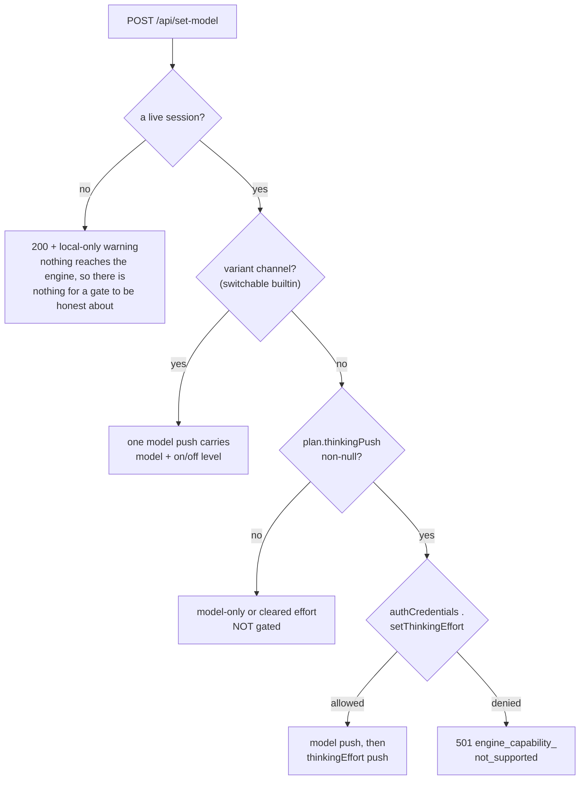

# Web UI

**English** | [简体中文](webui.zh-CN.md)

The Web UI (`packages/webui`) is the browser frontend for MiniMax Code. It uses the same engine as the TUI — the CLI's ACP server (`mcode acp`, JSON-RPC 2.0 over stdio) — so terminal, browser, and desktop clients run against one runtime. Each turn runs over ACP by default; two conditions switch it to the one-shot `mcode exec` CLI (see [Transport selection](#transport-selection-acp-or-exec)). It is not a plugin: it ships inside the repository and is launched by the CLI.

This document describes **what the shipped webui does today, against the source tree**. Every claim links to the file or test that backs it. When something is partial or a placeholder, the row below says so plainly. The shape and limits recorded here come from `packages/webui/{server,webapp}` as of the file-level ages noted in each subsection.

## Launch

```bash
mcode-web                     # http://127.0.0.1:18090
mcode web                     # equivalent — `web` and `webui` both resolve
mcode webui --port 8123 --host 127.0.0.1
mcode webui --token "$(openssl rand -hex 16)" --host 0.0.0.0   # LAN, token-gated
pnpm mcode-web                # from a source checkout (built)
node packages/webui/server.js # direct, from a checkout
```

The command resolves the webui package (installed `dist/webui/` or source `packages/webui/`), spawns the server as a child process, and points it back at the running CLI through `MCODE_WEBUI_SELF_ENTRY`. The webui then spawns `node <cli> acp` per active browser tab.

Without `--port` the server starts on 18090 and moves to the next free port when 18090 is taken, logging the URL it bound — the launcher opens that one. An explicit `--port` (or `PORT`) is pinned: it never moves, so a taken port exits with EADDRINUSE instead. (See `packages/webui/server/lib/config.js#PORT` and the launcher in `packages/webui/server.js`.)

## Running a development build

The development Web UI runs alongside an installed official mcode without
conflicts: the dev webui always spawns the checkout's own `dist/cli.js` as its
engine (detection order: `MCODE_CMD` > `MCODE_WEBUI_SELF_ENTRY` > repo
`dist/cli.js` > `~/.minimax-code` > PATH), and it shares the host's
`~/.minimax` sessions and `~/.mcode-webui` state.

From a checkout of this repository:

```bash
corepack pnpm install && corepack pnpm build   # once, and after engine changes
node dist/cli.js webui                         # dev Web UI on 127.0.0.1:18090
node dist/cli.js webui --port 8123             # keep the installed one free
```

### One-shot dev launcher (frontend + backend, hot reload)

When iterating on the Next.js frontend in `packages/webui/webapp/` you want both
the Node backend (port 18090, serves `/api/*`) and the Next dev server (port
18091, with HMR, proxies `/api/*` → 18090) running at once. `pnpm run webui:dev`
boots both in a single shell, prefixes their output so you can tell which side
is talking, and tears them down together on Ctrl+C:

```bash
pnpm run webui:dev        # http://127.0.0.1:18091/  ← open this in the browser
```

It is a thin wrapper over `node scripts/dev-webui.mjs` with no extra
dependencies. Stop the official `mcode` runtime first if port 18090 is busy
(`pkill -f "dist/cli.js webui"`), or pass `--port 28090` to `mcode webui` and
export `MCODE_WEBUI_ORIGIN=http://127.0.0.1:28090` so the dev proxy targets
the right backend.

### Day-to-day webui commands (Next-aligned)

| Command                  | What it does                                                                                |
| ------------------------ | ---------------------------------------------------------------------------------------------------- |
| `pnpm run webui:dev`      | Start both the backend (`:18090`) and Next dev (`:18091`, HMR) together; Ctrl+C cleans up both. |
| `pnpm run webui:build`    | `next build` the webapp (`packages/webui/webapp/out/` is the static export).                       |
| `pnpm run webui:start`    | Serve the already-built webui via `node packages/webui/server.js` on `:18090` (no HMR).          |
| `pnpm run webui:typecheck`| `tsc --noEmit` over the webapp's TS sources.                                                      |
| `pnpm run webui:test`     | Run all webui unit tests — backend (`test:webui`) + frontend (`test:webapp`).                     |

`next start` is intentionally omitted: the webui ships as a `next export` static
build and the backend serves those files directly, so there is no Next server
runtime to start. ESLint is also not wired into the webapp yet — add it via
`npx next lint` once a `.eslintrc` is in place.

### Docker

The repository's Docker setup runs the branch in a **clean environment**: no
host home directories are mounted, so host models/tools/sessions never leak in
(and container state never leaks out). Model credentials come from the
environment — each collaborator tests with their own key:

```bash
MINIMAX_CN_API_KEY=...  docker compose up webui   # MiniMax cn region
MINIMAX_API_KEY=...     docker compose up webui   # MiniMax global region
# open http://localhost:18080/?token=dev-token
docker compose down                                # reset to factory state
```

The image runs as a non-root `user` (uid 1000) with a realistic home at `/home/user` (Desktop/Documents/Downloads/Pictures/Music/Videos/projects + XDG config), so the directory picker's well-known-folder keywords behave as on a desktop. `docker/entrypoint.sh` seeds a fresh in-container `~/.minimax/config.yaml`
(`minimaxModelSource: minimax_api_key` + the key + `minimax_api/MiniMax-M3`
as the default model); `MAVIS_REGION` is derived from which variable you set
and can be overridden explicitly. Because the host browser is a non-local
client from the container's perspective, every URL carries `?token=…`
(`WEBUI_TOKEN`, default `dev-token`); the port is `WEBUI_PORT` (default
18080). A container without either key variable starts fine but chat has no
model credentials until one is provided.

For interactive development over the mounted source (same env-key flow):

```bash
docker compose run --rm -p 18080:18080 dev
# inside the container:
pnpm install --no-frozen-lockfile && pnpm build
node dist/cli.js webui --host 0.0.0.0 --no-open   # PORT defaults to 18080
```

## Security posture

- Loopback bind by default; LAN exposure requires `--host`/`HOST` env or the persisted `lanBind` setting.
- Trusted-origin CORS + a browser Origin/CSRF gate that applies even to loopback requests.
- Token auth (`?token=` / `Authorization: Bearer`) for non-local requests; local requests bypass.
- Read-only mode for non-local sessions; per-request `authorize()` gate with fail-closed audit; rate limiting; workspace containment; bounded uploads; no telemetry.
- **Credential-shaped file previews are refused by default** (slice 16). A basename match against `.env` / `.env.*`, `*.pem` / `*.key`, `id_rsa` / `id_ed25519` / `id_ecdsa` / `id_dsa`, `known_hosts`, `authorized_keys`, `.npmrc`, `.pypirc`, `.netrc`, `.pgpass`, `credentials*`, plus the backup-suffix set (`.bak` / `.old` / `.orig` / `.backup` / `.save` / `.swp`) returns HTTP `403 {code: "credential"}` from `GET /api/fs/read-file`. The webapp renders a "仍要打开？" second-confirmation; reopening the same URL with `?confirm=1` gets the plaintext. The shared predicate lives in `packages/webui/server/lib/credential-file.js` and is mirrored verbatim in `packages/webui/webapp/lib/credential-file.ts`; the test suite (`packages/webui/webapp/test/credential-file.test.ts`) walks both implementations on the same fixtures so they cannot drift. Tree listing, `/api/fs/search`, and OS-default open/reveal do not bypass the gate, but they are not plaintext previews and remain available — search flags matches (`credential: true`) but never returns contents. The predicate is name-based and therefore **does not defend against hardlink aliasing** (two names that share an inode — e.g. `config.txt → .env` — are indistinguishable by basename; the kernel does not expose the "primary" name from the inode). The defence covers symlinks (resolved by `realpathSync`) but not hardlinks — operators concerned about hardlink aliasing must keep the workspace tree uncluttered.

The canonical disclosure is [`packages/webui/references/SECURITY-NOTES.md`](../packages/webui/references/SECURITY-NOTES.md).

Slice 27 extends the same posture to the write side: `POST /api/fs/write`
runs the identical containment gate, applies the identical credential
predicate (default-refuse; `confirm:true` releases the write and emits a
`credential.override` audit line with `endpoint:"write"`), and
conflict-checks the caller's `(mtime, size)` baseline so an external edit
surfaces as `409 {code:"conflict"}` instead of being overwritten. The
write itself is a bare `writeFileSync` on the gated path — no shell, no
exec, no command interpolation.

## Transport selection (ACP, exec, or runtime)

Every turn is sent to the engine over one of three transports: the long-lived ACP subprocess (`mcode acp`), the one-shot exec subprocess (`mcode exec`), or — added in slice S2 — an **in-process runtime host** (`packages/webui/server/lib/runtime-host.js`) that owns the same `CliService` the TUI does. The choice is made server-side, per turn, before the engine spawns — and it is decided in two different places, evaluated in this order:

1. `process.env.MCODE_USE_ACP === "0"` forces the exec transport (`packages/webui/server/routes/chat.js#handleSend`; the code comment there calls it the escape hatch for an ACP protocol regression). This is the only read of the variable in the codebase. `MCODE_USE_ACP=0` short-circuits all three transports.
2. Otherwise the turn is handed to `runMcodeAcp` (`packages/webui/server/lib/mcode-acp.js`), which **silently re-routes to `runMcodeExec`** in its first branch when `cs.permissions` is set and is anything other than `"Full access"`.
3. Only when neither applies does the turn actually run over ACP.

S2 (slice 2 of the runtime-first migration) introduces a new switch alongside `MCODE_USE_ACP`:

| Env var | Default | Accepted values | What it does |
| --- | --- | --- | --- |
| `MCODE_USE_ACP` | unset | `0` → exec escape hatch (overrides everything); `1` → no effect; unset → no effect | Today-only escape hatch; see rows below. |
| `MCODE_WEBUI_TRANSPORT` | `acp` | `acp` (today's behaviour), `exec` (no-op — no production route consumes this value; `exec` transport today is reachable only via `MCODE_USE_ACP=0`), `runtime` (opt-in to the S2 in-process host; S3+ lights catalogue traffic) | Selects the engine transport. Default keeps every response field-identical to today's `main`; `runtime` opts catalogue traffic (list/title) into the in-process host once S3 lands. |

Resolution rule, in priority order:

1. `MCODE_USE_ACP=0` ⇒ `exec`, regardless of `MCODE_WEBUI_TRANSPORT`. The legacy escape hatch wins.
2. `MCODE_WEBUI_TRANSPORT=exec` ⇒ no-op. No production route consumes this value; the `exec` transport today is reachable only via `MCODE_USE_ACP=0`. Documented so the contract does not drift when a future slice wires the value.
3. `MCODE_WEBUI_TRANSPORT=runtime` ⇒ `runtime` for **catalogue traffic** (S3+); active turns still go through ACP today (S4 wires them). Per-call fallback to ACP on any runtime-host failure so a runtime regression never breaks the sidebar.
4. `MCODE_WEBUI_TRANSPORT=acp` (default) ⇒ today's ACP path. Permission-mode re-route still applies.
5. Unknown value (e.g. typo) ⇒ falls back to `acp` with a one-line warning to stderr. The server never refuses to boot because of an unknown transport.

| Turn condition | Transport | Decided at |
| --- | --- | --- |
| `MCODE_USE_ACP=0` in the server environment | exec | `routes/chat.js#handleSend` |
| `MCODE_WEBUI_TRANSPORT=exec` | (no-op — same as default `acp`; `exec` transport today is reachable only via `MCODE_USE_ACP=0`) | `server/lib/config.js#MCODE_WEBUI_TRANSPORT` (no route reads this value) |
| `cs.permissions` is `Ask`, `Auto`, or `Read` (not `Full access`) | exec (silent re-route inside ACP entry) | `mcode-acp.js#runMcodeAcp` |
| `MCODE_WEBUI_TRANSPORT=runtime` (S3+) | runtime for catalogue traffic (sessions list/title); active turns remain on ACP until S4 | `server/lib/acp-client.js#listAllMcodeSessions` / `#getMcodeSessionTitle` (ACP fallback on any runtime-host failure) |
| otherwise — factory default is `permissions: "Full access"` (`server/lib/state-bus.js` initial state) | ACP | `mcode-acp.js#runMcodeAcp` |

S2 invariants (must remain true on every later slice):

- **Default `MCODE_WEBUI_TRANSPORT=acp` is field-identical to `main`.** No existing endpoint response may shift; no child process count may grow. The verification suite proves this on every commit by running the full webui node:test suite with no env override.
- **S2 ships the host skeleton.** `createCatalogueHost` and `createTurnHost` are exported from `server/lib/runtime-host.js`. **S3 wires the catalogue path** (list/title) into `acp-client.js`; S4 wires active turns; S5 wires models; S6 wires interactions/accounts. S7 flips the default to `runtime`.
- **The catalogue host hands back the runtime's application handles, and they are process-local.** `createCatalogueHost` returns `adapter`, `cliService`, `apiHost`, `controller`, `application`, `applications`, and `close`. `application` is the process-local product facade (`events` / `models` / `skills` / `plugins` / `permissions` / …); `applications` is the feature-application tree. Turn diff lives on the latter only: `applications.session.diff` carries `getTurnDiff` / `revertTurnDiff` / `reapplyTurnDiff`, and the process-local facade declares no diff member at all, so diff read off `application` is always `undefined`. Both handles stay inside the server process — no route serves them today, and a slice that turns diff into an endpoint must authorize and narrow the surface rather than forward the whole tree.
- **The catalogue path is opt-in via `MCODE_WEBUI_TRANSPORT=runtime`.** Setting it lights the catalogue host for list/title; an in-flight failure falls back to ACP for that one call so a runtime regression never breaks the sidebar. The cache (`mcodeSessionsCache`) is shared between paths, so a sidebar fetch served by either path serves the next read equivalently.
- **The catalogue projection mirrors the ACP adapter's `toAcpSessionInfo` rule set** (`server/lib/catalogue-sessions.js`; rules live in `packages/tui/src/acp/agent.ts`, predicates in `packages/tui/src/runtime/delegation.ts`): internal sub-agent sessions (worker `purpose` prefixes `local-task:` / `local-background-task:` / `team-plan:`, `sessionKind: "task"`, or a builtin sub-agent `agentName` — `explore` / `worker` / `verifier`) and sessions with a missing or non-absolute `cwd` never reach the sidebar, exactly as ACP drops them; an empty `title` and a missing timestamp omit their keys — `title: null` never appears on the wire. `catalogue-via-runtime.test.js` pins this field-for-field against an independently re-derived expected page, and its zero-spawn probe is baseline-relative: descendants already alive when a window opens count as environment noise, while a genuine in-window spawn still trips the assertion.
- **R1 mitigation (process-isolation loss) lives in the turn host.** Every call into `adapter.sendMessage` is wrapped so a runtime-side throw becomes a stream-shaped error frame and never escapes the turn. Tests in `packages/webui/test/server/runtime-host.test.js` pin this with a mutation that drops the inner catch — the test goes red if the boundary is removed.
- **R2 mitigation (abort semantics) lives in `createTurnHost#abortSession`.** It returns `{success:true, elapsedMs}` after at most a 5 s wait for the stream to settle; it does NOT rely on subprocess kill, because there is no subprocess. The bound keeps graceful shutdown responsive even on a wedged runtime.
- **R8 mitigation (wedged host) lives in `createCatalogueHost#close`.** It races `apiHost.close()` against a 5 s timeout so a wedged dependency chain cannot wedge webui's graceful shutdown.

Contract notes:

- **There is no `/exec` command.** The webui button-command set is `CMD_BUTTON_COMMANDS` — `new`, `clear`, `status`, `sessions`, `review`, `help`, `usage`, `stop` (`server/lib/interaction/command-registry.js`) — and it is the only declaration of that set. The command cache in `server/lib/acp-client.js` fills its `webui` group from it, so `/help` and the composer's slash palette name exactly the commands `POST /api/cmd` accepts, `/review` included. (A second, hand-written list in `acp-client.js` used to omit `/review`, which is why `/help` and the palette disagreed with the 400 branch; it is gone, and `packages/webui/test/lib/command-list-drift.check.mjs` pins the relationship so it cannot come back.) Transport is never switched by a slash command; the two conditions above are the whole rule.
- The permission mode is selectable in the composer (Ask / Auto / Full access; `webapp/components/composer.tsx#PERMISSION_MODES`) or via `POST /api/permissions`, which also accepts `read`. The route writes the label into `cs.permissions` unconditionally (`server/routes/model.js#handleSetPermissions`) — that label is what steers the **next** turn's transport.
- An exec turn is not a degraded permission mode: the mode still reaches the engine as the `--permission` spawn flag (Ask→`ask`, Auto→`auto`, Read→`read`, else `full`; the mode mapping in `mcode-exec.js`), the session continues via `--session`, and the recorded model is passed via `--model`.
- A live exec child has no RPC surface: `session/set_config_option` calls (model, permission) return `no_acp_session` and take effect on the next turn (`server/lib/mcode-rpc.js#noLiveClientFailure`); the same call lands on the live child immediately on an ACP turn. Warning semantics are documented in [`packages/webui/docs/API.md`](../packages/webui/docs/API.md) under `POST /api/permissions`.

Known costs of an exec turn — all of these are current behaviour of this tree, not planned fixes:

- No tool-call lines: `collectExecResult` consumes only `delta` / `message` / `exec.result` stream events, so `→` tool rows never appear (the ACP path renders them via `applyToolUpdate`).
- The thinking-effort pick is not transferred: `applyRecordedModel` runs only on the ACP path, and `buildExecArgs` has no thinking flag — the engine runs its own default.
- No session-title write-back outside the finalize path: the title write-back runs only on the ACP finalize path (`getMcodeSessionTitle` is also read on the session-switch fallback and the on-demand title API, but only finalize persists).
- No interactive channel: the child's stdin is closed immediately after the prompt is written, so engine-side questions cannot reach the browser; questionnaire-type turn errors surface as alerts with a hint to re-ask via the composer (`routes/chat.js#handleSend` error branch).

This section records what the current source tree does, not a frozen contract. During a turn the two transports are distinguishable in the process list: an `mcode … acp` child is an ACP turn, an `mcode … exec --input -` child is exec. The operator-facing view — when you hit each transport, what it costs, and what to do — is the transport section of [`webui.zh-CN.md`](webui.zh-CN.md).

## Engine capability declaration (engine-abstraction batch B1)

The server carries an internal engine layer, `packages/webui/server/engine/`, whose first job is a **capability declaration**: every engine surface webui is wired to declares, as a reviewed module constant, which of 14 capability keys it supports and — for partial support — exactly which sub-items are missing. The design decision and the audited matrix behind every value live in `doc/engine-abstraction-design.md` (out-of-tree working document); the declaration itself is the code source of truth.

Why declarations instead of try-and-see: a missing capability must be a **fact the UI can read before calling**, not an exception discovered mid-call, and it must never be a silent empty implementation — an empty list or `{ok:true}` would tell the user "succeeded with nothing", the fake-success failure mode fixed in #110 and refused here by construction.

The 14 keys (one per row of the design matrix; key ↔ matrix row in parentheses):

`sessionCrud` (会话 CRUD), `streamingSend` (流式发送), `interrupt` (中断), `toolSkillInvocation` (工具/技能调用), `turnDiff` (回合级 diff 查询), `turnRewindRedo` (回合撤销/重做), `plugins` (插件管理), `mcp` (MCP), `subagents` (子 agent), `usageStats` (用量统计), `authCredentials` (认证/凭据), `updateCheck` (更新检查), `fileReadWrite` (文件读写), `gitOperations` (Git 操作).

Levels and rules (`server/engine/capabilities.js`):

- `full` — the surface is complete.
- `partial` — must enumerate `missing` sub-items and carry a `reason`. Never "half works, nobody knows which half".
- `none` — must carry a `reason` distinguishing `interface-absent` (no such method on the surface at all) from `implementation-absent` (the layer above has it, this surface does not open it).
- `servedBy` — **optional, and only on a `none` entry.** Names the provider whose in-process host actually answers the request when this provider does not implement the capability itself. Rejected on `full` and `partial` (a provider that partly implements a capability is not "served elsewhere"), and a `servedBy` naming an unregistered provider is a boot-time throw, not a runtime 404.

Current declarations (the two runtime surfaces transcribed from the audited matrix and re-verified against the live method surfaces at the `26043e9b` baseline — 91 adapter methods, 94 CliService methods plus the `applications.session.diff` facade):

| Key | local-runtime-v2 | tui-runtime-adapter |
| --- | --- | --- |
| sessionCrud | full | full |
| streamingSend | full | full |
| interrupt | full | full |
| toolSkillInvocation | partial — missing `setMode` (no session-mode write; M3-B9) | partial — missing `setMode` |
| turnDiff | full | none (implementation-absent on the adapter) |
| turnRewindRedo | full | partial — missing `reapplyTurnDiff` |
| plugins | full | partial — missing `previewGithubPlugin`, `importGithubPlugin`, `listEnabledPlugins` |
| mcp | full | full |
| subagents | partial — missing `getDelegationSnapshot`, `stopDelegation` (they live on the adapter's access-context, not the CliService surface) | full |
| usageStats | full | full |
| authCredentials | partial — missing `setConfigOption` (the GENERIC config write; M3-B9) | partial — missing `setConfigOption` |
| updateCheck | none (interface-absent) | none (implementation-absent) |
| fileReadWrite | partial — missing `file-write` | partial — missing `file-write` |
| gitOperations | partial — missing `git-diff`, `git-commit`, `git-branch` | partial — missing `git-diff`, `git-commit`, `git-branch` |

The third registered provider is the **`acp` transport** (M4-1) — a transport rather than an in-process surface, declared in `server/engine/providers/acp.capabilities.js` and audited against `MCODE_ACP_CAPABILITIES`, the protocol's live wire table, because a subprocess has no object to reflect:

| Key | acp |
| --- | --- |
| sessionCrud | partial — missing `deleteSession`, `renameSession`, `archiveSession` (`session/new` · `load` · `list` · `close` · `resume` · `fork` · `activate` are on the wire, and `session/delete` is registered with no handler) |
| streamingSend | full (`session/prompt`) |
| interrupt | none — interface-absent: `session/cancel` IS registered, but it is a **notification**, and a delivered cancel certifies that it was sent, never that the turn stopped |
| toolSkillInvocation | partial — missing `listSkills`, `listRuntimeSkills` (the protocol has no skill enumeration) |
| turnDiff | none — interface-absent, **servedBy `local-runtime-v2`** |
| turnRewindRedo | none — interface-absent |
| plugins | none — interface-absent, **servedBy `local-runtime-v2`** |
| mcp | partial — missing `mcp-configure`, `mcp-inspect`, `mcp-clear`, `mcp-list` (MCP servers take effect inside a turn; nothing configures or inspects them) |
| subagents | partial — missing `getDelegationSnapshot`, `stopDelegation`, `listBackgroundTasks` (activity is parsed off the event stream only) |
| usageStats | partial — missing `getSessionUsage`, `getSessionUsageSummary`, `watchSessionUsageCommits` (plan quota is queryable over `mcode/account/status`; the token detail webui shows beside it is read from the runtime DB, not the engine) |
| authCredentials | partial — missing the OAuth flow, the API-key surface and the user model-provider CRUD. The config-option write IS present, and dispatches the `model` and `permissionMode` config ids |
| updateCheck | none — interface-absent (`available_commands_update` refreshes the advertised command catalogue, which is not an update check) |
| fileReadWrite | none — interface-absent (webui's `/api/fs` family is its own `node:fs` implementation) |
| gitOperations | none — interface-absent (webui's `/api/git` family wraps the OS git binary) |

Two cells are **stronger** here than on either runtime surface, and flattening them would be the unearned claim the design matrix forbids: the protocol registers `session/set_mode` as a real request, so `toolSkillInvocation` does *not* miss `setMode` over acp; and `session/set_config_option` dispatches the `model` and `permissionMode` config ids, so two of the three bridged writers of `MODE_WRITE_BRIDGED_CONFIG_IDS` are genuinely reachable.

The fourth registered provider is the **`exec` transport** (M4-2) — the one-shot `mcode exec` subprocess, the third legal `MCODE_WEBUI_TRANSPORT` value. It is not a mode of acp and not an alias for the tui package: `mcode-exec.js` writes the prompt to stdin and parses `stream-json` off stdout, so there is **no request channel and therefore no methods to call**. What it has instead is CLI options and event types, and that is what `server/engine/providers/exec.capabilities.js` records in `EXEC_INTERFACE` and audits against:

| Key | exec |
| --- | --- |
| sessionCrud | partial — missing `createSession`, `listSessions`, `getSession`, `updateSession`, `renameSession`, `archiveSession`, `deleteSession`, `forkSession`, `getSessionForkOptions`, `loadSession`, `activateSession`. Only `--session` / `--continue` exist, and they re-enter a session rather than choose one |
| streamingSend | full (`--input -` plus the `stream-json` event stream) |
| interrupt | none — interface-absent: nothing to call. The SIGINT/SIGTERM/SIGHUP in `packages/tui/src/cli/run-exec-command.ts` are signals webui sends to the child **it** spawned, i.e. webui's own kill cascade, not a capability the transport offers |
| toolSkillInvocation | partial — missing `listSkills`, `listRuntimeSkills`, `listPendingPermissions`, `replyPermission`, `setMode`. The transport PRODUCES `tool_call` items and webui consumes but does not render them; and `--permission` is fixed at spawn time (the CLI says `ask` requires TUI/ACP), so there is no permission request/reply pair |
| turnDiff | none — interface-absent, **servedBy `local-runtime-v2`** |
| turnRewindRedo | none — interface-absent (`mcode exec review` reviews local git changes and carries no turn coordinate, so it is not a rewind surface) |
| plugins | none — interface-absent, **servedBy `local-runtime-v2`** |
| mcp | partial — missing `mcp-configure`, `mcp-inspect`, `mcp-clear`, `mcp-list` (`--config` can hand the process an MCP configuration; nothing configures or inspects one afterwards) |
| subagents | none — interface-absent: the event union has no delegation kind, and `packages/tui/src/headless/runner.ts` refuses to open sub-agent Sessions at all |
| usageStats | partial — missing `getSessionUsage`, `getSessionUsageSummary`, `watchSessionUsageCommits`. **Stronger than acp here**: `turn.completed.usage` is emitted on the wire, so this transport has something under its three missing names and acp does not |
| authCredentials | none — interface-absent: with no request channel there is no `mcode/account/status` and no `session/set_config_option`. `--model` / `--effort` are per-run spawn flags, not a readable or writable account surface |
| updateCheck | none — interface-absent (`mcode update` is a sibling CLI command, and there is no channel to notify over) |
| fileReadWrite | none — interface-absent (`--file` attaches a file to the prompt; webui's `/api/fs` family is its own `node:fs` implementation) |
| gitOperations | none — interface-absent (webui's `/api/git` family wraps the OS git binary) |

Three cells are **weaker** than acp, and for structural reasons rather than unfinished engine work: `interrupt` (acp has a cancel notification, exec has nothing to declare one on), `subagents` (acp can parse sub-agent activity off its stream, exec's event union has no such kind) and `authCredentials` (acp has two RPC methods, exec has no channel). The reverse exception is the same two keys for the same reason, which is a finding rather than a copy: `/api/turn-diff*` and `/api/plugins*` project the in-process v2 host and gate on **no transport**, so every transport inherits it.

**The mismatch this audit surfaced, and what it cost.** The three event names `collectExecResult` branched on — `delta`, `message`, `exec.result` — are the *supervisor's internal* stream-event names. `--output-format stream-json` writes only what `ExecEventProjector` produces (`packages/tui/src/headless/output.ts` refuses the format with no projector, `packages/tui/src/headless/runner.ts` always supplies one, and the encoder's `result()` leg goes through `projector.complete()` rather than writing the `ExecResult` itself), so the wire carries the ten `ExecEvent` types and the two name families did not intersect.

That was not a missing feature but a **dead data plane**, and it is worth spelling out what a user saw on `MCODE_USE_ACP=0` — and on every non-`Full access` permission mode, which silently re-routes to exec: reasoning and answer text streamed in and never landed, the turn ended with no answer line at all, the context counters never moved, and the follow-up turn started a brand-new engine session because the session id was never read back. D1 rewrote the consumer against the wire:

| Wire event | Consumed as |
| --- | --- |
| `sessionId` on every line | the engine session this run entered, written back to `cs.mcodeSessionId` so the next turn continues it |
| `item.started` / `item.updated` | `item.contentDelta` appended to the answer / reasoning accumulator and streamed as a `●` / `▲` line |
| `item.completed` | `item.content`, adopted only for an item that never streamed a delta |
| `turn.completed` | per-turn `usage` and `durationMs` |
| `turn.failed` | `status` and `error` |
| `exec.completed` | the terminal `ExecResult`, and the call to `finalize()` |

`EXEC_INTERFACE.consumedEvents` now names exactly those six, `EXEC_INTERFACE.baseOnlyEvents` names the four that carry nothing beyond `ExecEventBase`, and a test asserts the two partition the union, that the parser's `switch` arms are the same set, and that every consumed name is one the wire can emit. A `tool_call` item is consumed but not rendered — it carries a `toolCall` payload rather than text — which is why `toolSkillInvocation` stays `partial`.

**`servedBy` is the plan's one reverse exception, and it is load-bearing.** `turnDiff` and `plugins` are honestly `none` on the protocol, and the three `/api/turn-diff` and ten `/api/plugins` endpoints still work on the default acp transport, because they project the in-process local-runtime-v2 host through `getEngineCatalogueHost()` and are gated on no provider declaration. Reading the level alone would eventually 501 two working features the moment a frontend consulted the transport's provider instead of the default one. `summarizeCapabilityHosting(capabilities)` and `resolveCapabilityHostProvider(providerId, key)` expose the routing fact; the hosted keys deliberately stay in `summarizeUnavailableCapabilities`, because the provider really has none and that `{none, partial}` shape is already on the wire. The `exec` provider carries the same two fields for the same structural reason, which is what makes `servedBy` a per-key declaration field rather than an acp special case.

**Registering a provider is not routing to it.** Every capability gate resolves its provider through a transport→provider table in its own family module, and none of them lists `acp` or `exec`: a miss there means "no provider claims this transport yet", and the gate passes. So neither M4-1 nor M4-2 changed any gate's verdict on any transport. Making a transport provider actually reachable — `chat.js` transport selection reading the registry — is M4-3, and the test that keeps the two apart walks all sixteen `resolve*Provider` functions on both unwired transports.

**Auditing a table that cannot be imported.** The acp declaration is checked against `MCODE_ACP_CAPABILITIES`, a live constant the routes read. The exec contract is TypeScript in another package, and importing it would put `@mavis/*` on the boot path, so `EXEC_INTERFACE` is transcribed — and transcribed tables rot. Two live cross-checks keep it honest: every option in `applyExecCliContract`, every type in the `ExecEvent` union, every `ExecItem` kind and every signal `run-exec-command` registers are read out of the real sources and compared, and `buildExecArgs()` (a pure function) is invoked so the table can never shrink below what webui actually sends. `auditExecCapabilities` itself has two rules rather than three, and the missing third is a decision: "a `partial`'s `missing` must not name a mechanism the interface exposes" is vacuous here, because `missing` names provider methods while the coverage table names interface mechanisms, and the two namespaces cannot intersect. A check that cannot fail reads as coverage in a file whose only job is honesty.

### `GET /api/engine-capabilities`

Read-only, declaration-backed (boots no host, runs no probe). Returns one provider's declaration plus the degradation summary the future capability-driven UI renders from:

```
GET  /api/engine-capabilities[?provider=<id>]
200  { ok, provider, transport, capabilities: { <key>: {level, missing?, reason?} × 14 },
       unavailable: { none: [key…], partial: [{key, missing}…] } }
404  { ok: false, code: "unknown_engine_provider", knownProviders: [...] }   // caller confusion
```

Default provider is `local-runtime-v2` — unchanged since B1, and deliberately so: M4-1 and M4-2 each added a provider, not a default, so every existing caller (including the webapp's own degradation test) keeps seeing the declaration it saw before. The registered ids are `local-runtime-v2`, `tui-runtime-adapter`, `acp` and `exec`. Unknown `?provider=` answers 404 with the id list — it cannot collide with the 501 reserved for engine limitations.

### Calling an undeclared capability → 501

`server/engine/errors.js` defines `EngineCapabilityNotSupportedError` (structured: `capability`, `provider`, `missing`, `reason`). `assertEngineCapability(capabilities, key, provider, subItem?)` throws it for level `none` and for the missing half of a `partial`. Both HTTP layers (`server/app.js#invokeHandler` and the legacy `server/router.js` dispatcher, same centralisation as the existing 413 body-cap mapping) turn it into:

```
501 { ok: false, code: "engine_capability_not_supported", capability, provider, missing?, reason?, error }
```

501, not 400/404/500: the request was well-formed; the *engine provider* lacks the feature. This mirrors the existing `unsupported` → 501 mapping in `routes/protocol.js`. The frontend treats `engine_capability_not_supported` as expected degradation (hide the entry point per the level table), never as an error toast.

### Behaviour change: the two mode-write endpoints (M3-B9)

`POST /api/protocol/set-mode` (#67) and `POST /api/protocol/set-config-option` (#68) sit behind a **hard** capability gate, and they are the first endpoints in the migration whose answers change for some deployments. The change has exactly one trigger — *the connected engine provider declares the capability absent* — and it is worth being precise about, because everything outside it is unchanged byte for byte.

| Request | Before | After |
| --- | --- | --- |
| #67, provider declares `toolSkillInvocation.setMode` | forwarded to the engine; whatever it answered | `501 {ok:false, code:"engine_capability_not_supported", capability:"toolSkillInvocation", provider, missing:["setMode"], reason, error}` |
| #68 with any config id other than `model` / `permissionMode`, provider declares `authCredentials.setConfigOption` absent | forwarded to the engine; whatever it answered | `501 {… capability:"authCredentials", missing:["setConfigOption"] …}` |
| #68 with `model` or `permissionMode` | forwarded to the engine | **unchanged** — the bridge below |
| any of the above, the engine itself answers `unsupported` | `501 {ok:false, code:"unsupported", fallback:"send_plan_as_prompt"}` | **unchanged, including the `fallback` field** |
| any of the above, the provider does **not** declare the capability absent (including every request on the default `acp` transport) | unchanged | **unchanged** |

Two consequences of that table are deliberate rather than incidental:

- **The capability 501 carries no `fallback`.** The hint is the degraded action for a feature that exists and whose call failed. Where the engine has no mode write at all there is nothing to degrade to, and advertising `send_plan_as_prompt` from a "this is not available" response would offer a workaround for a missing feature. The engine's own `unsupported` refusal keeps its hint.
- **On the default `acp` transport nothing changes at all.** No provider is registered for `acp` until migration step M4, so the gate reports `unregistered-transport` and every response is the pre-M3 one. The refusals above are reachable on the `runtime` transport, where `local-runtime-v2` is the registered provider.

**The bridge.** A provider can refuse the *generic* config-option write and still have the dedicated writers webui's own controls depend on. #68's gate therefore asks for a sub-item derived from the request: `model` asks for `selectModel`, `permissionMode` asks for `setPermissionMode` and `thinkingEffort` asks for `setThinkingEffort`, all of which pass a provider that denies `setConfigOption`; every other config id asks for `setConfigOption` and gets the 501. The exemption is exactly three named ids — never a prefix, never a default — and it does not survive a `none`: a provider with no `authCredentials` at all has no dedicated writer either. (The third id arrived in M3-B14; see below.)

**What the user sees.** The permission-mode selector and the model selector are hidden, not disabled and not accompanied by an error message (`webapp/lib/engine-capabilities.ts`, wired in `webapp/components/composer.tsx`). A toast would report a failure for something the user was never able to do, offer nothing to act on, and reappear on every click. The rule is fail-open: the controls are shown until the declaration positively says the engine cannot do it, so a failed or slow `/api/engine-capabilities` request never removes a working control.

### M3-B10: the model and permission writes move behind the facade (no behaviour change)

`POST /api/set-model` (#58) and `POST /api/permissions` (#59) are the second half of the model endpoint family; B4 moved its read, this batch moves the write. The reasoning leaves the route and lands in `packages/webui/server/engine/model-writes.js`, where it is named, exported and tested on its inputs.

**Nothing a client can observe changed.** Every status, response field, field order, warning string and engine push — including which push happens first and what it is allowed to say when it fails — is the one these two endpoints produced before. The boundary is:

| Concern | Home after B10 |
| --- | --- |
| webui id → engine wire value | `resolveEngineModelConfigValue` |
| variant channel vs effort channel, and the push order each implies | `planModelSelectionPush` |
| the `set_config_option` calls | `pushEngineModelSelection` / `pushEnginePermissionMode` |
| permission mode → label / engine value | `resolvePermissionSelection` |
| the rule for when the local `configOptions` snapshot may claim the engine's new effort | `applyThinkingEffortMirror` (the write stays in the route — `cs` is webui's own state) |
| body parsing, the 400s, the `cs.model` / `cs.permissions` writes, `pushStateFor`, the response bodies | `packages/webui/server/routes/model.js` |

Two forms the picker deals with are deliberately different and stay that way. What the **engine** receives is the wire form — `m:<provider>:<model>:u`, or `m:<provider>:<model>:v:<variant>` for a switchable builtin, plus a bare level for `thinkingEffort` and an engine vocabulary word for `permissionMode`. What **webui** records is the user-facing form — `cs.model.name` in `<providerKey>/<engineModelKey>`, `cs.model.thinking`, `cs.permissions` as a label. The map between them is what the suite pins, field by field, over one row per (engine option shape × request shape) in `packages/webui/test/lib/engine/model-writes.test.js`.

**The variant channel (ticket 36) is unchanged and now covered by name.** A switchable builtin (`thinking_config.mode: switchable`, e.g. MiniMax-M3) has no engine effort vocabulary — the engine rejects every `thinkingEffort` value for it — and advertises it only as the wire pair `v:thinking` / `v:none-thinking`. Such a pick is therefore **one** `model` push carrying both the model and the on/off level, with no second push at all. Every other model keeps the two-push contract: `model` first, then `thinkingEffort`, because the engine rejects an effort set when no model is selected. A cleared level on the variant channel means the engine's **default** variant, not "off" — the normaliser only knows `on` and `off`.

**The 4-second SSE race window is unchanged**, and now has both halves pinned. A pick stamps the fields the request actually carried, all with one timestamp, so `applyConfigOptionUpdate`'s ownership-aware mirror (`server/lib/mcode-acp.js`, ticket 08) defers the engine's wire-form echo for 4 seconds instead of letting it overwrite the chip a few milliseconds after the optimistic write. A field the request did *not* carry is not stamped, so a later cross-client change to that field still mirrors immediately.

**`contextWindow` is still recorded and never pushed.** The engine's ACP surface has no channel for it, so the pick is a webui-side preference the picker reflects immediately.

**These two endpoints were not gated in this batch, and that was an open decision rather than an oversight.** #59 writes `permissionMode` only, so gating it on `authCredentials.setPermissionMode` would be behaviourally inert today and safe against the shipped UI (the permission selector is already hidden under exactly that declaration) — it is one `assertEngineCapability` call. #58 also writes `thinkingEffort`, which was a *generic* config id: gating it the same way would make the thinking-effort control answer 501 for the same reason #68 does for an unrecognised id. Both branches were costed in the KNOWN DEBT section of `model-writes.js` — bridge `thinkingEffort` as a third bridged id, or accept the 501 and extend the frontend's degradation to a third control. **M3-B14 took the first branch**, and the gate landed with it; #58 keeps its pre-B10 behaviour only on the paths that never reach the engine.

**The bridge is no longer an unverified exemption.** `selectModel` and `setPermissionMode` — the first two sub-items `MODE_WRITE_BRIDGED_CONFIG_IDS` named — are in the snapshot audit's `REQUIRED_METHODS`, so a real booted host is checked for both of them on the adapter *and* the CliService surface, and a declaration that stops listing one goes red. Neither surface carries a `setThinkingEffort` / `selectThinkingEffort`, which is the fact the gating decision above turns on. The third id M3-B14 added points at that same absent method, so the audit tracks it as a **proven absence** rather than as a presence — see the M3-B14 section for what that means when the engine ships the writer.

### M3-B11: the provider family moves behind the facade, and the two provider files become one (storage change)

`GET /api/providers` (#62), `PUT /api/providers` (#63), `POST /api/providers/test` (#64), `GET /api/providers/presets` (#65) and `POST /api/providers/preset/:id/enable` (#66) are the last catalogue family in the migration, and the only one that changes where a user's data lives.

**What changed.** webui kept two files describing the same providers: `~/.mcode-webui/providers.json` (the v2 catalogue, ordered, lossless) and the engine's `<engine data dir>/config.yaml` `custom_provider` tree (a projection of the first, written by a double-write that had no transaction across it). The projection was lossy and the loss was invisible precisely because nothing read it back: a disabled provider, a `coding-plan` provider, a `preset` name and the gemini-vs-openai protocol distinction all vanished on the way to the engine, and the catalogue's ordering came from the file that was about to stop being authoritative. There is now one file. Each webui-managed entry carries its webui record beside its engine fields:

```yaml
custom_provider:
  acme-gateway:
    name: Acme Gateway
    kind: custom
    api: openai-completions
    options: { apiKey: …, baseURL: …, authMode: api-key }
    models: { glm-5.3: { limit: { context: 128000 } } }
    _webui_owned: true        # ownership: webui wrote this entry
    _webui_provider: { … }    # the authoritative v2 record, verbatim
```

Both marker fields are ignored by the engine, which parses `config.yaml` through js-yaml with no schema rejection and reads named fields. A provider the engine cannot express still gets its key, its marker and its record — it simply has no engine fields, which is the whole difference from the double write.

**The migration, and the fallback.** While the store carries no `_webui_provider_migration` marker, the deprecated `providers.json` is still the authority; webui folds it into the store on the next read and stamps the marker on success, after which the file is never read again. A migration that fails — an unparseable `config.yaml`, a write that could not complete — leaves the store byte-identical and the old format readable, and the next read retries. The marker is a field rather than an inference ("the tree has webui entries") for one concrete reason: an operator who deletes every provider leaves a tree with no webui entries, and an inferred marker would hand authority back to the stale file and resurrect what they had just removed.

Field-by-field equivalence and both fallback paths are pinned in `packages/webui/test/lib/engine/provider-migration.test.js`, on a fixture built to break every assumption the migration could be quietly making: several providers, every schema field, and the boundary values (empty label, absent `preset`, disabled, `coding-plan`, the gemini protocol, a zero context limit, empty thinking levels, a model id the engine key grammar rejects, unicode, a 4096-character key).

**PUT atomicity is now structural.** There is one file and one `rename`, so the two-file disagreement the old arrangement allowed — the catalogue committed, the engine projection failed, a 200 with a warning nobody had to read — cannot be constructed. A refused write (an unparseable `config.yaml` is refused, never overwritten, because rewriting it would destroy every engine setting the store does not own) or a failed write leaves the previous document intact, and a concurrent reader always sees a whole catalogue.

**The gates.** The two write endpoints declare `authCredentials` and gate **hard** on `updateUserModelProvider` / `createUserModelProvider`: the catalogue the operator is about to see is read by the engine, so a provider that cannot write providers cannot truthfully answer 200. The three read endpoints declare the same capability and gate **soft** — a provider with no provider surface still serves a well-defined catalogue, so hard-gating them would delete a working UI over an enrichment. As in B9, an unregistered transport (`acp`, until M4) is not a 501.

**What a client observes.** The endpoint shapes, statuses, masking rule, keep-key convention, probe semantics and the `providers.updated` SSE frame are unchanged. Two response *values* moved with the storage: `PUT`'s `path` is now the engine's `config.yaml`, and it also reports `engineSync: {ok, written, keys}` for the store write itself. `GET`'s `sources` and `userPath` are unchanged in both field and value — they still name the deprecated file, because "which files did the server resolve" is a question an operator asks when a provider is missing, and the answer is now carried by the bilingual docs rather than by a renamed field.

**Three decisions are recorded rather than taken.** `POST /api/providers/test` names `testUserModelProvider` in its gate, and that method cannot answer it: the engine's tester is keyed on a *persisted* provider, while the endpoint tests an unsaved candidate from a form. The probe stays webui-local, which is also the only option that keeps its two load-bearing properties (the local key-format check runs before any network call, and the apiKey goes to the configured baseURL and nowhere else). The preset gallery is still webui's own template list, and the engine has a different one; the two are not the same taxonomy, so the plan's "align the two template sets" is made visible rather than closed. And a webui provider whose engine key collides with an operator's hand-written entry still overwrites it, because the key *is* the runtime id and a silent rename would turn a recorded model pick into an unresolvable one. All three are costed in the KNOWN DEBT sections of `provider-reads.js` and `provider-writes.js`.

### M3-B14: `thinkingEffort` becomes a bridged config id, and #58/#59 get capability gates

M3-B10 moved these two endpoints behind the facade and left one decision open. This batch closes it, and the part worth reading is why the obvious gate on #58 would have been wrong.

**The decision that was open.** #59 writes `permissionMode` and nothing else, so gating it on `authCredentials.setPermissionMode` is one call and no behaviour change. #58 also writes `thinkingEffort`, and that config id was *generic* — the one the plan (§3a, row 68) says has nowhere to be delivered under a provider with no generic write. Gating #58 the same way would have made the thinking-effort control answer 501 for exactly the reason #68 does for an unrecognised id. Two branches were costed: bridge `thinkingEffort` as a third bridged id, or accept the 501 and hide the control. **The bridge was chosen**, and the exemption list is now three names:

| config id | #68 asks for | #58 asks for | what the engine receives |
| --- | --- | --- | --- |
| `model` | `selectModel` | — the model push rides the model capability | `m:<provider>:<model>:u`, or `:v:<variant>` for a switchable builtin |
| `permissionMode` | `setPermissionMode` | — #59 is its own endpoint | an engine vocabulary word |
| `thinkingEffort` | `setThinkingEffort` | `setThinkingEffort`, **on the effort channel only** | a bare level |
| anything else | `setConfigOption` → 501 | — | — |

The exemption is still three named ids — never a prefix, never a default — and it still does not survive a `none`.

**Why #58's gate is on the effort channel and not on the endpoint.** #58 has two channels, and they use different capabilities. A switchable builtin (ticket 36) has no engine effort vocabulary at all, so **one** `model` push carries the model *and* the on/off level. The level there rides the **model** capability, and gating it on an effort sub-item would 501 a model switch for a capability the switch never uses. A model-only pick on the effort channel has no effort write to gate either. The predicate is therefore read off the plan rather than off the request's fields — `Boolean(plan.thinkingPush)` — and the variant channel is ungated by construction rather than by a second condition somebody has to keep in sync:



A pure model switch answering 200 while an effort write on the same session, the same provider and the same request frame answers 501 is not an inconsistency — it is the point, and both directions are pinned in `packages/webui/test/lib/engine/model-writes.test.js`.

**What a user sees.** One change, and it is a UI change rather than a status change: the thinking-effort selector is now the **third** control the engine-capability rule governs (`webapp/lib/engine-capabilities.ts`, wired in `webapp/components/composer.tsx`). Under a provider that declares the dedicated effort writer absent it is hidden, not disabled and not accompanied by a message, for the same reason the other two are. No registered provider declares it today, so **no control disappears on the current builds**; the rule stays fail-open, and a failed or slow `/api/engine-capabilities` request still shows everything.

**What changed for #68.** `POST /api/protocol/set-config-option` with `key: "thinkingEffort"` no longer answers 501 under such a provider. Nothing in the shipped webapp calls #68, so there is no client to break, and the change makes the two endpoints agree: a config id must not be deliverable through #58 and refused through #68 for the same provider. `contextWindow` is the honest generic example now, and both the suite and this table say so.

**The name is a forward contract, and the audit says so rather than implying otherwise.** `selectModel` and `setPermissionMode` are methods the audited surfaces really carry, which is why B10 could add them to the snapshot's `REQUIRED_METHODS` and have the audit check them on the adapter *and* the CliService. **`setThinkingEffort` is not.** The snapshot test probes the real booted host by reflection and asserts its absence on both surfaces, in a new `unimplemented` list that means precisely one thing — *this surface must not carry this method* — and that turns the audit **red** the moment either surface grows one. That is the whole closure mechanism, and it is deliberately one-directional: the engine shipping a dedicated effort writer is an event nobody here can schedule, and the audit is what makes it impossible to miss. When it happens, the name moves from `unimplemented` to `methods`, the declaration is re-audited, and the control comes back on its own.

What is deliberately **not** done: no provider's `authCredentials` declaration was edited to list `setThinkingEffort` in `missing`. Listing it would make every provider refuse the effort write and remove the control for every user today — the other branch's cost, not this one's. The gate reads the declaration, the declaration describes the surface, the surface really has no such method, and the gate is therefore inert. That is the truthful state of the world rather than a faked one.

### Migration state and constraints

- **M1 done in this batch**: host construction (`createCatalogueHost`) moved verbatim into `server/engine/providers/local-runtime-v2.js`; `runtime-host.js` re-exports it, so every existing importer is untouched. No existing route's behaviour changed; `GET /api/engine-capabilities` is a new, additive endpoint.
- **M2 done (declaration-vs-implementation snapshot)**: `packages/webui/test/lib/engine/capability-snapshot.test.js` boots a REAL catalogue host on an isolated tmp data dir (`MINIMAX_DATA_DIR` + every `MCODE_WEBUI_*` path pinned before the provider import) and audits every `full`/`partial` key of both providers — `full` requires every tracked method to exist on the declared surface (`adapter` / `cliService` / `applications.session.diff`), `partial` requires the present half to exist, the method-named `missing` items to be genuinely absent, and kebab-case sub-capabilities (`file-write`, `git-diff`) to have no covering method; `none` is not method-checked. The tracked-method table was reflected off the live surfaces (91 adapter / 94 CliService methods), not copied from the design matrix; mutation tests in the same file pin that flipping a level, deleting a method, or growing a sub-capability each goes red. A registry-driven guard (`engine/index.js#listEngineProviderIds`) rejects any provider declaration carrying keys outside the 14-key contract, so a typo cannot pass silently.
- **Capability probing (design §2.3 step 2) is deliberately not in this batch**: no route consumes a probe result yet, and wiring one would touch the catalogue host lifecycle that M1 leaves alone. It lands with the first A-batch route that needs it.
- **New-provider admission rules** (enforced by the snapshot tests in `packages/webui/test/lib/engine/capabilities.test.js`): all 14 keys declared; `partial` enumerates `missing` + `reason`; declaration levels are pinned — a level flip without re-auditing the surface goes red in CI; calling an undeclared capability answers the structured 501, never an empty implementation.

## Client capability negotiation, and the requests the engine sends back

The ACP handshake is bidirectional, and both directions are decided by one `initialize` payload. This section records what the webui advertises, why the list is that short, and what happens to a request the engine sends when the webui has no surface to answer it on.

### What the webui advertises

`packages/webui/acp.mjs` sends its capabilities under **`clientCapabilities`** — the ACP v1 `InitializeRequest` field the engine reads (`packages/tui/src/acp/agent.ts:434`). The value is the exported `CLIENT_CAPABILITIES` constant, and today it is exactly one entry:

| Advertised | Engine behaviour it switches on | Does the webui consume it? |
| --- | --- | --- |
| `plan: {}` | the `plan_update` session update (`agent.ts:1328` gates, `agent.ts:1356` sends) | **yes** — `streamAcpPrompt` writes `cs.plan` (`server/lib/mcode-acp.js:1138`) and the plan modal renders it |
| `elicitation.form` | the `elicitation/create` request path (`acp/interactions.ts:607`) | no — no form UI exists |
| `auth.terminal` | `authMethods` in the initialize response (`agent.ts:455`) | no — no terminal to run `mcode login` in |
| `_meta['minimax-code/extensions']` | goal / queue / delegation / current-session notifications (`acp/extensions.ts:277`) | no — nothing subscribes to those method names |

A capability is a promise to answer, so the list carries only what the webui really consumes. The three omitted entries are not free. `elicitation.form` makes the engine send an `elicitation/create` request that this client can only decline, and the engine then dismisses the Runtime questionnaire outright (`acp/interactions.ts:647`) — a questionnaire the user could have answered in the TUI simply disappears. The extension `_meta` is pure cost with no consumer: those notifications arrive as top-level ACP methods, and the only `goal_update` the webui handles is a `session/update` sub-kind (`acp.mjs:305`), a different channel.

Reading a capability off the wrong field is silent, not loud. The engine's `params.clientCapabilities ?? {}` means a payload sent under any other key negotiates nothing, and every capability-gated projection stays switched off with no error anywhere. That was the state of this tree: the webui sent `capabilities: { mcpCapabilities: … }` — a key that is not a field of the ACP v1 `ClientCapabilities` type, holding a member the type does not declare — and the plan projection never ran.

### Requests from the engine

The engine issues its own requests over the same pipe: `session/request_permission`, `elicitation/create`, `fs/read_text_file`, `fs/write_text_file`, `terminal/*`. `McodeAcpClient#_dispatch` answers every one of them. A message carrying an `id`, a `method`, and neither a `result` nor an `error` is a request. JSON-RPC ids are per-direction, so the engine's request may reuse an id the webui already used for its own outbound call, and the two spaces must not be confused.

With no `clientRequest` handler installed — today's state — the answer is a JSON-RPC error, `-32601`, naming the method. Silence is **not** the safe default here:

- The engine awaits these requests with only a cancellation signal (`acp/interactions.ts:562`). An unanswered request occupies an interaction-scheduler slot for the life of the connection, and when the pending queue overflows the whole ACP connection is closed (`interactions.ts:242`, `MAX_PENDING_INTERACTIONS`). The transport dies rather than degrading.
- A declined request is the engine's own outcome, not a new one. A request that throws resolves to `decision = 'deny'` (`interactions.ts:581`), and a questionnaire that cannot be answered is dismissed fail-closed (`interactions.ts:647`).

An error rather than a synthetic "cancelled" result says plainly that this client never considered the question, and carries the method name into the engine's log. Every declined request also logs `[acp] declined unhandled client request: <method>` on the webui side, so an engine asking for something this client cannot do is visible rather than inferred.

The seam for a real surface is the `clientRequest` constructor option: `(method, params) => result | Promise<result>`. Its resolved value becomes the JSON-RPC `result`; a throw or rejection becomes an error response carrying the thrown `message` and, when it has one, its `code` (otherwise `-32603`). Nothing in the webui installs a handler yet — routing a decision through to the browser is separate work, and the honest current state is that the webui has no interactive surface to offer.

### Engine stderr in the crash alert

The engine announces its own failures on stderr and then dies; the crash alert is raised by the webui, not by the engine. `McodeAcpClient` therefore keeps a bounded tail of that stream — the last 2KB and the last 20 lines, cleared at every `start()` so one process's crash text can never be blamed on the next — and the `[mcode-acp.start]` and `[mcode-acp.stream]` error alerts carry it as `data.stderrTail`, prefixed with `[acp stderr truncated, showing the tail]` when anything was dropped. An exit code is not a diagnosis: `mcode acp exited (code=1)` cannot separate a lock the engine could not take from a configuration it refused to parse, while the engine's own line (`agent_name_conflict_migration_failed:lock`) says which.

`stderrTail` is additive and optional. A silent engine leaves `data` byte-identical to what it was before the field existed, so no consumer of the alert contract has to learn a new required key. The `debug` constructor option keeps its old job — mirroring the stream live to the server's own stderr as it arrives — but all three construction sites in the shipped server pass `debug: false`, so in a running webui the alert's tail is the only channel that stderr has.

### What this does and does not buy

`plan: {}` turns on a **notification**, not a question. A plan review carries a single `approve` option and the Runtime pins `allowOther: true` on every step, so the engine settles it fail-closed through the questionnaire path rather than turning it into a permission request — which is why advertising `plan` is safe for a client that cannot answer anything. The permission-request path is a separate switch the webui never turns on.

Two consequences are **not** in scope here, and both matter to whoever picks this up next:

- Receiving `plan_update` is not the same as being able to act on it. The webui's plan modal has no reachable decision channel to the engine, and the payload mapping is its own question: the engine nests the body as `update.plan = { type, planId, content }` and puts nothing at the update's top level.
- The questionnaire and permission surfaces stay dark. The webui declines what it cannot answer, which is stable and honest, but it is not the same as being able to answer.

## Thinking levels (which models can be tuned, and how)

The composer mounts a thinking control only for models whose `/api/models` entry carries `thinkingLevels`. A model with no list never shows one — by design, a no-op control is worse than none. Where the list comes from, and what a pick actually does on the wire, depends on which of the engine's two thinking schemas describes the model:

| Model kind | `thinkingLevels` | A pick travels as |
| --- | --- | --- |
| Provider catalogue with `thinking.effortOptions` (custom providers, `MiniMax-M3.1-Flash-Preview`) | the engine's effort list, verbatim (e.g. `default/low/medium/high/xhigh/max`); thinking itself cannot be turned off (engine marks the model `forced_on`), only the depth is pickable | `session/set_config_option{configId:"thinkingEffort"}` after the model selection |
| Switchable builtin (`thinking_config.mode: switchable` + on/off variants, today `MiniMax-M3`) | `["off","on"]` — a two-state toggle, never a depth scale | one `set_config_option{configId:"model"}` whose value carries the variant (`m:minimax_api:MiniMax-M3:v:none-thinking` / `:v:thinking`) |
| `forced_on` with no effort dimension (`MiniMax-M2.7`, `MiniMax-M2.7-highspeed`) | absent — no control | n/a |

Why two channels: the engine's `thinkingEffort` option only accepts values the selected model advertises as `effortOptions`. A switchable builtin has none — the engine rejects every effort value for it (`Thinking effort is not advertised for the selected model`). Its on/off state is the model *variant* dimension, so the webui folds the level into the model selection. `variantChannelFor` (`server/lib/engine-catalogue.js`) derives the level→variant map from the engine's own variant tree (which variant disables thinking), never from hard-coded names.

Source of the builtin metadata: the engine materialises its builtin catalogue into `<engine data dir>/config.yaml` under `provider.minimax.models` (with `thinking_config`, `variants`, `thinking.effortOptions`). `GET /api/models` reads that tree on every request (`readEngineBuiltinThinking`) and annotates both the builtin shell entries and the engine-session wire-form entries — the latter because `applyConfigOptionUpdate` mirrors the engine's wire-form `currentValue` into `cs.model.name` outside the pick window, and the composer matches the active model by id.

Contract details:

- `POST /api/set-model` `{model, thinking?}` records `thinking` in `cs.model.thinking` whatever the channel; `thinkingSynced` reports the pick actually reaching the engine — for the variant channel it is the model push carrying the level, and `mcodeSynced`/`thinkingSynced` describe that one push from both angles.
- Session boot replays the pick (`applyRecordedModel`): effort models push model-then-effort; variant models push one variant-carrying model selection and skip the effort push. The order is load-bearing — the engine rejects a `thinkingEffort` set while no model is selected (`Select a Session model before changing thinking effort.`, engine `agent.ts#1003`), so reversing it silently drops the level. The `POST /api/set-model` path repeats the same model-then-effort order. A stale recorded level that the new model does not list is cleared by the composer on model switch (ticket 11 wire half).
- `default_value` from `thinking_config` is not a response field. The control's initial state is "Default" (`thinkingPicker.none`) until the user picks; for variant models an unpicked boot selects the engine's default variant (`default_value: 'true'` → thinking on).
- Engine-session entries appear in variant wire form (`m:...:v:thinking` / `:v:none-thinking`) because that is what the engine advertises for switchable models; both carry the same `thinkingLevels`.
- A pick while a turn is running takes effect on the next turn (same semantics as a model switch mid-run).
- A local pick owns its field for `PICK_DEFER_WINDOW_MS` (4 s): `applyConfigOptionUpdate` does not overwrite that field with the engine's wire-form `currentValue` inside the window, so an optimistic pick is not clobbered a few ms later. Model and thinking are stamped independently (`modelPickedAt` / `thinkingPickedAt`), so a thinking-only pick does not block a later cross-client model mirror. The window is defence-in-depth — the per-cid snapshot `revision` is the primary guard against wire reordering.
- An operator's providers-config entry with the same id as a builtin wins wholesale (existing merge rule); such an entry shows levels only if the operator wrote them.
- Ticket 49 batches 1–2 added a fourth display and a second editing entry inside the picker. The panel-bottom detail area renders the ACTIVE model's `thinkingLevels` as read-only badges. When a provider cascade is open, the fly-out renders as the reference picker's two-column popover — model rows on the left, a follow-focus settings column on the right — and that column's level control is **editable and shape-adaptive**: exactly `["off","on"]` renders one toggle switch; any other level list renders a radio group whose FIRST entry is always "Default" (submitted as the empty string). Form only — the wire semantics stay the local `thinkingLevels` + `""` contract, never the reference's effortOptions/variant derivation (A9 was scoped out). A pick commits immediately without closing the menu, through the same `{thinking}` payload the composer-level control sends; a focused-but-not-active model renders the control disabled with a "preview" marker. A recorded level the target model does not support highlights nothing — the row-badge anti-stale rule (B11) applied to the control.

The operator-facing view — which models show what control, and why MiniMax-M3 only has on/off — is the thinking section of [`webui.zh-CN.md`](webui.zh-CN.md).

## Session switch follows workspace (webui-parity ticket 39)

Switching to another session re-points the active workspace to the
session's stored workspace. The file tree (slice 01) re-roots under
the new directory; the old project's `webui:files-tree:<workspaceDir>`
key is left intact in `sessionStorage` so the user returns to the
same expanded set if they switch back.

### Contract

`POST /api/sessions/switch` (`routes/sessions.js#handleSwitchSession`)
resolves the workspace in this order:

1. **Target session's stored `workspace`** — that is the workspace the
   user was in when they last had this session open, modulo any
   pollution a previous code path introduced.
2. **`DEFAULT_WORKSPACE`** (env `MCODE_WORKSPACE` > mcode TUI
   `cwd.json` > `homedir()`) when the stored value is empty. Empty
   is the shape legacy sessions or `②`-polluted records carry.
3. **Refuse with `400`** if the resolved path fails
   `assertWorkspacePath` containment (e.g. the user tightened
   `MCODE_WEBUI_WORKSPACE_ROOTS` since the session was last opened).

The chosen path runs through the same `assertWorkspacePath` gate that
the workspace picker (`/api/workspace`),
`browseWorkspace` (`/api/workspace/browse`), the new-session POST, and
`/api/fs/*` all funnel through — refusing to switch into an
out-of-bounds path is the same boundary the picker refuses to land on.

The switch NEVER overwrites the target session's stored `workspace`
with the previous `cs.workspace.dir`. That was the pre-fix behaviour
(ticket 39's ② pollution path): every first-touch of an `mvs_`
session from project A inherited A's path, so the per-project
session grouping ended up duplicating A's directory for every
session the user opened from A. Newly-created overlays now start with
`workspace: ""`; the target-first read picks `DEFAULT_WORKSPACE` for
them.

The switch does NOT update `cs.lastUsedWorkspace`. The session bar's
"recent" sort (slice 07) is written only by `handleSend`; switching is
browsing, not authoring, and the previous "click any session and the
session jumps to the top" behaviour was the report that pinned that
contract.

### Mid-run safety

Switching mid-run does NOT abort the in-flight turn. The run's
ownership and stream buffer are keyed by `(cid, mcodeSessionId)` in
`lib/state-bus.js#runChatByCid`, not by workspace. The engine child
process holds its own cwd from when the turn started; the new
`cs.workspace.dir` is purely the next-viewing surface. Finalize-time
behaviour (`routes/chat.js` finalize drain) is unchanged: still-viewing
writes into `cs.chat`; switched-away writes via
`appendChatToSession(owningSid, lines)`.

### Parallel turns in one tab

A tab can run two conversations at the same time. The claim `POST /api/send`
takes is keyed by `(cid, conversation)`, not by `cid` alone.

`cid` is the browser-TAB identity — one `localStorage['webui_cid']`, generated
once and deliberately stable across a session switch so one tab keeps one
client state object, one SSE channel, one coalesce/revision bookkeeping and
one `mcode acp` transport connection. Those stay tab-scoped on purpose. The
turn claim was not one of them: keyed by `cid` alone, a long turn in one
conversation refused every send into every other conversation of the same tab
with `409 cid-busy` until it finished.

| Situation | Result |
| --- | --- |
| Send into session A while session B's turn runs (same tab) | `200`, runs in parallel |
| Second send into the SAME session while its turn runs | `409 cid-busy` — the duplicate-execution guard (#126 D-2) |
| Another tab or client already running that engine session | `409 session-busy` |
| More live turns server-wide than `MCODE_MAX_CONCURRENT` | `409 at-capacity` |

The conversation key is the webui record id, with `null` as a first-class key:
it is the tab's unsaved draft, which is itself a conversation, and a tab has at
most one. `handleSend` claims before that record exists (a brand-new session has
no id yet) and creates it a few statements later with no `await` in between, so
the claim is re-pointed onto the new id by `moveRunSession` — otherwise the
second send into that conversation would find a free key and start a duplicate
turn.

Two consequences of the conversation being a first-class key are worth stating
because they are load-bearing elsewhere:

- **A first turn's record id changes under the run.** The draft is promoted to
  the engine identity mid-turn (`bindDraftToMcodeSid`) and `cs.sessionId`
  follows, so the id a run was claimed under stops matching the view. Every
  lookup that answers "is this session the one that is streaming?" therefore
  falls back to the engine session id, which does not change. This is why a
  duplicate send into a first-turn conversation is answered `session-busy`
  rather than `cid-busy` once the backfill has landed — both refuse.
- **The claim moves with the id, and remembers where it was.** The promotion
  is the one instant the conversation's identity changes, so `mcode-acp.js`
  re-keys the claim there (`moveRunSession`) on both transports. The registry
  keeps the retired key as an alias on the entry, which is what lets the
  route's `finally { endRun(cid, runSessionId) }` — still holding the key it
  claimed under — find and release the re-keyed claim.

  Without the re-key the guard has a hole, and the hole is about
  acknowledgement rather than about locking. `beginRun` cannot see a turn
  whose key the view no longer presents, and its remaining guard
  (`runsBySid`) is populated by a separate mid-turn backfill. In a window
  where neither matches, the server answers `200` and hands a **second
  concurrent turn** to an engine session that is already executing — while
  the new turn's `›` echo lands in a live `cs.chat` that the run-mirror's
  finalize then writes over from a snapshot taken before it. The result is
  the one failure this whole area exists to prevent: the engine ran the
  message and the webui holds no record of it, so the user gets neither the
  bubble nor the history entry and the text is gone. (Observed in the 16:00
  UAT round, 2026-10-03, exception #1.) A guard that cannot see a turn must
  not ack it.
- **`MAX_CONCURRENT` counts turns, not busy clients.** One tab running two
  conversations spends two of the slots, because that is two engine
  subprocesses; that is the resource the ceiling exists to bound.

### Sending while a turn is running

A message sent into a conversation that is already running a turn is
**refused, not queued**. `POST /api/send` answers `409` with
`reason: "cid-busy"` or `"session-busy"`, the turn is never handed to the
engine, the `›` line is never written, and nothing reaches the persisted
record. The refused text comes back to the composer.

The 409's `error` field is written for the person reading it — it names the
decision and the next action — because the composer renders it verbatim.
`reason` is the stable machine-readable key, and it is what the client
branches on rather than on the wording.

There is no queue, and the three send outcomes in the composer are kept
distinct because they ask for opposite behaviour:

| State | What the server did | What the banner says | What the user should do |
| --- | --- | --- | --- |
| accepted | `200`; the turn runs | — | nothing |
| refused, conversation busy | `409 cid-busy` / `session-busy`; the engine has nothing | not delivered, text is back, wait for the turn | send again when the turn ends |
| unconfirmed | no answer, and the probe against the server could not establish whether the turn started | status unknown, or "the engine is running it, do not resend" | read the history first |

The third state is the one that must never lie about a side effect. It used
to treat "a turn is running" as proof that *this* send was accepted — the
reasoning being that a busy conversation answers `409` immediately, so a turn
seen after a deadline expiry is this one. That is false for the case that
actually produced the field report: the send was made **into** a running
conversation, so the running turn the probe sees is the previous one. The
banner then told the user "the engine is running your message, do not send it
again" about a message the engine never received. `stateAcceptsSend` now
requires the prompt's own echo line in the transcript, and consults the
running flag only when the snapshot carries no transcript at all — the one
place it cannot be contradicted, and where ignoring it is what made
`sleep 35` execute twice under webui-parity 81 D-2.

What stays tab-scoped, and why it is safe under two live turns:

| Concern | Key | Why it is still correct |
| --- | --- | --- |
| Client state, SSE channel, snapshot revision, push coalescing | `cid` | One projection per tab is the contract; the snapshot is scoped per conversation by `snapshotViewFields` |
| Stream line buffer (`runChatByCid`) | `(cid, engineSessionId)` | Already per conversation. `createRunChat` replaces only the calling run's own key — the previous whole-tab replace would have dropped a sibling's live lines |
| Run indicator / "thinking" state | the viewed conversation | `viewOwnsLiveRun` resolves the viewed session's run, so a sibling's turn neither claims nor clears this view's indicator |
| Engine child process, `/api/stop`, session RPCs | `(cid, engineSessionId)` | One subprocess per turn. `/api/stop` and `session/cancel` / `session/set_config_option` target the VIEWED session's child; a tab-wide lookup would have signalled the wrong turn |

### What the user sees

- **Side effect**: the file-tree panel re-roots under the new
  workspace's root; expansion / filter / showHidden for the old
  workspace stay preserved in `sessionStorage`, the new workspace
  starts at its own stored expansion (or empty if never opened).
- **Failure mode**: an out-of-bounds stored workspace returns `400`
  with the gate's actionable message
  (`工作区越界: <path> 不在任何允许根内。允许根: …`). `cs.workspace.dir`
  is NOT re-pointed; the previous workspace stays active.
- **Pre-existing polluted sessions** (recorded before this fix carried
  the previous project's path): the new rule reads the stored value
  verbatim. The user sees the polluted path's file tree until they
  open the workspace picker and re-pick the intended directory; that
  one re-pick rewrites the stored value to the canonical realpath.

### What contributors will change

- `routes/sessions.js#handleSwitchSession` adds
  `_resolveSwitchWorkspace(target, currentWs)` and writes
  `cs.workspace = { dir: switchWs.dir, branch: null, tree: null }`
  after the target is resolved and before `resetContext`.
- `routes/sessions.js#handleSwitchSession` no longer passes
  `workspace: ws` to `ensureOverlayForMcodeSid` — new overlays start
  with `workspace: ""`; the read picks `DEFAULT_WORKSPACE` for
  first-touch `mvs_` switches.
- The response payload gains `session.workspace` and
  `session.workspaceFallback`; the SSE state push (handled by
  `pushStateFor(cid)` at the end) carries the new `cs.workspace.dir`
  verbatim, so `FilesPanel`'s `useSessionContext()` subscription
  re-renders without any client-side wiring change.
- `routes/sessions.js#_eventsAppend("session.switch", …)` records
  `workspace` and `workspaceFallback` so post-mortems can answer
  "why did the file tree jump".

## Sidebar (webui-parity ticket 47)

The sidebar was aligned with the reference client across three areas:
collapse behaviour, nav rows, and the session list. This section is the
contract; `docs/webui.zh-CN.md`'s sidebar section is the user-facing twin.

### Collapse contract

| Constant | Value | Where |
| --- | --- | --- |
| `SIDEBAR_RAIL` | `64` (px) | `components/shell.tsx` — raised from 52 to match the reference rail |
| `SIDEBAR_MIN` / `SIDEBAR_MAX` / `SIDEBAR_DEFAULT` | `240` / `400` / `240` (px) | drag-resize clamp, unchanged |
| `SIDEBAR_AUTO_COLLAPSE_PX` | `980` (px) | `innerWidth < 980` collapses; never auto-expands |
| Width transition | `180ms cubic-bezier(.2,.7,.2,1)` | on the outer wrapper, matching the reference's `.webui-rail` |
| Collapsed background | `bg-transparent` | expanded keeps `bg-bg_default_scrim` |
| Collapsed toolbar compensation | `pl-[142px]` | wraps the toolbar slot in `AppShell`, the reference's own constant |

The collapse toggle is a `size-8` button on a `pointer-events-none` overlay
**outside** the sidebar (`data-testid="sidebar-collapse-toggle"`, expanded at
`left: 8px`, collapsed at `SIDEBAR_RAIL + 8`), so it stays reachable in both
states instead of living inside the clipping card. Its `aria-label` flips
with state — `sidebar.expand` / `sidebar.collapse`, "Expand navigation bar" /
"Collapse navigation bar" (展开导航栏 / 收起导航栏) — and `aria-expanded`
carries the machine-readable half.

The collapsed form is an **icon rail**, not the reference's emptied strip:
rows and the avatar menu stay reachable. This is a deliberate keep — the
reference's own collapsed shell hides everything and its rail-mode
`UserMenu` branch never executes there.

Persistence: the collapsed flag round-trips through the existing
`webui:ui-state` payload (`sidebarCollapsed`, see `lib/persist.ts`
`readShellCollapsedFromPersistedState` / `writePersistedShellCollapsed`).
**No new storage key was added**, so the persistence-keys section is
unchanged.

### Nav-row activation

Activation is a pure function, `lib/sidebar-nav.ts#isSidebarNavActive`, so
the regression suite drives the decision rather than rendered classes:

- `sidebar.search` lights when the tree column's active tab is the `search`
  surface;
- `sidebar.plugins` lights for the `plugins` surface (the legacy
  `panel === "plugins"` mirror agrees with `openSurfaceTab`);
- `topbar.newSession` lights only with **no session selected and no sibling
  surface active** — the reference's home-mode rule for its 新建任务 row.

The page computes the tree-surface signal (`activeNavSurface`, passed
through `AppShell`) because the tab strip state lives in `page.tsx`; the
session-id half comes from the store inside the shell. The active token is
`bg_interaction_tertiary_hover` held permanently — the reference's own
nav-active treatment, distinct from the session-row rule below.

定时 / 网站 / 远程 are **not rendered**: the repo's standing decision is
that a control without a contract behind it is omitted, not shipped inert.
They remain a product decision (see HANDOVER's 18094 fusion list).

### Session-list contract

- Selected rows (`sidebar-session-row`, `sidebar-subagent-row`) paint with
  `bg-bg_interaction_tertiary_selected`; hover uses
  `bg_interaction_tertiary_hover`. Before ticket 47 both states wrote the
  hover token, which made the open session indistinguishable from any
  hovered row. Honest boundary: upstream defines the two tokens as the
  **same value in the light theme** (both resolve to `--opacity_black_1_4`,
  see `tokens.css`), so the visual distinction holds only in the **dark
  theme** (hover `opacity_white_0_4` vs selected `opacity_white_0_8`); the
  light-theme equality is the upstream token set's current state, not a
  regression introduced here.
- Session and subagent rows are `<a href={sessionHref(id)}>` deep links over
  the **`?session=` query grammar** (`lib/url-restore.ts#sessionHref`), not
  the reference's `#session=` fragment: the restore pipeline (cold load,
  popstate, replaceState sync) parses the query string, and
  `writeSessionToUrl` preserves fragments, so a fragment href would linger
  beside the query parameter. Plain left clicks are intercepted into the
  same `switchSession` call as before; modified clicks (middle / cmd /
  ctrl / shift) fall through to the browser, and the URL they open is one
  the cold-load path already restores.
- Disclosures (project → directories → subagents) mount through
  `session-tree.tsx#Expandable`, the reference's `.webui-expandable-motion`
  (grid-template-rows `0fr→1fr`, 180ms, plus a 140ms opacity crossfade);
  `globals.css` carries the rule under the same class name with a
  `prefers-reduced-motion` branch that drops the transition but keeps the
  open/closed state. Children stay mounted while collapsed (wrapped in
  `inert` + `aria-hidden`).
- The reveal mechanism stays **per-directory, 6 at a time**
  (`SESSION_VISIBLE_LIMIT`); no global Load-more was introduced.
- `GET /api/session-tree` and `GET /api/sessions` are **read-only in this
  ticket** — no request parameter or response field changed.

### What this ticket does not do

The reference has a right-click context menu (pin / archive / fork / delete)
and a localStorage pin+archive overlay; both need server contracts that do
not exist yet (no pin, archive or copy endpoints) and are deferred as a
batch. The Agent Team badge, the `workspaceDir` secondary line and the
「最近任务」 section exist in reference files but are not rendered by the
reference's own shell, so they are not implemented here either. A later
agent must not mistake any of these for "implemented but broken".

## Conversation toolbar: the version badge (webui-parity 89)

The conversation toolbar's right end of the title row carries a version badge:
the branch name, the abbreviated commit id, and how long ago that commit
landed. It answers "which checkout am I looking at" without opening a terminal,
which is the question a user has when a build behaves unexpectedly and there
is more than one checkout in play.

| State | What renders |
| --- | --- |
| Repository with at least one commit | `branch` + `headSha` + relative commit time |
| Directory that is not a repository | nothing — the whole element is absent from the DOM |
| Repository with an unborn HEAD (`git init`, nothing committed) | nothing; there is no commit to name |
| Detached HEAD | the sha alone, with no placeholder word standing in for a branch |
| Request failed or has not answered yet | nothing |

The absent cases are the contract, not an afterthought: an empty pill would be
a control that looks live and carries no information, so
`resolveVersionBadge` returns `null` and the component renders an empty
string. `webapp/test/toolbar-version-badge.test.ts` pins the rendered output
in both directions.

**Placement.** The badge sits at the far end of the title row (`ml-auto`),
opposite the session title it qualifies, and before that row's `pr-20` reserve
— so the `fixed right-4` launcher cluster can never overlap it. It follows
the running-turn indicator when one is showing. The relative time is the only
part with a narrow-width rule (`hidden lg:inline`): the branch name and the
sha are what identify a build, so they stay and the time gives way. Long
branch names truncate rather than pushing the bar wider.

**The click copies the short sha.** It is a real `<button>` with an
`aria-label` and a transient 「已复制」 confirmation, not decorative text. A
denied clipboard shows no confirmation rather than a confirmation the user
acts on.

**Data and cost.** One `GET /api/git/status` on workspace change — the same
endpoint the right-panel Git panel reads, not a second source of truth. It
does not poll: a `git status` on a large tree is a real index refresh, a
version identity changes when the user commits or checks out a branch rather
than on a schedule, and the Git panel already sets the precedent of fetching
on workspace change plus an explicit Refresh. The relative-time half needs no
refetch at all — it ticks off the toolbar's existing 1s ticker, which the
elapsed-timer already pays for. While the Git panel is open, two requests for
the endpoint are in flight; that is accepted rather than hoisting panel state
into a provider above the shell for a panel the badge does not render.

## Context window (what the picker shows, and what a pick does today)

The model picker's settings detail renders at **two levels** (ticket 49 batch 2). The panel-bottom area always describes the ACTIVE model; when a provider cascade is open, the fly-out renders as the reference picker's two-column popover — the provider's model rows on the left, a **follow-focus settings column** on the right. Hovering or keyboard-focusing a model row switches that column to the model without picking it; a cascade that just opened (nothing focused yet) falls back to the active model, mirroring the reference. Both areas read the same draft mirror (below), so a window pick made in either place highlights in both.

A context-window radio group mounts only when the target model's `/api/models` entry carries at least two `contextWindowOptions`; a model without the field — or with a single option, which would be a no-op choice — renders no control. Today that is exactly `MiniMax-M3` and `MiniMax-M3.1-Flash-Preview` (`[512000, 1000000]`); every other catalogue entry stays field-free. Each option label is a compact token count (`512K`, `1M`), and an option the engine hints as `higher_usage` (`contextWindowOptionHints`) carries a "higher usage" tag. The two-column fly-out clamps itself to the viewport (`max-height: 100vh − 16px`) and each column scrolls its own overflow, so on short viewports the settings column's level control is never covered by the rows column.

When the focused row is not the active model, the settings column renders a **preview**: the options show (so the user can see what the model offers before picking it), but the controls are disabled and carry a "preview" marker — the recorded settings belong to the active model, and committing them for an unselected model has no contract meaning under the unchanged `/api/set-model` payload. Two empty states cover the rest: nothing describable (no focused row, no active model) shows "Select a model to see its settings"; a target model advertising neither context-window options nor thinking levels shows its MODEL NAME first, then "This model has no adjustable settings." — the container is an `aria-live="polite"` region, and announcing the bare sentence would leave a screen-reader user asking which model it is about. Where each control edits: a context-window radio commits from BOTH the settings column and the panel-bottom area — immediately, **without closing the menu**, so consecutive adjustments are possible; a LEVEL is pickable only in the settings column (or the composer-level control) — the panel-bottom area renders levels as read-only badges.

While the picker is open, the frontend also keeps a **draft mirror** (`useState` map keyed by model id): every pick lands in the mirror before the wire round-trip, so the highlight moves the instant the user clicks and does not blink back to the stale prop while the server confirms or `/api/models` re-fetches (a catalogue refresh mid-interaction never interrupts the flow). Closing the picker drops the mirror; reopening starts from the persisted state the server reported.

Close semantics (as measured): a `pointerdown` outside closes the menu; clicking a model row picks it and closes the menu; picking a setting commits and keeps the menu open (levels pick from the settings column; window radios pick from the settings column and the panel-bottom area alike); on the closed trigger, `↓`/`→` opens the menu and focuses the first row (`↑` the last), and the panel's own engine takes over from there — `→` on a provider row opens the cascade and focuses its first model, `↑`/`↓` cycle inside the cascade, `Home`/`End` jump to its ends, so the whole chain is keyboard-only reachable; `←` inside an open cascade closes only the cascade and restores focus to the provider row, leaving the menu open; `Escape` closes the whole menu (the cascade goes with it, and focus returns to the trigger).

Where the metadata comes from: the same engine-materialised builtin tree as the thinking projection (`provider.minimax.models` in `<engine data dir>/config.yaml`, keys `contextWindowOptions` / `contextWindowOptionHints` / `limit.context`). `GET /api/models` reads it on every request (`readEngineBuiltinContextWindows`, `server/lib/engine-catalogue.js`) and annotates both the builtin shell entries and the engine-session wire-form minimax_api entries; the highlighted value resolves to the recorded pick first and the model's `contextLimit` (the engine's current effective window) second, and is reported as `currentContextWindow`.

Contract note (ticket 49, both batches): neither batch changed **any field** of the `/api/set-model` request body — picks still travel as `{model, contextWindow}` / `{contextWindow}` / `{thinking}` exactly as U6 and the composer-level effort control shipped them (batch 2's in-picker level picks reuse the composer control's `{thinking}` payload verbatim), and the local thinking contract (`thinkingLevels` catalogue + `""` = engine default) is untouched; the reference's effortOptions/variant derivation (A9) was scoped out and would be its own ticket with the server side. The provider grouping (models bucketed per provider with sticky headers) and the three thinking displays (row badge, chip suffix, composer control) are the two explicit user exceptions from `PROMPT-ui-fidelity.md` — they take precedence over anything the reference layout does and must survive any future picker rework.

Testability of those two exceptions: the derivations behind them are exported pure functions in `packages/webui/webapp/lib/model-groups.ts` — `groupModelsByProvider`, `providerIdOfModel`, `isGroupDisabled`, `thinkingLevelsForModel`, `thinkingLevelKey`, `chipLevelSuffix`, `modalityBadgeKey`, `providerLabel` — and `components/composer.tsx` imports that module rather than re-deriving the rules inline. `webapp/test/composer-models.test.ts` therefore drives the product functions; it previously re-implemented the grouping loop in the test file, which made red line ⑤ unfalsifiable (a broken grouping stayed green). The extraction is behaviour-neutral: the code moved with its inputs named, and nothing about what a user sees changed. `webapp/test/composer-thinking-tripwire.test.ts` keeps pinning the call site, so a half-done extraction — an exported function the selector no longer calls — fails.

Honest boundary — a pick is recorded, not yet engine-applied. `POST /api/set-model` accepts `contextWindow` (tokens; `null` clears), validates it, records it in `cs.model.contextWindow`, and echoes it in the response. The engine's ACP surface has no channel for it: `session/set_config_option` accepts exactly three config ids, and the `model` value's wire encoding (`m:<provider>:<model>:u|v:<variant>`, packages/tui `control-state.ts#modelConfigValue`) has no context segment — verified against the shipped engine bundle (0.5.5) as well as this repo's source, whose runtime `models.select` does accept a `contextLimit` but is reachable only from the TUI/runtime clients. The recorded pick is therefore a webui-side preference the picker reflects immediately; the model switch that always accompanies it does reach the engine through the existing `set_config_option{configId:"model"}` push. Wiring the value into an engine-side apply is the engine ticket's work, and the route's shape (validate → record → echo) is the seam it plugs into. The same follow-the-model rule as thinking applies: switching to a model that does not list the recorded window clears it (`contextWindow: null`) in the same request.

## File tree (delivered UI)

Every shipped file tree, panel and column evidence is `grep`-able. The list
below cites the component file and one `data-testid` per surface.

| Surface | Component | Anchor `data-testid` |
| --- | --- | --- |
| Sidebar (rail) | `components/shell.tsx` | `sidebar-scroll-viewport` |
| Sidebar collapse toggle (overlay outside the rail, ticket 47) | `components/shell.tsx` | `sidebar-collapse-toggle` |
| Sidebar session tree | `components/session-tree.tsx` | `sidebar-session-row` |
| Session-tree section header (plain text, ticket 47) | `components/session-tree.tsx#SectionHeader` | `sidebar-section-header` |
| Session-tree error state (`role="alert"`, ticket 47) | `components/session-tree.tsx` | `sidebar-tree-error` |
| Sidebar user menu (settings / upgrade / check-in / usage / feedback & help / sign-out + trailing user card; full row set since ticket 55c) | `components/shell.tsx#SidebarFooter` | `sidebar-user-menu` |
| Project context menu (ticket 55c) | `components/session-tree.tsx#ProjectNode` | `project-context-menu` |
| Home quick-capability capsules (ticket 55c) | `components/chat.tsx#HomeState` | `home-quick-capabilities` |
| Sidebar inbox (alerts flyout) | `components/inbox.tsx` | `inbox-flyout` |
| Toolbar (top bar with model selector) | `components/toolbar.tsx` | `toolbar-session-status` |
| Toolbar version badge (branch + short sha + commit time, webui-parity 89) | `components/version-badge.tsx` | `toolbar-version-badge` |
| Composer + drop overlay | `components/composer.tsx` | `composer-drop-overlay`, `composer-send-button` |
| Chat (virtual list ≥ 200 messages) | `components/chat.tsx` + `chat-virtual-list.tsx` | `chat-virtual-top-spacer` |
| Turn process bar (composite summary + output rate since ticket 46 PR3) | `components/activity-group.tsx#TurnProcessDisclosure` | `turn-process-disclosure` |
| Turn-bar expand chevron (webui-parity 61, drives the turn's activity groups) | `components/activity-group.tsx#TurnProcessDisclosure` | `turn-process-trigger`, `turn-process-chevron` |
| Streaming-label phrase rotation (webui-parity 61) | `components/loading-states.tsx#ActivityPulse` + `lib/thinking-phrases.ts` | `activity-indicator-label` |
| Activity group (collapsible tool turns; in `activity-group.tsx` since ticket 46) | `components/activity-group.tsx` | `activity-group-header` |
| Thinking block (thought-process disclosure row, ticket 46 PR2) | `components/activity-group.tsx` | `thinking-block` |
| Tool card (one tool call, ticket 46 PR3) | `components/activity-group.tsx#ToolCard` | `tool-card` |
| File preview (right preview column body) | `components/file-preview.tsx` + `file-preview-pane.tsx` | `file-preview` |
| File tree column (column 4) | `components/workspace-tree-column.tsx` + `panels.tsx#FilesPanel` | `files-tree-root` |
| File tree search (server-driven, slice 19a; wired in 19b) | `components/panels.tsx` | `files-tree-filter` |
| Sidebar tree-column "搜索" surface (slice 19b) | `components/workspace-tree-column.tsx#SearchSurface` | `tree-surface-search-input` |
| Code preview (slice 22 IDE-grade: gutter + lazy hljs + byte-faithful copy) | `components/code-view.tsx` | `code-view` (rendered inside `file-preview`) |
| Three-state appearance picker (slice 18; lives in the settings General section since ticket 37) | `components/appearance-card-picker.tsx` | `appearance-card-picker` |
| Git panel (slice 03) | `components/panels.tsx#GitPanel` | `git-panel` |
| Browser panel (slice 04, sandboxed iframe over `/api/fs/raw`) | `components/browser-panel.tsx` | `browser-panel` |
| Workspace picker (modal) | `components/workspace-picker.tsx` | `workspace-picker` |
| Provider management | `components/provider-management.tsx` | `providers-panel` |
| Add-model dialog + fetched-models dialog (ticket 54; lifted to its own file in acceptance round 2 so the suite can render-test it; ticket 56 visual parity) | `components/add-model-dialog.tsx#AddModelDialog` / `#FetchedModelsDialog` (controlled surfaces `#AddModelDialogForm` / `#FetchedModelsDialogBody`, pure helpers `#collectDialogErrors` / `#defaultChecked`) | `provider-dialog` (fields `provider-dialog-provider-select` / `-api-key` / `-api-key-reveal` / `-model-add` / `-autofetch` / `-models-empty` / `-cancel` / `-save` / `-footer` / `-errors`; per-entry `provider-dialog-entry-{n}` with `-name` / `-context` / `-max-output` / `-thinking` / `-attachment-{mod}` / `-test` / `-test-result` / `-reset` / `-remove`) / `fetched-models-dialog` (`fetched-models-title` / `-item-{id}` / `-select-all` / `-cancel` / `-add`) |
| Context meter / panel | `components/context-meter.tsx` | `context-meter` |
| Settings modal | `components/panels.tsx#SettingsModal` | `settings-modal` |
| Segmented tabs of the Usage & models section (ticket 53) | `components/panels.tsx#UsageModelsSection` | `usage-models-segment` (tabs `usage-models-tab-token-plan` / `usage-models-tab-custom-models`) |
| Plan / usage / credits / invoice cards of the Usage & models section (ticket 37, reworked 53) | `components/panels.tsx#PlanCard` / `#UsageCard` / `#CreditsCard` / `#InvoiceCard` | `settings-plan-card` / `settings-usage-card` (bars `usage-bar-fiveHour` / `-weekly` / `-video`) / `settings-credits-card` / `settings-invoice-card` (`invoice-apply-link`) |
| Error boundaries (global + per-route) | `app/error.tsx` + `app/global-error.tsx` | `global-error-page` |

## Four-column workspace (main, slices 17 + 21)

On the right side of the sidebar, the shell renders a flex row that can
hold up to three **visible columns**: `conversation | preview | tree`. The
sidebar is owned by `AppShell`, lives outside the row, and is allocated
zero width inside the wrapper (`workspace-tabs-state.ts:738-744`).

### Column widths — the source of truth

Every width number below comes from `COLUMN_SPECS` in
`packages/webui/webapp/lib/workspace-tabs-state.ts:412-456`. Change a
default here, and the corresponding `DEFAULT_COLUMN_LAYOUT` follows;
change a `minWidth` / `maxWidth`, and `clampWidth`
(`workspace-tabs-state.ts:511-515`) plus `computeColumnLayout`
(`workspace-tabs-state.ts:724-854`) pick it up on the next render.

| Column | Role | Default | Min | Max | Flow |
| --- | --- | --- | --- | --- | --- |
| `sidebar` | AppShell chrome — outside the column row | 240 | 220 | 400 | fixed |
| `conversation` | Elastic — absorbs leftover, never caps the growth path | 720 | 280 | 2400 | fluid |
| `preview` | On demand — viewing surface (`file:<path>`, `browser`) | 400 | 320 | 720 | fixed |
| `tree` | On demand — navigation surface (`files`, `git`, `tasks`, `search`, `plugins`) | 340 | 320 | 600 | fixed |

The only `maxWidth` that does **not** cap what the user actually sees on
screen is `conversation.maxWidth = 2400`. It bounds the value the user
can write into the layout by dragging the divider
(`workspace-tabs-state.ts:511-528`); the layout algorithm explicitly
ignores it and lets `conversation` absorb every leftover pixel after
the fixed columns have grown to their caps
(`workspace-tabs-state.ts:805-823`, commentary at `:438-443` and
`:702-720`). `COLUMN_SPECS.conversation.maxWidth` is therefore **not**
a viewport ceiling — past 1920 the column just keeps growing, and the
readable measure on the chat content (960 px, centred —
`components/chat.tsx:38-52`, applied at `:255` and `composer.tsx:532`)
takes over the visual constraint.

### What the layout algorithm does, in invariant form

`computeColumnLayout` (`workspace-tabs-state.ts:724-854`) is a pure
function that returns a `ColumnLayoutSummary`. The flow is:

1. Each column starts at its stored width (clamped to its `[min, max]`
   band). `conversation`'s stored width is the user's drag target;
   `preview` / `tree` start at 0 when collapsed (slice 21 on-demand
   model — `workspace-tabs-state.ts:494-504`).
2. **Overflow** → fixed columns shrink toward their minimums in the
   order `preview → tree`. If still over, `conversation` shrinks
   toward its minimum (280). Last resort: `conversation` shrinks below
   its minimum and the renderer hides it.
3. **Leftover** → fixed columns grow toward their maximums in the
   order `tree → preview` (the fold order reversed). Whatever is left
   after that goes to `conversation`, **unconditionally** — slice 25
   removed the previous growth-path ceiling, and the source comment
   pins the decision (`workspace-tabs-state.ts:805-823`).

Two invariants follow directly:

- **Row sums to exactly the container width**, every render (modulo
  zero-width hidden segments). No dead gutter is reachable.
- **When `conversation` is the only visible column, its rendered width
  stays ≥ 280 px whenever the container can fit 280 px** — the fold
  ladder in step 2 shrinks `preview` and `tree` first, so `conversation`
  only shrinks past 280 when nothing else gives. At very narrow
  viewports the renderer hides it entirely
  (`workspace-tabs-state.ts:762-781`).

### Idle path — what the user sees at common viewports

When both `preview` and `tree` are closed (the shipped default on first
paint — `workspace-tabs-state.ts:494-504`), `conversation` absorbs
every pixel the row has after `sidebar` has taken its default 240 px.
The conversation width is therefore `viewport − sidebar`, a computed
remainder, **not** a configured cap:

| Viewport | Sidebar | Conversation (idle) | Notes |
| --- | --- | --- | --- |
| 1280 px | 240 | **1040** | `1280 − 240` |
| 1920 px | 240 | **1680** | `1920 − 240` |
| 2560 px | 240 | **2320** | `2560 − 240` |

The chat content's 960 px centred measure (`components/chat.tsx:38-52`,
applied at `:255` and `composer.tsx:532`) is a hard CSS cap on the
content, not a threshold on the column. As soon as the column reaches
960 px the cap starts biting: the content stays at 960 and the slack
above it splits evenly between left and right inside the column. The
column itself keeps absorbing leftover up to the algorithm's only
limit, which is the container width.

### Fixed columns open — what gets the leftover

When at least one fixed column is open, leftover after the user's
stored widths flows into the fixed columns first, bounded by their
`maxWidth`s (`workspace-tabs-state.ts:793-815`). At a 1920 px viewport
with both fixed columns open at their defaults, the container is
`1920 − sidebar 240 = 1680` — the same `1680` figure the idle table
and the "only preview" example use (`workspace-tabs-state.test.ts:1028`).
The stored widths (`preview` 400, `tree` 340, `conversation` 720) sum to
**1460**, so:

- container leftover = `1680 − 1460 = 220`
- `tree` grows 340 → **560** (eats 220 px, falling short of its 600 max
  because that is all the leftover there is)
- `preview` stays at **400** (no leftover left)
- `conversation` ends at its stored **720** — no leftover reaches it

If only `preview` is open at 1920, `tree` is skipped (collapsed). The
container is still `1680`; the stored widths sum to **1120**, so the
leftover is `560`:

- `preview` grows 400 → **720** (its max, eats 320 px)
- `conversation` absorbs the remaining **240 px** on top of its stored
  720 → ends at **960** (the locked value in
  `workspace-tabs-state.test.ts:1077`).

Drag behaviour on `conversation` itself is bounded by `[280, 2400]` via
`clampToConversation` (`workspace-tabs-state.ts:856-861`); the
algorithm may then re-distribute any overflow into `preview` first
(`workspace-tabs-state.ts:747-781`).

Each column hosts its own independent `activeId` (`previewActiveId`,
`treeActiveId`) so opening a tree surface does not steal focus from the
preview column, and vice versa. The surface vocabulary
(`SurfaceTabKind`) is six values — `files | git | tasks | search |
plugins` on the tree side, `browser | file:<path>` on the preview side
— and is the single source of truth in
`lib/workspace-tabs-state.ts#SURFACE_TAB_KINDS`. **The sidebar's
"搜索" surface is real as of slice 19b** — the
`SearchSurface` component in `workspace-tree-column.tsx` wires a
200 ms-debounced request to `GET /api/fs/search` (`api.searchFs`),
reuses the same `searchFootSegments` footer as the file-tree filter
(scanned / matches / skipped / truncated / budget), and on click
sends an expand-to-hit request through the shared `fs-tree-reveal`
channel so the file tree panel applies the same expand + highlight.
**The plugin panel shipped with the plugin backend (ticket 68).**
`PluginsSurface` (`webapp/components/plugins-surface.tsx`) is mounted in
both column hosts (`panels.tsx:354`, `workspace-tree-column.tsx:645`), so
the ten `/api/plugins/*` endpoints in
[The plugins API](#the-plugins-api-ticket-60-phase-1) below are called by
a screen a user can open today. The `plugins` area is real data — the
installed list, the local marketplace, GitHub import — and in the
installed view every card carries an enable switch and an uninstall
behind a confirmation dialog. The `skills`, `apps`, `mcp` and `agents`
areas have no management endpoint yet, so they render a `pending` card
naming the capability that is missing rather than a list of invented
entries.

Surface kinds go through `openSurfaceTab("…")`; the right-panel kinds
(`PanelKind`) are a separately-trimmed union: `"workspace" | "files" |
"git" | "plugins" | "browser"`. The previously-shipped `search`, `alerts`,
and `progress` kinds have been **removed from the `PanelKind` union**
(`packages/webui/webapp/lib/persist.ts#PanelKind`); `alerts` is reached via
the separate bell-icon `InboxFlyout` component, and `progress` had no live
entry point at all.

Dividers between columns are 8 px wide and support drag-resize (clamped
to `[minWidth, maxWidth]` per column) and double-click reset.

### The plugins API (ticket 60, phase 1)

This section documents the **contract behind that panel**: the ten
endpoints, their parameters, and the states a caller must handle. What
the user actually gets in the `plugins` area is a market view and an
installed view, a keyword box on both, a category dropdown and a source
switch on the market side, a refresh button, and a two-step GitHub
import (preview the URL, then commit it). Only the `plugins` area loads
anything; the four pending areas never issue a request. Two data facts
decide how much of that is reachable: the local marketplace, the
installed list and GitHub import return real data, while the official
marketplace cannot resolve in a local edition.

| func_name | Endpoint | `api.ts` function | Parameters |
|---|---|---|---|
| `plugins.list.installed` | `GET /api/plugins/installed` | `listInstalledPlugins` | `keyword?` `limit?` `cursor?` |
| `plugins.list.marketplace` | `GET /api/plugins/marketplace` | `listMarketplacePlugins` | `source` (required) + the above, plus `category?` `skillLimit?` `skillCursor?` |
| `plugins.list.enabled` | `GET /api/plugins/enabled` | `listEnabledPlugins` | — |
| `plugins.refresh.all` | `POST /api/plugins/refresh` | `refreshPlugins` | — |
| `plugins.enable.by_name` | `POST /api/plugins/enable` | `enablePlugin` | `pluginName` `source?` |
| `plugins.disable.by_name` | `POST /api/plugins/disable` | `disablePlugin` | `pluginName` `source?` |
| `plugins.install.by_name` | `POST /api/plugins/install` | `installPlugin` | `pluginName` `source?` |
| `plugins.uninstall.by_name` | `POST /api/plugins/uninstall` | `uninstallPlugin` | `pluginName` `source?` |
| `plugins.import.preview_url` | `POST /api/plugins/import/preview` | `previewGithubPlugin` | `url` |
| `plugins.import.from_url` | `POST /api/plugins/import` | `importGithubPlugin` | `source` (`repositoryUrl` `commitSha` `subPath?`) |

`webapp/lib/api.ts` exposes one typed function per endpoint:

States a caller must handle, as the contract defines them. The rendering
column is what the shipped panel does, with one exception:
`plugins.refresh.all` is never called — the panel's refresh button
re-pulls the list rather than posting to the endpoint.

| func_name | empty | loading | error | success |
|---|---|---|---|---|
| `plugins.list.installed` | `{ok:true, plugins:[], hasMore:false}` | consumer's own | 200 `{ok:false, code}` | one page, official + local merged |
| `plugins.list.marketplace` | `{ok:true, plugins:[]}` | consumer's own | `source=2` → report it; `source=1` → designed notLocal state | plugin rows + `marketplaceSkills` for the local source |
| `plugins.list.enabled` | `{ok:true, plugins:[]}` | — | 200 `{ok:false, code}` | `{plugins:[{name, displayName?}]}` |
| `plugins.refresh.all` | — | refresh-button spinner | runtime code passed through | `{ok:true}`, then re-pull the installed list |
| `plugins.enable.by_name` | — | row spinner | `PLUGIN_NOT_FOUND` / `PLUGIN_AUTH_REQUIRED` / `PLUGIN_AUTH_SYNC_TIMEOUT` | `{ok:true, sourceKind, installExists, enabled:true}` |
| `plugins.disable.by_name` | — | row spinner | same three codes | `{ok:true, sourceKind, installExists, enabled:false}` |
| `plugins.install.by_name` | — | button spinner | `PLUGIN_AUTH_REQUIRED`; `LOCAL_PLUGIN_INSTALL_UNSUPPORTED` on a local package | `{ok:true, sourceKind, installExists:true, enabled:true}` |
| `plugins.uninstall.by_name` | target absent → `{ok:true, installExists:false}` | confirm dialog, then spinner | same three codes | `{ok:true, sourceKind, installExists:false, enabled:false}` |
| `plugins.import.preview_url` | — | dialog loading | invalid URL / `PLUGIN_NO_SUPPORTED_CAPABILITY` / unreachable | `{source, plugin:{summary,…}, diagnostics, packageSizeBytes, canImport}` |
| `plugins.import.from_url` | — | button spinner | `PLUGIN_ALREADY_EXISTS` / `PLUGIN_IMPORT_INVALID` | `{plugin:{summary}}`, already enabled |

**The one endpoint that cannot serve a local edition, stated plainly.**
The official marketplace needs a cloud account, and the local edition's
cloud base URL does not resolve, so `source=1` answers
`{ok:false, code:"NETWORK_ERROR"}`. The panel treats that as a designed
state — the `plugins.market.official.notLocal.*` copy rather than a red
error — and short-circuits **before** issuing the request
(`mayRequestMarketplace`), because a request that fails only after a
30 s timeout would make a designed state look like an incident. Official
refusals on the install / enable / disable / uninstall actions are
silent for the same reason. Everything else is real
data: the installed list, the local marketplace (standalone skills plus
the local package projection), and the two GitHub import endpoints, which
fetch a public repository directly and never touch the registry. A
local package cannot be *installed* — the runtime answers
`LOCAL_PLUGIN_INSTALL_UNSUPPORTED` — so `canInstall` is true only for an
official row in the market view and a local card renders no install
button, rather than offering an action that always fails.

**Wire conventions worth knowing before writing a new call.**
`source` is numeric on the way in (`1` official, `2` local); on the way
out the runtime's number is passed through and the route adds a
protocol-free `sourceKind` string (`"official"` / `"local"`) to the
page, to every plugin row and to every mutation answer. A consumer must
branch on `sourceKind`, never on the numeric `source`, which is how the
webapp stays free of an `@mavis/protocol` dependency. The marketplace
listing *requires* `source`, because the runtime reads a missing one as
"official" and a silent default would send every request to an
unreachable registry. A
runtime failure answers 200 with `ok:false` and a `code` to branch on;
a rejected request answers 400 instead, and the webapp helper surfaces
any non-2xx as a thrown error carrying the server's message — which
means a `code` on a 400 cannot be read back, so a consumer must reset a
stale cursor on a filter change rather than parse the failure. A cursor
is bound to the filter it was issued for: reusing it after a keyword
change answers 400 `PLUGIN_CURSOR_INVALID`. Authentication is the shared
gate chain, and in
read-only mode every POST answers 403 — the mutations are unavailable
by policy, not by failure.

### Code preview (slice 22, IDE-grade)

The file preview tab uses `components/code-view.tsx` (`data-testid`
`file-preview`). It layers three slice-22 affordances on top of the
plain `<pre>` view that shipped in slice 02:

- **Line-number gutter**, aligned to code lines and independent of
  horizontal scroll — line numbers never move when the user scrolls
  right on a long line. `splitHighlightedLines` (`webapp/lib/code-highlight.ts`)
  walks the highlight.js HTML output and balances any `<span>` that
  crossed a line boundary, so each line is hover-stable and copy-faithful.
- **Per-language lazy syntax highlighting**. The grammar for the open
  file's language is the only grammar loaded — `loadHljsLanguage` is
  a switch / if-ladder of literal `import("highlight.js/lib/languages/<name>.js")`
  branches so webpack code-splits each grammar into its own chunk (the
  alternative — a Record-driven dynamic import — would have bundled
  all 191 grammars). Unknown or unloaded languages fall through to a
  plain monospace view (the contract is total: bad inputs must not
  blow up). The hard byte cap is **32 KiB** with a **1500-line**
  cap; larger files are truncated before the highlight step so a
  multi-megabyte file cannot freeze the tab, and the UI renders an
  honest `truncated` notice. The map is in `LANGUAGE_TO_HLJS` —
  `html` is an alias of `xml`, `jsonc` shares `json`, and `toml` /
  `plain` deliberately have no entry (the caller treats them as plain
  monospace).
- **Byte-faithful copy**. The copy path restores the trailing
  newline (`endsWithNewline` is tracked across the highlight → split
  → copy chain so the clipboard text round-trips to the file bytes
  for `cp file.js file.js.bak; copy in panel; paste back`) and never
  leaks the gutter line numbers into the copied text.

## Settings page (tickets 37 / 48)

The settings surface is a full-viewport modal — a grouped category tree on
the left (with a search box), a content column on the right (840px for the
General page, 760px for every other tab since ticket 48; the previous flat
704px cap had copied the usage page's own width). It is opened from the
avatar's user menu at the bottom of the sidebar. This section records the
structure and the write paths; the parity reference is the desktop's own
settings (`refs/ui/03-settings-usage-models.jpg`, `04-settings-general.jpg`).

**Navigation and capability honesty**

Ten tabs in four groups. Every tab carries the reference's 18×18 stroke
glyph; the state column says what a user actually gets, and a control that
renders but cannot act is called **placeholder** — a designed outcome, not a
missing feature. Only Worktree is genuinely not implemented.

| Group | Tab | State |
| --- | --- | --- |
| Preferences | General (通用) | implemented |
| Preferences | Voice | implemented, placeholder controls — the microphone dropdown is disabled with a single 「本地版不适用」 option, and both dictation rows show 未设置 (no device enumeration, no dictation input in a browser) |
| Preferences | Shortcuts | implemented — 10 desktop rows, each stating what the browser can do with it: 3 rebindable and live, 1 live on macOS only, 6 blocked with the specific reason (see **Shortcuts — what the browser can intercept**) |
| Preferences | Personalization | implemented — 自定义指令 and 关于你 persist to `localStorage`; both memory switches render off and disabled with the not-applicable marker, and 管理 opens the 记忆摘要 dialog in its permanent empty state |
| Management | Usage & models | implemented; since SB-1 the two engine sources are real (Token Plan / MiniMax API switch the engine's credential, the 「使用中」 badge reads the engine back, and the MiniMax API key can be saved and probed) — the third pill, Custom models, stays a VIEW onto the provider catalogue |
| Management | Connection | implemented |
| Management | Account | implemented as a read — the section reads `GET /api/account` on mount and renders the account name, the current plan name, the quota overview (plan-quota state plus the 5-hour and weekly remaining figures) and the account status; sign-out stays disabled (no engine method acts on it) |
| Coding | Code review | implemented — 自定义审查准则 persists to `localStorage`; 审查方式 is a disabled single-option dropdown showing 子会话 |
| Coding | Worktree | **not implemented** — the tab is a one-line panel reading 「本地版暂不支持工作树管理」 |
| Archived | Archived tasks | the tab renders its empty state 「暂无已归档任务」; the list and its actions need an archived-session contract that does not exist |

**There is no Browser tab in Settings.** The browser surface is a workspace
column tab (`workspaceTabs.tab.browser`) that mounts `BrowserPanel` over the
workspace tabs, not a settings section; the `settings.tab.browser` dictionary
key has no call site. An earlier revision of this document listed a Browser
tab under Preferences.

**Shortcuts — what the browser can intercept**

A page cannot register a global shortcut, and it cannot intercept a
combination the browser has already claimed. The Shortcuts tab therefore
does not present the desktop's bindings as a dead reference list: every
row states its own verdict, and the same registry decides both the label
and the dispatch. `webapp/lib/shortcuts.ts` holds that verdict; `app/page.tsx`
matches keydowns against it and `components/settings-extra-pages.tsx`
renders it, so a row cannot be shown as live while nothing dispatches it
(or the reverse).

| Row | Combination | Verdict | Why |
| --- | --- | --- | --- |
| 显示或隐藏 Mini Chat | `Alt+M` | blocked | the WebUI has no Mini Chat surface |
| 全局搜索 | `Ctrl+K` | live | unclaimed in the browsers this client targets; opens the tree-column search surface |
| 搜索任务和会话 | `Ctrl+G` | blocked | the browser's find-next |
| 新建任务 | `Ctrl+N` | macOS only | a new window in Chromium and Firefox on Windows and Linux — the keydown never reaches the page there |
| 新建无项目任务 | `Ctrl+Alt+O` | live | unclaimed |
| 打开项目文件夹 | `Ctrl+O` | blocked | the browser's Open File dialog |
| 打开设置 | `Ctrl+,` | live | unclaimed |
| 按住听写 / 切换听写 | — | blocked | no speech recognition behind the rows |
| 反转跟进行为 | `Ctrl+Enter` | blocked | the key is free, but the action's semantics are undecided; binding it would promise behaviour that does not exist |

The three **live** rows are rebindable: the box takes the next combination
the user presses, persists it under `webui-shortcut-bindings`, and the
handler picks it up on the next keydown. A combination another dispatched
row already owns is refused and the conflicting action is named — two rows
sharing one combination would be an order-dependent bug in the handler.
`Ctrl+N` is deliberately not rebindable: moving it would not make it fire
on the platforms where the browser owns it, so the row prints the limit
instead of pretending a rebind fixes it. Blocked rows keep the desktop's
printed combination for reference, render disabled, and print the reason
from the table above. `Ctrl+Shift+T`-style interception is not attempted
and cannot be: those keys never arrive.

**General (通用) — sections**

The General page follows the reference's sectioned layout (ticket 48): an
`<h3>` title above each 16px-radius card, horizontal rows (title +
description left, control right, 56px min height) with hairline dividers
between adjacent rows:

| Section | State | Notes |
| --- | --- | --- |
| Mode | disabled furniture | the two mode cards (built for coding / built for everyday work) render as the reference's, both `disabled` with the coding card preselected — no local mode switch |
| Application | enabled | appearance picker + language switch. The reference's five desktop switches (menu-bar icon, launch-at-login, desktop notifications, early access, accelerated indexing) render **disabled**, one per row — no capability behind them |
| Link destinations | disabled furniture | two rows (web links, local links) whose selects are disabled single-option dropdowns |
| Files | enabled | two switches persisted in `localStorage`, see the table below |
| Session management | enabled | one switch, persisted; gates the composer's context-window readout (see below) |
| Agent control | disabled furniture | the 「自动打开浏览器面板」 switch renders off and disabled (no capability behind it) |
| Preference settings | enabled | follow-up behaviour (disabled / queue / send now); since SB-4 the composer reads it, and a send into a running turn reaches the engine's queue or steers the running turn. Watermark and data opt-in render disabled |
| About | mixed | upload logs and check-for-update are disabled buttons; the local URL and LAN URL are live read-only rows from `/api/settings` |
| dataDir footer | not implemented | the reference prints the app data directory at the bottom of the General page; `/api/settings` has no such field and the server routes are read-only this round, so no value exists to print |

Appearance and language behave as before: immediate effect on click; the
appearance choice persists through the `webui:ui:v1` envelope; in `system`
mode the page follows the OS colour scheme live.

**Browser-local switches (ticket 48)**

Four bare-string `localStorage` keys, same names and format as the desktop
reference, so one browser profile carries the same preferences in both
clients:

| Key | Default | Affects behaviour? |
| --- | --- | --- |
| `file_open_in_new_tab` | `"true"` here (`"false"` in the reference) | **Yes.** On (default) keeps this client's standing one-tab-per-file behaviour; off replaces the **active file tab** with the newly opened file. The strip has no pinned-tab concept, so "active file tab" is the reuse target — a documented approximation of the reference's "reuse the unpinned tab" |
| `file_line_wrap` | `"true"` | **Yes.** On wraps over-wide lines; off scrolls horizontally. Covers both code-file previews (ticket 48) and markdown codeblocks — chat messages, activity groups and markdown file previews (ticket 52); the language label never wraps. Applies to previews opened / messages mounted after the switch (an already-open one does not reflow); a wrapped file-preview line's gutter number aligns with its first visual row — a known trade-off |
| `webui-context-window-usage` | `"false"` | **Yes.** On draws the context-window readout in the composer's toolbar, immediately left of the model chip; off renders nothing there. The readout's own form is unchanged — the ring, the percentage, the breakdown and the plan rows all come from the session snapshot as before. Flipping the switch takes effect without a reload |
| `webui-follow-up-behavior` | `"queue"` (or `"off"`, `"steer"`) | No. Decides what a send does while a turn runs; `"off"` is webui's own third position (the reference has two) |

**The context-window readout**

`components/context-meter.tsx` is the only consumer of
`webui-context-window-usage`. It reads the key once at mount and then
follows `subscribeContextWindowUsage` in `webapp/lib/settings-local.ts`,
so the switch takes effect in the already-open page — the settings modal
and the composer are on screen at the same time, and a reload would be
the only other way to hear about it. The channel's shape is
`subscribe*(listener) → unsubscribe`, the same one
`webapp/lib/theme.ts#subscribeSystemTheme` uses for the appearance picker;
a listener that throws is isolated so it cannot cost the other subscribers
their update.

The default stays `"false"`, the desktop reference's own default, so a
profile that has never touched the switch renders no readout. That is a
change from the webui's previous behaviour, where the meter drew
unconditionally and the switch did nothing: the reference hides it by
default, and the switch is what decides. The stored format is still the
bare `"true"` / `"false"` string — the key did not move onto the
`webui:ui:v1` envelope, which would have broken the reference-shared
contract.

**Search and layout details (ticket 48)**

- The search matches the **localized label and the internal key**: typing
  `custom-instructions` finds Personalization, `usage` finds Usage &
  models (the nav carries alias entries where this client's tab id differs
  from the reference's key).
- The content column carries the active tab's title in an `<h2>` that
  follows every switch.
- Tab switches replay a 180ms horizontal fade-in (`key={active}` re-mount);
  with `prefers-reduced-motion` the animation is off and the content
  renders in place.
- The search field is a bordered 36px container — leading search glyph,
  input, and a clear button that appears only when there is text; the back
  affordance carries a "Back to app" label.

**Present in the reference, not implemented here (recorded honestly)**

| Capability | Why |
| --- | --- |
| Account page | sign-out only — the readings are real (see **Account section (账户)** below); the engine exposes no sign-in/sign-out method, so the button renders in the reference's form, disabled, with that reason in its tooltip |
| Archived tasks page | the tab renders its empty state; the list, its restore and its delete need the archived-session contract |
| Usage & models three-source switching | the segmented tabs now match the desktop form (ticket 53), but they are a **view switcher** — they do not switch the model source in use; real Token Plan / MiniMax API / custom-model routing plus source badges still need a model-routing contract |
| MiniMax API key panel | input + connectivity test + save-and-use |
| Custom model drag-reorder, per-model toggles, preset picker | provider contract work; add, edit and delete all converge on one dialog (this batch), leaving the list to display and delete |
| Search keyword highlighting | the reference itself never wired it (component + keyframes defined, no call site) |
| General-page dataDir footer | see the section table above |

**Usage & models (用量与模型)**

Below the page's h2 sits the desktop's segmented header: 「Token Plan 使用中
⌄」 (selected state is a grey pill; the green "active" badge and the
disclosure chevron render in the desktop's form, and the dropdown itself is
deliberately omitted per ticket 53 — the local edition has no plan source to
switch between) | a hairline | 「自定义模型」. The page lands on the Token
Plan view; the one exception is the model selector's add-provider deep-link
(`autoAddProvider`), which seeds the custom-models view — otherwise the add
flow would fire behind a view where the panel is not rendered.

The Token Plan view is the desktop's five blocks (the tabs plus four cards):

| Block | Data policy |
| --- | --- |
| Plan card (ⓘ + two rows + 管理⌄) | The plan NAME is real: `tokenPlan.tier` from `GET /api/account`, read when the view mounts, rendered verbatim; when the engine reports no plan, or the account surface is unreachable, the row renders 「未订阅套餐」 — never a default tier. The remaining figures have no credential path here: the credits figure renders 「云端账户域，本网页端无账户凭据」 and the expiry line is omitted rather than given a fabricated date; 升级 (black primary) / 管理 ⌄ / 去充值 render in the desktop's form but disabled, because all three act on the cloud account |
| Usage card (three stacked progress bars) | The 5-hour and weekly windows are the one live source (engine over ACP, `POST /api/usage`; polled every 2 minutes, manual refresh records a forecast sample): with data they print the desktop forms "X% / 100%" / "X%" plus a relative reset caption ("resets in 43 min"); with no reading a bar shows the unavailable line, never 0%; the video window has no local source and permanently shows 「本地版不适用」 |
| Credits row (ⓘ + blue switch) | Credits are a cloud-account figure: the switch renders the desktop's blue on-form but greyed (checked + disabled), the hint is the reference's, and the row names the cloud account domain as the reason |
| Invoice row | The one fully live affordance: 申请 ↗ opens the MiniMax open platform in a new tab |

The plan card is where ticket 53's A1 ruling was revised. A1 read 「无源即占位」 — a figure with no local source renders the placeholder — and applied that to the whole card, but the local server does have sources here (`POST /api/usage` for the quota windows, `GET /api/account` for the plan tier), so the ruling overstated the gap. The revision splits the card by source rather than by card: what the server can read is rendered, and what belongs to the cloud account domain renders the honest line that names that domain as the reason. Two alternatives were rejected — keeping the whole card on the placeholder (a plan name the engine has already reported is not a gap), and wiring credits / expiry / invoicing as well (this session holds no account credentials for the cloud account, so a real-looking figure there is exactly the fabrication A1 exists to prevent).

The custom-models view is the existing provider panel (API keys, protocols,
model lists, connection tests, preset one-click enable); ticket 54 rebuilt
the **add** flow into the desktop's dialog form (next section) and this batch
folded **editing** into that same dialog (see "One dialog also edits" below) —
the panel is now a list plus a delete affordance, with no second editor.

**Account section (账户)**

One read of `GET /api/account` on mount answers the whole section. The
endpoint is not new and not duplicated: it is the same projection the user
menu's account card already reads, fetched on demand because the state
snapshot is broadcast to every SSE subscriber.

| Row | Field | Missing-value sentence |
| --- | --- | --- |
| 账户名 | `identity.name`, trimmed | the engine answered and reported no name |
| 当前套餐 | `tokenPlan.tier`, through the Token Plan card's own `planNameOf` | 「未订阅套餐」 when the engine reported no plan; 「正在读取当前套餐…」 while a read is in flight; the unread sentence when the surface itself failed |
| 配额概况 | `tokenPlanQuotaState`, plus `quota.fiveHour` / `quota.weekly` `remainingPercent` | 「引擎未返回读数」 per window; 「不限量」 when the engine reports the window unmetered |
| 账户状态 | `status` | the unread sentence; a status token with no dictionary entry resolves to no sentence rather than leaking a raw enum |

The unread sentence is one per failure kind and each names the endpoint:
`ok: false` renders the engine's own `reason` when it sent one, a transport
failure renders the read-failed line, and none of them asserts a fact about
the user. The two failures that are NOT the same thing — an unreachable
account surface and an answer with no account name — therefore get different
sentences, which is what the previous hardcoded 「本地模式，未登录」 row
could not express.

Division of labour with the Token Plan card is by shape, not by topic: that
card owns the limit BARS, the plan actions, credits, expiry and invoicing;
this section owns identity and the plain-text readings. The only shared
value is the plan name, and it goes through one resolver (`planNameOf`) so
the two surfaces cannot drift. A window reported as unmetered prints
「不限量」 rather than 「剩余 0%」 — a plan with no cap must not read as an
exhausted one.

Rejected alternatives: a second account endpoint (the projection already
exists and a second route would be a second contract to keep in sync), and
showing the quota as bars here as well (the same gauge twice, from two
different sources, on two pages).

**Add-model dialog (ticket 54, 53b)**

The 「+ 添加模型」 button — centered under the empty state, at the bottom of
the provider rail once providers exist, and via the model selector's
deep-link — opens the desktop's modal instead of appending a rail draft:

| Dialog region | Contract |
| --- | --- |
| Provider select (「请选择提供商」) | Options are `GET /api/providers/presets` plus a 「+ 其他（自定义）」 sentinel; choosing a preset fills id / label / auth-type / baseURL and seeds 「API 格式」, choosing the sentinel expands the custom fields (id, display name, auth type); 接口地址 is a top-level field for both branches — see "One dialog also edits" below. DeepSeek / Zhipu AI（智谱）/ Moonshot AI (China) carry the reference's spellings; other local presets keep their catalogue labels. A 404 catalogue degrades to the custom-only dropdown |
| API 格式 | The desktop's **second** field, rendered for every provider rather than only for 「其他（自定义）」. It is the existing wire `protocol` under the desktop's labels — `OpenAI Completions` / `Anthropic Messages` / `Gemini` — so no new format reaches the backend. Choosing a preset seeds it from that preset's own protocol and it stays editable afterwards. The protocol select that used to sit inside the custom branch was removed rather than kept alongside: two controls bound to one value is how the preset and custom branches end up disagreeing about what gets saved |
| 自定义 Headers | Rows of (name, value) with 「＋ 添加 Header」 and a per-row remove, held as a **list** rather than an object so a half-typed row survives editing. A blank name is dropped, a name is trimmed but a value is not, and a later duplicate wins — all three decided in one place (`headerPairsToRecord`), so the dialog, the PUT body and the server cannot disagree. Zero rows render an explicit placeholder rather than collapsing. The collapse result lands in `auth.headers` on the PUT body and comes back in `auth.headers` on `GET /api/providers` |
| API key (`AntInput.Password`) | The eye toggle is safe here and only here: the field's value is what the user just typed, not a masked placeholder — the editor's no-reveal rule (keep-existing-key convention) is untouched |
| Model entries (「模型 01…」 + connectivity test + ↻ reset + 🗑 delete) | Five fields: name → `id`, context window → `contextLimit`, max output tokens → **disabled with the 「本地版不适用」 marker** (the `/api/providers` PUT contract has no field to persist it), reasoning levels → `thinkingLevels` fed from `THINKING_LEVELS` (the low/medium/high contract is frozen; the reference's 「max」 placeholder example is deliberately not copied), attachments → four checkboxes 图片/PDF/视频/音频 mapping to `image`/`file`/`video`/`audio` (`file` joined `MODALITIES`; `text` passes through untouched) |
| 「＋ 添加」 / 「自动获取」 | Add appends a blank entry; auto-fetch opens the 「已获取模型」 dialog listing the **selected preset's built-in catalogue** with the note that it is not a live per-key query — the local backend has no model-listing proxy. With no preset selected the dialog states the missing capability instead of inventing rows. 「全选（n/N）」 + 取消/添加 follow the reference; picked entries arrive with their catalogue metadata. Both actions carry tooltips spelling out the split (manual entry vs catalogue pick; auto-fetch reads the list only and saves nothing); with zero entries the models section renders a dashed placeholder naming both paths instead of collapsing |
| 跳过连通检测 / 连通检测 | The desktop's **form-level** check, on the left of the footer bar. It reuses the existing `POST /api/providers/test` contract with the live form values (protocol, key, baseURL **and the custom headers**, so the probe exercises the request that will actually be sent) and records one verdict, rendered as 「可达 · Nms」 / 「不可达：错误」. This is a different scope from the per-entry 检测 on each model card — that one asks whether a model id responds, this one asks whether the provider is reachable at all — so both exist. Editing any probed input (provider, API 格式, key, baseURL, auth type, any header row) drops the verdict, because a verdict that survived an edit is a pass for a request the provider will never see. Header values are re-validated server-side on this path too, since the test endpoint takes `auth` straight from the body without the PUT normaliser |
| 取消 / 保存 | Save validates (provider chosen, unique id, per-entry `validateModelRow`), appends the draft to the panel's list, and PUTs through the **unchanged** `draftToWire` + `api.putProviders({version: 2})` path; on failure the dialog stays open with the typed input intact. The pair sits in a dedicated footer region (hairline separator + 16px clearance) at the h-9 control height, the black primary carrying the token shadow. 保存 is **disabled until the form-level check passes**, matching the reference footer and the greyed 保存 in the reference screenshot; 跳过连通检测 is the escape hatch for an operator who cannot reach the endpoint, and a line states which of the two is blocking. A disabled control with a stated reason and two ways to lift it is not a dead button |

Ticket 54 invariants — no server-contract change (the `/api/providers` PUT
body, `/api/set-model`, and every endpoint are untouched; the whole delta is
client-side plus tests and docs); every pre-existing `data-testid` on the
panel/editor surfaces survived in source at the time
(`webapp/test/add-model-dialog.test.ts` pinned 36 + 2) — **that assertion is
now void**: after the flat editor's retirement its testids are pinned as
must-not-return instead, while the list chrome's testids are still pinned
one by one; the preset catalogue, thinkingLevels editing semantics,
provider grouping and the thinking-display exceptions are unchanged; the
auto-add deep-link still lands on the custom-models view, now opening the
dialog. The legacy rail-draft `addProvider` path and the editor's dead
auto-focus prop were deleted with their behaviour subsumed by the dialog.

**Acceptance round 2 (same ticket).** The dialog components moved to
`components/add-model-dialog.tsx` and export their controlled surfaces,
which unlocked behaviour-level tests (`renderToStaticMarkup`, the 53a
F-7 harness): the eye round-trip, the validation error block, the
cancel-reset landing state, the check-all semantics with its n/N
counter, and the zero-selection / custom-provider disabled states are
now pinned on rendered markup plus the pure helpers — an 11-mutation
spot-check that reverted dialog behaviour all fails red. The PUT-body
red line moved from a call-site literal to a closed key-set assertion
on `draftToWire` itself (`provider-management.test.ts`). One wording
correction from the first round: with a custom provider the 自动获取
link is NOT disabled — it opens the dialog, which states the missing
capability honestly and disables 添加. The count correction: 36
preserved testid literals in the panel-source pin plus the 2
empty-state affordances = 38, matching the base tree.

**Ticket 56 — dialog visual/interaction parity with the official
screenshot** (user report: ugly, interaction/layout inconsistent;
reference `design-ref/screenshots/byok-custom-model-official.png`):

- **Layout.** Both modals centre vertically (antd `centered`); the
  card takes `--radius_12` with an elevation composed from the
  `--opacity_black_1_8`/`1_15` ramp (no literal rgba). 取消/保存 moved
  into a dedicated footer region (hairline `border_default` + 16px
  clearance), buttons at the h-9 control height with the black
  primary carrying `--shadow_default`. The models header packs its
  label and actions adjacently — the old `justify-between` row read
  as broken through its wide dead gap. The form body clamps to
  `90vh` with an internal scroll and a footer that never scrolls
  away — the live verify round caught the filled custom branch (5
  provider fields + entry cards) reaching 884px in a 633px viewport,
  where antd's overlay offers no scroll and 取消/保存 sat below an
  unreachable fold.
- **Models empty state.** With no entries the section renders a
  dashed placeholder naming both add paths instead of collapsing to
  blank; ＋添加 / 自动获取 carry tooltips stating their division of
  labour.
- **Connectivity test (per-entry 检测 button).** The official
  semantics is "probe with the currently filled-in info, per model".
  The local implementation reuses the server's existing
  `POST /api/providers/test` contract verbatim — protocol whitelist,
  local key-format check, then a real fetch against the configured
  baseURL — with no new route. The dialog shell assembles the probe
  from the current form values (the protocol comes from 「API 格式」,
  the endpoint from the top-level 接口地址 field — which this batch
  lifted out of the custom branch, so a preset is no longer pinned
  to its catalogue endpoint) with a 4s timeout, and renders 「可达 · Nms」 (success token) / 「不可达：
  error」 (error token). **Granularity, stated honestly**: the probe
  is endpoint-level (baseURL + key) and does not exercise the
  entry's model id — the tooltip and this paragraph say so rather
  than claiming the reference's model-level coverage. The button's
  availability mirrors the server's local gate: a byok probe demands
  a typed key, a coding-plan probe (the claude-code / codex /
  opencode-go presets) fires with the endpoint alone. A verdict is
  dropped the moment its inputs go stale — editing/resetting an
  entry drops that entry's verdict, removing one shifts the rest,
  and any change to the shared probe inputs (provider choice,
  protocol, baseURL, auth type, API key) drops them all. The ticket
  also fixed the probe's target: `testProvider` previously read and
  validated the body's `baseURL` but dropped it, sending every probe
  to the protocol default; it now honours it as the route's comment
  always claimed (`PUT /api/providers` is untouched).
- **Auto-fetch semantics vs the official table** ("read the
  provider's model list for selection; saves nothing"). The local
  behaviour already matches — picked rows only land in the dialog
  draft, and saving is a separate explicit action. The one
  difference is the list's source (the local preset catalogue, not a
  live per-key query), which the fetch dialog already states
  honestly; no behaviour change was needed.

**Ticket 85 — the three desktop fields the local dialog was missing**
(`API 格式`, `自定义 Headers`, footer `连通检测` / `跳过连通检测`)

The add surface was **already** dialog-based on this branch — that part of
the request was a no-op, and no work was spent re-doing it. What was
genuinely missing is below; the per-model-entry 检测 from ticket 56 and
the page-inline **editing** flow are both untouched.

`自定义 Headers` is the only one of the three that needed a contract
change, so it is the one worth reading closely:

| Layer | What it does |
| --- | --- |
| Dialog | Rows of (name, value). Held as a list, collapsed by `headerPairsToRecord` (blank names dropped, names trimmed, values not, later duplicate wins) |
| `PUT /api/providers` | New **optional** field `providers[].auth.headers: Record<string,string>`. A body that omits it is byte-identical to the pre-ticket body and a stored provider without it loads to `{}` — the field is additive, not a migration |
| `GET /api/providers` | Returns `auth.headers` **verbatim, unmasked** |
| `engine-provider-sync` | Copies it to the engine's `options.headers`, omitted when empty. This is the load-bearing link: `local-runtime-v2` already merges `options.headers` into every upstream request for the provider (`catalog/provider-views.ts:218`), so no runtime change was needed |
| `POST /api/providers/test` | Carries the headers into the probe, re-validated through the same grammar because this route takes `auth` from the body without the PUT normaliser |

**Why headers are not masked, when `apiKey` is.** `apiKey` is masked
because the server substitutes it on the operator's behalf — the operator
never needs to read it back. A custom header is routing or tenant
configuration the operator typed and must be able to edit, so masking it
would create a write-only field. An operator who treats a header *value*
as a secret has no way to express that here; the honest statement is that
this field is not a place to keep credentials. The API Key field remains
the only masked one.

**Validation is a reject, not a strip.** Names must match the RFC 9110
token grammar and values may not carry CR, LF or NUL; a record that fails
rejects the whole PUT with an error naming the provider and the header.
Silently stripping the character would leave the operator believing a
header is in effect when the upstream never received it intact. Ceilings:
20 headers, 128-char names, 4096-char values.

**Probe asymmetry, stated.** The connectivity probe spreads operator
headers FIRST, so the protocol's own required headers (`Content-Type`,
`anthropic-version`, `Accept`) overwrite them. A probe answers "can I
reach this provider", not "replay my headers exactly"; letting a
mistyped `Content-Type` break the probe would make it answer a question
the operator did not ask. The production request path has no such
restriction.

**Still not done** (deliberately, for the next batch): the desktop's
「模型 01」 nested sub-card with 模型名称 / 上下文窗口 / 最大输出 Token is
a **screenshot-only** shape — the reference implementation carries a
single 模型名称 textarea instead, so the desktop is newer than the
reference and there is no second source to check it against. Rebuilding
the model-entry structure is a larger change than this batch and is left
alone.

**This batch — one dialog also edits, the flat editor is retired, and
「API 格式」 drives the endpoint surface.**

| Change | Contract |
| --- | --- |
| Editing runs through the same dialog | A click on a list row opens the **same** modal (`editTarget`), seeded by `editSeedFromDraft`: a preset provider lands on its own catalogue branch, a custom one on 「+ 其他（自定义）」. Id, display name, auth type, 接口地址, the custom headers and the model entries all arrive pre-filled. The title switches from 添加模型 to 编辑模型 (`providers.dialog.editTitle`). Two entry points share one form rather than two forms free to drift |
| The commit starts from the stored record | The committed draft begins at the record being edited (`const base = editTarget ?? newDraftProvider()`); only the fields the form can reach are taken from form state. `enabled`, `preset` and `draftId` are properties of the **record**, not the form — rebuilding one would re-enable a provider the operator had disabled, or detach it from its preset. The panel locates and replaces the row by `draftId`, not by wire id: matching on the id would write a second record instead of renaming the first whenever a custom id is retyped |
| The key still never lands on disk in edit mode | The edit seed's API Key is always `""`, the server's keep-the-existing-key sentinel; the masked value reaches the placeholder only and is never written back as a value. An untouched field preserves the stored credential; a typed one replaces it |
| The flat editor is retired | `ProviderEditor` and its `ApiKeyInput` / `DraftModelList` / `DraftModelRow`, plus the panel-level 「保存供应商」 button, the whole-list validation and the selected-row probe, are deleted. Delete did not disappear with them: it moved onto the list row as 🗑 (`provider-delete-{draftId}`, `Popconfirm` confirmation). Preset rows still carry no delete, the retired editor's own rule — a preset's lifecycle belongs to the preset controls |
| The row element changed | The row is now a `<div>` wrapper rather than a `<button>`: it holds a second clickable control, and a button inside a button is invalid HTML with ambiguous keyboard semantics. The row's edit control is `provider-row-edit-{draftId}`, its delete is `provider-delete-{draftId}` |
| 接口地址 lifted to a top-level field | The field used to sit inside the 「+ 其他（自定义）」 branch, which meant **11 of the 12 preset providers could neither see nor change their endpoint**. It now renders for every provider: a preset choice seeds it with the catalogue endpoint, the operator may override it, and an empty field falls back to the same protocol default the server uses |

What the 「API 格式」 selection drives (`API_FORMAT_SPECS`, every value
transcribed verbatim from `server/lib/providers-config.js` —
`DEFAULT_BASE_URL` and `probe()`):

| Format | Default endpoint | What 连通检测 actually sends | How the key travels |
| --- | --- | --- | --- |
| `OpenAI Completions` | `https://api.openai.com` | `GET {baseURL}/v1/models` | `Authorization: Bearer` header |
| `Anthropic Messages` | `https://api.anthropic.com` | `POST {baseURL}/v1/messages` | `x-api-key` header |
| `Gemini` | `https://generativelanguage.googleapis.com` | `GET {baseURL}/v1beta/models?key=…` | **`?key=` query parameter**, not a header |

The hint under the field shows the **resolved** probe target: the typed
endpoint when there is one, the format's default when the field is blank —
i.e. the request the test button will send. The credential line switches with
it, and Gemini's says outright that the key rides in the query string;
copying the other two formats' "key in a header" habit yields a 401.

**KNOWN DEBT — per-format field show/hide was not built, and here is
why.** The three protocols carry the same field set in the
`/api/providers` PUT contract; the backend has no field to hide per format.
The linkage therefore lands on **dynamic content** (the endpoint default, the
probe request, the credential's transport) rather than on a field's presence:
hiding a field this backend cannot store would produce a form that lies about
what it saves, which is worse than not hiding it. Real per-format show/hide
requires extending the PUT contract and is its own batch.

**This batch's invariants.** No server-contract change (all five
`/api/providers` endpoints and `/api/providers/test` are reused as they are;
the whole delta is client-side plus tests and docs). The PUT body is
byte-identical — still `draftToWire` + `api.putProviders({version: 2})`, with
an edit substituting one record in the list. `enabled`, `preset`, the masking
convention, the preset catalogue and the thinkingLevels semantics are all
unchanged, and the engine layer, `sessions.js` and markdown were not touched.
On the test side the list chrome's testids stay pinned positively, the
retired editor's eleven are pinned negatively (a return turns the suite red),
two named suites cover the format linkage and the edit reuse, and ten revert
mutations were run against them — all ten were caught.

**Ticket 53 invariants** — no server-contract change (the delta:
`panels.tsx` / `usage-models-cards.tsx` / `icons.tsx` / `i18n.ts` plus two
test files); the h2 header, the per-tab fade-in and the 760px page width are
untouched; `SETTINGS_NAV`, the `SettingsSection` union and the deep-link
entry points (`initialSection`, `autoAddProvider`) are unchanged; the eight
tabs that were placeholders when this round landed kept their placeholder
form — the settings-modal port (58) and its four sub-pages (55a) later gave
most of them content, see the navigation table above. The `usage.used` /
`usage.reset` label strings, which lost their last consumer to the
desktop-figure forms, were deleted from both dictionaries.

**Acceptance fixes (second round, 2026-09-29).** The usage-bar track moved
to `bg-border_default` — the context meter's `bg-bg_grouped_tertiary_elevated`
it had been copied from resolves to the same grey as the section card in
the light theme (`--gray_75` both), making all three bars invisible, and
the reference itself is light-themed. The invoice 申请 ↗ action switched to
the white-ground grey-outline form the 去充值 / 管理 buttons share. Whole-hour
reset captions drop the minute slot ("resets in 1 h", new key
`usage.duration.hour`). The four pure display cards now live in
`components/usage-models-cards.tsx`, and
`webapp/test/usage-models-cards.test.ts` asserts their RENDERED markup
(`renderToStaticMarkup`: placeholders, disabled actions, the track token,
the outbound link, the caption boundary) — the track-token assertion was
red-green verified: injecting the old token fails the test.

**The user menu's usage row**

The row used to host a hover flyout with the quota figures. It now jumps
straight to the settings page's Usage & models section (`onOpenUsage` →
`initialSection: "providers"`); the flyout component and its
`usagePopover.*` strings were deleted. There is exactly one surface for
quota figures.

The nav item id behind the section is `"providers"`, unchanged: the model
selector's "Add provider" deep-link targets that id, and only the visible
label moved.

**Ticket 48 invariants** — what this round did NOT change: the server
contracts (`server/routes/settings.js`, `server/routes/providers.js`,
`server/lib/settings.js` are untouched — the whole delta is client-side);
the `SETTINGS_NAV` four-group division and the three-value
`SettingsSection` union; the deep-link entry points (`initialSection`,
`autoAddProvider` — the model selector's add-provider flow and the user
menu's usage row both still land where they did); and the eight tabs that
were placeholders in this round, which the settings-modal port (58) has
since given content. The dead `if (!section)` branch inside `SettingsPanel`
was removed and the `section` prop made required — every reachable tab
resolves a section, so the branch could never render.

### Usage & models: the source switcher is real (SB-1)

**What the user sees.** Opening the 用量与模型 tab reads the engine
once and settles three things that used to be local guesses: which
credential the engine is actually using, whether a MiniMax API key is
stored, and what the last connectivity probe found. The pill is still
the *view*; the 「使用中」 badge beside it is the engine's answer, and it
moves only when a write has been confirmed. Picking Token Plan or MiniMax
API in the dropdown switches the view AND writes the engine
(`PUT /api/model-source`); a refusal — the engine's `NO_API_KEY` when no
BYOK key is stored — leaves the view where the user put it, so the key
field they need is the panel that stays on screen, while the badge keeps
showing what is really in use.

**Why the badge and the view are separate values.** They were one value
before, which is what made the old build's claim false: a `useState`
switcher could render a source as selected while the engine kept using
the other one. A badge that claims 使用中 for a source the engine never
accepted is the fake-success shape this codebase keeps refusing, so the
badge is fed exclusively by a read-back.

**The key row.** A stored key shows as the engine's mask, never as
plaintext, and typing a new value replaces it on save. 保存并使用 is one
request, not two: the engine writes the key and switches the source in a
single transaction, so the tab never shows a saved key beside a source
that was not switched. An empty submission is the **keep** sentinel
(`changed: false`, no engine write) — the same convention
`PUT /api/providers` uses, and it exists because the read can only
return a mask while the engine rejects a mask submitted as a key.

**What the probe does and does not test.** 检测 probes the STORED key on
the `minimax_api` provider and the response says so (`tested:
"stored_key"`). Two limits are the engine's contract, not this UI's:
`testUserModel` takes no key override, so an unsaved value cannot be
probed — the button is disabled while the field holds one, and a visible
line under the field says why, because the reason used to live only in a
`title` attribute that keyboard and touch users never see — and the
managed Token Plan credential is not a model-service key, so the Token
Plan source has nothing to probe here. A probe that ran and failed is a
completed probe, not an error: it renders the engine's status.

**The key row is four states, not two.** The badge reads the engine's
masked projection, but it is describing a field the user can be editing
right now, so a typed-but-unsaved key is its own state (「已输入，未保存」)
that outranks both 「已保存密钥」 and 「未启用」 — the user is replacing the
stored key, or has plainly typed one, and neither badge is true. Symmetric
to that, the engine's `NO_API_KEY` refusal is a verdict on an EMPTY field:
typing one falsifies it, so the pinned 「请先填写 API Key」 is dropped on
the next keystroke. A refusal that is not about the missing key — a
transport failure, a rejected write — is still true afterwards and stays
on screen.

**Cost.** One extra read per settings-tab open. The read boots the
engine runtime if none is up, which is the write-side contract and is
acceptable here because the user opened the tab; a future change that
moves this fetch to page level must use the non-booting host getter
instead (`server/engine/model-source.js` KNOWN DEBT 2).

**What this did not do.** The add-model dialog's 「自动获取」 still
resolves against the built-in preset directory: v2 has no per-provider
catalogue query for an arbitrary key, so a live per-key fetch has no
engine method behind it. The Token Plan cards stay on decision A1
(本地版不适用) — wiring them to `/api/usage` and `/api/account` is a
separate, undecided item, not a side effect of this one.

### Usage & models: a source switch re-reads the account (P20)

**The defect this fixes.** A UAT round trip on 2026-10-03 (板块 4) switched
Token Plan → MiniMax API → Token Plan with a key stored in between. The
Token Plan card came back reading 「未订阅套餐」 while `GET /api/account`
answered `tier: "Ultra"` throughout, and only F5 recovered it. The
endpoint was never wrong.

**Root cause.** The plan name is read in `UsageModelsSection`
(`webapp/components/panels.tsx`), mounted only while the port's view is on
the token-plan tab, so a switch away and back remounts it. The read was
`useEffect(..., [])` — once per mount — and that mount raced the engine:
the section rendered in the same tick as `PUT /api/model-source`, and
`GET /api/account` answers an engine that is still rebinding with HTTP
**200** and `{ok: false, reason: "no_client"}`. The card read that as "no
plan", nothing re-read it, and the section's state outlived the failure.

**The re-read.** The port owns an `accountRevision` counter and increments
it after every *successful* source write — the dropdown's `PUT
/api/model-source` and 保存并使用's `PUT /api/model-source/api-key`, which
switches the source inside the same engine transaction. The section's
`/api/account` effect lists that counter as a dependency, so a confirmed
write re-runs the read against an engine that has finished rebinding. A
refused write bumps nothing: nothing changed, and a re-read would only
spend a request to re-render the same answer.

**A failed read may not un-know a name.** Revalidation alone is not enough,
because the re-read can also lose the race. `reconciledAccount`
(`webapp/components/usage-models-cards.tsx`, pure and unit-tested) keeps
the last `ok: true` answer standing: only an `ok: true` payload is new
information, so an unreachable account surface cannot knock a known plan
off the card. An `ok: true` answer that reports no plan *does* replace it —
the engine saying "no plan" is an answer, saying "unreachable" is not.

**A read in flight is its own sentence.** With the name held, the only
remaining nameless state is "not read yet", and it renders 「正在读取当前
套餐…」 rather than 「未订阅套餐」. An account surface that has not
answered has not said the user has no plan — that conflation was the
visible half of UAT4-1.

**Cost.** One `GET /api/account` per confirmed source write, on a surface
the user has just acted on. The read is not debounced: a source switch is
a deliberate act, not a stream of them.

### Follow-up messages: the switch is a behaviour (SB-4)

**What the user sees.** 跟进消息行为 has three positions. While a task is
running, the composer keeps Stop where it was and — with 排队 or 立即发送
— also offers the send arrow: 排队 hands the message to the engine's queue
so it runs after the current turn, 立即发送 steers the running turn. With
关闭 the composer is exactly what it was before: the send control is
replaced by Stop until the turn ends and the text waits in the box.
Flipping the switch takes effect in the open page; no reload, no new
send.

**Why there is a third position.** The desktop reference's control has
two, because the desktop owns the running turn and neither of its options
can fail. webui's follow-up can be refused — the engine that owns the
running turn may be another process — so a two-valued switch would be a
behaviour change wearing a switch's clothes. 关闭 is webui's own option and
is documented as such.

**The ownership gate, and why it is not a transport check.** Before
either action runs, the server asks the engine whether *this* process owns
the active turn (`cliService.getActiveTurn`). Under the `runtime`
transport the turn runs in the webui process, so the answer is yes and the
queue or the steering message is admitted. Under the default `acp`
transport the turn runs in an `mcode acp` subprocess, and queueing into
this host would wake its own dispatcher and start a SECOND turn for a
session that already has one — the failure `/api/send` spends four claims
and a 409 preventing. That case is refused with `turn_not_owned`, the
text comes back to the box, and the banner says why. The gate reads the
engine's own answer rather than `MCODE_WEBUI_TRANSPORT`, so it stays
correct when the chat path finishes its move to the in-process transport
and needs no edit to start working.

**What the response reports.** The engine's own answer, never the request:
a queue answers with the item id and position the engine committed, a
steer with the turn id and delivery mode. The two refususes stay two
different sentences, because "no turn any more" and "the turn is in
another process" call for different next steps.

**Cost.** One engine read per follow-up send, and a write that boots the
runtime if none is up — acceptable, because the user pressed send.

**What this did not do.** The queue has no UI: a queued message is
committed with an id and a position that nothing displays, and cannot be
inspected, reordered or cancelled from the browser. That is PB-13's
scope, and until it lands a queued follow-up is invisible until the
running turn ends. A steered message reports admission, not whether the
running agent read the text before its next step.

## Main-surface elements: user menu / project context menu / home capsules (ticket 55c)

The user asked for every desktop main-surface screenshot to be copied
verbatim. This ticket covers three elements under ticket 53's A1 ruling:
**what has a local data source is real; what does not renders the
desktop's exact shape with the 本地版不适用 marker, never faked data.**
Server contracts are untouched — the whole delta is client-side.

**User menu** (sidebar footer avatar, ref-01) now carries the desktop's
full row set — Settings (with a `Ctrl+,` kbd badge; the binding is real,
added to `app/page.tsx`'s keydown handler) / Upgrade / Daily check-in /
Usage / Feedback & help / Sign out — plus a trailing user card (avatar,
display name, plan badge, bell). The enabled/placeholder split:

| Row | State | Reason |
| --- | --- | --- |
| Settings | enabled | opens the existing settings modal; `Ctrl+,` is a new real binding |
| Usage | enabled | jumps to the settings page's Usage & models section (2026-09-28 decision, unchanged) |
| Upgrade / Feedback & help | disabled placeholder | cloud billing and product support pages; hover title carries `common.notLocal` |
| Daily check-in / Sign out | disabled placeholder | engine contract not landed (pre-55c treatment kept); hover title carries `common.unsupported` |
| User card | real | engine identity and plan badge when `/api/account` reports them; the 本地用户 stand-in and no badge otherwise. The bell opens the existing inbox flyout with the unread dot |

The desktop's UID line at the top is deliberately not rendered: a local
edition has no account id to print, and an empty or invented id would
break the honesty rule the rest of the menu follows. This reverses the
2026-09-23/24 trims of the Upgrade / Feedback rows — the earlier call
held that a disabled row next to a real one was the shape the user had
rejected; the 2026-09-29 instruction to copy the screenshots overrides
it, with the A1 marker keeping the limits stated rather than implied.

**Project context menu** (right-click a sidebar project row, ref-26):
重命名项目 / 置顶项目 / 在文件夹中显示 / 归档对话 / 移除 (danger).

- Rename and pin are real, backed by a browser-local overlay
  (`webui:project-custom:v1`, see Persistence keys). mcode's runtime db
  has no project entity to write into — a project is the git root its
  directories resolve to (`server/lib/session-tree.js#buildTree`) — so
  the overlay lives where its only consumer lives, mirroring how
  `titleCustom` overlays session titles. Pinned projects sort to the top
  and carry a persistent pin mark beside the title; the menu row toggles
  between 置顶项目 / 取消置顶.
- 在文件夹中显示 is live (SB-6). It posts the project's path to
  `POST /api/fs/reveal` — the endpoint has been implemented and
  registered all along (`server/routes/fs.js#handleFsReveal`,
  `server/app.js`); the menu row was a placeholder that claimed a
  browser cannot reach the OS file manager, which is false for a
  webui install (the server holds the workspace). The row is disabled
  for exactly one reason: the project is bound to no local directory,
  and the tooltip says so in those words rather than shrugging with
  「本地版不适用」. A reveal that succeeds is silent — the file-manager
  window is the feedback, and a toast would race it. A failure reports
  through the same banner as the menu's other writes, labelled with the
  menu's own localized name, whether the server refused with a
  structured `code` or the request threw.
- The SESSION-level 在文件夹中显示 stays a disabled placeholder. The
  desktop reference disables it too, so there is no parity to chase
  and no local limitation to blame — unlocking it would be a product
  decision this build has not made.
- 归档对话 is a disabled placeholder: the runtime db has an `archived`
  flag, but writing another process's database is out of scope, and
  until ticket 55b's archived-tasks page lands there is no un-archive
  surface — archiving would be irreversible data loss.
- 移除 is a real danger row: the confirm modal states the TRUE deletion
  set — main sessions AND subagent rows, not the sidebar pill's
  main-session count; an irreversible confirm must not understate what
  goes — together with the irreversibility and, because the server
  authorizes each single-session delete separately through
  `authorize("session.delete")` (there is no batch contract), the number
  of approval prompts to expect. Once confirmed, the dialog shows live
  `deleting i/N` progress while the delete walks the existing
  `DELETE /api/sessions/:id` sequentially over every session under the
  project **including subagent rows** (the runtime rows are per-session;
  DELETE does not cascade into children). A failure reports through the
  action-error banner and stops the batch; the project's rename/pin
  entries are cleared ONLY on a full success — a partially-failed remove
  leaves the surviving project its customizations — and the clear runs
  through the tree's state so memory and localStorage stay in step.

**Home quick-capability capsules** (ref-28): the home screen renders the
desktop's five chips under the composer row — 视频生成 (H3 badge) /
Vibe Coding / 设计视觉 / 产品运营 / 询问 MCode — as white pills with
hairline borders and the H3 badge in its fixed brand tint. The skills
are cloud-only, so every chip answers a click with the 本地版不适用
toast and sends nothing: same shape as the desktop, limit stated in one
sentence, no launch to fake.

The regression pins live in `webapp/test/shell-elements-parity.test.ts`
in three layers: bilingual coverage for every 55c key with the zh labels
asserted verbatim against the reference screenshots; static-source
tripwires for the row sets, the enabled/disabled split, the danger tone,
the batch-delete wiring (including that the confirm quotes the TRUE
deletion set, never the pill's main-session count) and the capsules'
click-to-toast wiring (including a no-`api.send` assertion on the capsule
strip); and BEHAVIOUR tests on `lib/cap-toast.ts` — the toast state
machine is an import-clean module precisely so the click→replace→dismiss
contract runs under node:test without a render harness (QA round M6:
hollowing the handler body had kept every source-only assertion green).
Each layer was red-green verified against its own targeted mutation.

## Markdown rendering and Mermaid diagrams (slice 23)

Assistant messages and Markdown file previews render through
`webapp/lib/markdown.ts` (`marked`, already a workspace dependency — no
CDN). A fenced code block whose language token is `mermaid` renders as a
diagram instead of a code block. The behaviour is a contract, not an
implementation accident:

| Aspect | Contract | Backed by |
| --- | --- | --- |
| Fence language | The bare token after the fence opener must be `mermaid`, case-insensitive; trailing metadata (```` ```mermaid {theme: dark} ````) still matches | `webapp/lib/markdown.ts:133-136` |
| Renderer seam | Fence languages dispatch through a language→renderer registry; the markdown main flow never branches on a language name. Any other fence language can be taken over the same way — one `registerLanguageRenderer(...)` call. That is the seam a future `minimax-code-plugin` renderer will install through | `webapp/lib/markdown.ts:54-113`, `webapp/lib/mermaid-renderer.ts:64-71` |
| Theme | Diagrams re-render when the app switches light/dark: the host watches `<html>`'s class and mermaid is re-initialised per theme | `components/markdown-html.tsx:52-66`, `components/mermaid-block.tsx:156-166` + `223-229` |
| Failure state | A syntax error does not blank the page. The failing diagram shows its error text plus the **original source in a copyable `<pre>`** — the copy round-trips byte-exact, including `-->|label|` edge syntax — and the rest of the document renders normally. (If the chart library itself fails to load — offline, say — the same failure card appears with the source still copyable. If a language renderer throws, the fence falls back to the plain code block — same "never blank the document" rule at the parser level.) | `components/mermaid-block.tsx:285-307`, `components/markdown-html.tsx:183-230`, `webapp/lib/markdown.ts:149-165` |
| Sizing | Diagrams scale to the column width; a diagram wider than its card scrolls inside the card | `webapp/styles/mermaid.css:62-80` |
| CJK labels | Node and edge labels render through a font stack with PingFang SC / Microsoft YaHei / Noto Sans CJK SC fallbacks, so Chinese text does not come out as tofu | `components/mermaid-block.tsx:109` |
| Loading | The chart library is several megabytes and is `import()`-ed when the **first** diagram of a page mounts; the chunk ships with a one-year immutable cache, so later page loads fetch it from the browser cache. A page with no mermaid fence never requests the chunk | `components/mermaid-block.tsx:54-66`, `server/lib/static.js:64-66` |
| Outline | A diagram is never a heading: the fence emits a `<pre>`/`<div>` placeholder pair, not `h1`–`h6`, so diagrams appear in no heading-derived outline (the outline the preview renders since slice 27 walks the rendered DOM's `h1`–`h6`, which the placeholder pair never produces) | `webapp/lib/mermaid-renderer.ts:44-57`, `webapp/lib/markdown-toc.ts` |

The `mermaid` dependency (11.12.1, MIT) is recorded in
`release/dependency-licenses.json`.

### Raw HTML in Markdown is text, never markup (P17)

HTML written into a Markdown source — an assistant message, an activity
group, a `.md` file preview — is **shown as the source text**. It is never
parsed into DOM elements. That is the whole contract; the rest is how it is
kept, and how you would notice a regression.

| Aspect | Contract | Backed by |
| --- | --- | --- |
| Author HTML | Inline and block HTML are escaped, so a pasted `<svg><path …/></svg>`, a `<div onclick=…>`, or a `<script>` block appears verbatim as text. The prose around it is unaffected — one snippet does not blank the message | `webapp/lib/markdown.ts` (the `renderer.html` override) |
| Why the parser and not the sanitiser | `marked` has no "no raw HTML" option: without the override the snippet reached the tag allowlist, which admits `svg`/`path` for KaTeX geometry, and `components/markdown-html.tsx` then called `createElement("path")` — an unknown host element, and one `The tag <path> is unrecognized in this browser` console error per occurrence (nine in a single UAT round; `doc/uat/2026-10-03-16-master-sub-agent-comm-redline1.md`, anomaly #2) | `webapp/lib/markdown.ts`, `components/markdown-html.tsx` (`htmlToReact`) |
| Generated HTML is exempt | Markup this app *generates* never passes through that override: KaTeX arrives from the `webuiMath` inline extension and every fenced language from `registerLanguageRenderer`, both of which return their HTML directly. Formula geometry — real `<svg>`/`<path>` — therefore still renders | `webapp/lib/math-renderer.ts`, `webapp/lib/markdown.ts` (`safeLanguageRenderer`) |
| Line structure | A block snippet keeps its original line breaks; escaping never collapses a multi-line paste onto one line | `webapp/lib/markdown.ts`, `webapp/test/markdown-raw-html.test.ts` |
| How to tell it works | The regression suite asserts the React tree, not just the string: no `svg`/`g`/`path` element is ever created for author HTML, and a formula still creates `svg` + `path`. A change that lets a tag through turns the suite red, and so does one that over-tightens and kills formula geometry | `webapp/test/markdown-raw-html.test.ts` |

Rejected alternatives: **rendering model-authored SVG** (an XSS surface — an
`<svg>` can carry `<foreignObject>`, animation and event handlers, and the
product intent is a transcript, not a renderer); **adding DOMPurify** (a
multi-megabyte dependency to defend markup the app never needs, when the
parser can refuse it outright).

### Code block wrapping and scrollbars (ticket 52)

Every markdown codeblock — chat messages, activity groups and markdown
file previews alike — renders through one host
(`components/markdown-html.tsx`) with the shell the parser emits
(`lib/markdown.ts`: `.codeblock-shell` > `.codeblock-toolbar` +
`pre.codeblock-pre` > `code.codeblock-code`; the scroll container is
the `code` element). The contracts:

| Aspect | Contract | Backed by |
| --- | --- | --- |
| Wrapping | The `file_line_wrap` switch (ticket 48's key, no new key) extends to markdown codeblocks: on, code lines wrap at the column edge (`white-space: pre-wrap; overflow-wrap: anywhere`) and the horizontal scrollbar is suppressed; off (scroll mode), lines stay on one row. The language label sits in the toolbar outside the scroll container and never wraps. Read once per host mount — same semantics as ticket 48's file previews: blocks mounted after the toggle reflow, the ones on screen do not | `components/markdown-html.tsx`, `webapp/styles/markdown-overrides.css` |
| Scrollbar visibility | In scroll mode the idle scrollbar is visible: faint grey thumb (8 % opacity token, theme-flipped) over a transparent track, deepening to `--utility_scrollbar` (15 %) on hover — upstream's sheet painted the idle thumb fully transparent and collapsed the chat-content webkit bar to `height:0`, so users read clipped code without knowing a bar existed | `webapp/styles/markdown-overrides.css` |
| Scroll container is a blockified `<code>` | The parser emits a bare inline `<code>` (no `.shiki` wrapper, unlike upstream markup), and `overflow` is ignored on inline boxes — upstream's `overflow:auto` on the element therefore never produced a scroll container here, which is the deeper half of the "can't scroll, can't see a bar" report. The override sheet blockifies it (`display: block`) so the upstream scroll declaration takes effect; without that line every scrollbar rule is dead styling. A tripwire test also rejects any bare `code`/`pre` selector in the sheet, because one would restyle `code.inline-code` (inline code in prose) | `webapp/styles/markdown-overrides.css`, `webapp/test/markdown-code-wrap.test.ts` |
| Overflow containment for a codeblock taller than the 45vh shell | `.codeblock-shell` caps itself at `max-height: 45vh`, and its flex children are the toolbar and the `<pre>`. The `<pre>` is not the scroll box — the `<code>` is — and the `<code>` was not a flex item, so upstream's `flex: 1 1 auto; min-height: 0; overflow: auto` on it never applied. The `<pre>` therefore kept the default `min-height: auto` ("never shorter than my content"), grew through the cap, and — the shell having no `overflow` of its own — painted the tail of the code over the prose below it. UAT 2026-10-03 17:00 measured it: shell 285px, `<pre>` 375px, `<pre>` `overflow-y: visible`, and the last rows of a Python block overlapped the "总结" paragraph. Fix: the override sheet makes the `<pre>` a flex column with `min-height: 0`. The `<code>` becomes a real flex item, upstream's scroll rule takes effect, and the overflow scrolls inside the block; the cap is untouched, and a block that fits lays out exactly as before. Rejected alternatives: moving `overflow` to the `<pre>` (every scrollbar rule, upstream's and this sheet's, keys on `.codeblock-code`, so the bars would be restyled or lost) and raising the cap (hides the defect, keeps long blocks unscrollable) | `webapp/styles/markdown-overrides.css`, `webapp/test/codeblock-overflow-containment.test.ts` |

The overrides live in `webapp/styles/markdown-overrides.css`, a
webui-owned sheet loaded after `styles/official-utilities.css`
(`app/layout.tsx`); the vendored upstream sheet itself stays
byte-identical, because the desktop build shares it. Same-selector
rules there win by source order, which is why the import order is
load-bearing.

## Math formulas in Markdown (KaTeX)

Assistant messages and Markdown file previews also render math formulas,
in the same pipeline as Mermaid diagrams. Three input shapes are math;
every other use of the dollar sign stays prose:

| Shape | Written as | Rendered as | Backed by |
| --- | --- | --- | --- |
| Inline | `$E=mc^2$` | KaTeX markup inside the paragraph | `webapp/lib/math-renderer.ts` (the marked `webuiMath` inline extension) |
| Display | `$$\frac{a}{b}$$` | A centred block (`.katex-display`) | the same tokenizer, `displayMode: true` |
| Fence | ```` ```math ```` | A centred block, dispatched through the language→renderer registry — the same seam `mermaid` uses, so neither fence language can shadow the other | `webapp/lib/math-renderer.ts` (`registerMathRenderer`) |

| Aspect | Contract | Backed by |
| --- | --- | --- |
| False positives | A single `$` is math only when a closing `$` exists, the body stays on one line, and the body does not start with a digit: `costs $5 and $10`, `$HOME`, an unclosed `$\frac{` all stay prose | `webapp/lib/math-renderer.ts` (tokenizer guard) |
| Invalid formula | An input KaTeX cannot parse degrades to the **original source as code** — inline/display shapes become `<code class="inline-code">raw</code>`, a ```math fence falls back to the plain codeblock shell (the registry's existing throw path). The rest of the document is unaffected; the page never blanks | `webapp/lib/math-renderer.ts`, `webapp/lib/markdown.ts` (`safeLanguageRenderer`) |
| Sanitiser surface | KaTeX runs with `output: "html"` and emits only `span`, `svg`, `path`. The allowlist admits exactly those tags; `svg` keeps a fixed attribute set (`xmlns`, `width`, `height`, `viewBox`, `preserveAspectRatio`, `class`) with no `href`-like attribute, and `<math>`/MathML stays a DROP tag — which is precisely why HTML-only output is configured. Inline `style` survives only on `span` and only when the value clears `isSafeStyleValue`: no parentheses rules out `url(...)`/`expression(...)`, and `position`/`background`/`behavior` are refused outright | `webapp/lib/markdown.ts` (`ALLOWED_TAGS`, `ALLOWED_ATTRS`, `isSafeStyleValue`) |
| React tree | The style attribute reaches React as a parsed object (`parseInlineStyle`), because React rejects a string `style` prop outright — passing it through would silently drop all KaTeX layout | `webapp/lib/markdown.ts` (`parseInlineStyle`), `components/markdown-html.tsx` |
| Trust | KaTeX `trust` stays `false`: `\href` renders as a red warning text node, never a link, so no URL can enter the DOM through a formula | `webapp/lib/math-renderer.ts` (`KATEX_OPTIONS`) |
| Theme | Formulas are inheriting text plus CSS transforms; they need no per-theme re-render (unlike Mermaid, which repaints on the theme flip) and pick up both themes' text colours from the design tokens | `webapp/styles/katex.css` |
| CSS + fonts | `webapp/styles/katex.css` is vendored from `katex/dist/katex.min.css` (the same version as the `katex` devDependency) with the `@font-face` sources repointed at the vendored fonts in `webapp/public/fonts/katex/` (60 font files + the MIT license notice). The stylesheet is loaded unconditionally from `app/layout.tsx` (~24 KB); fonts are served from `/fonts/katex/…` | `app/layout.tsx`, `webapp/styles/katex.css`, `webapp/public/fonts/katex/` |
| Bundle cost | `katex` JS is in the client bundle, not lazy-loaded the way Mermaid is: the math pipeline is synchronous string rendering (`renderToString`), and an inline `$…$` can appear mid-sentence. Accepted as a known cost; the lazy-load lever exists only if bundle budgets demand it | `webapp/lib/math-renderer.ts` |

Upgrading `katex` regenerates both halves in the same commit: replace the
files in `webapp/public/fonts/katex/` from the new `dist/fonts/`, and
regenerate the stylesheet with
`sed 's|url(fonts/|url(/fonts/katex/|g' node_modules/katex/dist/katex.min.css
> webapp/styles/katex.css`.

The `katex` dependency (0.18.7, MIT) is recorded in
`release/dependency-licenses.json`.

## File preview toolbar and Markdown outline (slice 27)

The preview component's header carries three controls, and the Markdown
preview grows an outline panel. This slice also opens the webapp's first
**write** path, so its boundary decisions are contracts, not defaults:

| Control | What it does | What it never does |
| --- | --- | --- |
| ↻ refresh | Re-reads the file from disk, re-renders, and restores the scroll position. An external edit shows up on the next click | Never blanks on failure: a deleted/renamed file keeps the last content and shows a banner naming the likely cause |
| 预览/编辑 toggle | Flips a text preview (markdown, code) into a plain editor seeded with the disk bytes. Image and unsupported previews offer no editor | Never offered for credential-shaped paths without an explicit confirmation card (see below) |
| ✓ save | Writes the editor buffer through `POST /api/fs/write`, then shows "saved at HH:MM" and re-renders the preview from the saved bytes | Never automatic, never silent-on-failure: the buffer survives a failed save and the server's reason is shown |

### Write-path invariants (`POST /api/fs/write`)

The endpoint is the only write surface the preview opens, and each
invariant is enforced server-side — the webapp is a presenter over the
structured answer:

- **Containment** — the same `assertWorkspacePath` gate every other
  `/api/fs/*` route funnels through (realpath-resolved, symlink-aware).
  The write path adds no escape hatch.
- **Credential guard (slice 16 alignment)** — `.env` / `*.pem` /
  `id_rsa` / `credentials*` … default-refuse with
  `403 {code:"credential", credentialReason}`. `confirm:true` releases
  the write and emits the same `credential.override` stderr audit line
  as the read override (`endpoint:"write"`). Reason: the server
  broadcasts a LAN URL, and a web-editable `.env` makes every LAN peer
  an author of the local machine's config.
- **Conflict detection** — the read (`GET /api/fs/read-file`) carries
  the file's `mtime`; the save sends the `(expectedMtime, expectedSize)`
  pair it recorded when the file was opened. Either value drifting from
  the live stat answers `409 {code:"conflict", diskMtime, diskSize}`
  and **nothing is written**. The panel shows a conflict card with two
  explicit exits: overwrite the disk version, or load the disk version.
  A save that omits the baseline is the explicit-overwrite shape the
  panel only sends after the user answered that card.
- **Controlled write** — the handler is a bare
  `writeFileSync(path, content)` on the gated path. No shell, no exec,
  no command interpolation anywhere on the path.
- **Caps** — bodies over 512 KiB (the same figure the read caps at)
  answer `413 {code:"too-large"}`; the editor edits existing files
  only (a vanished file is surfaced, never created).

### Markdown outline

The outline is derived from the **rendered DOM** — never a second parse
of the markdown source — so the outline lists, by construction, what the
page shows. Heading ids are assigned onto those DOM nodes (stable slugs,
`-2`/`-3` suffixes on duplicates); a click `preventDefault`s the anchor
and smooth-scrolls the heading into view via `scrollIntoView`, so the
jump animates and the scroll position still persists through the tab's
usual channel. The panel is sticky within the scroll viewport (its
max-height pinned to the viewport's height, so a long outline cannot
outgrow the pane it floats in) and tracks the scroll position to
highlight the current section. Documents without headings render no
panel (no empty box), Mermaid diagrams never enter the outline (a
diagram is not a chapter), and entries are readable in both themes
through the design tokens. Below ~300px of content width the outline
hides rather than squeezing the document — the preview column's own
minimum (320px) still shows it.

## Session rendering: thinking block, activity group and tool card (ticket 46)

The "process" half of an assistant turn is carried by two native
`<details>` disclosures. The components live in
`components/activity-group.tsx` (lifted out of `chat.tsx` for the same
reason U8 lifted `loading-states`: the SSR render tests can load the
module without `chat.tsx`'s `@/`-aliased import graph). All data comes
from the existing transcript decode (`groupActivity` in
`webapp/lib/transcript.ts`); the server transport is untouched by this
ticket.

**Activity group** (one run of adjacent thinking/tool steps; the summary
reads like "Thought 1 time, ran 1 command"):

- The summary row IS a `<summary>`: one click anywhere on the row toggles
  the group (keyboard reachable), replacing the previous text-button +
  separate-chevron-button pair.
- **The `file-edit` contribution counts distinct FILES, not edit calls.**
  Every other category counts the calls in its bucket, because every other
  sentence is a call sentence (「执行 1 条命令」). 「已编辑 N 个文件」 has a
  file as its subject, so a model that edited one file five times must not
  read as five files — that number used to disagree with the turn's
  edited-files card, which renders the same sentence from
  `collectEditedFiles`. Both now de-duplicate through one key,
  `editedFileKey` in `webapp/lib/transcript.ts` (separators folded, case
  left alone), so a group header and the card cannot report different N for
  one turn. An edit call that named no path contributes no `file-edit` line
  at all rather than a phantom file. How many calls ran is not lost: it is
  the summary's `tools`, which the turn bar reports as 「用了 N 次工具」.
- The expanded body carries a 1px timeline spine on its left edge
  (`.timeline-spine`, `border_light`, ported parameters).
- While the run holds a tool whose status has not settled (no
  `[completed]`/`[failed]` line yet, or an explicit `[in_progress]`), the
  group carries `data-active="true"` and cannot be collapsed — a click
  during the run snaps straight back open; only a settled turn folds. The
  predicate `isActivityGroupActive` is an exported pure function.
- **Reachability of `data-active` (stated plainly)**: protocol-level probes
  (live engine turns, 120ms sampling, including a `sleep 15` tool and a
  15-second streaming-output tool) show that under the current ACP
  transport the tool's `→ name` header and its `  [completed]` status line
  land in the SAME frame — the engine emits the `tool_call` notification
  (carrying `update`) only at completion, with no incremental
  `tool_update` in between, and the server's `applyToolUpdate`
  (`mcode-acp.js`) defaults an update without a status field to
  `[completed]`. The "running tool block" intermediate state therefore
  does NOT occur under the current engine transport: `data-active`
  forced-open is a capability reserved for the engine emitting tool-start
  events / non-terminal intermediate updates in the future. The decode
  contract (no status line = running), the front-end predicate and the
  snap-back logic are all in place and pinned by unit tests, so the
  behaviour activates the moment the engine sends the events. The SSE
  snapshot coalescing window (default 16ms) is not the masking cause.
- Default-open follows the upstream orchestration (`AssistantBody`'s
  `expandProcessByDefault` + `renderActivityParts`): a mixed run (thoughts
  AND tools) opens expanded; a pure-tool run starts collapsed; thinking
  rows nested in a mixed run start collapsed while a thoughts-only run
  starts with its thinking row expanded.
- **The group body is uncapped and has no scrollbar of its own (webui-parity
  61, restoring the desktop shape)**: the body used to carry
  `max-h-[230px] overflow-y-auto`, so a long tool run nested a second
  scrollbar inside a page that already scrolls and cut its own steps off
  mid-list. The reference stylesheet gives `.activity-group-items`
  `gap: 0` plus a 28px minimum row height and no `max-height`; this
  repository now matches — zero gap as the component's `gap-0`, and the
  28px floor in `app/globals.css` as `.activity-group-items > *` (outside
  every `@layer`, so Tailwind's purge cannot reach a hand-written rule).
  Removing the cap costs no render work either way: a collapsed
  `<details>` keeps its body in the DOM, so the row count was never the
  reason for the cap. The one scroll container the desktop keeps inside a
  group is the tool detail's `pre`, capped at 180px (the reference
  `.webui-tool-detail-section pre`); this repository shipped 320px.

**Thinking block** (one thought):

- The summary row reads icon + status copy + elapsed seconds + chevron.
  While streaming it shows 「推理中...」 with the second counter ticking
  every second; when the turn settles it becomes 「已完成推理」+ the
  frozen total.
- The expanded body renders through the existing Markdown pipeline
  (`lib/markdown.ts`; the KaTeX and mermaid language renderers register
  with the component), not as plain text.
- A body taller than 224px is clamped (`.is-clamped` plus a bottom
  gradient mask) behind an 「展开 / 收起」 toggle.
- Streaming keeps the block expanded; the end of the turn collapses it
  again (unless the user had opened it by hand).

**Duration data boundary (stated plainly)**: the line-oriented transcript
carries no per-thought timestamps, so the seconds tick from the snapshot's
`running.startedAt` (the turn's start) — the same turn-level anchor
upstream feeds `WebuiThinkingBlock` as `processingStartedAtMs`. The
streaming seconds therefore read as "time elapsed in this turn", and the
frozen total is the turn-elapsed value at the moment that thought settled
— NOT an engine-measured per-thought duration (the engine does not expose
one). A cold-loaded historical thought has no anchor and omits the seconds
rather than inventing them.

Showing the seconds additionally requires the thought's streaming window
("the tail block is a thought") to be exposed in at least one SSE snapshot
frame. Two boundaries confirmed on the live instance:

1. **Swallowed streaming window**: a very short thought, or one that lands
   in the same frame as the turn's end, may never appear as the tail block
   in any snapshot frame; that thought then freezes with no seconds
   (「已完成推理」 with no number). The data was already merged at the
   transport layer — the renderer cannot reconstruct it afterwards.
2. **Row remounting (the fixed primary cause)**: mid-turn, tool headers
   land only at completion and prose lines stream in between, so the
   activity runs are re-cut frame by frame; the thinking rows originally
   keyed by their within-group position remounted on every re-cut, wiping
   the elapsed state exactly as the turn settled (reproduced live: ticking
   1s→4s, zeroed at finalize). Fix: `assignActivityBlockKeys` (an exported
   pure function in `activity-group.tsx`) assigns global birth-order keys,
   and the same scenario now keeps its seconds. Rare line reorderings
   (e.g. a block displaced by a late-arriving prose line) can still drop
   an individual thought's seconds.

The streaming verdict itself is derived, not signalled: the tail unit of
the transcript is an activity run whose last block is a thought
(`streamingActivityIndex` in `chat.tsx`). The transcript has no
thinking-level streaming marker (the `▍` cursor only marks the trailing
assistant block), so this is the most honest signal the render layer can
derive.

### Streaming tail visibility (webui-parity ticket 88)

**Invariant: while a turn streams, the tail of the transcript is inside the
scroller's visible box.** Every token the engine emits must be readable without
the reader scrolling. A turn appends a block and then grows it token by token,
so the DOM below the reader grows while their `scrollTop` does not move; with
nothing pinning the offset, the answer is laid out below the fold and the reader
watches the thinking indicator for the whole turn. Reproduced on the unfixed
build: over a 15-second turn `scrollTop` never left 0 while `scrollHeight` went
688 → 1196.

This is not virtualization. Below `VIRTUAL_LIST_THRESHOLD` (200 units) the
window is `useVirtual: false` and every unit is in the DOM; the measured turn
peaked at 8 units. The tail was rendered and simply off-screen.

| Concern | Decision | Rejected alternative |
| --- | --- | --- |
| Who owns the offset | Exactly three: the tail follow, the reader, the persisted-position restore. Browser scroll anchoring is switched OFF on the scroller (`.chat-scroll`, `app/globals.css`) because it is a fourth, implicit owner — it adjusted `scrollTop` by 55 → 125 px on its own while the transcript grew above the viewport, which the follow reads as the reader leaving | Leaving anchoring on. A transcript that grows at the tail needs pinning, not anchoring; with it on the follow cannot attribute a move to its cause |
| When the follow turns off | When the container moves off the pin the follow itself last wrote (`isAwayFromPin`, 2 px tolerance). Content is appended BELOW the reader, so growth alone never changes `scrollTop` | A nearness test (`isNearBottom`) at scroll-event time. Scroll events dispatch asynchronously, so by the time the handler runs the next SSE frame may already have grown the transcript and the test answers "no" for a reader who never left. Shipped once, measured latching off ~20 s into every turn, replaced |
| When the follow re-arms | The reader scrolls back to the tail, or clicks the "jump to latest" pill (which calls `followNow()` — the pill's own scroll is about to change the position a re-arm would read) | Re-deriving from metrics every commit, which cannot tell "the reader moved" from "the transcript grew" |
| Reader scrolled up | Left exactly where they are, for the rest of the turn; the pill stays available. Measured: 0 px drift across 157 samples / 40 s of continued streaming | Following anyway, on the argument that the reader will want the answer eventually. Dragging a reader who is reading history is the other half of the same annoyance |
| While a turn is live | The persisted-position restore is gated off (`sessionRunning`). `initialScrollTop` is re-read from storage on every render, so the restore re-armed itself from the follow's own persisted writes and dragged the container back one frame after each pin | Letting both write. Two owners for one offset is the defect, not the fix |
| Animation | Instant, not smooth — a smooth scroll chases a target that moves with every token, so it lags the stream and overshoots at turn end | `behavior: "smooth"` on the pin |
| Virtualization | Untouched. The follow is orthogonal: one number written per commit, before paint, in a layout effect | Disabling virtualization above 200 units to keep the tail rendered. The tail was always rendered |

The restore is unaffected for a settled session — that is the case it exists
for. Reopening a session left on the tail lands on the tail; one left
mid-history lands mid-history.

### Tool card (ticket 46, PR3)

One tool call renders as a native `<details>` card (`ToolCard`), on the
structure of the reference `WebuiToolRow`:

- **Human labels**: the summary row shows the human tool name
  (`bash` → 终端, `read` → 读取文件, `edit` → 编辑文件, `grep` →
  搜索, …) from `toolCallLabel` in `webapp/lib/tool-projection.ts` — a
  bilingual port of the reference desktop copy (the zh column is the
  reference copy verbatim, the en column its English counterpart; both
  locales ship at equal weight). Unknown names fall back to 「工具 /
  Tool」, the reference fallback. Reference entries carrying `{{name}}`
  template placeholders (`read_skill_file` & co.) are not carried over:
  this renderer has no substitution site, so keeping them would display
  the raw placeholder.
- **Five-state normalisation**: `normalizeToolStatus` maps the wire
  status line onto 等待中 / 运行中 / 已完成 / 失败 / 已取消 (plus
  `unknown`), with the reference desktop copy; Desktop's numeric codes
  1/2/3/4/5 map to running/completed/error/pending/pending and are kept
  for parity (today's wire only writes string statuses). One deliberate
  delta: **a missing status line counts as running** (the reference
  records unknown), because the wire writes the `→ name` header first
  and the status line only when the call settles — "no status" means
  in-flight on this transport, the same rule `isActivityGroupActive`
  encodes. A completed call renders no status chip (reference rule —
  settled rows stay clean).
- **Three body sections**: 输入 / 结果 / 错误. The input args moved OFF
  the summary row into the 输入 section (orchestration decision); a
  failed call's output lines render as the red 错误 section (the wire
  writes failure text as ordinary output lines — there is no separate
  error field), falling back to 「执行失败」 when a failure has no
  output; any section longer than 2000 characters clamps with `...`
  (`clampDetailText`). A running call with no output yet shows
  「运行中…」.
- **Read-style resource paths**: for `read` / `read_file` the resource
  path is lifted onto the summary row (basename displayed, full path on
  the `title` attribute, `toolSummaryResourcePath`). The args derivation
  comes first (the reference rule), falling back to the `@ path` lines
  the decoder collects into `toolPaths`. Live sessions show the engine
  writes read calls with JSON args on the header
  (`→ read  {"path": …}`, key `path`) — real traffic takes the
  first-priority branch and the summary path renders (verified 3/3 read
  cards on a live instance, each title the full absolute path). A
  header-without-args spelling also occurs; there, when the `@ path`
  location lines are separated from the tool body by a blank line and
  the 「N more lines」 truncation marker, the decoder's existing orphan
  rule drops them (which also correctly discards the next tool's status
  lines mixed in among them — the rule is right and stays) and the
  summary path is absent — a data-source shape difference, not a
  rendering defect. No other tool lifts a path.
- **Icons**: a 16×16 SVG catalog (`components/tool-icon.tsx`) replaces
  the unicode-glyph placeholder. Paths are transcribed from the
  reference `WebuiToolIcon` registry; this wire's icon vocabulary
  (`SummaryIconType`) is not name-identical with the reference
  categories, so a few entries use the nearest reference glyph
  (`plugin` → reference combine, `file-edit`/`edit` → reference code,
  `agent` → reference bot, `skill` → reference task), and the two types
  with no reference counterpart (`summary`, `alert`) are drawn here in
  the same style (viewBox 16, stroke 1.25, round joins/caps). On
  failure the icon and the status chip turn error-coloured.
- **Legality fix (QA-registered)**: the old card header was a
  `<button>` with the subagent badge — another `<button>` — nested
  inside it: invalid HTML. The `<details>/<summary>` rebuild removes
  the nesting (a `<summary>` may legally contain interactive
  descendants). The orphan `data-message-collapse-trigger` attribute
  (no consumer anywhere in the repo) is deleted.

**No per-tool duration, by decision**: the reference tool row summary
reads "name · status" only — durations live on the turn bar and the
thinking block. That is the orchestration call, not an omission.

### Turn process bar (ticket 46, PR3)

While a turn is in flight, a process bar renders at the transcript tail
(`TurnProcessDisclosure`, lifted from `chat.tsx` into
`activity-group.tsx` and rebuilt on the reference `WebuiTurnProcess`):

- The summary row is the composite 「思考 N 次，用了 M 次工具，已执行
  N 秒」 (「…共执行 X 分 Y 秒」 once the turn settles); zero-count parts
  drop out; durations over a minute read 「X 分 Y 秒」, under it bare
  「N 秒」. The counting matches the activity group (adjacent thinking
  blocks merge), and the span is everything between the previous user
  message and this turn's end (`webapp/lib/turn-stats.ts`; the forward
  and backward scans share the one rule).
- The settled state shows the output rate `N token/s` on the right.
  **The figure is an estimate**: the wire transcript carries no per-turn
  token count (the ACP `usage` event only accumulates session totals
  server-side, and this ticket's red line forbids touching the four
  server files), so it uses the same fallback the reference applies
  when its runtime reports no `usage.outputTokens`:
  `answer characters / seconds`. Character-to-token ratios differ
  between scripts — read it as an order of magnitude, not a meter.
- The tick is effect-driven, so the SSR and hydration first frame
  deterministically render 0 seconds (no server/client markup
  divergence).
- **The settled bar is transient (stated plainly)**: when the turn
  ends, the bar briefly flips to 「共执行 X 分 Y 秒」 and gains the
  `N token/s` figure, but that settled state is visible only for about
  one SSE snapshot window (measured on the order of 150ms); after the
  session stream finishes, and after any reload, it is gone. Root cause
  is the existing server link: finalize pushes the
  `§§ processed_duration` marker into the in-memory `cs.chat` (the SSE
  briefly delivers it), but the marker does not survive the session
  state persistence/rebuild, so the front-end decode has no
  `processedDuration` to render. This ticket's red line forbids the
  four server files; fixing it (persisting the marker, or moving it to
  a structured field) needs its own ticket — until then the settled bar
  is transient by design of the transport.
- A 0.5px separator closes the bar from below; the
  `turn-process-disclosure` testid is kept.

#### The turn bar's expand chevron (webui-parity 61, restoring the desktop shape)

A settled turn bar carries the desktop's `>` chevron
(`turn-process-chevron`). Ticket 46 removed it on the grounds that there
was "nothing to expand" — this repository lays the thinking and tool
steps out flat as activity groups instead of nesting them inside the
turn bar's collapsible region, so the chevron had nothing to point at.
Webui-parity 61 changes that premise: the chevron is **state
coordination** that drives the turn's activity groups, without
re-arranging the DOM.

- **When it appears**: the turn has thoughts or tool calls. The predicate
  is the exported pure function `hasExpandableTurnContent(stats)` — the
  same two counts the composite summary already prints, and the same
  question the reference asks through `WebuiTurnProcess`'s
  `hasExpandableContent` (which `AssistantBody.tsx` computes from that
  turn's thinking text, tools and activity segments). A plain question
  turn (no thought, no tool) has nothing to disclose and renders the bare
  summary line with no chevron; that is the desktop's own rule, and the
  reason the turn in desktop screenshot 02 does show one is that the turn
  itself had process content.
- **A live turn never shows it.** The reference reaches the same state
  through its `forceExpanded` / `disabled` props, whose docblock says
  those modes "suppress the toggle and keep available details open". Here
  there is a harder reason as well: an activity group holding a running
  tool is force-open under `data-active` and cannot be collapsed, so a
  live chevron would be a control that cannot act.
- **What expanding shows**: the turn's thinking and tool steps — the
  activity groups. The turn's answer text is not part of it: the
  reference keeps the answer outside the collapse through
  `collapsedContent`, and here the answer is never inside a group.
- **The coordination key is the turn ordinal, not the unit index.**
  Activity runs are re-cut on every streaming frame, so a unit index
  drifts while its turn ordinal only advances when a new user prompt
  arrives; keying on units would detach the chevron from the groups it
  drives the moment a tool header lands. `computeTurnLayout` in
  `webapp/lib/turn-stats.ts` is the pure function that produces the
  ordinals, and the intent lives in one
  `Map<turn ordinal, expanded>` in `Chat`.
- **Until the user clicks, every group keeps its own default** (mixed run
  open, pure-tool run collapsed). The chevron's `aria-expanded` reads
  `computeTurnLayout#defaultExpandedByTurn` (true when any group of the
  turn opens by default) and inverts it on the first click, so the first
  click always changes something visible. After that the turn's groups
  move as one block.
- Neither the `data-active` forced-open rule nor a group's own folding
  semantics change: a collapse intent never overrides forced open.

## The 「已编辑 N 个文件」 card (tickets 77 + 83)

The last block of a turn is the edited-files card — the one in the
desktop screenshot `06-browser-tree-tasks-review.jpg`. Ticket 77 mounted
it once, at the end of the transcript, from the file paths the turn's
edit tools named, and recorded in this document that the desktop's line
counts and undo button were unreachable. **Both became reachable in
ticket 83**, and this section now describes what the card does with
them.

The header reuses the existing `activity.editedFiles` key for its
sentence; ticket 83 added keys only for the new affordances (undo, redo,
the failure copy). The activity-group summary and this card are the same
sentence, so they have to stay the same sentence — and, since they are the
same sentence, the same number: the group header counts distinct files
through the same `editedFileKey` (see the activity-group section above).

### Where the data comes from

Two sources, in strict order of authority, and never merged:

| Source | What it is | What it can prove |
|---|---|---|
| **The engine's record** | `GET /api/turn-diff` with the turn's `assistantMessageId` | The real per-file `+N` / `-N`, the real file list (which includes edits made through tools whose arguments name no path), and the engine's own `canUndo` / `canReapply` |
| **The transcript scan** | `collectEditedFilesByTurn` (`webapp/lib/edited-files.ts`), keyed by the layout turn ordinal | Only the file paths a `file-edit` tool named. No counts, no gates. |

The engine's list REPLACES the scan rather than merging with it. A merge
would double-count a file the two name differently, and the counts would
then sit on the wrong row. When there is no record — a session recorded
before the turn coordinate shipped, a legacy transcript read, the `exec`
transport — the scan is the whole story and the card is exactly what
ticket 77 shipped.

### The turn coordinate

The engine persists a turn's record under the msg_id of that turn's
**last assistant message** (`local-runtime-v2/.../turn-outcome.ts` reads
the last agent *message* response; a turn carries more than one id on
the wire, one per message segment). The ACP transport already delivered
that id; the server used to drop it.

- **Live**: `acp.mjs#prompt` keeps the last `agent_message_chunk`
  `messageId`; `mcode-acp.js#finalize` writes `§§ turn_msg=<id>` next to
  the `§§ processed_duration=Nms` marker it already wrote. The `§§`
  family is the established convention for server-written per-turn
  metadata — third reuse, not a new grammar.
- **Restored**: `server/lib/transcript.js`'s v2 probe now selects the
  `turn_id` and `msg_id` columns the message table already carries, and
  synthesises the same marker from the last assistant row of each turn.
  Switching away and back gives an existing session its coordinates
  without asking the engine anything.

`decodeTranscript` consumes the marker and hangs the id on the turn's
LAST assistant block. A transcript without the marker decodes exactly as
it did before — every session older than the marker has to keep
rendering, and a decoder that assumed the marker would throw on all of
them.

### What each desktop element maps to

| Desktop element | Here | Why |
|---|---|---|
| Header glyph | **Present** | The `pencil` icon from the existing `icons.tsx` set. |
| 「已编辑 N 个文件」 | **Present** | N counts **distinct files**, not edit calls. With a record it is the engine's own file count; without one it is the count of paths the scan could name. |
| Green `+N` / red `-N` | **Present, with a record** | The engine's own per-turn counts, summed in the header. **Absent without one** — a card showing `+0 -0` would say "this file did not change", which is a different and false claim. A zero side is not drawn as `+0` / `-0` either. |
| 「撤销」 (undo) | **Present, gated on `canUndo`** | Calls `POST /api/turn-diff/revert`, which rewrites real workspace files. |
| 「重做」 (redo) | **Present, gated on `canReapply`** | Calls `POST /api/turn-diff/reapply`. Appears independently of undo: a reverted turn offers redo and no undo. |
| 「Review」 | **Absent — the file rows replace it** | A file row opens the real preview through the existing `onOpenFile` chain (red line 4). |
| File row: type icon + name | **Present** | A `file` icon plus the path's trailing segment; the full path rides on `title` and `data-file-path`. |
| Per-row added/deleted | **Present, with a record** | The engine's per-file counts, not the header total repeated. |
| Collapse (3 rows, then expand) | **Present** | A pure client-side state machine, `reduceEditedFilesCardState`; the toggle appears only past three rows. |

The two buttons are **not** greyed out when they cannot act; they are
absent. Only the latest turn diff can be changed — the engine answers
`canUndo:false` before the user clicks, and 409 `TURN_DIFF_CONFLICT`
if they click anyway — so a disabled button would promise an action the
engine has already refused. The card never re-derives "is this the last
turn?" from the transcript; the whole coordinate system exists because
that inference cannot be made safely.

### What a successful undo refreshes

A revert rewrites files the browser is already showing, so five things
move, in this order:

1. the server's session-tree cache (`invalidateSessionTree()`);
2. a `session-tree-changed` broadcast (the sidebar);
3. a `workspace-files-changed` broadcast — a new named SSE frame, no
   payload, the only signal the webui has that files on disk moved;
4. on that frame, the files tree re-reads every directory it has open
   and the git panel re-reads status and branches;
5. on the same frame, the open file preview re-reads through the refresh
   path — scroll position preserved, a deleted file shown as a named
   banner rather than a blank pane, and a **dirty draft left alone**,
   because its baseline is what a later save conflict-checks against.

### Contract notes

- The collapse state is **not** persisted in `localStorage`: a reload
  returns to collapsed. It is derived state, not a user preference, so
  red line 3 is untouched.
- The **coordinates, the scan and the records** are all derived from the
  **full** `units` list, never from the virtualised `visibleUnits` window, so
  a turn outside the window is still fetched and its numbers do not change
  under the user. The card itself, however, is a list child: it renders
  inside the `visibleUnits` loop at its own turn's last unit. Above
  `VIRTUAL_LIST_THRESHOLD` (200 units) a turn's card therefore appears and
  disappears with the scroll window, the same as that turn's messages do.
  This is the one place the card is windowed, and it is a deliberate trade —
  a card pinned outside the window would render in a position the reader
  cannot see. Non-virtualised transcripts (≤ 200 units, the overwhelming
  majority) render every turn's card unconditionally.
- Each turn's card sits at **its own** turn's last unit, so a three-turn
  session reads as three cards. Ticket 77's single session-wide card at the
  transcript tail is gone: the trailing message-action row is now the last
  element in the column.
- With no `onOpenFile` wired, a file row degrades to plain text rather
  than to a button that does nothing.
- The route exposes `applications.session.diff` and nothing else; the
  `applications` tree also carries `session.lifecycle`, which can delete
  a session.
- `previewState` is declared by the protocol and is always `undefined` on
  this path. Nothing renders it.

## Loading states: transcript skeleton and streaming indicator (ticket U8)

The two waiting windows on the conversation surface have distinct treatments,
and neither is a bare spinner:

| Waiting for | What renders | Where it lives |
| --- | --- | --- |
| The first state snapshot (page load, engine boot) | `TranscriptSkeleton` — a shimmer placeholder shaped like the real transcript: right-aligned user bubbles, full-width assistant text lines, a tool-summary row with indented output lines. The connection copy (connecting / disconnected) stays underneath | The page-level `!state` branch in `app/page.tsx`; the component itself is `webapp/components/loading-states.tsx` |
| The current turn's output (`running.active`) | `ActivityPulse` at the transcript tail — the desktop's three-dot loader plus a shimmer bar sitting where the next line of output will land. The label shows the phase the engine reported (thinking / working / …) first, then rotates through the desktop's weighted phrase table | `components/chat.tsx#ThinkingIndicator`, gated by the exported pure function `isSessionActivityActive` |

Invariants worth keeping when touching either branch:

- The skeleton's bar colour is the user-bubble token (`--bg_grouped_tertiary`)
  with the 15%-black overlay token as the sweep, so both themes come from the
  token layer and the placeholder sits in the same colour family as the rows
  it stands in for. No per-theme rules exist.
- `prefers-reduced-motion: reduce` switches every animated class off
  explicitly (`.mavis-skeleton-bar`, `.mavis-loading .mavis-dot`) in
  `app/globals.css`, on top of the generic duration catch-all. The dots' rule
  carries `!important`: `styles/official-utilities.css` loads after
  `globals.css` and re-declares `animation-name` on `.mavis-dot-a/b/c` at the
  same specificity, so a plain declaration would lose the cascade and the
  dots would only look still through the duration hack. The label text
  survives with the motion removed.
- Session *switching* does not show the skeleton: `POST /api/sessions/switch`
  resolves the full transcript before responding and the next SSE snapshot
  replaces the old content wholesale. The skeleton's only trigger is a missing
  snapshot, which is the cold-load path.
- Rendering tests for both components and the reduced-motion tripwire live in
  `webapp/test/loading-skeleton.test.ts` (SSR through
  `renderToStaticMarkup`; the suite has no DOM harness).
- **Streaming-label phrase rotation (webui-parity 61, restoring the desktop
  shape)**: the desktop does not park one static label on screen for the
  length of a turn. The schedule and the draw are transcribed from the
  reference `ActivityIndicator.tsx`: 2000–3000 ms (drawn) before the first
  swap, 3500 ms between swaps after that, a weighted bucket draw — basic
  0.75, specific 0.15, motion 0.1 — uniform inside the drawn bucket, with
  the previous phrase filtered out so nothing repeats back to back. The
  tables are in `webapp/lib/thinking-phrases.ts`, indexed by `Locale` with
  the same structure in both languages; a separate module rather than the
  flat `lib/i18n.ts` dictionary, for the reason `lib/i18n-agent-team.ts`
  gives. The draw and the schedule are the exported pure functions
  `pickWeightedPhrase` / `computeThinkingPhraseStartDelay`, and the timer
  lives in `ActivityPulse` alone.
- **Under `prefers-reduced-motion` the rotation continues, deliberately.** A
  phrase swap is a discrete text replacement, not motion: there is no
  translation, no scaling and no continuous movement for a vestibular
  trigger to react to, and the desktop makes the same trade — its
  reduced-motion branch halts the lottie and leaves the label ticking.
  Stopping the rotation would re-install the frozen-label defect G5 exists
  to remove. The animated half of the indicator (three dots, shimmer) is
  still switched off by the explicit `globals.css` rules above, so a
  reduce-motion user sees a still indicator with a still-ticking label.
- **No side effects on streaming**: the rotation's state lives in
  `ActivityPulse` itself, so a swap re-renders that one `<span>`
  (`activity-indicator-label`) and nothing above it — the transcript
  bodies, the markdown and the streaming cursor are not in the update path.
  The effect depends on the phrase table alone (a module-level constant
  looked up by locale, stable identity), never on a per-render closure and
  never on `label` — the phase copy changes with the engine, and depending
  on it would reset the schedule mid-turn. The timer is a chained
  `setTimeout` rather than a `setInterval` and is cleared on cleanup; the
  component unmounts when the turn settles, leaving no pending timer.
  Effects do not run on the server, so the SSR and hydration first frames
  are both the phase copy — no first-paint swap.
- **The streaming cursor blinks; it does not breathe (webui-parity 61, G6)**.
  The trailing cursor glyph on a streaming assistant block is drawn with
  `.stream-cursor`, a square wave: `stream-cursor-blink 1.1s steps(1, end)
  infinite` over two opacity levels, lit for 60% of the cycle and dim for the
  rest. It replaced Tailwind's stock `animate-pulse` — `pulse 2s
  cubic-bezier(0.4, 0, 0.6, 1) infinite` over `@keyframes pulse { 50% {
  opacity: .5 } }` — a symmetric eased breath with no instant edge and no off
  state: a loading tell, not a caret. Four choices are load-bearing.
  `steps(1, end)` holds each level for its whole interval and jumps at the
  interval end, which is what makes it read as a blink. The 1.1s period is
  faster than the 3.5s phrase rotation and not a ratio of it (3.5 / 1.1 =
  3.18), so the two rhythms never lock into one slow compound beat. The dark
  level is 0.2 rather than 0, because this glyph sits at the end of a prose
  run and owns no cell of its own the way a terminal block cursor does — at 0
  the paragraph looks like it lost its last character for half a second. The
  `60.01%` stop exists so the dark level has a declared start and the edge is
  a jump rather than a fade across 60% → 100%.
  The rhythm is deliberately *not* keyed to token arrival. The cursor span is
  reconciled as the same element for the whole turn, so the animation
  free-runs; a "flash on each push" behaviour would need a per-token remount,
  which would restart the animation before it ever reached its dark phase — a
  solid glyph exactly while the rhythm matters most — and churn one DOM node
  per token for nothing. Under `prefers-reduced-motion` the class is switched
  off by an explicit rule in the shared `globals.css` block, like every other
  animated class there, and the caret renders solid and still: the glyph is
  the only carrier of "where the next token lands", so a cursor that vanished
  under reduce-motion would break the insertion point. Pinned by
  `webapp/test/stream-cursor.test.ts`.
- Boundary with ticket 46: while a thought streams, the 「推理中...」+
  ticking-seconds readout lives on the thinking block's summary row inside
  the tail activity group, and the live 「已执行 N 秒」 turn bar sits at
  the transcript tail (see the "Session rendering" section above); the
  `ActivityPulse` in this table (three dots + shimmer + phase label +
  rotating phrases) also appears only at the transcript tail, below the
  turn bar. Different positions, different jobs; none replaces another.

## Persistence keys (client-side `localStorage` / `sessionStorage`)

| Key | Channel | Owner | Introduced by | Shape |
| --- | --- | --- | --- | --- |
| `webui:ui:v1:<cid>` | `localStorage` | `webapp/lib/persist.ts#uiStateKey` | slice 07 (reopen state) | `{version:1, cid, state:{panel, panelTab, sidebarCollapsed, lastSessionId, appearance}}` — `appearance` (slice 18) is the three-state picker choice (`"light" \| "dark" \| "system"`); `applyAppearance` writes through this envelope |
| `webui:scroll:v1:<cid>:<sessionId>` | `localStorage` | `webapp/lib/persist.ts#scrollKey` | slice 07 | `{version:1, cid, sessionId, scrollTop, savedAt}` |
| `webui:workspace-tabs:v1:<cid>` | `localStorage` | `webapp/lib/persist.ts#workspaceTabsKey` | slice 15 (workspace columns) | version-discriminated state (`WORKSPACE_TABS_VERSION`) — see `lib/workspace-tabs-state.ts` |
| `webui:open-file:path` | `localStorage` | `webapp/lib/open-file.ts#STORAGE_KEY` | slice 12 (file preview) | bare path string or absent |
| `webui:files-tree:<workspaceDir>` | `sessionStorage` | `webapp/components/panels.tsx` (slice 01) | slice 01 (file tree) | `{version:1, workspace, expanded[], filter, showHidden}` |
| `file_open_in_new_tab` | `localStorage` | `webapp/lib/settings-local.ts` | ticket 48 (settings General page) | bare `"true"\|"false"` string; **deliberately outside the `webui:` namespace** — same key and format as the desktop reference so one browser profile shares the preference across both clients. Default `"true"` here (reference: `"false"`); read by `app/page.tsx#openFileTab` |
| `file_line_wrap` | `localStorage` | `webapp/lib/settings-local.ts` | tickets 48 + 52 | bare `"true"\|"false"` string, reference-shared namespace; default `"true"`; read per mount by `components/code-view.tsx` (code-file previews) and `components/markdown-html.tsx` (markdown codeblocks: chat, activity groups, file previews) |
| `webui-context-window-usage` | `localStorage` | `webapp/lib/settings-local.ts` | ticket 48 | bare `"true"\|"false"` string, reference-shared namespace; default `"false"`; read at mount and followed live by `components/context-meter.tsx` through `subscribeContextWindowUsage` |
| `webui-follow-up-behavior` | `localStorage` | `webapp/lib/settings-local.ts` | ticket 48 / SB-4 | bare `"off"\|"queue"\|"steer"` string (anything else reads as `"queue"`), reference-shared namespace; read by `components/composer.tsx` and republished on every write |
| `webui-shortcut-bindings` | `localStorage` | `webapp/lib/shortcuts.ts` | ticket 55c (settings Shortcuts page) | `{"global-search":"Ctrl+Shift+P", …}` — rebindings of the **live** shortcut rows only, written when the user records a new combination and removed entirely when the last one is cleared. Re-validated against the registry on read: a stored id that is no longer dispatched, or a chord that no longer parses, is dropped rather than honoured, so a hand-edited entry cannot widen what the page dispatches. Read at every keydown by `app/page.tsx` (through `effectiveBindings`) and once per mount by the settings page |
| `webui:project-custom:v1` | `localStorage` | `webapp/lib/project-custom.ts` | ticket 55c (project context menu) | `{version:1, titles:{<projectKey>:<customName>}, pinned:[<projectKey>]}`. **Deliberately not cid-namespaced**: a rename or a pin describes the project, not a browser session, so every tab of this browser shares it. Best-effort write, silent failure; a project's entries are cleared when its remove completed with every session deleted |

Except for ticket 48's four reference-shared keys (`file_open_in_new_tab`,
`file_line_wrap`, `webui-context-window-usage`, `webui-follow-up-behavior`,
which deliberately use the desktop reference's bare key names),
all keys share the `webui:` prefix and are best-effort writes (debounced
150 ms for `ui` and `workspace-tabs`; immediate for the others). A failed
write leaves the in-memory state correct and the persistence silent — the
failure mode we care about is the `app/global-error.tsx` crash, not a quota
error here. Per-session scroll keys are deliberate: a refresh restores
the user's place in each conversation independently.

One timing invariant guards all of it (webui-parity 106): the page root
never reads these keys during render. The prerendered server HTML and the
client's first (hydration) render must be identical, and a render-phase
storage read breaks that equality the moment the `state === null` skeleton
changes shape. `app/page.tsx` renders its first frame from the shared
DEFAULT constants and applies the stored payload in one post-mount effect;
the three write-back mirrors are gated on that restore having run, so the
defaults-seeded first render cannot overwrite the stored payload. What the
user sees is unchanged: the skeleton is still up while the restore lands,
and by the time the first snapshot arrives the saved layout is in place.

## Slash commands: which endpoint answers them (webui-parity ticket 65)

A `/`-prefixed line in the composer is not automatically a command. Two
endpoints can consume one, they implement different sets, and the
composer decides between them before anything is sent.

| Input | Endpoint | Why |
| --- | --- | --- |
| `/new` `/clear` `/status` `/sessions` `/review` `/help` `/usage` `/stop` — bare, no argument | `POST /api/cmd` | the button-command set; `/api/cmd` claims exactly these eight |
| `/goal <text>`, `/goal-done`, `/goal-blocked` | `POST /api/send` | typed webui commands, implemented by `handleLocalSlash`; `/goal` needs its argument and has no `/api/cmd` equivalent |
| `/compact` and every other engine command | `POST /api/send` | `handleLocalSlash`'s `default` branch forwards the line to mcode unchanged, which is how engine commands work at all |
| anything unclaimed | `POST /api/send` | same forward; the engine answers in the transcript |
| `/clear now` (a claimed command with an argument) | `POST /api/send` | `handleCmdCommand` matches the whole text after the slash, so the argument makes it a different string; `handleLocalSlash` parses the name and runs the same gated handler |

The `/api/send` side is not a disjoint list.
`server/lib/interaction/command-registry.js` declares
`SEND_SLASH_COMMANDS` (`goal`, `goal-done`, `goal-blocked`, `clear`,
`new`, `status`, `review`, `help`, `usage`) — nine names, six of which
(`clear`, `new`, `status`, `review`, `help`, `usage`) are also button
commands. `handleLocalSlash` consumes them, which is why the
`/api/cmd` 400 branch asks `isSendSlashCommand(name)` first and
phrases its `suggestion` as "send it as a normal message" for those.
Routing still prefers `/api/cmd` for the bare form;
`SEND_SLASH_COMMANDS` never influences routing.

The decision is `routeSlashInput` (`webapp/lib/slash-routing.ts`), called
from `composer.tsx#submit`. The set it compares against is declared once
on the server in `server/lib/interaction/command-registry.js`
(`CMD_BUTTON_COMMANDS`, read by the `/api/cmd` 400 branch and by
`/help`'s fallback); the browser carries a mirror because the bundle
cannot import a server module, and `webapp/test/slash-routing.test.ts`
compares the mirror against the registry and against the `case` labels
parsed out of both dispatchers in `interaction/commands.js`. A command
added on one side alone fails the gate.

### The slash palette: what Enter and Tab do

While the composer holds a single `/`-word and at least one command
matches, the palette is open. The keys mean this, and the meaning does
not depend on how many candidates are showing:

| Key | Effect |
| --- | --- |
| `Enter` | **sends** what is in the box, palette open or not |
| `Tab` | accepts the highlighted candidate into the box; the box is not sent |
| `↑` / `↓` | moves the highlight (wraps) |
| clicking a row | accepts that row |
| `Esc` | clears the draft, including a palette that was open |

The candidate count is deliberately **not** an input to any of this.
`availableCommands` reports every command in two groups — the engine's
own `mcode` list and the webui button list — and a name can therefore
arrive more than once, so a fully typed `/status` reaches the composer
as two identical candidates. A rule of the form "Enter completes while
the list is ambiguous" therefore fired on an unambiguous command and
swallowed the keystroke that was supposed to run it: the box kept its
text, the command never ran, and the next `Enter` sent the bare word as
a chat message. The decision lives in `shouldCompleteSlashWord`
(`webapp/lib/slash-routing.ts`), which takes the key and nothing else.
Dedupe is applied on the way to the screen, not inside that decision —
see below — because the two defects are independent and neither is the
other's precondition.

A second defect shared that key handler and is fixed with it:
`availableCommands` carries **bare** names (`name: "status"`), so
writing a candidate back verbatim produced `status ` — the leading
slash was gone, and what left the composer was a message, not a
command. `completeSlashWord` re-attaches exactly one slash and strips
any the name already had, so the box can never come to hold `//`.

The rows themselves come from `flattenAvailableCommands`
(`webapp/lib/slash-routing.ts`), which flattens the `availableCommands`
dict **deduped on first occurrence**: the `mcode` group (engine
commands over ACP) and the `webui` group both carry a `help`, and the
palette keys its rows by name, so an unchecked flatten rendered the same
key twice — React logged "Encountered two children with the same key"
and the user saw two identical rows. The duplicate is the same slash
command to the user (typing it routes through `routeSlashInput`, not the
row), so the palette shows one entry per name.
`webapp/test/slash-commands.test.ts` pins the dedupe against the real
function the composer calls.

| Design | Enter on an ambiguous prefix | Rejected because |
| --- | --- | --- |
| Enter always sends (shipped) | runs `/co`, which the engine rejects and the user sees at once | — |
| Enter sends unless an arrow key moved the highlight | runs the highlighted candidate | one key then means two things depending on state the user did not necessarily set — hover moves the highlight too — and the failure is silent: a command nobody typed is what runs |
| Enter always completes | inserts the first candidate | the reported defect; a typed command is unreachable without arrow keys |

The palette does not replace the send button and the send button does
not replace the palette. The composer's hint line states the two
bindings outright: `Enter 发送,Tab 插入`.

### `POST /api/cmd` — four answers

The response is written **after** the dispatch, so it describes the
command rather than the receipt.

| Status | Body | Meaning |
| --- | --- | --- |
| `200` | `{ok:true, cmd}` | the dispatcher claimed the command and ran it |
| `400` | `{ok:false, error, reason:"unknown_command", cmd, knownCommands[], suggestion}` | nobody claimed it; nothing was mutated |
| `4xx` | request gate refusal, before the handler runs | untrusted `Origin`, bad token (`403`), rate limit (`429`) |
| `5xx` | gate, audit, or handler failure | the write-ahead audit is fail-closed by design |

A **declined** `authorize("slash.clear")` gate is not an error status:
`handleCmdCommand` appends `● 已取消 /<cmd> (授权未通过: <decidedBy>)`
to the transcript and still answers `200 {ok:true, cmd}`, with nothing
mutated. So `200` is not proof that the command did something — read
the transcript.

`error` is the one-line Chinese string the composer's error banner
shows; `reason` is the machine-readable discriminator; `suggestion` is
the fix — "send it as a normal message" for a `/api/send` command such
as `/goal`, otherwise the list of commands this endpoint does accept.
`knownCommands` carries the accepted set so a client can render it
without hard-coding the list.

An earlier revision of this route wrote `200 {ok:true}` before
dispatching, which made every input a success — `/goal <text>` cleared
the composer and did nothing at all.

A rejected command mutates nothing: no chat line, no goal, no session.
The composer restores the rejected text (merged after anything typed
while the request was in flight) and shows the banner; a command routed
to `/api/send` that the engine rejects surfaces as an error alert on the
anomaly channel.

### Who owns a transcript line

`/api/cmd` output and engine output are both transcript lines, and they
do not come from the same place.

| Kind | Written by | In the engine runtime DB? | Survives a poll tick? |
| --- | --- | --- | --- |
| engine turn (`› ping`, `● pong`, tool blocks) | the engine, streamed into `cs.chat` | yes | yes, refreshed from the DB |
| the streaming **mirror** of that turn (one folded `● answer…`, a `→ bash` header without its args) | the same stream, into the same array | yes — the same text, folded | **no — it retires**, the engine's own lines take its place |
| `/api/cmd` echo (`› /help`, `● 可用命令：…`, `● 当前 model=…`, `● 变更概览 …`) | `interaction/commands.js`, into `cs.chat` | **no — the engine never sees it** | yes, and it is the only thing that keeps it there |
| a turn another client ran (desktop app, TUI) | the engine, for a different cid | yes | yes, pulled in — that is the poll's purpose |

The four-second poll (`lib/transcript-sync.js`, `MCODE_WEBUI_TRANSCRIPT_SYNC_MS=0`
disables it) re-reads the engine's view so a conversation driven elsewhere
catches up in an open tab. It is a **merge**, not a replacement:
`mergeEngineTranscript` (`lib/transcript.js`) walks the engine read and
the lines already shown in lockstep, keeps any line the engine does not
know about in place, and appends the engine's remainder.

The mirror is the third kind, and it is the one the merge has to retire. While
a turn streams, the same engine output is written into `cs.chat` a second time
in a folded form — the answer and thinking branches write one line
(`prefix + text.replace(/\n+/g, " ").trim()`) where the engine's own mapper
keeps one array entry per source line, and a tool header is written `→ bash`
when the frame carried no `rawInput` against the engine's
`→ bash  {"command":…}`. Neither can ever be byte-equal to what the engine
holds, so the lockstep walk called every mirror a locally-authored line, kept
it, and appended the engine's whole spine behind it. The answer, the tool block
and the thinking chain each rendered twice, and `persistCurrentChat` made the
duplicate permanent. Measured on a UAT session: 81 stored lines against a
67-line engine read, 14 of them a second copy of engine content.

Retirement is an identity test, not a shape heuristic. A folded prose mirror
(`●`/`▲`/`›`/`○`) retires when the maximal run of engine lines carrying the
same glyph, starting at the cursor, folds — their texts joined by a single
space, every whitespace run collapsed — to exactly the mirror's folded text. A
tool header retires when the engine line at the cursor names the same tool, and
the indented block goes with it on both sides. So the engine must already hold
that text at that position: a `/api/cmd` echo, which the engine has never seen,
has no fold to match and is kept. And a test that misses — unusual spacing, a
tool block the engine has not finished writing — leaves the line in place, which
is the double render the merge already had. No path drops content the engine
read did not account for.

Server-written annotations — `§§ processed_duration=Nms`, `§§ turn_msg=<id>`,
`##tc:<id>` — are the one class of engine line the merge may not treat as an
ordinary line, because position is their entire meaning: the decoder resolves
each one onto the block above it. A tab whose chat was recorded before its
marker shipped does not carry the line, so the merge emits it at the cursor
the engine put it at and never at the tail. Two consequences, both visible in
the chat. A turn another client ran keeps **its own** turn coordinate instead
of handing it to whatever the user ran next, which is the difference between
the 「已编辑 N 个文件」 card reading this turn's diff and reading the engine's
latest turn. And a transcript recorded before a marker shipped is annotated in
place rather than replayed behind its own copy — the tail position duplicated
the whole conversation instead, once annotated and once not.

The alternative that was rejected: assign the read over `cs.chat`. It is
one line, and it is what shipped. The consequence was that `/help` and
`/status` returned `200`, cleared the composer, rendered their output for
about four seconds, and then vanished — and `persistCurrentChat` recorded
the deletion, so a reload did not bring them back. Measured on a live
instance: the echo was on the wire at t+200 ms and gone by the next tick.
An in-memory ledger of local lines was also considered and rejected: it
would not survive the reload it was meant to protect, which is exactly the
half of the defect users noticed.

The merge assumes the engine **appends** and never rewrites a line it has
already emitted. A rewrite would show up as the old line sitting next to
its replacement rather than being replaced; the switch path's backfill rule
(`routes/sessions.js`) already depends on the same assumption.

## The send acknowledgement: "not confirmed" is not "failed"

`POST /api/send` writes `200 {ok:true}` at the top of `handleSend` and
runs the turn afterwards. The acknowledgement therefore reports *receipt*,
and the deadline the browser imposes on it (`SEND_ACK_TIMEOUT_MS`, 30 s in
`webapp/lib/api.ts`) reports *round trip*. Neither says whether the engine
took the prompt — during a stalled proxy or a busy event loop the engine can
be executing the message while the browser is still waiting.

Reporting that as a failure is a claim about a side effect that may already
have happened, and the composer's response to a "failure" — put the text
back in the box — turned it into a duplicate execution. In testing, a
`sleep 35` ran twice because the first attempt's acknowledgement was slow
and the user pressed Enter again.

| | Old | New |
| --- | --- | --- |
| Error shape | `Error("no response within 30000ms")`, matched by wording | `SendUnconfirmedError`, matched on an `unconfirmed` flag (`isSendUnconfirmed`) |
| Deadline | 30 s | 30 s — **unchanged**; a longer one only moves the same false negative later |
| Decision | none — the deadline was the verdict | `probeSend` asks `GET /api/state`, bounded to 3 reads over ~2.7 s |
| Draft restored | always | only when the server positively holds no record of the send |
| Banner | `消息发送失败: no response within 30000ms`, red | one of three, none of which claims failure |

`probeSend` (`webapp/lib/send-confirmation.ts`) reduces its reads to one of
three answers:

| Answer | Evidence | Draft | Banner says |
| --- | --- | --- | --- |
| `accepted` | a turn is running for this cid, or the prompt's `›` echo is in the transcript | **not** restored | sent, never confirmed, the engine is running it — do not send it again |
| `rejected` | the server answered and holds no record | restored | not delivered, the server has no record; the text is back in the box |
| `unreachable` | no read came back | restored | status unknown, it may already be running — check the history before sending again |

`accepted` is the case the whole design turns on: a send the engine may
already be running must never come back as text one Enter can re-send.
`unreachable` restores the draft even though the answer is unknown, because
losing what the user typed is the worse defect, and the banner carries the
"check the history first" instruction that makes the restore safe. The
banner is also styled as secondary text rather than as an error.

The banner's *display* semantics are the three answers above; its *dismissal*
is separate (webui-parity 106). While `running.active` is up, the warning is
doing its job. When the flag falls — the turn it warned about is over — the
grey banner goes with it (`unconfirmedPatchOnTurnEnd` in
`webapp/lib/composer-draft.ts`, applied by a composer effect that watches the
running-flag fall): after `sleep 35` finished, the banner used to sit under
the input until the next send or a reload. A real `rejected` refusal keeps
its dismiss paths; no display rule changed.

The banner is also addressed, not broadcast. The draft store is keyed by
session, and the catch branch writes the banner into the key of the session
the send was dispatched FROM — so a failure recorded in session A while the
user has already switched to session B never paints B red; the user finds
the banner when they return to A. The previous behaviour (a module-scope
shared box, then #141's clear-on-switch) either bled the banner across
sessions or destroyed the returning session's own unread one.

A client-generated idempotency key on `POST /api/send` would make the
duplicate structurally impossible rather than merely unlikely. It is not
implemented: it is a request-contract change, and it needs a
server-side dedup store with a defined window. Treated as its own ticket,
not folded into this fix.

**How you would tell it works.** Send `/help` in a session that already has
an engine turn, and leave the tab open: the output is still there ten
seconds later, and it is still there after a reload. Force an
acknowledgement timeout against a server that is running the turn: the
banner says the engine is running the message, and the composer is empty.
Wait for the turn to finish: the grey banner disappears on its own.

## The composer's state is per-session (webui-parity 106)

Everything the user has parked in the composer — typed text, attachment
chips, the send-error banner — is stored under the active session's key
(`webapp/lib/composer-draft.ts`, a `Map` keyed by `state.sessionId`; `""` is
the no-session home-screen bucket). Switching sessions swaps the whole box:
session B never shows session A's draft or banner, and both survive the
round trip. The smoke run's s28 capture was the shared-bucket version of
this store: session 2's view showing session 1's draft, 409 banner and
model chip at the same time.

Per-session storage, not clear-on-switch, is the deliberate choice: a
clear-on-switch effect (the #141 interim fix) also fires when the user
comes BACK, destroying the very draft and unread banner they returned for.
Keyed storage keeps the good half of the old global behaviour (nothing is
lost when hopping between sessions) while removing the bleed. Drafts are
not persisted to `localStorage` — they are working state for the current
page visit; the persisted surface stays `lib/persist.ts`'s contract.

The model picker's chip VALUE always read the server snapshot and needs no
isolation; its local UI state (open cascade, previewed row, per-model draft
mirror) resets when the session key changes, so no menu state from session A
visually persists into session B's view. Whether a model pick made in one
session's view can land in another session's engine config is a
server-side `applyConfigOptionUpdate` question and out of this ticket's
frontend scope.

**How you would tell it works.** Type a draft in session A, switch to
session B: B's composer is empty and the chip follows B's server model.
Switch back: A's draft and any unread failure banner are exactly as left.

## Endpoint catalog (against current source)

Every `/api/*` endpoint listed below is registered either by Hono
(`packages/webui/server/app.js`) or by the legacy dispatcher
(`packages/webui/server/router.js`); the file path is the implementation
of record. `OWNED_ROUTES` (Hono) is the ledger (62 routes), and the legacy
dispatcher owns the two SSE channels (`/api/events`, `/api/alerts`) plus
the static + trajectory mounts.

On `/api/events` the server sends named frames alongside the state
snapshot — `needs_authorization`, `authorization_decided`,
`token.first_run`, `auth.token_rotated`, `providers.updated`,
`session-tree-changed`, `heartbeat`. `session-tree-changed` (Agent Team)
carries no payload (`data: {}`); it fires when a subagent row lands in the
runtime db and tells the sidebar to re-fetch `GET /api/session-tree`, and it
bypasses the push coalescer so a sparse tree update is never dropped. The
parent's subagent list rides the state snapshot as `recentSubagents[]`
(`{toolCallId, sessionId, agentName, status, createdAtMs, updatedAtMs}`),
idempotent on `toolCallId`, capped at 32 with a 5-minute TTL; the chat
renderer matches a `→ task` block to its entry by `toolCallId` (the `##tc:`
marker), not by tool name.

### Hono-owned routes (`server/app.js` — `OWNED_ROUTES`)

| Method | Path | Handler file | Notes |
| --- | --- | --- | --- |
| `GET` | `/api/health` | `routes/health.js` | `200` `{ok, port, defaultModel, defaultWorkspace, mcodeCmd, mcodeVersion, maxConcurrent}` |
| `GET` | `/api/account` | `routes/account.js` | `200` engine-projected card; `{ok:false, reason:"no_client"\|"rpc_error"\|"account_unavailable"}` when the engine hasn't answered |
| `GET` | `/api/state` | `routes/state.js` | full `state` projection (snapshot) |
| `GET` | `/api/sessions` | `routes/sessions.js#handleListSessions` | merged webui + mcode session list |
| `POST` | `/api/sessions` | `routes/sessions.js#handleNewSession` | creates a webui session record |
| `POST` | `/api/sessions/switch` | `routes/sessions.js#handleSwitchSession` | swaps the active conversation |
| `POST` | `/api/sessions/rename` | `routes/sessions.js#handleRenameSession` | retitles a session (B03 authorize-gated) |
| `GET` | `/api/sessions/search` | `routes/sessions.js#handleSearchSessions` | cross-workspace fuzzy search (B03 authorize-gated) |
| `POST` | `/api/sessions/cleanup-orphans` | `routes/sessions.js#handleCleanupOrphans` | drops mcode sessions no webui record references (`scope=orphans\|all`) |
| `DELETE` | `/api/sessions/:id` | `routes/sessions.js#handleDeleteSession` | B03 authorize-gated; deletes from webui + mcode sqlite |
| `GET` | `/api/session-tree` | `routes/sessions.js#handleSessionTree` | sidebar tree projection |
| `GET` | `/api/acp-sessions` | `routes/sessions.js#handleAcpSessions` | mcode acp session list |
| `GET` | `/api/acp-session-title` | `routes/sessions.js#handleAcpSessionTitle` | title helper for `?sid=...` |
| `GET` | `/api/sessions/:id/export` | `routes/export.js` | `?format=md\|json[&download=true]`; `400` on bad format; `403` on authorize decline; `404` on missing session |
| `POST` | `/api/send` | `routes/chat.js#handleSend` | fire-and-forget; `200 {ok}`; `400 content required`; `409 {reason:"cid-busy"\|"session-busy"\|"at-capacity", running?, limit?}`. The claim is per conversation, so a second conversation of the same tab is not blocked — see [Parallel turns in one tab](#parallel-turns-in-one-tab); the idle watchdog aborts a run that stays silent for `MCODE_WEBUI_PROMPT_IDLE_TIMEOUT` (default 120 s) |
| `POST` | `/api/stop` | `routes/chat.js#handleStop` | `200 {ok, wasRunning, cancelled, hardKilled, note}` |
| `POST` | `/api/cmd` | `routes/chat.js#handleCmd` | the eight button commands only; `200 {ok, cmd}` when claimed, `400 {ok:false, reason:"unknown_command", knownCommands, suggestion}` when not — see [Slash commands](#slash-commands-which-endpoint-answers-them-webui-parity-ticket-65) |
| `POST` | `/api/usage` | `routes/usage.js#handleUsage` | record-only + projection |
| `POST` | `/api/usage-trigger` | `routes/usage.js#handleUsage` | alias kept for legacy clients |
| `GET` | `/api/usage-real` | `routes/usage.js#handleUsageReal` | real-token snapshot |
| `POST` | `/api/refresh` | `routes/usage.js#handleRefresh` | force a refresh |
| `GET` | `/api/usage/forecast` | `routes/usage.js#handleForecast` | linear + Huber extrapolation of exhaustion time |
| `POST` | `/api/workspace` | `routes/workspace.js#handleWorkspace` | `{ok, error}` of the workspace change |
| `GET` | `/api/workspace/browse` | `routes/workspace.js#handleWorkspaceBrowse` | `?path=<abs>`; `400` on bad path |
| `GET` | `/api/workspace/tree` | `routes/workspace.js#handleWorkspaceTree` | full workspace → sessions tree |
| `GET` | `/api/workspace/resolve` | `routes/workspace.js#handleWorkspaceResolve` | `?name=<folder>` → candidate absolute paths |
| `GET` | `/api/workspace/recent` | `routes/workspace.js#handleWorkspaceRecent` | `?search=&limit=` (limit clamped ≤ 20) |
| `GET` | `/api/fs/read` | `routes/fs.js#handleFsRead` | `?path=&showHidden=1`; containment gate; `400` missing path |
| `GET` | `/api/fs/read-file` | `routes/fs.js#handleFsReadFile` | `?path=&confirm=1`; `200` text/JSON (success carries `mtime`, the conflict-detection baseline for `POST /api/fs/write`); `403 {code:"credential"}` on a credential shape (unless `confirm=1`); `413` oversize (fs-util `DEFAULT_FILE_READ_MAX = 512 KiB`); `415` binary / non-regular |
| `GET` | `/api/fs/raw` | `routes/fs.js#rawStreamToWebResponse` | `?path=&download=1&confirm=1`; streaming 20 MiB cap; same credential gate; mime-by-extension table including `.html/.htm`, `.svg`, `.png/.jpg/.gif/.webp`, `.js/.mjs/.css/.json` |
| `POST` | `/api/fs/mkdir` | `routes/fs.js#handleFsMkdir` | `{path}`; parent in allowed roots; `403` on containment fail |
| `POST` | `/api/fs/write` | `routes/fs.js#handleFsWrite` | `{path, content, expectedMtime?, expectedSize?, confirm?}` — the preview editor's save (slice 27). `200 {ok, path, size, mtime}` (fresh baseline); `400 {code:"missing-path"\|"missing-content"\|"invalid-content"\|"not-a-regular-file"}`; `403` containment / `403 {code:"credential", credentialReason}` (slice-16 shapes without `confirm:true`); `404 {code:"not-found"}` (vanished file — TOCTOU guard; a missing path normally fails the gate first, same as reads); `409 {code:"conflict", diskMtime, diskSize}` (stale baseline, nothing written); `413 {code:"too-large"}` (write cap = the read's 512 KiB). Bare `writeFileSync` on the gated path — no shell anywhere. `confirm:true` on a credential shape emits the `credential.override` audit line with `endpoint:"write"`. |
| `POST` | `/api/fs/open-default` | `routes/fs.js#handleFsOpenDefault` | `{path}`; `400 {code:"missing-path"}` / `403 {code:"out-of-bounds"}` / `400 {code:"not-a-regular-file"}` / `503 {code:"no-opener"}` / `502 {code:"spawn-failed"}` |
| `POST` | `/api/fs/reveal` | `routes/fs.js#handleFsReveal` | `{path}`; same code → status map as `open-default`. Consumers: the file-preview toolbar and the sidebar project menu's 在文件夹中显示 (SB-6) |
| `GET` | `/api/fs/search` | `routes/fs.js#handleFsSearch` | `?root=&q=&depth=&maxNodes=&wallMs=&limit=&includeHidden=1`; `400 {code:"missing-root"\|"missing-q"\|"not-a-directory"\|"stat-failed"}`; success envelope: `{ok, root, q, matches:[{path,name,type,ancestors,credential?,credentialReason?}], scanned:{dirs,files,total}, skipped:{node_modules,n,.git,n,credential,n,huge,n,optional:{dist,build,…}}, truncated, truncatedReason: null\|"depth"\|"nodes"\|"wallClock"\|"matches", elapsedMs, budgets}`. Walker defaults: `maxDepth=8`, `maxNodes=5000`, `wallMs=1500`, `maxMatches=200`; absolute limits: `16/50_000/5_000/1_000` (`packages/webui/server/lib/fs-search.js`). `node_modules` and `.git` are non-overridable skips. |
| `GET` | `/api/git/status` | `routes/git.js#handleGitStatus` | `?dir=`; `400 {error:"missing dir"}` |
| `GET` | `/api/git/branches` | `routes/git.js#handleGitBranches` | `?dir=`, leading `* ` → `current` flag |
| `GET` | `/api/git/diff` | `routes/git.js#handleGitDiff` | `?dir=&file=`; `400 {error:"missing dir/file"}`; falls back to `--no-index` for untracked |
| `POST` | `/api/git/checkout` | `routes/git.js#handleGitCheckout` | `{dir, branch}`; branch allow-list `^[A-Za-z0-9._/-]+$` + leading-dash guard; `400 {error:"missing dir/branch"}`; `413 {code:"BODY_TOO_LARGE"}` on cap |
| `GET` | `/api/settings` | `routes/settings.js#handleGetSettings` | full settings projection |
| `POST` | `/api/settings` | `routes/settings.js#handlePostSettings` | `500 {error:"audit write failed"}` if event log fails; B03 authorize gates within the handler |
| `POST` | `/api/auth/decision` | `lib/authorize.js#handleAuthDecision` | `{requestId, approve}`; `200` resolved; `404` no such pending request; `400` bad body; idempotency guard via resolved-set delete |
| `POST` | `/api/upload` | `routes/upload.js` | multipart required; `400` if not; `413 {code:"UPLOAD_REQ_TOO_LARGE"\|"UPLOAD_FILE_TOO_LARGE"\|"UPLOAD_QUOTA_EXCEEDED"}`; `400 {code:"UPLOAD_MALFORMED"\|"UPLOAD_ABORTED"}`; write-ahead audit `upload.create.intent` before disk, `upload.create` after; `200 {ok, path, name, size}` |
| `GET` | `/api/models` | `routes/model.js#handleGetModels` | engine model + webui label/limit projection; `thinkingLevels` from both engine thinking schemas (effort list verbatim, switchable builtins as `["off","on"]`). Response `{ok, models, groups, current, currentThinking, source, reason?}` — `models` the flat list; `groups` provider-grouped for the picker (`{id, label, auth:{hasKey,type}, protocol?, models}`, `auth`/`protocol` only on config groups — `__engine`/`minimax_api` carry `id/label/models`); `current` the active id or `null` (never a fabricated default); `currentThinking` the active level (`thinkingEffort.currentValue` → `cs.model.thinking` → `null`); `source` = `acp-session-config`\|`config+mcode-cli-bundle`\|`mcode-cli-bundle` (which layer answered); `reason:"no_catalogue"` only when `models` is empty |
| `POST` | `/api/set-model` | `routes/model.js#handleSetModel` | `{model, thinking?}`; `400` only when `model` is empty **and** `thinking` is absent (missing-parameter, not unknown-model — an unknown model name is recorded and pushed, never validated here); effort models push model+`thinkingEffort`, variant models fold the on/off level into one model selection. Gated on `authCredentials.setThinkingEffort` for a standalone effort write only (M3-B14): a pure model switch and a variant-channel pick are not gated |
| `POST` | `/api/permissions` | `routes/model.js#handleSetPermissions` | `{mode}`; mapped to engine mode via `WEBUI_TO_MCODE_PERMISSION`; gated on `authCredentials.setPermissionMode`, which is behaviourally inert today (M3-B14) |
| `GET` | `/api/permissions-modes` | `routes/model.js#handleListPermissionModes` | engine's current `availableModes` |
| `POST` | `/api/answer` | `routes/model.js#handleAnswer` | **Removed capability — tombstone only.** Always `410 {ok:false, removed:true, error}`. It used to answer `200 {ok:true, deprecated:true}` without reaching the engine, and four buttons called it, so a click looked successful while the prompt stayed pending. `webapp/lib/api.ts` deliberately exports no client for it; do not add one without a channel that reaches the engine. See "Blocking prompts: what each one can actually answer" |
| `GET` | `/api/providers` | `routes/providers.js#handleGetProviders` | masked catalogue |
| `PUT` | `/api/providers` | `routes/providers.js#handlePutProviders` | full replace; `400` on validate, `500` on write failure |
| `POST` | `/api/providers/test` | `routes/providers.js#handleTestProvider` | `{provider}`; structured codes → status |
| `GET` | `/api/providers/presets` | `routes/providers.js#handleGetPresets` | gallery |
| `POST` | `/api/providers/preset/:id/enable` | `routes/providers.js#handleEnablePreset` | one-click enable |
| `GET` | `/api/model-source` | `routes/model-source.js#handleGetModelSource` | `{ok, source, apiKey:{available,hasKey,masked,testState,lastTestedAtMs}}`; `501` when the host has no `getMiniMaxModelSource`, `503` when no runtime is booted, `502 {code:"UNKNOWN_MODEL_SOURCE"}` for a value outside the engine's own two. `available:false` is not `hasKey:false` |
| `PUT` | `/api/model-source` | `routes/model-source.js#handleSetModelSource` | `{source}`; `400 {code:"INVALID_MODEL_SOURCE"\|"BAD_FIELD_TYPE"}`, `400 {code:"NO_API_KEY"}` when the engine refuses the BYOK direction; the response carries what the engine PERSISTED |
| `PUT` | `/api/model-source/api-key` | `routes/model-source.js#handlePutModelSourceApiKey` | `{apiKey, saveAndUse?}`; an absent/empty/whitespace `apiKey` is the KEEP sentinel → `200 {changed:false}` with no engine write; `400 {code:"BAD_FIELD_TYPE"\|"INVALID_API_KEY"}`; `500 {code:"engine_error"}` never carries the thrown message |
| `POST` | `/api/model-source/test` | `routes/model-source.js#handleTestModelSource` | `{modelId?}`; always 200 for a COMPLETED probe (`{ok, success, providerId:"minimax_api", tested:"stored_key", status}`) including `success:false`; non-200 only when the probe is refused (`503`/`501`, or the engine's `400 NO_API_KEY`) |
| `POST` | `/api/follow-up` | `routes/follow-up.js#handleFollowUp` | `{behavior:"queue"\|"steer", content, attachments?, requestId?}` — the engine session id comes from the server's own conversation state, never the body; `400 {code:"invalid_follow_up_behavior"\|"follow_up_empty"\|"no_active_conversation"\|"BAD_FIELD_TYPE"}`; `409 {code:"no_active_turn"\|"turn_not_owned"}` when this process does not own the running turn, and nothing is queued; `501` when the host lacks the method, `503` when no runtime is booted; 200 `{ok, behavior, itemId, position, status}` (queue) or `{ok, behavior, turnId, mode}` (steer) — the engine's own answer |
| `POST` | `/api/debug/inject` | `routes/debug.js#handleDebugInject` | `DEBUG_INJECT=1` gate |
| `GET` | `/api/debug/state` | `routes/debug.js#handleDebugState` | same gate |
| `POST` | `/api/protocol/set-mode` | `routes/protocol.js#handleSetMode` | mid-session mode change |
| `POST` | `/api/protocol/set-config-option` | `routes/protocol.js#handleSetConfigOption` | with `configId:'permissionMode'` this becomes the mid-session mode switch |
| `POST` | `/api/protocol/cancel` | `routes/protocol.js#handleCancel` | acp `session/cancel` notification |
| `POST` | `/api/protocol/load-session` | `routes/protocol.js#handleLoadSession` | `?cwd=`, fallback to current |
| `POST` | `/api/protocol/activate-session` | `routes/protocol.js#handleActivateSession` | one acp client tracks one active session |
| `GET` | `/api/protocol/list-sessions` | `routes/protocol.js#handleListSessions` | `?cwd=` filtered |
| `GET` | `/api/protocol/capabilities` | `routes/protocol.js#handleCapabilities` | `{mcodeVersion, mcodeName?, mcodeTitle?, capabilities, capabilitiesProvider, capabilitiesProviderFor, capabilitiesUnavailable, notes}` — `capabilities` is the engine's declared 14-key capability object (it was the ACP wire table `MCODE_ACP_CAPABILITIES` before M3-B4) |

### Legacy dispatcher (`server/router.js`)

| Method | Path | Reason it stays here |
| --- | --- | --- |
| `GET` | `/api/events` | SSE channel: writer held by `lib/state-bus.js` across pushes (Hono streaming lands in P2) |
| `GET` | `/api/alerts` | Independent anomaly SSE channel (bell icon + audit log) |
| `GET` | `/trajectory`, `/trajectory/...` | Separate panel; SPA fallback to `/trajectory/` |
| `GET` | `/` and `/index.html` | `serveIndex` / `auth-gate.html` |
| `GET` | `*.<ext>` | static (webapp/out) |
| `OPTIONS` | `*` | 204 short-circuit (CORS preflight) |

The Hono layer still owns `/api/health` and `/api/settings` for every real
consumer; the legacy copies exist only so gate tests
(`checks/router-origin-gate.check.mjs`) have a route to assert against.

### `authorize()` action whitelist (`lib/authorize.js#AUTHORIZE_ACTIONS`)

Every HTTP request that crosses a destructive boundary waits on a per-cid
authorize round-trip (5-minute default timeout, fail-closed):

- `session.delete` — `DELETE /api/sessions/:id`
- `sessions.cleanup-orphans`
- `session.cleanup-all` (extension hook)
- `session.export` — `GET /api/sessions/:id/export`
- `session.search` — `GET /api/sessions/search`
- `token.reset`
- `slash.clear` — `/clear` and `/new` on the chat stream
- `startup.cleanup` — boot-time orphan sweep

The whitelist is the only source of truth — anything not on this list
cannot be gated via the modal flow.

**The 5-minute budget answers "a human saw the modal and did not answer".
It does not answer "no human was ever shown one".** The gate is a push:
`pushAuthRequest` writes a `needs_authorization` frame into the requesting
tab's SSE response, and the decision comes back on `POST
/api/auth/decision`. When the request's client has no live connection
(`state-bus.js#hasDecisionListener` — no response registered for that cid,
or the registered one can no longer be written to), nobody can decide, so
the fail-closed result is already determined. The request is answered at
once with the ordinary decline body — `403 {ok:false, error:"authorize
declined", decidedBy:"timeout", decidedAt}` — and audited as
`auth.unreachable` with `reason:"no_connected_client"`, so an operator can
tell "nobody was there" from "somebody said no". Before this the same call
held the socket open for the full five minutes with no status and no body,
which is indistinguishable from a hang; in practice that is what
`curl -X DELETE /api/sessions/<id>` from a script saw, because a request
without `?cid=` has no client to ask.

A bus that cannot answer the question (a test double that does not model
the connection registry) is treated as "might have a listener" and keeps
the old wait. The short-circuit can only ever deny — no path approves
anything without a recorded decision.

**"Is anybody listening?" and "does this request have an owner?" are two
different questions, and the rule above answers only the first.** A
request without `?cid=` — a curl, a script, a caller that forgot
`withClientQuery` — is told "yes, somebody is listening" as soon as one
browser tab is open, because an empty cid is the *broadcast* target and a
connected tab really can see and answer the modal. Nobody asked for it,
so nobody answers it, and the destructive request sits there for the full
300000 ms. A gate that fires only while the connection registry is empty
therefore misses the common case, and the caller sees a hang rather than
a denial.

The routes that serve an identified HTTP caller pass
`{requireRequester: true}` for that reason: `session.delete`,
`sessions.cleanup-orphans`, `session.export`, `session.search`. With no
owner the answer is the same fail-closed one, at once, audited as
`auth.unreachable` with `reason:"no_requester"` so an operator can tell it
apart from a closed tab. The rule is opt-in because the difference is
load-bearing in the other direction too — `startup.cleanup` asks with an
empty cid on purpose, and any tab may answer it.

`DELETE /api/sessions/:id` applies it before anything else, ahead of the
plan, so an unattributable delete costs no store read and reaches no
engine at all. The same handler also stops asking a question it can
already answer: an id that is absent from the session store *and* is not
an `mvs_` sid has no wrapper to splice and no engine rows to remove, so
it returns the `404 {ok:false, error:"session not found"}` this branch has
always returned — the facade's own `not_mcode_sid` / `already_absent`
pair, stated at the HTTP layer instead of waited out — with no governance
round-trip. Every id that can delete something, a resolved record or an
orphan `mvs_` sid whose engine rows are about to go, still passes the
gate.

## Blocking prompts: what each one can actually answer

`components/modals.tsx` renders three blocking prompts. Two of them carry a
decision the engine receives; one cannot, and says so instead of pretending.
The distinction is a contract, not a UI preference: a button that posts
somewhere the engine never reads accepts the click and leaves the prompt
pending, which is worse than showing no button.

| Prompt | Answer channel | Engine receives it? |
| --- | --- | --- |
| ask_user | `POST /api/send {content, isAskAnswer:true}` | Yes. `routes/chat.js` reads `isAskAnswer` and forwards the string; options, free text and Skip all use it. |
| Authorization | `POST /api/auth/decision {requestId, approve}` | Yes — for webui's own `authorize()` actions. It is a webui-local gate, not the engine's tool-permission prompt. |
| Plan review | none | **No.** The prompt is read-only and renders no decision. |

### Why a plan decision has no channel

A plan review is not an ACP message. It is a runtime questionnaire:

1. `local-runtime-v2` opens it as `questionnaire.ask` with `mode:'plan'` and a
   single step carrying one option, `approve`
   (`packages/local-runtime-v2/src/service/plan/application.ts:278`).
2. The ACP bridge projects it **one way**, as a `plan_update` notification
   (`packages/tui/src/acp/agent.ts:1356`). Nothing carries the answer back.
3. The TUI answers it on the local-runtime channel — `runtime.replyQuestionnaire`
   (`packages/tui/src/tui/controller/interaction/interaction-flow.ts:938`) — which
   this package does not speak.
4. The fallback is an incoming `session/requestPermission` **request**
   (`packages/tui/src/acp/interactions.ts:680`). `acp.mjs#_dispatch` emits it
   with no responder, so it cannot be answered either. The agent's entire
   `app.onRequest(acp.methods.agent.*)` surface is `initialize`, `authenticate`,
   `session.new/list/fork/load/resume/close/setMode/setConfigOption/prompt` —
   there is no plan-decision method to call.

So the modal shows the plan document and states that the review must be answered
elsewhere. It is dismissible: with no working button, a dialog that cannot be
closed is a trap. Closing it does not answer the review, and the turn stays
pending on the engine either way.

### The `plan_update` payload

The only producer is `agent.ts:1356`, and it sends
`{sessionUpdate:'plan_update', plan:{type:'markdown', planId, content}}`. The
projection in `server/lib/mcode-acp.js` reads exactly that. It used to read
`planId` / `title` / `summary` / `options` off the top level of the update,
where the engine puts none of them — so `plan.active` was true with an empty
title, an empty body and no options. `options` is always empty and stays in the
type only so a consumer cannot trip over `undefined`; the review's single
`approve` option lives on the questionnaire side.

### Wiring a plan decision, when it is done

Two things must land together, in this order:

1. **The ACP client must answer incoming requests.** `acp.mjs#_dispatch`
   currently drops any message that is a request rather than a response. It
   needs a responder registry keyed by JSON-RPC id, or the engine's
   `session/requestPermission` hangs until its projection times out and
   fail-closes by dismissing the questionnaire.
2. **Only then fix `initialize`.** `acp.mjs#start` sends
   `capabilities: {mcpCapabilities: …}`, but the agent reads
   `params.clientCapabilities` (`agent.ts:434`), so webui negotiates no client
   capabilities at all. The consequence is larger than the plan: the
   `plan_update` projection is gated on `clientCapabilities.plan` and therefore
   never fires today, and the elicitation path that would answer a
   multi-option questionnaire is unavailable for the same reason. Fixing the
   field name alone would start sending questionnaires webui cannot answer.

`POST /api/answer` stays a `410` tombstone until then, and
`webapp/lib/api.ts` exports no client for it.

## Architecture

See [`packages/webui/docs/ARCHITECTURE.md`](../packages/webui/docs/ARCHITECTURE.md) for the runtime topology, request lifecycle, and SSE contract. In short: `packages/webui/server.js` registers the workspace import resolver and delegates to `server/bootstrap.js`; `server/router.js` applies the gate chain (CORS → origin/CSRF → LAN → token → rate limit → read-only) and dispatches to `server/routes/*`; `server/lib/*` holds one-concern modules; `acp.mjs` is the ACP client spawning the engine; `webapp/out/` (the Next static export) is the UI, with `public/trajectory/` and `public/auth-gate.html` (served from the export root) as the only remaining legacy assets.

The HTTP layer is split: legacy routes cover the streaming/SSE surfaces and the auth-gate/html fallback; everything else is on a Hono app (`server/app.js`). `OWNED_ROUTES` is the literal-source greppable ledger; `ownsRequest(method, pathname)` resolves the runtime dispatch decision against the Hono router table.

## Trajectory studio

`server/trajectory/` (migrated from the mcode-trajectory-studio plugin) inspects local sessions read-only via the runtime SQLite projection with `messages.jsonl` fallback, offering turn/duration/token/compaction/subagent views. It is mounted at `/trajectory/` behind the webui's gates and can also run standalone:

```bash
node packages/webui/server/trajectory/main.mjs --serve   # loopback panel
node packages/webui/server/trajectory/main.mjs --doctor  # data-source diagnostics
node packages/webui/server/trajectory/main.mjs --stdio   # MCP over stdio (7 tools)
```

The seven MCP tools are registered in `packages/webui/server/trajectory/mcp.mjs`:
`trajectory_list`, `trajectory_summary`, `trajectory_get`, `trajectory_search`,
`trajectory_tasks`, `trajectory_task_output`, `trajectory_studio`. Server
name: `mcode-trajectory-studio`, version `0.1.1`. Protocols supported:
`2025-06-18`, `2025-03-26`, `2024-11-05` (newest first).

## Development and tests

```bash
pnpm --filter @mavis/webui test      # full node:test suite (unit + mocked + integration + matrix + trajectory)
pnpm test:webui                      # same, from the repository root (CI gate)
node packages/webui/scripts/check-docs-alignment.mjs
```

The package has three runtime dependencies (`hono` + `@hono/node-server` for the HTTP layer, `@mavis/shared` for the workspace path contract) and requires Node 22.19+ (the trajectory studio additionally needs `node:sqlite`, floor 22.13).

## Origin

The package migrates the community mcode-webui plugin (v1.0.0 → v2.0.0, MiniMax-Code-Plugins PRs #16/#23/#31/#55) and the mcode-trajectory-studio plugin (PR #56) into the product. The full people and history record is [co-builders.md](../co-builders.md).
