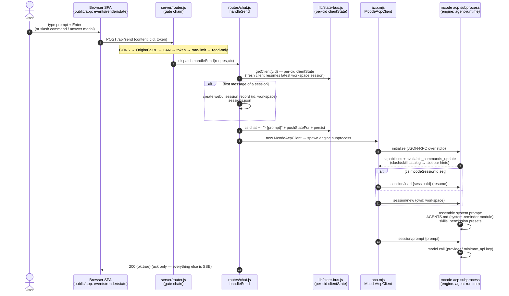
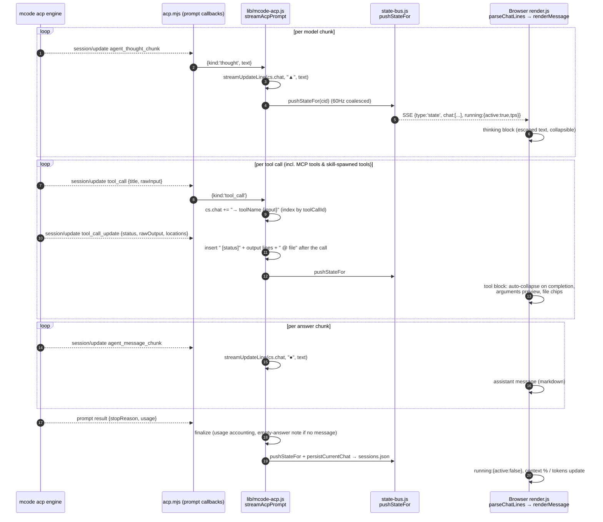
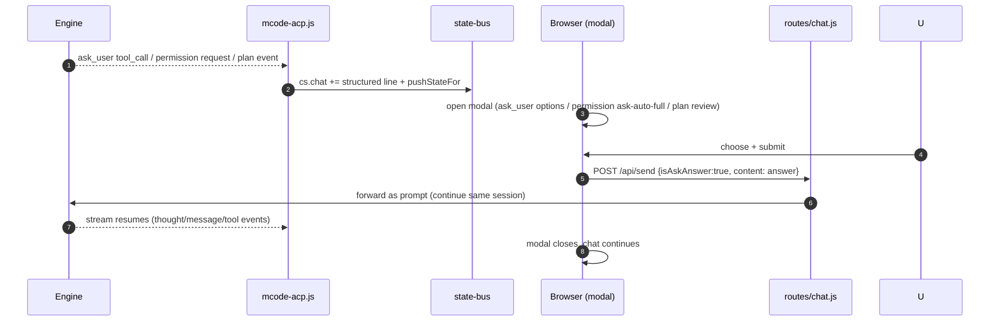
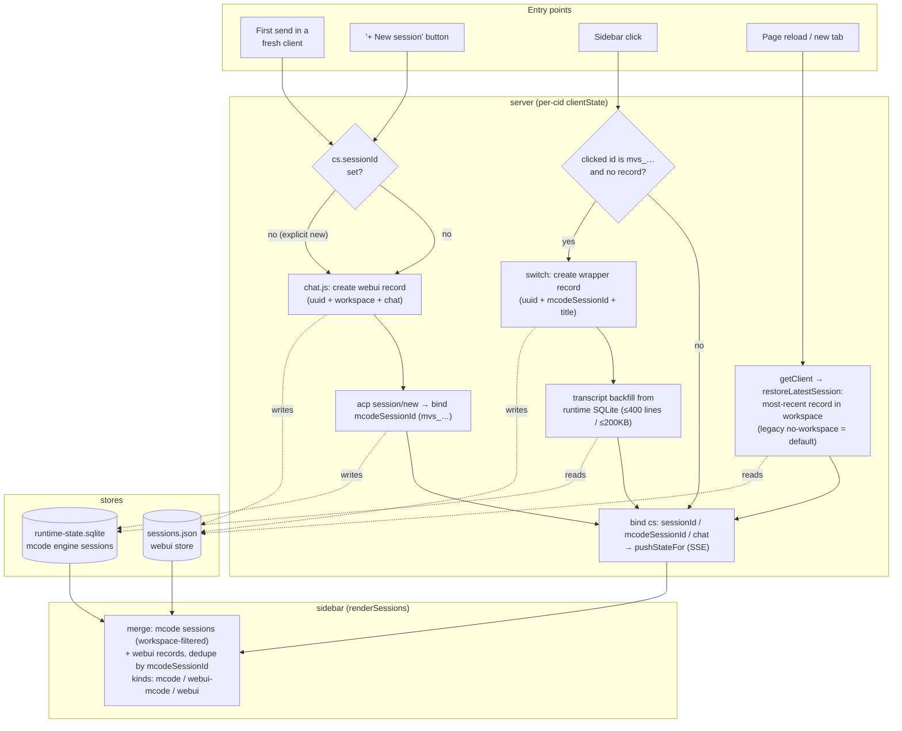

# Architecture

**English** | [简体中文](ARCHITECTURE.zh-CN.md)

> Companion to [README.md](../README.md). This document is for people
> modifying the webui or integrating with it. It describes the runtime
> topology, the module boundaries, the request lifecycle, and the SSE
> payload contract.
>
> **Scope boundary.** This document is the single source of truth for how the
> webui is built. The repository-root [ARCHITECTURE.md](../../../ARCHITECTURE.md)
> covers a different subject: the measured architecture of the desktop client and
> the TUI, and the desktop-facing alignment contract. It deliberately does not
> restate the topology, modules, or payload schemas documented here.

## 1. High-level topology

```
                              ┌─────────────────────────────────────────────┐
                              │  Browser (public/)                          │
                              │   • index.html (markup)                     │
                              │   • app/main.js (ES module)                 │
                              │   • styles/main.css                         │
                              └─────────────────────────────────────────────┘
                                  │ ▲                          │ ▲
                  fetch / JSON   │ │  EventSource / SSE        │ │
                                  ▼ │                          ▼ │
   ┌──────────────────────────────────────────────────────────────────────┐
   │  server.js — bootstrap only (≈ 100 lines)                            │
   │   • installGlobalErrorHandlers()                                     │
   │   • preflight: mcode.cmd exists, upload dir writable, etc.            │
   │   • http.createServer(handleRequest)                                 │
   └──────────────────────────────────────────────────────────────────────┘
                                  │
                                  ▼
   ┌──────────────────────────────────────────────────────────────────────┐
   │  server/router.js — declarative route table                          │
   │                                                                      │
   │  LAN guard: !isLocalRequest(req) && !getLanBroadcast() → 403         │
   │                                                                      │
   │  ┌─ static  ┐ ┌─ /api/health  ┐  ┌─ /api/state  ┐ ┌─ /api/sessions ┐ │
   │  │ index   │ │ health.js     │  │ state.js     │ │ sessions.js    │ │
   │  │ .html   │ └───────────────┘  │ + /api/events│ │ + acp-         │ │
   │  │ .css/js │                    │   (SSE)      │ │   sessions/*   │ │
   │  │ .png    │                    └──────────────┘ └────────────────┘ │
   │  └─────────┘                                                       │
   │  ┌─ /api/send    ┐ ┌─ /api/usage  ┐ ┌─ /api/workspace  ┐             │
   │  │ chat.js      │ │ usage.js     │ │ workspace.js      │             │
   │  │ + /stop /cmd │ │ + -real      │ │ + /workspace/    │             │
   │  │              │ │ + /refresh   │ │   browse          │             │
   │  └──────────────┘ └──────────────┘ └──────────────────┘             │
   │  ┌─ /api/upload ┐ ┌─ /api/settings  ┐ ┌─ /api/models    ┐            │
   │  │ upload.js    │ │ settings.js     │ │ model.js         │            │
   │  └──────────────┘ └─────────────────┘ │ + /set-model     │            │
   │                                        │ + /permissions   │            │
   │                                        │ + /answer        │            │
   │                                        └──────────────────┘            │
   │  ┌─ /api/protocol/*  ┐ ┌─ /api/debug/*  ┐                            │
   │  │ protocol.js       │ │ debug.js       │                            │
   │  │ /set-mode         │ │ /inject (gated)│                            │
   │  │ /set-config-option│ │ /state         │                            │
   │  │ /cancel           │ └────────────────┘                            │
   │  │ /load-session …   │                                              │
   │  │ /capabilities     │                                              │
   │  └───────────────────┘                                              │
   └──────────────────────────────────────────────────────────────────────┘
                                  │
                                  ▼
   ┌──────────────────────────────────────────────────────────────────────┐
   │  server/lib/ — pure modules (one concern each)                      │
   │                                                                      │
   │  config · lan · models · db · sessions                              │
   │  state-bus · acp-client · mcode-rpc · mcode-acp · mcode-exec        │
   │  mavis-usage · usage · settings · upload · workspace · slash        │
   └──────────────────────────────────────────────────────────────────────┘
                                  │                          ▲
                                  ▼                          │  JSON-RPC over stdio
   ┌──────────────────────────────────────┐   ┌─────────────────────────────┐
   │  mcode exec subprocess                │   │  mcode acp subprocess        │
   │  (legacy single-turn, fallback)      │   │  (default multi-turn)        │
   │  stdio: line-delimited stream-json    │   │  stdio: newline-delimited    │
   │                                      │   │  JSON-RPC 2.0                │
   └──────────────────────────────────────┘   └─────────────────────────────┘
```

## 2. Request lifecycle

A user clicks **Send**. The events that follow:

```
browser           server/router.js           server/lib/*                mcode
   │ POST /api/send {content,…}    │                              │
   │ ──────────────────────────────►│                              │
   │                                │ chat.js: validate,           │
   │                                │   cs = getClient(cid)         │
   │                                │   cid → state-bus             │
   │                                │ ─────────────────►           │
   │                                │                              │ mcode-acp.js / mcode-exec.js
   │                                │                              │ ─── spawn / pipe stdin ───►
   │                                │                              │
   │                                │ state-bus: pushStateFor(cid) │
   │   ◄──────────── SSE event ────│   {type:'state', running:…}  │
   │   {type:'chat', lines:[…]}    │                              │
   │   ◄──────────── SSE event ────│   ◄── line  ◄─── stdout  ────│
   │   {type:'delta', text:'…'}    │                              │
   │   …                            │                              │
   │   ◄──────────── SSE event ────│   ◄── exec.result  ──────────│
   │   {type:'exec', status:'ok'}   │                              │
   │   ◄──────────── SSE event ────│                              │
   │   {type:'state', running:false}│                              │
   │   …                            │                              │
   │ connection closes / kept open   │                              │
```

Key invariants:

- **One `mcode` subprocess per active webui tab** (keyed by `cid` =
  client id, a UUID stored in `localStorage.webui_cid`). A new tab gets a new
  subprocess; a closed tab kills its subprocess. State is per-cid, not
  per-connection.
- **The SSE channel is the only source of state updates** for the client.
  REST endpoints mutate server state but do not push to the client. The
  client treats SSE as truth.
- **`pushStateFor(cid, opts)` is the only function that mutates per-cid
  state on the server.** Everything else is read-only. This is why
  `state-bus.js` is the size it is — it's the single chokepoint.

## 2.1 Conversation sequence — prompt → stream → render

How one user turn travels end to end, and where each engine surface
(AGENTS.md, thinking, tool calls, MCP tools, skills) is invoked and
rendered. Names are the real code symbols.



The stream that follows — every engine event becomes a chat line, every
chat mutation becomes an SSE state snapshot:



Interactive surfaces and engine-side modules — who owns what:

| Surface | Engine side (mcode) | Wire | Web UI render |
|---|---|---|---|
| **AGENTS.md** | `agent-modules/system-reminder` injects it into the system prompt at session start (project instructions, project memory) | invisible in chat; visible in the trajectory studio (`/trajectory/`, session events) | nothing special — it shapes model behavior |
| **Thinking (思维链)** | model emits `agent_thought_chunk` | `kind:'thought'` → `▲` line | collapsible thinking block (escaped text) |
| **Builtin tools** (Bash/Read/Write/Edit/…) | agent-runtime executes with permission presets | `tool_call` / `tool_call_update` → `→ name` + indented output lines | tool block, auto-collapse, file chips |
| **MCP tools** | engine spawns configured MCP servers (`mcp.json`); calls surface as `mcp__server__tool` | same tool_call wire | same tool block (server·tool naming) |
| **Skills** | `/skill` or prompt triggers `agent-modules/skills` → injected as system-reminder content | slash catalog from `available_commands_update`; invocation = normal prompt turn | slash hint UI; skill output = ordinary thought/message/tool stream |
| **ask_user tool** | engine emits `ask_user` tool call | chat line `→ ask_user {json}` | modal with options/multi-select/Other; answer → `POST /api/send {isAskAnswer:true}` |
| **Permission prompts** | engine requests approval for a tool call | permission events → modal (ask/auto/full) | answer forwarded on the send path |
| **Plan mode** | `Plan:`-prefixed prompt → structured plan event | plan-review modal | agree / skip / add context → forwarded |
| **Trajectory studio** | reads runtime SQLite projection (read-only) | `/api/trajectory/*` | `/trajectory/` panel (turns, tokens, compaction, subagents) |

Round-trip for interactive prompts (ask_user / permission / plan):



## 2.2 Session management flow

Two stores cooperate. The **webui store** (`sessions.json`, the recent-
sessions list) holds one record per webui session: `id` (uuid),
`mcodeSessionId` (bound `mvs_…`), `title`, `workspace`, `chat[]`. The
**mcode runtime store** (`~/.minimax/v2/sqlite/runtime-state.sqlite`)
holds the engine's own sessions; the webui reads it for the sidebar and
for transcript backfill.



Lifecycle notes:

- **Delete** (`DELETE /api/sessions/:id`) removes the webui record AND
  cross-deletes the linked `mvs_…` rows from the runtime SQLite
  (`deleteMcodeSessionFromDb`, `?dryRun=true` to preview). Deleting the
  mcode record drops it from both lists in one transaction.
- **Startup cleanup** prunes records that are empty AND default-titled
  AND older than 24h — the "+"-then-never-typed leftovers.
- **Search** (`GET /api/sessions/search`) fuzzy-matches titles across
  workspaces; matches render with a `[ws-short]` prefix and switching
  into them rides the same switch path above.
- **Same conversation, one record**: a fresh client resumes the latest
  session instead of forking (§2.2 fix history), and continuing a chat
  reuses the bound `mcodeSessionId` — no new engine session per message.
- The wrapper for an `mvs_…` click is **persisted** (title from the
  cache-first lookup, falling back to the ACP title probe), so repeated
  switching does not create duplicate records.


## 3. Module contracts

Each `server/lib/*.js` file exports a small set of named functions. No
file reaches into another's internals. The notable contracts:

### `config.js`
- Exports frozen-ish constants: `MCODE_ROOT`, `MCODE_CMD`, `PORT`, `HOST`,
  `TOKEN`, `DEFAULT_MODEL`, `DEFAULT_TIMEOUT`, `DEFAULT_MAX_STEPS`,
  `MAX_CONCURRENT`, `UPLOAD_DIR`, `SESSIONS_DB`, `MCODE_RUNTIME_DB`,
  `MAVIS_DATA_DIR`, `MAVIS_DB_PATH`, `SQLITE3_BIN`, `DEFAULT_WORKSPACE`.
- Exports functions: `getPlatformFallbackPaths`, `detectSqlite3Bin`,
  `detectTuiCwd` (re-export), `installGlobalErrorHandlers`.
- Reads `process.env.*` exactly once at module load. No per-request
  re-reading.
- `installGlobalErrorHandlers()` writes uncaught exceptions to
  `.server.err` so they survive a process restart.

### `state-bus.js`
The chokepoint. Exports:

| Function | Purpose |
|---|---|
| `getClient(cid)` | Returns the `clientState` object: `state`, `sse`, `activeChild`, `chatHistory`, `requestSeq`. Lazily creates on first call. |
| `pushStateFor(cid, opts)` | Build a normalized `state` object and write it to `clientState.state`. Broadcasts to the SSE channel unless `opts.silent`. |
| `pushOnlineCount(lanBroadcast)` | Count `sseByCid.size` and broadcast to all clients. Called on connect/disconnect. |
| `SSE_HEADERS` | Standard headers: `Content-Type: text/event-stream`, `Cache-Control: no-cache`, `Connection: keep-alive`, `X-Accel-Buffering: no`. |

The `state` payload is documented in § 5 below. The `clientState.state`
object is the **only** thing the rest of the codebase reads from.

### `acp-client.js`
Wraps mcode's JSON-RPC-over-stdio protocol. Exports:

- `McodeAcpClient` class — `start()`, `request(method, params)`,
  `notify(method, params)`, `stop()`, `events` EventEmitter.
- `getMcodeAcpClient()` — process-wide singleton. Init is
  `pInitPromise` de-duplicated so concurrent `start()` callers share a
  single subprocess.
- Cache: `mcodeSessionsCache` (in `acp-client.js`) and
  `getCachedMcodeCommands()` (in `state-bus.js`) avoid
  repeated JSON-RPC round-trips for `session/list` and
  `session/commands`.

### `mcode-rpc.js`
The shim for methods mcode 0.1.5 does not implement:

```js
const UNSUPPORTED = new Set([
  'session/set_mode',
  'session/set_config_option',
  'session/cancel',
  'session/activate', 'session/fork', 'session/resume', 'session/delete',
  'session/request_permission', 'session/subscribe',
])
```

`callRpc(method, params)` returns
`{ok:false, code:'unsupported', error:'…'}` synchronously when the
method is unsupported. The caller decides what to do — usually a toast
on the client.

### `mcode-acp.js` vs `mcode-exec.js`
Two transports with a shared shape. The transport layer is selected
by `mcode-rpc.js` based on `mcode version >= 0.1.4` and the per-request
`/exec` opt-in.

Both expose:
- `runMcode(content, opts)` → `AsyncGenerator<NormalizedEvent>`
- `stopExec()` → `void`
- `isRunning()` → `boolean`

`NormalizedEvent` is a tagged union (`{type, …}`) with these types:
`state`, `chat`, `delta`, `tool`, `permission`, `plan`, `ask`,
`exec`, `usage`. See § 5.

## 4. The `clientState.state` payload

This is the shape every SSE `state` event contains. The webui mirrors
it 1:1 into the `state` JS variable.

```ts
{
  version: string,                 // webui version (from package.json)
  running: { active: boolean,
             sessionId?: string,    // mcode acp session id (if any)
             cid: string,           // webui tab id
             startTime?: number,    // ms epoch
             pendingPermission?: object,
             pendingPlan?: object,
             pendingAsk?: object },
  workspace: { dir: string,         // absolute path, "" if unset
               branch?: string,     // git branch (best-effort, "" on error)
               treeState?: 'clean'|'dirty'|'unknown' },
  model: { name: string,            // e.g. "minimax_api/MiniMax-M3"
           ctx: string,            // e.g. "512k"
           thinking: 'On'|'Off'|string },
  permissions: string,             // mcode-side: 'ask'|'auto'|'full'|'plan'|...
  commands: Array<{                // mcode slash commands
    cmd: string, zh: string, en: string,
    description_zh?: string, description_en?: string,
    hint?: string,
    input_hint?: string,
    destructive?: boolean }>,
  sessions: Array<{                // webui-side session list (merged w/ mcode)
    id: string,
    title: string,
    workspace: string,
    mcodeSessionId?: string,        // linked mcode session id
    updatedAt: number }>,
  mcodeSessions: Array<{            // mcode-side session list (raw)
    sessionId: string,
    title: string,
    cwd: string,
    updatedAt: number }>,
  mcodeSessionId?: string,         // currently-active mcode session
  context?: {                       // updated by SSE delta accumulation
    used: number,                   // tokens used (per-turn)
    percent: number,                // 0..100
    cacheRead: number,              // per-turn cache reads
    tps: number,                    // current tok/s
    source: 'mavis'|'mmx' },        // which backend provided the data
  usage?: {                         // from /api/usage
    remaining: number,              // percent
    resetAt: number,                // ms epoch
    weeklyResetAt: number,
    fetchedAt: number },
  plan?: { active: boolean, title: string, summary: string,
           options: Array<{label:string}>, totalLines: number,
           summaryLines: number },
  enterPlanMode?: { active: boolean },
  permissionChoice?: { active: boolean, current: string,
                        options: Array<{label:string}> },
  askUser?: { active: boolean, questions: Array<…> },
  goal?: { active: boolean, text: string, status: 'running'|'done'|'blocked',
           duration?: number },
  todo?: Array<{ content: string, status: 'pending'|'in_progress'|'done' }>,
  lanBroadcast: boolean,           // mirrors /api/settings
  onlineCount: number,              // from pushOnlineCount
  // 🆕 v1.0.1 — settings surface pushed over SSE state updates
  readOnly: boolean,                // read-only mode (server gate blocks remote POST/DELETE on /api/*)
  tokenEnabled: boolean,            // token auth master switch (default true)
  currentToken: string,             // 32-hex auto-generated token; "" after tokenAcknowledged=true
  tokenAcknowledged: boolean,       // operator confirmed they saved the token
  tokenRotatedAt: number            // ms-since-epoch of last rotation
}
```

The webui **does not** hold additional state outside this object. Any UI
panel that needs data reads it from `state` and reacts to `state`
changes via `render()`.

## 5. SSE event schema

Two event types — `state` (the standard state push) and a 🆕
v1.0.1 named event `auth.token_rotated` that fires only when the
token changes.

```
event: state
data: {"version":"0.1.3","running":{"active":true,…},…}

event: chat
data: {"lines":[{"role":"user","content":"…"}]}

event: delta
data: {"sessionId":"mvs_…","text":"hello","isPartial":true}

event: tool
data: {"name":"Bash","input":{…},"output":"…","status":"ok"|"err"|"running"}

event: permission
data: {"id":"perm_…","tool":"Bash","input":{…},"options":["ask","auto","full"]}

event: plan
data: {"title":"…","summary":"…","options":[…],"totalLines":N,"summaryLines":N}

event: ask
data: {"questions":[{"header":"…","question":"…","options":[…], "multiSelect":false}]}

event: exec
data: {"status":"ok"|"err"|"aborted","durationMs":N,"errorMessage"?:string}

event: usage
data: {"remaining":N,"resetAt":N,…}

event: online
data: {"count":N,"lanBroadcast":true}
```

🆕 **v1.0.1** — a separate named event for live token rotation:

```
event: auth.token_rotated
data: <new-32-hex-token>     // raw string, NOT JSON-wrapped
```

Fires when the operator hits "重置 token" in the settings card (or
any future trigger that rotates the token). Each connected client
that receives the event updates its `localStorage` (`webui_token` key)
and the live `HEADERS.Authorization` object **in place** — subsequent
`fetch()` calls use the new token automatically, no reload required.
Clients that were offline when the event fired will get `401` on
their next request; they need to be re-sent the new URL manually.

The body is **raw text**, not JSON-encoded — it's obvious in devtools
that this is sensitive material, and `JSON.stringify` would not add
any value (and would obscure the token when copy-pasted from
network logs).

The webui treats each event as an idempotent update; replaying the
same event is safe. The server uses an at-most-once delivery model
(SSE drops on disconnect → no retry), which the client handles by
fetching `/api/state` on reconnect.

## 6. Frontend topology

```
public/index.html         (markup only, no inline <script> or <style>)
public/app/main.js        (single ES module, ~4200 lines)
public/styles/main.css    (single stylesheet)
public/lib/marked.min.js  (third-party markdown)
```

`main.js` is intentionally monolithic. The codebase chose a single
file over a build step because:
- No bundler → zero build time, zero source maps, zero config
- Easier to grep (one file = one search)
- Cache-bust via `?v=N` query string on `<script src>`

Internal structure (top to bottom):
1. **Config** — env, `CID`, `TOKEN`, `API_SUFFIX`
2. **I18N tables** — `zh`, `en` objects; `t(key)` lookup; `applyI18n()` walk
3. **DOM cache** — `els = {...}` populated on `init()`
4. **Render functions** — `render()`, `renderChat()`, `renderSessions()`, `renderUsage()`, `renderRight()`, `renderGoal()`, `renderTodo()`, `renderContext()`
5. **State synchronization** — `connect()` (SSE), `pushStateFor` mirror
6. **Event handlers** — `attachEvents()` (delegation + per-element), `attachModalEvents()`
7. **Action functions** — `send()`, `stopExec()`, `setMode()`, `setModel()`, `submitWorkspaceChange()`, `cancelConfirm()`, `refreshSessions()`, `refreshUsage()`
8. **Helpers** — `parseChatLines()`, `parseMarkdown()`, `renderMessage()`, `escapeHtml()`
9. **Init** — try { init(); attachModalEvents() } catch { show red error }

## 7. Why zero npm dependencies

The webui is intentionally dependency-free. Reasons:

- `mcode.cmd` is already a toolchain that pulls its own deps
- A webui that needs `npm install` to start is one more thing that can break
- All required functionality (HTTP server, EventSource, JSON, multipart
  parsing) is in Node stdlib

The `package.json` exists for the `name`/`version`/`scripts` fields and
for editor tooling (Node type detection). `npm start` is a one-liner
that just runs `node server.js`.

If a future change needs a new dep, the rule is: add it, document why,
keep the dep optional where possible (try/catch + fallback).

## 8. Failure modes

| Failure | Detection | Recovery |
|---|---|---|
| mcode acp subprocess crashes | `child.on('exit')` listener | pushStateFor with `running.active=false`; client shows "agent stopped" toast |
| mcode acp returns "Method not found" | `mcode-rpc.js` whitelist | returns `{ok:false, code:'unsupported'}` synchronously; route handler returns 501 Not Implemented; client shows toast |
| SSE connection drops | `EventSource.onerror` | auto-reconnect with backoff; on reconnect, fetch `/api/state` and resync |
| LAN request from a non-whitelisted IP | `router.js` L120 | 403 + friendly HTML page (or JSON for /api/*) |
| Server out of file descriptors | `installGlobalErrorHandlers` EMFILE sink | written to `.server.err`; user sees an empty page; reload usually fixes it |
| mcode exec encoding is GBK (Windows) | Node defaults to UTF-8 in `spawn`; no fix needed | documented in README as a pitfall for future Python ports |

## 9. Adding a new endpoint

The pattern (see `docs/DEVELOPMENT.md` for the full walk-through):

1. Create `server/routes/foo.js`, export `async function handleFoo(req, res, ctx, pathname)`
2. Import in `server/router.js`
3. Add to the routes table:
   ```js
   { method: 'POST', match: (p) => p === '/api/foo', handler: fooRoute.handleFoo }
   ```
4. If the new endpoint mutates state, call `pushStateFor(cid, {...})` from
   the handler. Never write to `clientState.state` directly.
5. If the endpoint is invoked by the webui, add it to the fetch helper
   in `public/app/main.js` (`API_SUFFIX` is automatically appended).

## 10. Future directions

- **mcode `acp` capability parity**: once mcode implements the missing
  methods (`set_mode`, `cancel`, etc.), the `UNSUPPORTED` set in
  `mcode-rpc.js` shrinks; the corresponding `/api/protocol/*` endpoints
  become functional. The `protocol/capabilities` endpoint already
  advertises this.
- **WebSocket transport**: SSE is fine for unidirectional push. If
  bidirectional low-latency control becomes a need (e.g. live
  cursor tracking in a shared session), replace the EventSource
  with a WebSocket and keep the same message schema.
- **Multi-user session sharing**: per-cid state can be replaced with
  per-session state and a session-id routing key. The architecture
  already separates per-cid state from per-session data; the
  migration is renaming, not restructuring.
