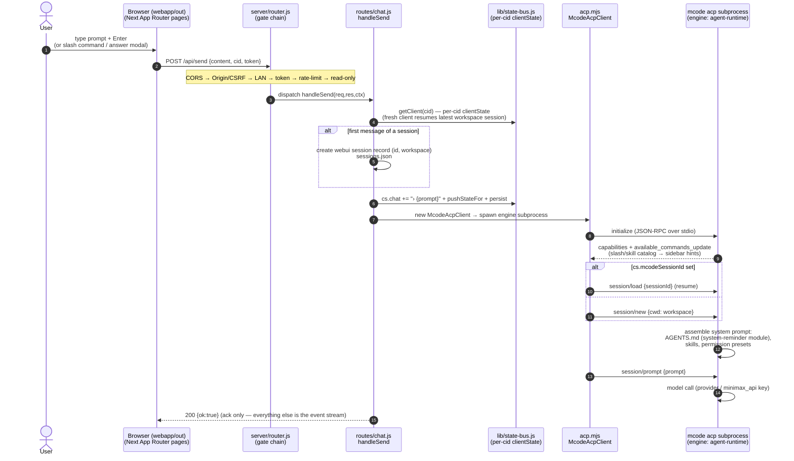
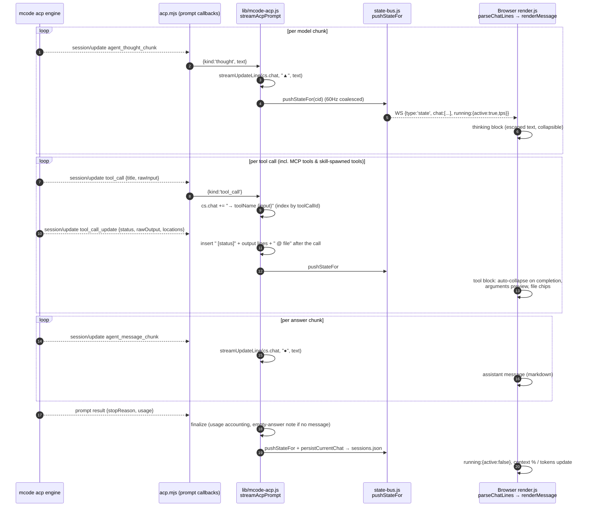
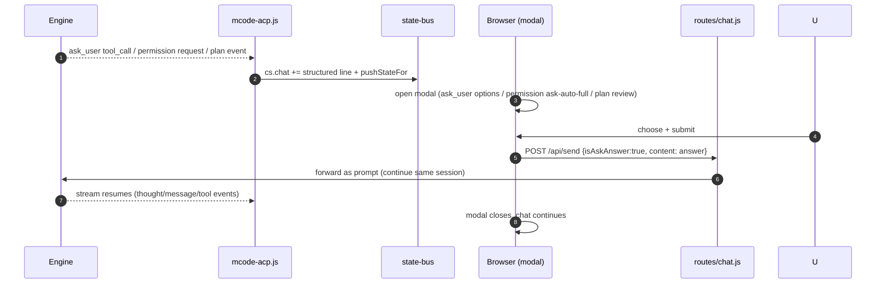
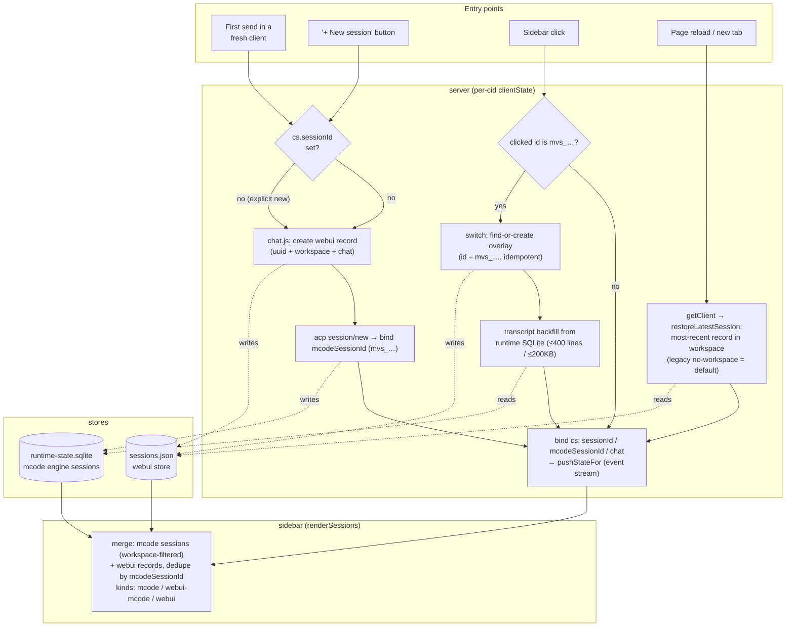

# Architecture

**English** | [简体中文](ARCHITECTURE.zh-CN.md)

> Companion to [README.md](../README.md). This document is for people
> modifying the webui or integrating with it. It describes the runtime
> topology, the module boundaries, the request lifecycle, and the
> WebSocket event-stream payload contract.
>
> **Scope boundary.** This document is the single source of truth for how the
> webui is built. The companion [DESKTOP-ARCHITECTURE.md](DESKTOP-ARCHITECTURE.md)
> covers a different subject: the measured architecture of the desktop client and
> the TUI, and the desktop-facing alignment contract. It deliberately does not
> restate the topology, modules, or payload schemas documented here.

## 1. High-level topology

```
                              ┌─────────────────────────────────────────────┐
                              │  Browser (webapp/out, Next static export)   │
                              │   • index.html + App Router pages           │
                              │   • _next/static/* (content-hashed)        │
                              │   • webapp/public/auth-gate.html (LAN gate) │
                              └─────────────────────────────────────────────┘
                                  │ ▲                          │ ▲
                  fetch / JSON   │ │  WebSocket /api/stream    │ │
                                  ▼ │                          ▼ │
   ┌──────────────────────────────────────────────────────────────────────┐
   │  server.js (source-mode) — registers @mavis/* → workspace TS resolver│
   │  server/bootstrap.js — actual startup (delegated to by server.js) │
   │  dist/webui/server.js — esbuild bundle of bootstrap.js (shipped)  │
   │   • installGlobalErrorHandlers()                                     │
   │   • preflight: mcode binary exists, upload dir writable, etc.       │
   │   • http.createServer(handleRequest)                                 │
   └──────────────────────────────────────────────────────────────────────┘
                                  │
                                  ▼
   ┌──────────────────────────────────────────────────────────────────────┐
   │  server/router.js — declarative route table                          │
   │                                                                      │
   │  LAN guard: !isLocalRequest(req) && !getLanBroadcast() → 403         │
   │                                                                      │
   │  ┌─ static  ┐ ┌─ /api/health  ┐  ┌─ /api/state  ┐ ┌─ /api/sessions ┐ │
   │  │ index   │ │ health.js     │  │ state.js     │ │ sessions.js    │ │
   │  │ .html   │ └───────────────┘  │ + /api/stream│ │ + acp-         │ │
   │  │ .css/js │                    │   (WebSocket)│ │   sessions/*   │ │
   │  │ .png    │                    └──────────────┘ └────────────────┘ │
   │  └─────────┘                                                       │
   │  ┌─ /api/send    ┐ ┌─ /api/usage  ┐ ┌─ /api/workspace  ┐             │
   │  │ chat.js      │ │ usage.js     │ │ workspace.js      │             │
   │  │ + /stop /cmd │ │ + -real      │ │ + /workspace/    │             │
   │  │              │ │ + /refresh   │ │   browse          │             │
   │  └──────────────┘ └──────────────┘ └──────────────────┘             │
   │  ┌─ /api/upload ┐ ┌─ /api/settings  ┐ ┌─ /api/models    ┐            │
   │  │ upload.js    │ │ settings.js     │ │ model.js         │            │
   │  └──────────────┘ └─────────────────┘ │ + /set-model     │            │
   │                                        │ + /permissions   │            │
   │                                        │ + /answer        │            │
   │                                        └──────────────────┘            │
   │  ┌─ /api/protocol/*  ┐ ┌─ /api/debug/*  ┐                            │
   │  │ protocol.js       │ │ debug.js       │                            │
   │  │ /set-mode         │ │ /inject (gated)│                            │
   │  │ /set-config-option│ │ /state         │                            │
   │  │ /cancel           │ └────────────────┘                            │
   │  │ /load-session …   │                                              │
   │  │ /capabilities     │                                              │
   │  └───────────────────┘                                              │
   └──────────────────────────────────────────────────────────────────────┘
                                  │
                                  ▼
   ┌──────────────────────────────────────────────────────────────────────┐
   │  server/lib/ — pure modules (one concern each)                      │
   │                                                                      │
   │  config · layout · lan · models · sqlite-resolver ·                │
   │  mcode-session-delete · sessions · state-bus · acp-client         │
   │  mcode-rpc · mcode-acp · mcode-exec · chat-line · context-percent  │
   │  mavis-usage · usage · settings · upload · workspace · slash ·     │
   │  static                                                           │
   └──────────────────────────────────────────────────────────────────────┘
                                  │                          ▲
                                  ▼                          │  JSON-RPC over stdio
   ┌──────────────────────────────────────┐   ┌─────────────────────────────┐
   │  mcode exec subprocess                │   │  mcode acp subprocess        │
   │  (legacy single-turn, fallback)      │   │  (default multi-turn)        │
   │  stdio: line-delimited stream-json    │   │  stdio: newline-delimited    │
   │                                      │   │  JSON-RPC 2.0                │
   └──────────────────────────────────────┘   └─────────────────────────────┘
```

## 2. Request lifecycle

A user clicks **Send**. The events that follow:

```
browser           server/router.js           server/lib/*                mcode
   │ POST /api/send {content,…}    │                              │
   │ ──────────────────────────────►│                              │
   │                                │ chat.js: validate,           │
   │                                │   cs = getClient(cid)         │
   │                                │   cid → state-bus             │
   │                                │ ─────────────────►           │
   │                                │                              │ mcode-acp.js / mcode-exec.js
   │                                │                              │ ─── spawn / pipe stdin ───►
   │                                │                              │
   │                                │ state-bus: pushStateFor(cid) │
   │   ◄──────────── WS event  ────│   {type:'state', running:…}  │
   │   {type:'chat', lines:[…]}    │                              │
   │   ◄──────────── WS event  ────│   ◄── line  ◄─── stdout  ────│
   │   {type:'delta', text:'…'}    │                              │
   │   …                            │                              │
   │   ◄──────────── WS event  ────│   ◄── exec.result  ──────────│
   │   {type:'exec', status:'ok'}   │                              │
   │   ◄──────────── WS event  ────│                              │
   │   {type:'state', running:false}│                              │
   │   …                            │                              │
   │ connection closes / kept open   │                              │
```

Key invariants:

- **One `mcode` subprocess per active webui tab** (keyed by `cid` =
  client id, a UUID stored in `localStorage.webui_cid`). A new tab gets a new
  subprocess; a closed tab kills its subprocess. State is per-cid, not
  per-connection.
- **The WebSocket event stream (`GET /api/stream`) is the only source of
  state updates** for the client. REST endpoints mutate server state but do
  not push to the client. The client treats the event stream as truth.
- **`pushStateFor(cid, opts)` is the only function that mutates per-cid
  state on the server.** Everything else is read-only. This is why
  `state-bus.js` is the size it is — it's the single chokepoint.

## 2.1 Conversation sequence — prompt → stream → render

How one user turn travels end to end, and where each engine surface
(AGENTS.md, thinking, tool calls, MCP tools, skills) is invoked and
rendered. Names are the real code symbols.



The stream that follows — every engine event becomes a chat line, every
chat mutation becomes a state snapshot on the event stream:



Interactive surfaces and engine-side modules — who owns what:

| Surface | Engine side (mcode) | Wire | Web UI render |
|---|---|---|---|
| **AGENTS.md** | `agent-modules/system-reminder` injects it into the system prompt at session start (project instructions, project memory) | invisible in chat; visible in the trajectory studio (`/trajectory/`, session events) | nothing special — it shapes model behavior |
| **Thinking (思维链)** | model emits `agent_thought_chunk` | `kind:'thought'` → `▲` line | collapsible thinking block (escaped text) |
| **Builtin tools** (Bash/Read/Write/Edit/…) | agent-runtime executes with permission presets | `tool_call` / `tool_call_update` → `→ name` + indented output lines | tool block, auto-collapse, file chips |
| **MCP tools** | engine spawns configured MCP servers (`mcp.json`); calls surface as `mcp__server__tool` | same tool_call wire | same tool block (server·tool naming) |
| **Skills** | `/skill` or prompt triggers `agent-modules/skills` → injected as system-reminder content | slash catalog from `available_commands_update`; invocation = normal prompt turn | slash hint UI; skill output = ordinary thought/message/tool stream |
| **ask_user tool** | engine emits `ask_user` tool call | chat line `→ ask_user {json}` | modal with options/multi-select/Other; answer → `POST /api/send {isAskAnswer:true}` |
| **Permission prompts** | engine requests approval for a tool call | permission events → modal (ask/auto/full) | answer forwarded on the send path |
| **Plan mode** | `Plan:`-prefixed prompt → structured plan event | plan-review modal | agree / skip / add context → forwarded |
| **Trajectory studio** | reads runtime SQLite projection (read-only) | `/api/trajectory/*` | `/trajectory/` panel (turns, tokens, compaction, subagents) |

Round-trip for interactive prompts (ask_user / permission / plan):



## 2.2 Session management flow

**One conversation = one identity**: the mcode session (`mvs_…`) IS the
session. The **webui store** (`sessions.json`) is an *overlay* keyed by
`mcodeSessionId` — it carries `title`, `workspace`, and a `chat[]`
snapshot for fast hydration, never a second session identity. New
overlay records use `id === mcodeSessionId`; drafts ("+" sessions that
have not sent yet) keep a uuid until the first turn promotes them
(`promoteDraftToMcodeSid`). Legacy uuid-keyed wrapper records still
resolve (every lookup matches `mcodeSessionId` first). The **mcode
runtime store** (`~/.minimax/v2/sqlite/runtime-state.sqlite`) is the
authoritative session list; the webui reads it for the sidebar and for
transcript backfill.



Lifecycle notes:

- **Delete** (`DELETE /api/sessions/:id`) removes the webui record AND
  cross-deletes the linked `mvs_…` rows from the runtime SQLite
  (`deleteMcodeSessionFromDb`, `?dryRun=true` to preview). Deleting the
  mcode record drops it from both lists in one transaction.
- **Startup cleanup** prunes records that are empty AND default-titled
  AND older than 24h — the "+"-then-never-typed leftovers.
- **Search** (`GET /api/sessions/search`) fuzzy-matches titles across
  workspaces; matches render with a `[ws-short]` prefix and switching
  into them rides the same switch path above.
- **Same conversation, one record**: a fresh client resumes the latest
  session instead of forking (§2.2 fix history), and continuing a chat
  reuses the bound `mcodeSessionId` — no new engine session per message.
- **Single identity (v2.4)**: switching to an `mvs_…` session resolves
  to exactly one overlay record — `ensureOverlayForMcodeSid` creates it
  with `id === mvs_…` on first contact and reuses it on every later
  switch. A first send promotes its draft to the same engine identity
  (merging into a pre-existing overlay when one exists). One
  conversation can therefore never appear as two records.


## 3. Module contracts

Each `server/lib/*.js` file exports a small set of named functions. No
file reaches into another's internals. The notable contracts:

### `config.js`
- Exports frozen-ish constants: `PACKAGE_ROOT` (alias for `WEBUI_ROOT`),
  `WEBUI_DATA_DIR`, `MCODE_CMD`, `PORT`, `PORT_PINNED`, `HOST`, `TOKEN`,
  `TOKEN_STDOUT`, `DEFAULT_MODEL`, `DEFAULT_TIMEOUT`, `DEFAULT_MAX_STEPS`,
  `MAX_CONCURRENT`, `UPLOAD_DIR`, `SESSIONS_DB`, `MCODE_RUNTIME_DB`,
  `MAVIS_DATA_DIR`, `MAVIS_DB_PATH`, `SQLITE3_BIN`, `DEFAULT_WORKSPACE`,
  `PROMPT_IDLE_TIMEOUT_MS`, `RATE_LIMIT_PER_MIN`, `RATE_LIMIT_BURST`,
  `MCODE_WEBUI_UPLOAD_DIR`, `MCODE_WEBUI_SETTINGS_PATH`,
  `MCODE_BETTER_SQLITE3`, `DEBUG_INJECT`.
- Exports functions: `getServingPort`, `setServingPort`, `resolveBindHost`,
  `getPlatformFallbackPaths`, `detectSqlite3Bin`, `detectTuiCwd`
  (re-export), `installGlobalErrorHandlers`.
- Reads `process.env.*` exactly once at module load. No per-request
  re-reading (port fallback is an exception — `setServingPort` updates
  the live port after boot).
- Data-dir precedence: `MINIMAX_DATA_DIR` > `MAVIS_DATA_DIR` > `~/.minimax`
  (one resolver shared with `MAVIS_DB_PATH`, which is the runtime SQLite).
- `installGlobalErrorHandlers()` writes uncaught exceptions to
  `.server.err` under `WEBUI_DATA_DIR` so they survive a process restart.

### `state-bus.js`
The chokepoint. Exports:

| Function | Purpose |
|---|---|
| `getClient(cid)` | Returns the per-cid `clientState` built by `makeClientState()` (`version`, `workspace`, `model`, `sessionId`, `mcodeSessionId`, `chat`, `sessions`, `context`, `usage`, `permissions`, `running`, `plan`, `ask`, `todo`, `goal` …). Lazily creates on first call; there is no `sse` field — the per-cid live channel is the `/api/stream` subscription on the event bus. |
| `pushStateFor(cid, opts)` | Build a full snapshot for the cid — the `clientState` fields plus injected `sessions`, settings and quota fields (`opts` carries `lanBroadcast` / `mcodeSessions` overrides) — and publish it straight to the event bus as a `state.snapshot` event; `cid === "__broadcast__"` fans out to every subscribed cid. |
| `pushOnlineCount(lanBroadcast)` | Set `onlineCount` to the number of event-stream subscribers (`getSubscribedCids().length`) and emit a `state.snapshot` to every subscribed cid. Called on `/api/stream` connect/disconnect. |

The snapshot payload shape is documented in § 4 below. Snapshots are
built on the fly by `pushStateFor` (`clientState` fields + injected
sessions / settings / quota fields); the rest of the codebase reads
the `clientState` fields themselves.

### `acp-client.js`
Wraps mcode's JSON-RPC-over-stdio protocol. Exports:

- `McodeAcpClient` class — `start()`, `request(method, params)`,
  `notify(method, params)`, `stop()`, `events` EventEmitter.
- `getMcodeAcpClient()` — process-wide singleton. Init is
  `pInitPromise` de-duplicated so concurrent `start()` callers share a
  single subprocess.
- Cache: `mcodeSessionsCache` (in `acp-client.js`) and
  `getCachedMcodeCommands()` (in `state-bus.js`) avoid
  repeated JSON-RPC round-trips for `session/list` and
  `session/commands`.

### `mcode-rpc.js`

The acp-side wrapper. Each public function (`setMode`,
`setConfigOption`, `cancelSession`, `loadSession`, `activateSession`,
`listSessions`, `getAccountStatus`, …) dispatches through
`clientForCid(cid, requireLive)`:

  - if a `cid` is supplied, the cid's registered active child
    (the per-prompt `McodeAcpClient`) is preferred — that subprocess
    is the one whose `sessions` map holds the in-flight session;
  - `requireLive: true` (used by `cancelSession` / `setConfigOption`)
    returns `null` rather than falling back to the singleton when no
    active child is registered, because silent fallback would mask the
    dispatch bug that previous PRs reintroduced;
  - everything else falls back to the singleton, which keeps the
    commands-probe and session-list paths working without a cid.

The capability table webui advertises to itself:

```js
export const MCODE_ACP_CAPABILITIES = {
  set_mode: true,
  set_config_option: true,
  cancel: true,
  activate: true,
  fork: true,
  resume: true,
  // session/delete registers on the engine but no handler exists,
  // which is why deletes go through SQL on the local_runtime_*
  // tables (see sqlite-resolver.js).
  delete: false,
  load: true,
  close: true,
  list: true,
  new: true,
  prompt: true,
}
```

`callRpc(method, params)` returns `{ok:false, code:'unsupported',
error:'…'}` when the engine answers with `-32601 Method not found`
(or the equivalent in the jsonrpc envelope). The caller decides what
to do — usually a toast on the client.

### `mcode-acp.js` vs `mcode-exec.js`
Two transports with a shared shape. The transport layer is selected
by `mcode-rpc.js` based on the engine's reported version (from the
`initialize` reply's `agentInfo`) and the per-request `/exec` opt-in.

Both expose:
- `runMcode(content, opts)` → `AsyncGenerator<NormalizedEvent>`
- `stopExec()` → `void`
- `isRunning()` → `boolean`

`NormalizedEvent` is a tagged union (`{type, …}`) with these types:
`state`, `chat`, `delta`, `tool`, `permission`, `plan`, `ask`,
`exec`, `usage`. See § 5.

## 4. The state snapshot payload

This is the shape every state snapshot on the event stream contains.
The webui mirrors it 1:1 into the `state` JS variable.

```ts
{
  version: string,                 // webui version (from package.json)
  running: { active: boolean,
             sessionId?: string,    // mcode acp session id (if any)
             cid: string,           // webui tab id
             startTime?: number,    // ms epoch
             pendingPermission?: object,
             pendingPlan?: object,
             pendingAsk?: object },
  workspace: { dir: string,         // absolute path, "" if unset
               branch?: string,     // git branch (best-effort, "" on error)
               treeState?: 'clean'|'dirty'|'unknown' },
  model: { name: string,            // e.g. "minimax_api/MiniMax-M3"
           ctx: string,            // e.g. "512k"
           thinking: 'On'|'Off'|string },
  permissions: string,             // mcode-side: 'ask'|'auto'|'full'|'plan'|...
  commands: Array<{                // mcode slash commands
    cmd: string, zh: string, en: string,
    description_zh?: string, description_en?: string,
    hint?: string,
    input_hint?: string,
    destructive?: boolean }>,
  sessions: Array<{                // webui-side session list (merged w/ mcode)
    id: string,
    title: string,
    workspace: string,
    mcodeSessionId?: string,        // linked mcode session id
    updatedAt: number }>,
  mcodeSessions: Array<{            // mcode-side session list (raw)
    sessionId: string,
    title: string,
    cwd: string,
    updatedAt: number }>,
  mcodeSessionId?: string,         // currently-active mcode session
  context?: {                       // updated by delta accumulation
    used: number,                   // tokens used (per-turn)
    percent: number,                // 0..100
    cacheRead: number,              // per-turn cache reads
    tps: number,                    // current tok/s
    source: 'mavis'|'mmx' },        // which backend provided the data
  usage?: {                         // from /api/usage
    remaining: number,              // percent
    resetAt: number,                // ms epoch
    weeklyResetAt: number,
    fetchedAt: number },
  plan?: { active: boolean, title: string, summary: string,
           options: Array<{label:string}>, totalLines: number,
           summaryLines: number },
  enterPlanMode?: { active: boolean },
  permissionChoice?: { active: boolean, current: string,
                        options: Array<{label:string}> },
  askUser?: { active: boolean, questions: Array<…> },
  goal?: { active: boolean, text: string, status: 'running'|'done'|'blocked',
           duration?: number },
  todo?: Array<{ content: string, status: 'pending'|'in_progress'|'done' }>,
  lanBroadcast: boolean,           // mirrors /api/settings
  onlineCount: number,              // from pushOnlineCount
  // 🆕 v1.0.1 — settings surface pushed over event-stream state updates
  readOnly: boolean,                // read-only mode (server gate blocks remote POST/DELETE on /api/*)
  tokenEnabled: boolean,            // token auth master switch (default true)
  currentToken: string,             // 32-hex auto-generated token; "" after tokenAcknowledged=true
  tokenAcknowledged: boolean,       // operator confirmed they saved the token
  tokenRotatedAt: number            // ms-since-epoch of last rotation
}
```

The webui **does not** hold additional state outside this object. Any UI
panel that needs data reads it from `state` and reacts to `state`
changes via `render()`.

## 5. Event schema (WebSocket event stream)

Two event types — `state` (the standard state push) and a 🆕
v1.0.1 named event `auth.token_rotated` that fires only when the
token changes.

> **Channel note (decision 20).** SSE is removed. These events ride
> `GET /api/stream` as `state.snapshot` frames (payload = the §4 state
> object) and `control` frames (`{v:1, seq, ts, type:"control",
> payload:{name, data}}`) — see [API.md `GET /api/stream`](API.md).
> The `event:` / `data:` lines below are the pre-decision-20 encoding,
> retained as the canonical event-name → payload map.

```
event: state
data: {"version":"0.5.2","running":{"active":true,…},…}

event: chat
data: {"lines":[{"role":"user","content":"…"}]}

event: delta
data: {"sessionId":"mvs_…","text":"hello","isPartial":true}

event: tool
data: {"name":"Bash","input":{…},"output":"…","status":"ok"|"err"|"running"}

event: permission
data: {"id":"perm_…","tool":"Bash","input":{…},"options":["ask","auto","full"]}

event: plan
data: {"title":"…","summary":"…","options":[…],"totalLines":N,"summaryLines":N}

event: ask
data: {"questions":[{"header":"…","question":"…","options":[…], "multiSelect":false}]}

event: exec
data: {"status":"ok"|"err"|"aborted","durationMs":N,"errorMessage"?:string}

event: usage
data: {"remaining":N,"resetAt":N,…}

event: online
data: {"count":N,"lanBroadcast":true}
```

🆕 **v1.0.1** — a separate named event for live token rotation:

```
event: auth.token_rotated
data: <new-32-hex-token>     // raw string, NOT JSON-wrapped
```

Fires when the operator hits "重置 token" in the settings card (or
any future trigger that rotates the token). Each connected client
that receives the event updates its `localStorage` (`webui_token` key)
and the live `HEADERS.Authorization` object **in place** — subsequent
`fetch()` calls use the new token automatically, no reload required.
Clients that were offline when the event fired will get `401` on
their next request; they need to be re-sent the new URL manually.

The payload's `data` field is the **raw token string**, not a
JSON-encoded string — it's obvious in devtools that this is sensitive
material, and double-encoding would not add any value (and would
obscure the token when copy-pasted from network logs).

The webui treats each event as an idempotent update; replaying the
same event is safe. The event stream keeps a per-cid ring buffer: on
reconnect the client resumes from `lastSeq`, and when the buffer has
underrun the server replays the latest `state.snapshot` as the
baseline (the first-connect baseline comes from `GET /api/state`).

## 6. Frontend topology

```
packages/webui/webapp/                Next.js 14.2.35 app (React 18 + Tailwind)
├── app/                              App Router: layout.tsx, page.tsx
├── components/                       shell, chat, composer, toolbar, panels, modals, icons
├── lib/                              transcript, sse, api, cid, store, markdown, i18n, theme, types
├── styles/tokens.css                 design tokens (verbatim from desktop)
├── styles/desktop-typography.css     typography preset cascade
├── styles/official-utilities.css     copied upstream utility classes
├── public/                           static assets Next copies into the export
│   ├── auth-gate.html                LAN token gate (served by the same static root)
│   ├── favicon_v2.ico                site icon
│   └── favicon_v2.png                site icon
└── out/                              next export — served by server/lib/static.js

packages/webui/public/trajectory/     standalone Trajectory Studio (its own backend,
                                    CSP, token posture) — only legacy subtree left
                                    under public/; routed at /trajectory/ before any
                                    static lookup.
```

The frontend is a **Next static export**, not the legacy vanilla-JS SPA. The
export is rebuilt by `pnpm run webui:build` (which `pnpm build` runs) and
copied into `dist/webui/webapp/out/` so the bundled runtime serves it from
the same relative location as a source checkout. There is exactly one
static root: `server/lib/static.js` reads from `NEXT_EXPORT_DIR` (the Next
export) only — there is no `PUBLIC_DIR` fallback for the main UI. The
Trajectory Studio under `public/trajectory/` is mounted at `/trajectory/`
by the trajectory handler (its own backend / CSP / token posture), not by
the static root. Internal layout:

1. **App Router** — `app/layout.tsx` (theme bootstrap, global styles), `app/page.tsx` (composition)
2. **Components** — `shell`, `chat`, `chat-virtual-list`, `composer`, `toolbar`, `panels`, `modals`, `inbox`, `session-tree`, `context-meter`, `action-error-banner`, `icons`
3. **Logic** — `lib/transcript`, `lib/sse`, `lib/api`, `lib/cid`, `lib/store`, `lib/markdown`, `lib/i18n`, `lib/theme`, `lib/types`, `lib/action-errors`, `lib/alerts`, `lib/use-locale`, `lib/workspace-filter`
4. **Styles** — `styles/tokens.css` (verbatim from desktop), `styles/desktop-typography.css`, `styles/official-utilities.css`; `app/globals.css` is the App Router global stylesheet
5. **Public** — `public/auth-gate.html` (the LAN token gate, served by the same static root), `public/favicon_v2.ico`, `public/favicon_v2.png`
6. **Output** — `out/` is the `next export`; the server's static handler serves it as the single root

## 7. Runtime vs. build dependencies

The server is **bundled, not copied** and is no longer required to be
dependency-free. `scripts/build.mjs` produces `dist/webui/server.js` from
`packages/webui/server/bootstrap.js`, reusing the shared workspace-source
esbuild plugin (the same plugin the `cli` bundle uses); that bundle is
the only runtime form shipped in the published archive. In a source
checkout, `packages/webui/server.js` is a small source-mode bootstrap:
it registers the `tsx` loader and an import resolver that maps every
`@mavis/*` specifier to the workspace's TypeScript sources, then
delegates to the same `server/bootstrap.js`. Source runs, tests, and the
shipped bundle all resolve the same way.

### 7.1 Tiered dependency policy

Use the tier that matches the surface you are touching.

**Tier 1 — must be reused, never re-implemented.** Contracts and pure logic
that a workspace package already owns. Drift between a copy and its source is
silent and expensive, so anything in this tier has to be imported by subpath
from `@mavis/*`:

- data-directory and path contracts (`@mavis/shared` paths, the
  `~/.mcode-webui` layout)
- model catalogues and provider presets
- questionnaire / question schemas and the corresponding ACP method shapes
- retry / redaction / formatting helpers
- any contract duplicated elsewhere in the workspace — if two packages would
  diverge on a field rename, it is Tier 1 by definition.

**Tier 2 — may be owned locally.** Process- and platform-bound surfaces of
this HTTP server that no other surface shares:

- MIME map, multipart parsing
- LAN / IP allow-list and CORS handling for this server's listener
- port-fallback policy, static-asset serving, `/api/*` auth middleware
- this server's own settings/token state, idle watchdog, upload directory.

These are Web UI-shaped by design; pulling them out would just create a
second package to version.

**Tier 3 — must not be imported.** Internals of packages that ship native
modules with platform-bound prebuilds (TUI native binaries, sandbox-runtime).
The reason is platform reach, not purity: depending on them from a JS bundle
that runs on every supported Node turns the package into a native-module
package. Depend on the ACP protocol, not on TUI internals (this is already
the rule recorded in `DESKTOP-ARCHITECTURE.md` §6 row 7).

### 7.2 The frontend rule, unchanged

New *frontend* libraries are held to the same rule that was correct in the
previous text: prefer one the workspace already depends on (as `marked` is,
via `packages/tui`) so the lockfile, the licence inventory and the
standalone boundary all stay as they are. Tier 1 / Tier 2 / Tier 3 apply to
the server only.

### 7.3 Enforcement

"Add a dependency and import it" is now a supported, checked path, not a
forbidden one:

- `pnpm webui:typecheck` covers the frontend TS; `scripts/check-webui-bundle.mjs`
  inspects the produced bundle and fails on any bare external import that is
  not declared in `cliExternalModules`. The bundle check is what would have
  caught `hono` shipping without being declared in the release manifest.
- `scripts/verify.mjs` runs both gates; a red bundle check is a red `pnpm verify`.

### 7.4 Why the old "dependency-free" rule existed, and why it no longer applies

The old rule was written for the plugin era, when the webui was distributed
as a directory the user dropped into a `mcode` install: no build pipeline, no
lockfile, no release archive. In that world, every runtime dependency was
another thing the user had to install or whose absence could silently break
the plugin; the safe answer was "no dependencies at all". That reasoning no
longer holds: the webui is now an in-tree workspace member with a build step,
its server is produced by `scripts/build.mjs` as `dist/webui/server.js`, and
the published archive (`scripts/lib/cli-release.mjs` + `releaseManifest`) pins
every external module. The cost of a hand-copied implementation is now higher
than the cost of importing a real package, because the copy cannot be checked
by the build pipeline.

The "no bundling" comment in `scripts/build.mjs` is owned by workstream 1 and
will be removed when its bundle entry point lands. This document is the
authority on the policy; treat any source comment that contradicts §7 as
stale.

## 8. Failure modes

| Failure | Detection | Recovery |
|---|---|---|
| mcode acp subprocess crashes | `child.on('exit')` listener | pushStateFor with `running.active=false`; client shows "agent stopped" toast |
| mcode acp returns "Method not found" | `mcode-rpc.js` whitelist | returns `{ok:false, code:'unsupported'}` synchronously; route handler returns 501 Not Implemented; client shows toast |
| Event stream drops | WebSocket `onclose` | reconnect with backoff + `resume {lastSeq}`; on ring-buffer underrun the server replays the latest `state.snapshot` (first connect fetches `/api/state`) |
| LAN request from a non-whitelisted IP | `router.js` L120 | 403 + friendly HTML page (or JSON for /api/*) |
| Server out of file descriptors | `installGlobalErrorHandlers` EMFILE sink | written to `.server.err`; user sees an empty page; reload usually fixes it |
| mcode exec encoding is GBK (Windows) | Node defaults to UTF-8 in `spawn`; no fix needed | documented in README as a pitfall for future Python ports |

## 9. Adding a new endpoint

The pattern (see `docs/DEVELOPMENT.md` for the full walk-through):

1. Create `server/routes/foo.js`, export `async function handleFoo(req, res, ctx, pathname)`
2. Import in `server/router.js`
3. Add to the routes table:
   ```js
   { method: 'POST', match: (p) => p === '/api/foo', handler: fooRoute.handleFoo }
   ```
4. If the new endpoint mutates state, call `pushStateFor(cid, {...})` from
   the handler. Never write to `clientState.state` directly.
5. If the endpoint is invoked by the webui, add it to the fetch helper in
   `packages/webui/webapp/lib/api.ts` (`API_SUFFIX` is automatically appended).

## 10. Future directions

- **mcode `acp` capability parity**: methods the engine has not yet
  implemented stay in the unsupported path of `mcode-rpc.js`; the
  corresponding `/api/protocol/*` routes answer `501 unsupported`.
  `GET /api/protocol/capabilities` exposes the current table so the
  webui can grey out controls that the engine does not yet back.
- **WebSocket transport**: SSE is fine for unidirectional push. If
  bidirectional low-latency control becomes a need (e.g. live
  cursor tracking in a shared session), replace the EventSource
  with a WebSocket and keep the same message schema.
- **Multi-user session sharing**: per-cid state can be replaced with
  per-session state and a session-id routing key. The architecture
  already separates per-cid state from per-session data; the
  migration is renaming, not restructuring.
