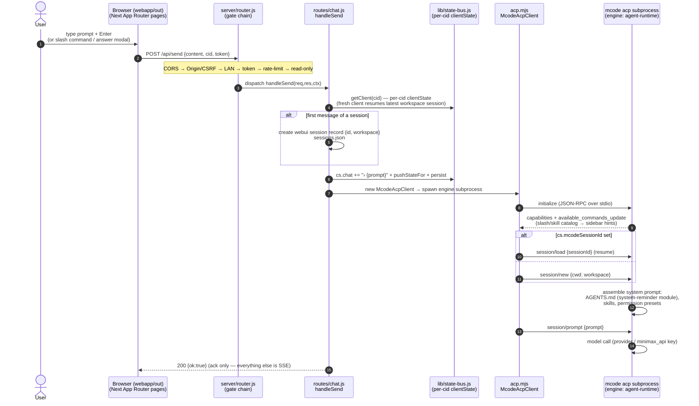
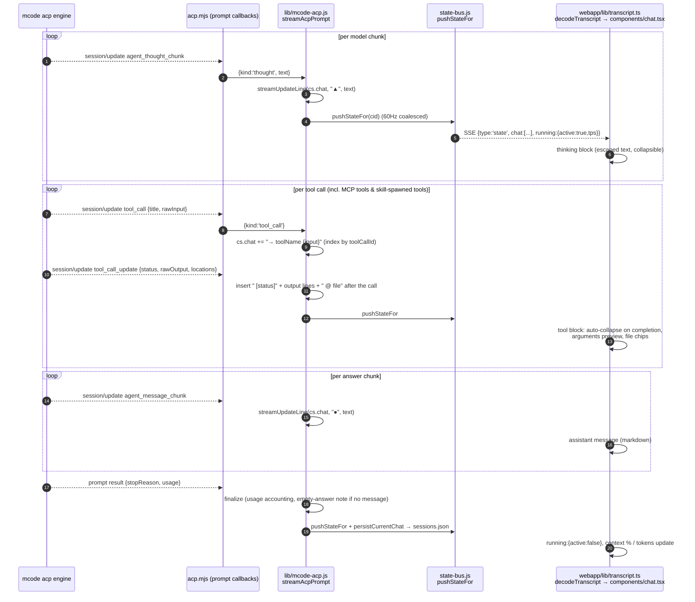
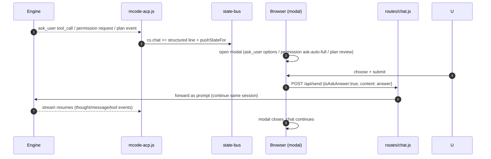
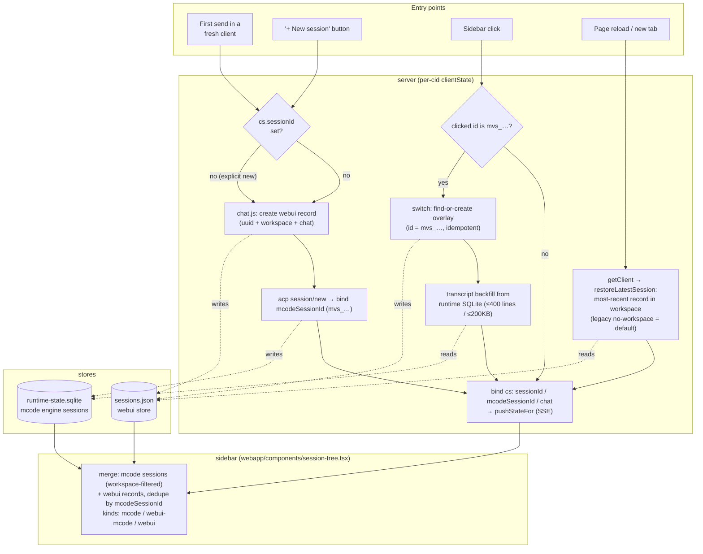

# Architecture

**English** | [简体中文](ARCHITECTURE.zh-CN.md)

> Companion to [README.md](../README.md). This document is for people
> modifying the webui or integrating with it. It describes the runtime
> topology, the module boundaries, the request lifecycle, and the SSE
> payload contract.
>
> **Scope boundary.** This document is the single source of truth for how the
> webui is built. The companion [DESKTOP-ARCHITECTURE.md](DESKTOP-ARCHITECTURE.md)
> covers a different subject: the measured architecture of the desktop client and
> the TUI, and the desktop-facing alignment contract. It deliberately does not
> restate the topology, modules, or payload schemas documented here.

## 1. High-level topology

```
                              ┌─────────────────────────────────────────────┐
                              │  Browser (webapp/out, Next static export)   │
                              │   • index.html + App Router pages           │
                              │   • _next/static/* (content-hashed)        │
                              │   • webapp/public/auth-gate.html (LAN gate) │
                              └─────────────────────────────────────────────┘
                                  │ ▲                          │ ▲
                  fetch / JSON   │ │  EventSource / SSE        │ │
                                  ▼ │                          ▼ │
   ┌──────────────────────────────────────────────────────────────────────┐
   │  server.js (source-mode) — registers @mavis/* → workspace TS resolver│
   │  server/bootstrap.js — actual startup (delegated to by server.js) │
   │  dist/webui/server.js — esbuild bundle of bootstrap.js (shipped)  │
   │   • installGlobalErrorHandlers()                                     │
   │   • preflight: mcode binary exists, upload dir writable, etc.       │
   │   • http.createServer(handleRequest)                                 │
   └──────────────────────────────────────────────────────────────────────┘
                                  │
                                  ▼
   ┌──────────────────────────────────────────────────────────────────────┐
   │  server/router.js — declarative route table                          │
   │                                                                      │
   │  Gate chain (Gates 1→5) live in server/lib/gates.js#runGates, which   │
   │  router.js delegates to; both layers share it:                        │
   │  LAN guard: !isLocalRequest(req) && !getLanBroadcast() → 403         │
   │                                                                      │
   │  ┌─ static  ┐ ┌─ /api/health  ┐  ┌─ /api/state  ┐ ┌─ /api/sessions ┐ │
   │  │ index   │ │ health.js     │  │ state.js     │ │ sessions.js    │ │
   │  │ .html   │ └───────────────┘  │ + /api/events│ │ + acp-         │ │
   │  │ .css/js │                    │   (SSE)      │ │   sessions/*   │ │
   │  │ .png    │                    └──────────────┘ └────────────────┘ │
   │  └─────────┘                                                       │
   │  ┌─ /api/send    ┐ ┌─ /api/usage  ┐ ┌─ /api/workspace  ┐             │
   │  │ chat.js      │ │ usage.js     │ │ workspace.js      │             │
   │  │ + /stop /cmd │ │ + -real      │ │ + /workspace/    │             │
   │  │              │ │ + /refresh   │ │   browse          │             │
   │  └──────────────┘ └──────────────┘ └──────────────────┘             │
   │  ┌─ /api/upload ┐ ┌─ /api/settings  ┐ ┌─ /api/models    ┐            │
   │  │ upload.js    │ │ settings.js     │ │ model.js         │            │
   │  └──────────────┘ └─────────────────┘ │ + /set-model     │            │
   │                                        │ + /permissions   │            │
   │                                        │ + /answer        │            │
   │                                        └──────────────────┘            │
   │  ┌─ /api/protocol/*  ┐ ┌─ /api/debug/*  ┐                            │
   │  │ protocol.js       │ │ debug.js       │                            │
   │  │ /set-mode         │ │ /inject (gated)│                            │
   │  │ /set-config-option│ │ /state         │                            │
   │  │ /cancel           │ └────────────────┘                            │
   │  │ /load-session …   │                                              │
   │  │ /capabilities     │                                              │
   │  └───────────────────┘                                              │
   └──────────────────────────────────────────────────────────────────────┘
                                  │
                                  ▼
   ┌──────────────────────────────────────────────────────────────────────┐
   │  server/lib/ — pure modules (one concern each)                      │
   │                                                                      │
   │  config · layout · lan · models · sqlite-resolver ·                │
   │  mcode-session-delete · sessions · state-bus · acp-client         │
   │  mcode-rpc · mcode-acp · mcode-exec · chat-line · context-percent  │
   │  mavis-usage · usage · settings · upload · workspace · slash ·     │
   │  static · gates · auth · alerts · trajectory                       │
   └──────────────────────────────────────────────────────────────────────┘
                                  │                          ▲
                                  ▼                          │  JSON-RPC over stdio
   ┌──────────────────────────────────────┐   ┌─────────────────────────────┐
   │  mcode exec subprocess                │   │  mcode acp subprocess        │
   │  (legacy single-turn, fallback)      │   │  (default multi-turn)        │
   │  stdio: line-delimited stream-json    │   │  stdio: newline-delimited    │
   │                                      │   │  JSON-RPC 2.0                │
   └──────────────────────────────────────┘   └─────────────────────────────┘
```

## 2. Request lifecycle

A user clicks **Send**. The events that follow:

```
browser           server/router.js           server/lib/*                mcode
   │ POST /api/send {content,…}    │                              │
   │ ──────────────────────────────►│                              │
   │                                │ chat.js: validate,           │
   │                                │   cs = getClient(cid)         │
   │                                │   cid → state-bus             │
   │                                │ ─────────────────►           │
   │                                │                              │ mcode-acp.js / mcode-exec.js
   │                                │                              │ ─── spawn / pipe stdin ───►
   │                                │                              │
   │                                │ state-bus: pushStateFor(cid) │
   │   ◄──────────── SSE event ────│   {type:'state', running:…}  │
   │   {type:'chat', lines:[…]}    │                              │
   │   ◄──────────── SSE event ────│   ◄── line  ◄─── stdout  ────│
   │   {type:'delta', text:'…'}    │                              │
   │   …                            │                              │
   │   ◄──────────── SSE event ────│   ◄── exec.result  ──────────│
   │   {type:'exec', status:'ok'}   │                              │
   │   ◄──────────── SSE event ────│                              │
   │   {type:'state', running:false}│                              │
   │   …                            │                              │
   │ connection closes / kept open   │                              │
```

Key invariants:

- **One `mcode` subprocess per active webui tab** (keyed by `cid` =
  client id, a UUID stored in `localStorage.webui_cid`). A new tab gets a new
  subprocess; a closed tab kills its subprocess. State is per-cid, not
  per-connection.
- **The SSE channel is the only source of state updates** for the client.
  REST endpoints mutate server state but do not push to the client. The
  client treats SSE as truth.
- **`pushStateFor(cid, opts)` is the only function that mutates per-cid
  state on the server.** Everything else is read-only. This is why
  `state-bus.js` is the size it is — it's the single chokepoint.

## 2.1 Conversation sequence — prompt → stream → render

How one user turn travels end to end, and where each engine surface
(AGENTS.md, thinking, tool calls, MCP tools, skills) is invoked and
rendered. Names are the real code symbols.


```mermaid
sequenceDiagram
    autonumber
    actor U as User
    participant B as Browser (webapp/out)<br/>(Next App Router pages)
    participant R as server/router.js<br/>(gate chain)
    participant C as routes/chat.js<br/>handleSend
    participant S as lib/state-bus.js<br/>(per-cid clientState)
    participant A as acp.mjs<br/>McodeAcpClient
    participant E as mcode acp subprocess<br/>(engine: agent-runtime)

    U->>B: type prompt + Enter<br/>(or slash command / answer modal)
    B->>R: POST /api/send {content, cid, token}
    Note over R: CORS → Origin/CSRF → LAN → token → rate-limit → read-only
    R->>C: dispatch handleSend(req,res,ctx)
    C->>S: getClient(cid) — per-cid clientState<br/>(fresh client resumes latest workspace session)
    alt first message of a session
        C->>C: create webui session record (id, workspace)<br/>sessions.json
    end
    C->>S: cs.chat += "› {prompt}" + pushStateFor + persist
    C->>A: new McodeAcpClient → spawn engine subprocess
    A->>E: initialize (JSON-RPC over stdio)
    E-->>A: capabilities + available_commands_update<br/>(slash/skill catalog → sidebar hints)
    alt cs.mcodeSessionId set
        A->>E: session/load {sessionId} (resume)
    else
        A->>E: session/new {cwd: workspace}
    end
    E->>E: assemble system prompt:<br/>AGENTS.md (system-reminder module),<br/>skills, permission presets
    A->>E: session/prompt {prompt}
    E->>E: model call (provider / minimax_api key)
    C-->>B: 200 {ok:true}  (ack only — everything else is SSE)
```

The stream that follows — every engine event becomes a chat line, every
chat mutation becomes an SSE state snapshot:


```mermaid
sequenceDiagram
    autonumber
    participant E as mcode acp engine
    participant A as acp.mjs (prompt callbacks)
    participant M as lib/mcode-acp.js<br/>streamAcpPrompt
    participant S as state-bus.js<br/>pushStateFor
    participant B as webapp/lib/transcript.ts<br/>decodeTranscript → components/chat.tsx

    loop per model chunk
        E-->>A: session/update agent_thought_chunk
        A->>M: {kind:'thought', text}
        M->>M: streamUpdateLine(cs.chat, "▲", text)
        M->>S: pushStateFor(cid)  (60Hz coalesced)
        S-->>B: SSE {type:'state', chat:[...], running:{active:true,tps}}
        B->>B: thinking block (escaped text, collapsible)
    end
    loop per tool call (incl. MCP tools & skill-spawned tools)
        E-->>A: session/update tool_call {title, rawInput}
        A->>M: {kind:'tool_call'}
        M->>M: cs.chat += "→ toolName  {input}" (index by toolCallId)
        E-->>A: session/update tool_call_update {status, rawOutput, locations}
        M->>M: insert "  [status]" + output lines + "  @ file" after the call
        M->>S: pushStateFor
        B->>B: tool block: auto-collapse on completion,<br/>arguments preview, file chips
    end
    loop per answer chunk
        E-->>A: session/update agent_message_chunk
        M->>M: streamUpdateLine(cs.chat, "●", text)
        B->>B: assistant message (markdown)
    end
    E-->>A: prompt result {stopReason, usage}
    M->>M: finalize (usage accounting, empty-answer note if no message)
    M->>S: pushStateFor + persistCurrentChat → sessions.json
    B->>B: running:{active:false}, context % / tokens update
```

Interactive surfaces and engine-side modules — who owns what:

| Surface | Engine side (mcode) | Wire | Web UI render |
|---|---|---|---|
| **AGENTS.md** | `agent-modules/system-reminder` injects it into the system prompt at session start (project instructions, project memory) | invisible in chat; visible in the trajectory studio (`/trajectory/`, session events) | nothing special — it shapes model behavior |
| **Thinking (思维链)** | model emits `agent_thought_chunk` | `kind:'thought'` → `▲` line | collapsible thinking block (escaped text) |
| **Builtin tools** (Bash/Read/Write/Edit/…) | agent-runtime executes with permission presets | `tool_call` / `tool_call_update` → `→ name` + indented output lines | tool block, auto-collapse, file chips |
| **Tool-call id marker** `##tc:<toolCallId>` | `mcode-acp.js#applyToolUpdate` writes it immediately before each `→ name` header | one chat line `##tc:<id>`, consumed by `decodeTranscript` | attaches `toolCallId` to the tool block so `ToolCard` matches `recentSubagents[]` by id (not by tool name); never reaches the chat body |
| **Processed-duration marker** `§§ processed_duration=Nms` | prompt finalise in `mcode-{acp,exec}.js#finalize` | one chat line `§§ processed_duration=Nms`, consumed by `decodeTranscript` | attaches `processedDuration` to the assistant block for the `turn_process_disclosure` bar; never reaches the chat body |
| **MCP tools** | engine spawns configured MCP servers (`mcp.json`); calls surface as `mcp__server__tool` | same tool_call wire | same tool block (server·tool naming) |
| **Skills** | `/skill` or prompt triggers `agent-modules/skills` → injected as system-reminder content | slash catalog from `available_commands_update`; invocation = normal prompt turn | slash hint UI; skill output = ordinary thought/message/tool stream |
| **ask_user tool** | engine emits `ask_user` tool call | chat line `→ ask_user {json}` | modal with options/multi-select/Other; answer → `POST /api/send {isAskAnswer:true}` |
| **Permission prompts** | engine requests approval for a tool call | permission events → modal (ask/auto/full) | answer forwarded on the send path |
| **Plan mode** | `Plan:`-prefixed prompt → structured plan event | plan-review modal | agree / skip / add context → forwarded |
| **Trajectory studio** | reads runtime SQLite projection (read-only) | `/trajectory/api/*` (its own backend, `server/trajectory/http.mjs`) | `/trajectory/` panel (turns, tokens, compaction, subagents) |

Round-trip for interactive prompts (ask_user / permission / plan):


```mermaid
sequenceDiagram
    autonumber
    participant E as Engine
    participant M as mcode-acp.js
    participant S as state-bus
    participant B as Browser (modal)
    participant C as routes/chat.js

    E-->>M: ask_user tool_call / permission request / plan event
    M->>S: cs.chat += structured line + pushStateFor
    B->>B: open modal (ask_user options / permission ask-auto-full / plan review)
    U->>B: choose + submit
    B->>C: POST /api/send {isAskAnswer:true, content: answer}
    C->>E: forward as prompt (continue same session)
    E-->>M: stream resumes (thought/message/tool events)
    B->>B: modal closes, chat continues
```

## 2.2 Session management flow

**One conversation = one identity**: the mcode session (`mvs_…`) IS the
session. The **webui store** (`sessions.json`) is an *overlay* keyed by
`mcodeSessionId` — it carries `title`, `workspace`, and a `chat[]`
snapshot for fast hydration, never a second session identity. New
overlay records use `id === mcodeSessionId`; drafts ("+" sessions that
have not sent yet) keep a uuid until the first turn promotes them
(`promoteDraftToMcodeSid`). Legacy uuid-keyed wrapper records still
resolve (every lookup matches `mcodeSessionId` first). The **mcode
runtime store** (`~/.minimax/v2/sqlite/runtime-state.sqlite`) is the
authoritative session list; the webui reads it for the sidebar and for
transcript backfill.


```mermaid
flowchart TD
    subgraph ENTRY["Entry points"]
        A1["First send in a<br/>fresh client"]
        A2["'+ New session' button"]
        A3["Sidebar click"]
        A4["Page reload / new tab"]
    end

    subgraph SERVER["server (per-cid clientState)"]
        B{"cs.sessionId<br/>set?"}
        C["chat.js: create webui record<br/>(uuid + workspace + chat)"]
        D["acp session/new → bind mcodeSessionId (mvs_…)"]
        E["getClient → restoreLatestSession:<br/>most-recent record in workspace<br/>(legacy no-workspace = default)"]
        F{"clicked id is mvs_…?"}
        G["switch: find-or-create overlay<br/>(id = mvs_…, idempotent)"]
        H["transcript backfill from<br/>runtime SQLite (≤400 lines / ≤200KB)"]
        I["bind cs: sessionId / mcodeSessionId / chat<br/>→ pushStateFor (SSE)"]
    end

    subgraph STORES["stores"]
        J[("sessions.json<br/>webui store")]
        K[("runtime-state.sqlite<br/>mcode engine sessions")]
    end

    subgraph SIDEBAR["sidebar (webapp/components/session-tree.tsx)"]
        L["merge: mcode sessions (workspace-filtered)<br/>+ webui records, dedupe by mcodeSessionId<br/>kinds: mcode / webui-mcode / webui"]
    end

    A1 --> B
    B -- "no" --> C --> D --> I
    A2 --> B
    B -- "no (explicit new)" --> C
    A3 --> F
    F -- "no" --> I
    F -- "yes" --> G --> H --> I
    A4 --> E --> I
    C -.writes.-> J
    D -.writes.-> K
    E -.reads.-> J
    G -.writes.-> J
    H -.reads.-> K
    J --> L
    K --> L
    I --> L
```

Lifecycle notes:

- **Delete** (`DELETE /api/sessions/:id`) removes the webui record AND
  cross-deletes the linked `mvs_…` rows from the runtime SQLite
  (`deleteMcodeSessionFromDb`, `?dryRun=true` to preview). Deleting the
  mcode record drops it from both lists in one transaction.
- **Startup cleanup** prunes records that are empty AND default-titled
  AND older than 24h — the "+"-then-never-typed leftovers.
- **Search** (`GET /api/sessions/search`) fuzzy-matches titles across
  workspaces; matches render with a `[ws-short]` prefix and switching
  into them rides the same switch path above.
- **Same conversation, one record**: a fresh client resumes the latest
  session instead of forking (§2.2 fix history), and continuing a chat
  reuses the bound `mcodeSessionId` — no new engine session per message.
- **Single identity (v2.4)**: switching to an `mvs_…` session resolves
  to exactly one overlay record — `ensureOverlayForMcodeSid` creates it
  with `id === mvs_…` on first contact and reuses it on every later
  switch. A first send promotes its draft to the same engine identity
  (merging into a pre-existing overlay when one exists). One
  conversation can therefore never appear as two records.


## 3. Module contracts

Each `server/lib/*.js` file exports a small set of named functions. No
file reaches into another's internals. The notable contracts:

### `config.js`
- Exports frozen-ish constants: `PACKAGE_ROOT` (alias for `WEBUI_ROOT`),
  `WEBUI_DATA_DIR`, `MCODE_CMD`, `PORT`, `PORT_PINNED`, `HOST`, `TOKEN`,
  `TOKEN_STDOUT`, `DEFAULT_MODEL`, `DEFAULT_TIMEOUT`, `DEFAULT_MAX_STEPS`,
  `MAX_CONCURRENT`, `UPLOAD_DIR`, `SESSIONS_DB`, `MCODE_RUNTIME_DB`,
  `MAVIS_DATA_DIR`, `MAVIS_DB_PATH`, `SQLITE3_BIN`, `DEFAULT_WORKSPACE`,
  `PROMPT_IDLE_TIMEOUT_MS`, `RATE_LIMIT_PER_MIN`, `RATE_LIMIT_BURST`,
  `MCODE_WEBUI_UPLOAD_DIR`, `MCODE_WEBUI_SETTINGS_PATH`,
  `MCODE_BETTER_SQLITE3`, `DEBUG_INJECT`.
- Exports functions: `getServingPort`, `setServingPort`, `resolveBindHost`,
  `getPlatformFallbackPaths`, `detectSqlite3Bin`, `detectTuiCwd`
  (re-export), `installGlobalErrorHandlers`.
- Reads `process.env.*` exactly once at module load. No per-request
  re-reading (port fallback is an exception — `setServingPort` updates
  the live port after boot).
- Data-dir precedence: `MINIMAX_DATA_DIR` > `MAVIS_DATA_DIR` > `~/.minimax`
  (one resolver shared with `MAVIS_DB_PATH`, which is the runtime SQLite).
- `installGlobalErrorHandlers()` writes uncaught exceptions to
  `.server.err` under `WEBUI_DATA_DIR` so they survive a process restart.

### `state-bus.js`
The chokepoint. Exports:

| Function | Purpose |
|---|---|
| `getClient(cid)` | Returns the per-cid `clientState` object, created by `makeClientState()` and restored via `restoreLatestSession()` on first call. The object *is* the state — there is no `clientState.state` wrapper. The per-cid side tables live beside it, not inside it: `sseByCid` (SSE response per cid) and `activeChildByCid` (child process per cid). |
| `pushStateFor(cid, opts)` | Build a normalized `state` object from `clientState` and broadcast it to the SSE channel unless `opts.silent`. |
| `pushOnlineCount(lanBroadcast)` | Count `sseByCid.size` and broadcast to all clients. Called on connect/disconnect. |
| `SSE_HEADERS` | Standard headers: `Content-Type: text/event-stream`, `Cache-Control: no-cache`, `Connection: keep-alive`, `X-Accel-Buffering: no`. |

The `state` payload is documented in § 4 below. A `clientState`
object is the **only** thing the rest of the codebase reads from.

### `acp.mjs` and `acp-client.js`
Two distinct files, and the split matters when you grep for a symbol:

- `acp.mjs` (at the package root, `packages/webui/acp.mjs`) is the
  zero-dependency JSON-RPC-over-stdio transport. It **defines**
  `class McodeAcpClient` — `start()`, `request(method, params)`,
  `notify(method, params)`, `stop()`, `events` EventEmitter — and
  answers every engine→client request.
- `server/lib/acp-client.js` is the webui-side cache and lifecycle
  wrapper *around* that transport. It imports `McodeAcpClient` from
  `acp.mjs`; it does not define or re-export it. Its own exports:
  `getMcodeAcpClient()` — the process-wide singleton, whose init is
  de-duplicated by the module-level `_mcodeAcpInitPromise` so
  concurrent callers share one subprocess — plus
  `getCatalogueHost()`, `listAllMcodeSessions()`,
  `getMcodeSessionsForWorkspace()`, `getMcodeSessionTitle()`,
  `invalidateMcodeSessionsCache()`, `shutdownMcodeAcpSingleton()`,
  `getMcodeServerInfo()`, `WEBUI_LOCAL_COMMANDS`, and
  `ensureMcodeCommands()`.
- Cache: `mcodeSessionsCache` and `getCachedMcodeCommands()` are both
  module state of `acp-client.js`. `state-bus.js` only *imports*
  `getCachedMcodeCommands()` when it builds a snapshot. Both caches
  avoid repeated JSON-RPC round-trips for `session/list` and
  `session/commands`.

### `mcode-rpc.js`

The acp-side wrapper. Each public function (`setMode`,
`setConfigOption`, `cancelSession`, `loadSession`, `activateSession`,
`listSessions`, `getAccountStatus`, …) dispatches through
`clientForCid(cid, requireLive)`:

  - if a `cid` is supplied, the cid's registered active child
    (the per-prompt `McodeAcpClient`) is preferred — that subprocess
    is the one whose `sessions` map holds the in-flight session;
  - `requireLive: true` (used by `cancelSession` / `setConfigOption`)
    returns `null` rather than falling back to the singleton when no
    active child is registered, because silent fallback would mask the
    dispatch bug that previous PRs reintroduced;
  - everything else falls back to the singleton, which keeps the
    commands-probe and session-list paths working without a cid.

The capability table webui advertises to itself:

```js
export const MCODE_ACP_CAPABILITIES = {
  set_mode: true,
  set_config_option: true,
  cancel: true,
  activate: true,
  fork: true,
  resume: true,
  // session/delete registers on the engine but no handler exists,
  // which is why deletes go through SQL on the local_runtime_*
  // tables (see sqlite-resolver.js).
  delete: false,
  load: true,
  close: true,
  list: true,
  new: true,
  prompt: true,
}
```

`callRpc(method, params)` returns `{ok:false, code:'unsupported',
error:'…'}` when the engine answers with `-32601 Method not found`
(or the equivalent in the jsonrpc envelope). The caller decides what
to do — usually a toast on the client.

### `mcode-acp.js` vs `mcode-exec.js`
Two transports with a shared shape. Which one a turn uses is decided
before the engine spawns, in two places: `routes/chat.js#handleSend`
forces `mcode exec` when the server environment has `MCODE_USE_ACP=0`
(the escape hatch for an ACP protocol regression), and `runMcodeAcp`
itself re-routes to `runMcodeExec` when the session's permission mode
is anything other than `Full access` (the first branch of
`runMcodeAcp`). There is no `/exec` command and no per-request
opt-in; `mcode-rpc.js` does not select transports — it only talks to
whatever child is currently registered.

Each exposes one entry point, named after its transport:
- `mcode-acp.js` → `runMcodeAcp(content, opts)` → `AsyncGenerator<NormalizedEvent>`
- `mcode-exec.js` → `runMcodeExec(content, opts)` → `AsyncGenerator<NormalizedEvent>`

> **Removed symbols.** Earlier revisions of this section documented a shared
> triple — `runMcode(content, opts)`, `stopExec()` and `isRunning()` — as
> exported by both transports. None of the three exists any more. The single
> entry point was split per transport, and the stop and status questions are
> answered elsewhere: cancellation goes through `mcode-rpc.js#cancelSession`,
> and run status is read off the `running` field of the per-cid `clientState`.
> There is no rename you can follow here — these are gone, not moved.

`NormalizedEvent` is a tagged union (`{type, …}`) with these types:
`state`, `chat`, `delta`, `tool`, `permission`, `plan`, `ask`,
`exec`, `usage`. See § 5.

### `agent-team-status.js`

DB → UI status projection for the Agent Team panel. The runtime db's column
vocabulary is **not** what the UI renders — stored value ≠ display value:

| Source column | Stored values | Note |
| --- | --- | --- |
| `local_runtime_sessions.status` | `idle \| interrupted \| aborted \| error` | Narrow; the runtime does not flip this while a session runs a turn — it stays `idle` |
| `local_runtime_background_tasks.status` (`kind=subagent`) | `running \| succeeded \| failed \| canceled` | The subagent's actual run state |

The UI renders `AGENT_TEAM_STATUS` = `idle \| queued \| running \| waiting \|
done \| stopped \| failed`. This module is the **only** place that decides the
mapping (`projectSessionStatus`, `projectTaskStatus`, `projectAgentStatus`);
raw db values never reach the wire. `projectAgentStatus` composes the two — the
task row's `running` wins (the session column alone can never report `running`),
a terminal task projection beats a stuck-`idle` session, else the session
projection. The TUI's finer vocabulary (`failed \| waiting \| running \| queued \|
done \| stopped`) is a projection-layer product, not a stored value; webui does
not import it but adopts the same shape. Unknown future statuses render as
`idle`, never a false `running`.

### `engine/` (capability declarations + the local-runtime-v2 host)

The engine abstraction lives at `server/engine/` (engine-abstraction
batch B1; migration state M1, plus M3 batches B0, B1, B2, B3, B4 and B5).
Fifteen files, one job each:

| File | Owns |
| --- | --- |
| `engine/capabilities.js` | The contract: `ENGINE_CAPABILITY_KEYS` (the 14 matrix keys), `validateEngineCapabilities`, `assertEngineCapability`, `summarizeUnavailableCapabilities` |
| `engine/errors.js` | `EngineCapabilityNotSupportedError` + `engineCapabilityHttpResponse` (the 501 payload shape) |
| `engine/host.js` | `getEngineCatalogueHost` — the lazy bridge to the one catalogue host. No static import of the host module: the getter body is a dynamic `import()` of `lib/acp-client.js`, so the facade costs a function, not a module load |
| `engine/index.js` | The facade: `getEngineProvider`, `listEngineProviderIds`, `getEngineCatalogueHost` (registry by provider id; transport selection arrives with migration step M4) |
| `engine/providers/local-runtime-v2.capabilities.js` | `LOCAL_RUNTIME_V2_CAPABILITIES` — **declaration only, and the split is load-bearing**: its sole import is `../capabilities.js`, so `/api/engine-capabilities` can read the capability table without pulling the v2 host's TypeScript dependency tree (~4.7 s of first-compile) into the boot path. That tree stays behind the same lazy boundary `acp-client.js` already documented |
| `engine/providers/local-runtime-v2.js` | `createCatalogueHost` (moved verbatim from `runtime-host.js`, which re-exports it) + re-exports the declaration above, so consumers keep one import shape. This is the heavy one — `@mavis/local-runtime-v2`, `@mavis/config`, `@minimax/code/runtime-adapter` — and no file `app.js` reaches may import it |
| `engine/providers/tui-runtime-adapter.js` | `TUI_RUNTIME_ADAPTER_CAPABILITIES` (declaration only — the adapter itself is constructed inside the v2 host) |
| `engine/session-reads.js` | The directory-read family's facade calls (`readEngineSessionList`, `readEngineSessionListForWorkspace`, `readEngineSessionTitle`, `readEngineVersion`) and the endpoint→capability table `SESSION_READ_ENDPOINTS` (step M3, batch B1) |
| `engine/session-tree-reads.js` | The session-tree family's facade call (`readEngineSessionTree`) and the endpoint→capability table `SESSION_TREE_ENDPOINTS` (step M3, batch B2). Gates **hard**: `assertSessionTreeCapability` throws → 501, because the tree is entirely engine data. Forwards to `lib/session-tree.js#getSessionTree`; the assembler is not duplicated |
| `engine/session-export.js` | The export family's facade call (`readEngineSessionTranscript`) and the endpoint→capability table `SESSION_EXPORT_ENDPOINTS` (step M3, batch B2). Gates **soft**: `checkSessionExportCapability` reports and never throws, because export's primary source is `sessions.json`, not the engine |
| `engine/usage-reads.js` | The usage family's facade calls (`readEngineAccountQuota`, `readEngineSessionUsage`, `readEngineQuotaForecast`), the derived figure `contextUsedTokens`, and the endpoint→capability table `USAGE_READ_ENDPOINTS` (step M3, batch B3). Gates **hard** on the two engine reads and declares **no capability at all** for #19, which touches no engine surface |
| `engine/account-reads.js` | The account family's facade call (`readEngineAccount`) and the endpoint→capability table `ACCOUNT_READ_ENDPOINTS` (step M3, batch B4). Gates **hard** on `authCredentials` · `getAccountStatus` — the same pair and the same provider method as `engine/usage-reads.js`, because #20 and #15/#16 read the same engine projection. Its read is **asynchronous** and it lives under the ordinary `await import()` boot-path rule |
| `engine/model-reads.js` | The model-catalogue family's facade call (`readEngineModelCatalogue`), the whole projection as named pure functions (`projectModelCatalogue`, `deriveModelSelection`, `buildModelCataloguePayload`, `catalogueSourceLabel`, `webuiFullModelId`, `providerOfModelId`, `attachContextWindowOptions`, `configOption`), and the endpoint→capability table `MODEL_READ_ENDPOINTS` (step M3, batch B4). Gates **soft**: `checkModelReadCapability` reports and never throws, because the catalogue's primary sources are files webui owns. Its read is **synchronous**, and it is the one engine module **not** re-exported from `engine/index.js` — see the boot-path note below |
| `engine/capability-reads.js` | The capability-declaration family's facade call (`readEngineCapabilityView`) and the endpoint→capability table `CAPABILITY_READ_ENDPOINTS` (step M3, batch B4). Declares **no capability for #73** — it IS the declaration endpoint, and gating the gate would let a `none` hide the declaration that says so. It is the only endpoint in the migration whose response CONTRACT changed (`capabilities` is now the 14-key declaration, replacing the ACP wire table) |
| `engine/session-writes.js` | The session WRITE family's facade calls (`planEngineSessionDelete`, `commitEngineSessionDelete`, `commitEngineOrphanSessionDelete`, `previewEngineSessionDelete`, `applyEngineSessionRename`, `readOrphanSessionWriteIds`), the pure derivations they are built from (`resolveSessionTarget`, `isMcodeSessionId`, `isOrphanSessionRecord`, `selectOrphanSessionIds`, the two fan-out predicates, the per-client state resets), and the endpoint→capability table `SESSION_WRITE_ENDPOINTS` (step M3, batch B5). Gates **hard** on `sessionCrud` · `deleteSession` for #7 and #6, and declares **no capability at all** for #4. Forwards the 32-table SQL to `lib/mcode-session-delete.js` rather than moving it — see the write-path section below |

Routes take the host from the facade and never from `lib/acp-client.js`:
`routes/plugins.js` and `routes/turn-diff.js` call
`getEngineCatalogueHost()`. Both keep a `deps`-injected data source
(`deps.getCliService`, `deps.getDiffApplication`) so the handler suites stay
hermetic.

Declaration discipline (admission rules for any future provider, enforced
by the snapshot tests in `test/lib/engine/capabilities.test.js`):

1. All 14 keys declared — no "absent means none". `partial` must enumerate
   `missing` sub-items and a `reason`; `none` must carry a `reason`
   distinguishing `interface-absent` from `implementation-absent`.
2. Declarations are static module constants — the first source of truth,
   code-reviewed. A level flip without re-auditing the provider surface
   goes red in CI (the tests pin every key of every provider).
3. Calling an undeclared capability throws
   `EngineCapabilityNotSupportedError`; both HTTP layers
   (`server/app.js#invokeHandler`, `server/router.js`) map it to
   `501 engine_capability_not_supported`. **Empty implementations are
   forbidden** — a missing capability must be legible before the call
   and loud after it (#110 fake-success discipline).
4. One host per provider process-wide: `createCatalogueHost` remains the
   single owner of the runtime instance, and the only way to reach it is the
   facade's `getEngineCatalogueHost()` (which forwards to
   `acp-client.js#getCatalogueHost` and its "Never build a second host" rule);
   `close()` stays bounded. Two `CliService` instances over one dataDir is a
   split brain against the plugin / local-disable tables, not a redundancy.
5. Levels drive the UI, never provider names: the frontend reads
   `GET /api/engine-capabilities` (`routes/engine-capabilities.js#handleEngineCapabilities`)
   and renders `full` / `partial`(+missing) / `none` — no hard-coded
   provider lists in UI code.

### Declaration-vs-implementation snapshot (M2)

A declaration is only as honest as the check behind it.
`test/lib/engine/capability-snapshot.test.js#auditProviderCapabilities`
audits every `full`/`partial` key of both registered providers against a
REAL catalogue host booted once per run on an isolated tmp data dir
(`MINIMAX_DATA_DIR` plus every `MCODE_WEBUI_*` path pinned BEFORE the
provider import — setting only `MCODE_WEBUI_DATA_DIR` would leave the
engine dir falling back to `~/.minimax` and rewriting the user's real
config):

- `full` — every tracked method of the key must be a function on the
  declared surface member (`adapter`, `cliService`, or
  `applications.session.diff`);
- `partial` — the present half must exist; every method-named `missing`
  item must be genuinely absent; an absent method that dropped out of
  `missing` goes red (under-declaration); and kebab-case sub-capability
  names (`file-write`, `git-diff`, …) go red the moment a covering
  method appears on the surface — a future `getWorkspaceGitDiff` forces
  the `git-diff` entry to be re-audited;
- `none` — deliberately not method-checked; a provider may expose no
  surface for the capability.

The tracked method table (`REQUIRED_METHODS` in the same file) was
derived from the live surfaces themselves (prototype-chain reflection:
91 adapter methods, 94 CliService methods, the session.diff facade), not
copied from the design matrix. The audit is a pure function over
(declaration, method sets), and the mutation tests in the same file pin
that each drift class — a flipped level, a deleted method, a grown
sub-capability — turns it red. A registry-driven static guard sweeps
every REGISTERED provider (`engine/index.js#listEngineProviderIds`) for
the exact 14-key set, so a typo'd or unknown key cannot pass silently,
and providers registered by M4 will be swept without editing the test.

Runtime probing (downgrading a declared level when the environment
disagrees) is deliberately absent in this batch — see `engine/index.js`
for the reasoning.

Boot-path discipline: `app.js` reaches `engine/index.js`, so that file and
everything it imports statically must stay free of `@mavis/*`,
`@minimax/*` and the host modules. M1 learned that by paying for it
(209ms → 2700ms at server start; the facade's own load 4685ms → 5ms after
declaration and construction were split). `test/lib/engine/host-facade.test.js`
enforces it against the real module graph rather than against source text.
`engine/session-reads.js`, `engine/session-tree-reads.js`,
`engine/session-export.js`, `engine/usage-reads.js`,
`engine/account-reads.js`, `engine/capability-reads.js` and
`engine/session-writes.js` all live under the
same rule: their static imports are `engine/capabilities.js` and
`engine/index.js` only, and every heavier dependency —
`lib/acp-client.js`, `lib/config.js`, `lib/session-tree.js`,
`lib/transcript.js`, `lib/usage.js`, `lib/mavis-usage.js`,
`lib/quota-forecast.js`, `lib/mcode-rpc.js` — is reached through
`await import()` inside the functions. `engine/session-writes.js` adds
`node:fs` at module scope (a builtin, and `engine/usage-reads.js`
already does the same) and reaches `lib/sessions.js`,
`lib/mcode-session-delete.js`, `lib/state-bus.js` and
`lib/config.js` dynamically — all six of its storage dependencies, which
is what lets it be re-exported from `engine/index.js` at all.

`engine/model-reads.js` is the one deliberate exception, and it deviates on
**both** sides of the import. Its four sources — `lib/config.js`,
`lib/engine-catalogue.js`, `lib/models.js`, `lib/providers-config.js` — are
static imports, because `routes/model.js` already imported all four
**before** M3-B4 and the server's boot cost is therefore exactly what it
was. They reach `@mavis/shared/local-runtime-paths` (via `lib/config.js`)
and `js-yaml` (via `engine-provider-sync.js`), so the module is deliberately
**not** re-exported from `engine/index.js`: making the shared facade — the
one import site the whole server shares, and the one `routes/plugins.js`
must stay light through — heavier than it has ever been would buy nothing.
`routes/model.js` therefore imports `../engine/model-reads.js` directly,
the same shape `routes/protocol.js` already uses for `engine/session-reads.js`.
`test/lib/engine/host-facade.test.js` is the gate that forced this, and it
is right to.

The price is a **synchronous** read. Making the four imports dynamic would
let the module re-export from the facade again, at the cost of turning
`handleGetModels` into an async handler — a contract change for any caller
that does not await, and the one thing this batch promises not to do. When
the catalogue read becomes async (M4, with a provider-backed source) the
module can move back behind `await import()` and be re-exported with the
rest.

#### Which endpoints read through the facade (step M3, batch B1)

`engine/session-reads.js` covers the five directory-read endpoints. Each
row names the capability it gates on and the provider method it depends
on, so a `partial` declaration that drops exactly that method answers 501
naming it:

| Endpoint | Capability · sub-item | Value source |
| --- | --- | --- |
| `GET /api/acp-sessions` | `sessionCrud` · `listSessions` | `acp-client.js#getMcodeSessionsForWorkspace` (30s cache, cwd normalisation) |
| `GET /api/acp-session-title` | `sessionCrud` · `getSession` | `acp-client.js#getMcodeSessionTitle` |
| `GET /api/protocol/list-sessions` | `sessionCrud` · `listSessions` | `acp-client.js#listAllMcodeSessions`; the route keeps its own cwd filter |
| `GET /api/state` | `sessionCrud` · `listSessions` | the `mcodeSessions` mirror only — `snapshotViewFields` / `mcodeSessionsSnapshotFields` are untouched |
| `GET /api/health` | none of the 14 keys | the ACP `initialize` `agentInfo.version` mirror; the catalogue host exposes no version accessor, so the facade reports the source instead of inventing one |

Three properties this layer holds, each with a test behind it:

1. **One normalizer.** The runtime path is projected by
   `lib/catalogue-sessions.js#projectTuiSessionToAcp`, which mirrors the
   ACP adapter's `toAcpSessionInfo` rule for rule — `title` and
   `updatedAt` are omitted when absent, never emitted as `null`. The
   facade forwards that projection; it does not re-project it.
2. **Where the bytes came from is reported, not assumed.** Every read
   answers a `source` of `catalogue`, `acp` or `acp-fallback` (the
   transport asked for the catalogue host and got `null`). It is
   metadata, not wire — the endpoints' payloads are byte-identical before
   and after the facade.
3. **The gate is real.** The registered provider declares `sessionCrud`
   `full`, so nothing 501s today; the tests drive a fixture declaration
   that lacks `listSessions` and assert the 501 payload. A gate nobody
   ever exercises is indistinguishable from no gate.

#### Which endpoints read through the facade (step M3, batch B3)

`engine/usage-reads.js` covers the four usage endpoints (#15, #16, #17,
#19). This family is where a refactor can be entirely silent, because three
of its four numbers are derived rather than counted — so the table below is
as much about where each number comes from as about which capability gates
it:

| Endpoint | Capability · sub-item | Value source |
| --- | --- | --- |
| `POST /api/usage` | `authCredentials` · `getAccountStatus` | `lib/usage.js#runUsageQuery` — the engine's `mcode/account/status` projection, copied into `cs.usage`; the payload is written byte-for-byte, `ok:false` / `error` shape included |
| `POST /api/usage-trigger` | `authCredentials` · `getAccountStatus` | the same read; the two endpoints differ only in the client's `record` flag, which is the difference between a reading and a measurement |
| `GET /api/usage-real` | `usageStats` · `getSessionUsage` | `lib/mavis-usage.js` over the engine's own `local_runtime_token_usage` table. `contextUsed` is derived here by `contextUsedTokens` |
| `GET /api/usage/forecast` | none of the 14 keys | webui's own `~/.mcode-webui/usage-history.ndjson`, via `lib/quota-forecast.js`. It calls no engine surface, so it declares none |

Four properties this family holds, each with a test behind it:

1. **`contextUsed` is cumulative, and the cache counters are not in it.**
   `totalInput + totalOutput + totalReasoning`. The cache counters are a
   SUBSET of `input`, so adding them double-counts; `totalCacheWrite` is
   not part of the context window at all. This is also NOT the chat flow's
   `lastTurnContextTokens`: the context bar shows one turn's worth, `#17`
   shows the session's spend, and `test/lib/engine/usage-reads.test.js`
   perturbs each of the seven numeric fields one at a time so a merged or
   "simplified" formula flips a row instead of quietly shipping.
2. **`totalReasoning` is the database's own `SUM`, forwarded.** The
   snapshot test reads the same aggregate with plain SQL and compares; a
   facade that re-derived it from anything else fails.
3. **The forecast is a pure function of a history prefix.** Every prefix of
   a growing history is compared against the module's own
   `forecastExhaustion(readHistory())` at the same instant, and the sample
   count's flat stretch across the deliberately-null sample is asserted, so
   a read that re-filtered, re-sorted or re-sampled would break the
   sequence rather than the shape.
4. **A `none` / `partial`-missing declaration would 501.** The registered
   provider declares both `authCredentials` and `usageStats` `full`, so only
   the fixture-driven tests can prove the gate bites. #19's `null` row is
   the counter-example with a reason: gating a read that touches no engine
   surface would remove a working endpoint in response to a declaration
   about something it does not depend on.

`#17` declares `usageStats` · `getSessionUsage` but does not yet CALL that
method; it reads the same SQLite table the method reads, through
`lib/mavis-usage.js`. Three measured reasons, stated in the module header:
the catalogue host only exists under the `runtime` transport
(`acp-client.js#transportWantsCatalogue`), and `acp` is the default;
`getSessionUsage` answers `{summary, rows: UsageView[]}` where the endpoint
answers a per-column aggregate with `rows` as a COUNT, so switching would
mean rebuilding `totalReasoning` and `contextUsed` from a different
starting point; and it would put the v2 TypeScript tree on an endpoint that
needs nothing from it. M4 is where the two are allowed to meet.

The transport→provider table has one entry (`runtime`). Under the default
`acp` transport no provider is registered yet, so the gate reports
`unregistered-transport` and passes through — M4 registers the ACP
provider and the table gains its row. Passing through is not the same as
claiming support, and the two are reported differently on purpose.

#### Which endpoints read through the facade (step M3, batch B2)

Batch B2 adds two endpoints, and they are the first two whose gate policies
**differ**. They are separate files for that reason; merging them would force
one to inherit the other's.

| Endpoint | Capability · sub-item | Enforcement | Value source |
| --- | --- | --- | --- |
| `GET /api/session-tree` | `sessionCrud` · `listSessions` | hard — 501 | `lib/session-tree.js#getSessionTree`, forwarded verbatim |
| `GET /api/sessions/:id/export` | `sessionCrud` · `getSession` | soft — reported | `lib/transcript.js#readMcodeTranscript` (the enrichment only) |

**Why one gate throws and the other does not.** `/api/session-tree` is
entirely engine data: the hierarchy is assembled from `local_runtime_sessions`
in the runtime db, so a provider that cannot list sessions genuinely has no
tree to return, and 501 is the honest answer. `/api/sessions/:id/export` is
mostly *not* engine data — the conversation comes from `sessions.json`, and
the engine only contributes a best-effort transcript enrichment the endpoint
has always promised never to block on. Gating it hard would delete working
functionality in response to a declaration about a capability the endpoint
does not depend on. So `checkSessionExportCapability` answers what the
provider declared and returns; the caller degrades `_meta.mcode_unavailable`
through the endpoint's own pre-existing channel, and the export still serves
the full webui chat. `test/lib/engine/session-export.test.js` pins this by
swapping in a provider that declares `sessionCrud: none` and asserting that
export reports while the tree family throws on the same fixture.

Four properties this batch holds, each with a test behind it:

1. **The node shape is unchanged, and it is asymmetric.** A root node
   carries `{id, title, agent, kind, status, updatedAt, children}`; a child
   node carries the same fields **without** `children`, because
   `buildTree` adds that key only in the output map that wraps each root.
   Measured on the real tree: 233 root nodes carry `children`, all 66 child
   nodes do not. "Normalising" this would change 66 nodes' shape in the
   sidebar.
2. **There is no `parent_session_id` in the response.** The hierarchy is
   structural — expressed through `children` — and `parent_session_id`
   exists only inside the db read. A future addition of that key to the node
   is a client-visible change, so the exact key set is asserted per depth.
3. **One assembler.** `buildTree` remains the only thing that decides which
   rows attach to which parent, and the route does not re-derive the
   hierarchy. Rows that cannot attach — an orphan whose parent is not in the
   row set, a cross-directory parent, a grandchild, a child of a `root`
   container row, anything in a cycle — are dropped, as they always were.
   That is why the batch was verified by exporting the tree before and
   after and diffing every node, not by counting rows.
4. **The tree's 501 is not swallowed.** The route's existing `try/catch`
   would otherwise fold the capability error into its own
   `{ok:false, reason:"session_tree_failed"}` soft-fail body and turn a 501
   into a 200. The route re-throws `EngineCapabilityNotSupportedError` and
   keeps the soft-fail path for everything else.

**`source` is not transport-switched for the tree.** The tree is read from
the engine's own runtime db, which both the `runtime` and the `acp`
transport can see, so `readEngineSessionTree` reports `source: "runtime-db"`
under every transport rather than claiming a catalogue answer. The
declaration check is still transport-keyed: which provider is active is a
transport question even when the read itself is not.

**Export's enrichment is currently inert against the v2 schema, by
design.** `lib/transcript.js` keeps its `v2-data-json` probe OUT of the
default probe set so that export's behaviour does not change, and the live
`local_runtime_message_rows` has no `content` column. So on a current
runtime db the enrichment answers `no_matching_table` and every export
reports `_meta.mcode_unavailable: true` with
`_meta.source: "webui"`. That is pre-existing and deliberately preserved —
re-enabling it is a behaviour change for a later slice, not a refactor.

#### Which endpoints read through the facade (step M3, batch B4)

Batch B4 adds three endpoints, and they are the first three whose gate
policies are **all different from each other**: one hard, one soft, one
declared-as-nothing. Three modules, for the reason B2 gave — a shared table
would force one family to inherit another's policy.

| Endpoint | Capability · sub-item | Enforcement | Value source |
| --- | --- | --- | --- |
| `GET /api/account` | `authCredentials` · `getAccountStatus` | hard — 501 | `lib/mcode-rpc.js#getAccountStatus`, the engine's `mcode/account/status` projection. The response body is built by the facade: `{ok:true, ...data}` on success, `{ok:false, reason}` at HTTP 200 otherwise |
| `GET /api/models` | `authCredentials` · `listModelProviders` | soft — reported | three layered sources: the engine session's `model` config option, the merged providers config (webui `env > cwd > user` over the engine's `custom_provider` tree, via `lib/engine-catalogue.js`), and the builtin cli-bundle extraction |
| `GET /api/protocol/capabilities` | none of the 14 keys | none — the gate is a reported no-op | the registered provider's 14-key declaration, its `summarizeUnavailableCapabilities` roll-up, and the ACP `initialize` `agentInfo` mirror |

**Why #20 gates hard and #57 does not.** The account card is 100% engine
data: there is no webui-side fallback for "who am I" or for a plan tier, so
a provider that cannot report an account has nothing to return and 501 is the
honest answer. The model catalogue is not: its primary sources are files
webui owns and can read without the engine — `models.json`,
`~/.mcode-webui/providers.json`, and a cli-bundle extraction — plus the
engine's own `config.yaml`. Gating #57 hard would delete a working picker in
response to a declaration about a capability it does not depend on, which is
the same reasoning `engine/session-export.js` records for #11. So
`checkModelReadCapability` reports and returns; the read is unaffected by
what it reports.

**Why #73 declares nothing.** It is the declaration endpoint. A gate on it
would be circular, and a `none` anywhere in the declaration could hide the
declaration that says so — the same reason B1's `/api/health` and B3's
`/api/usage/forecast` declare no capability. `checkCapabilityReadCapability`
is exported anyway, so the symmetry with the other families is visible and
testable.

Four properties this batch holds, each with a test behind it:

1. **#57 is a full snapshot, and the oracle is the pre-refactor code.**
   `test/lib/engine/model-reads.test.js` projects one rich fixture — engine
   session option, engine `custom_provider` layer, webui config layer,
   builtin layer, a builtin that **collides** with a config entry, a
   switchable variant model, an effort-list model, a `forced_on` model, two
   providers with overlapping upstream model ids, one provider with a key
   and one without — and compares the whole response body, field for field
   and key for key, against a literal captured from `3362c9be`. The oracle
   is not recomputed by the functions under test. The load-bearing part is
   what is **absent**: the config layer takes the `minimax_api/MiniMax-M3`
   slot wholesale, so that entry appears once, with the operator's label and
   `contextLimit`, and **without** the builtin's `thinkingLevels` and
   `contextWindowOptions`.
2. **Grouping is by provider, and the dedupe is per provider.** The webui id
   is always `<providerKey>/<engineModelKey>`, even when the upstream model id
   already contains `/` (ticket 09-02). `nousresearch/z-ai/glm-5.3` and
   `zai-max/z-ai/glm-5.3` are two rows in two groups; the previous
   behaviour let one swallow the other. The builtin shell is keyed by
   `minimax_api` **regardless of the recorded pick**, which is the
   "8 config + 6 misplaced builtins = 14 in `nousresearch`" replay.
3. **The two builtin-tree projections reach two sites, and a miss is a miss.**
   `readEngineBuiltinThinking` and `readEngineBuiltinContextWindows` are two
   views of `provider.minimax.models`, read once per request and consumed at
   the engine-session site (keyed by the wire form's **bare** model id) and at
   the builtin shell. A wire form whose model segment does not parse, or a
   model absent from the tree, produces a field-free entry — never a
   half-annotation. The section that perturbs the tree asserts which entries
   move for which record.
4. **#73's contract CHANGED, deliberately, and the declaration appears
   once.** `capabilities` used to be `MCODE_ACP_CAPABILITIES`, a
   hand-maintained flat `{method: boolean}` table of the ACP JSON-RPC
   surface; it is now the engine's **declared** 14-key object, forwarded by
   identity. The twelve old accessors are asserted gone, so a consumer
   reading `capabilities.set_mode` gets `undefined` and fails loudly
   rather than receiving a truthy object field. This is the one
   user-authorised endpoint contract change in the migration, and the
   first shape of it — an additive `engine` block carrying the view
   beside the old table — was rejected in review precisely because it
   would have carried the same 14 keys twice in one response. What
   survives from that shape is the provenance, hoisted to
   `capabilitiesProvider` / `capabilitiesProviderFor`, plus
   `capabilitiesUnavailable` for the derived roll-up. The test counts the
   declaration's occurrences structurally, so re-introducing a second
   carrier is a red bar. `providerFor` is the honest bit: a
   capability-detection endpoint must not report a standing-in
   declaration as though it were the connected engine's, and under the
   default `acp` transport that standing-in is the normal case until M4.
   `docs/API.md`, `docs/webui.md` and `docs/tui-capabilities.md` all
   record the new shape in both languages.

**The three "what is active" figures are derived once.** `current` prefers
the engine's `currentValue` and falls back to the recorded pre-session pick;
`currentThinking` prefers the engine's `thinkingEffort` option; and
`currentContextWindow` is the recorded window with the current model's
catalogue `contextLimit` as the fallback. When neither exists the answer is
`null`, never a default model — the old behaviour invented an active model
the engine never confirmed and the composer chip claimed it.

**`handleGetModels` is still a synchronous handler.** The facade read is
synchronous too, and the test asserts it: the body must be complete when the
handler returns, because that is what the pre-M3 handler guaranteed.

## 4. The `clientState` payload

This is the shape every SSE `state` event contains. The webui mirrors
it 1:1 into the `state` JS variable.

```ts
{
  version: string,                 // webui version (from package.json)
  running: { active: boolean,
             sessionId?: string,    // mcode acp session id (if any)
             cid: string,           // webui tab id
             startTime?: number,    // ms epoch
             pendingPermission?: object,
             pendingPlan?: object,
             pendingAsk?: object },
  workspace: { dir: string,         // absolute path, "" if unset
               branch?: string,     // git branch (best-effort, "" on error)
               treeState?: 'clean'|'dirty'|'unknown' },
  model: { name: string,            // e.g. "minimax_api/MiniMax-M3"
           ctx: string,            // e.g. "512k"
           thinking: 'On'|'Off'|string },
  permissions: string,             // mcode-side: 'ask'|'auto'|'full'|'plan'|...
  availableCommands: Record<        // mcode slash commands, grouped
    string,                         //   e.g. { mcode: [{name, description}, …] }
    Array<{ name: string,
            description?: string }>  // the composer flattens this to a name[] palette
  >,
  sessions: Array<{                // webui-side session list (merged w/ mcode)
    id: string,
    title: string,
    workspace: string,
    mcodeSessionId?: string,        // linked mcode session id
    updatedAt: number }>,
  mcodeSessions: Array<{            // mcode-side session list (raw)
    sessionId: string,
    title: string,
    cwd: string,
    updatedAt: number }>,
  mcodeSessionId?: string,         // currently-active mcode session
  context?: {                       // updated by SSE delta accumulation
    used: number,                   // tokens used (per-turn)
    percent: number,                // 0..100
    cacheRead: number,              // per-turn cache reads
    tps: number,                    // current tok/s
    source: 'mavis'|'mmx' },        // which backend provided the data
  usage?: {                         // from /api/usage
    remaining: number,              // percent
    resetAt: number,                // ms epoch
    weeklyResetAt: number,
    fetchedAt: number },
  plan?: { active: boolean, title: string, summary: string,
           options: Array<{label:string}>, totalLines: number,
           summaryLines: number },
  enterPlanMode?: { active: boolean },
  permissionChoice?: { active: boolean, current: string,
                        options: Array<{label:string}> },
  askUser?: { active: boolean, questions: Array<…> },
  goal?: { active: boolean, text: string, status: 'running'|'done'|'blocked',
           duration?: number },
  todo?: Array<{ content: string, status: 'pending'|'in_progress'|'done' }>,
  lanBroadcast: boolean,           // mirrors /api/settings
  onlineCount: number,              // from pushOnlineCount
  // 🆕 v1.0.1 — settings surface pushed over SSE state updates
  readOnly: boolean,                // read-only mode (server gate blocks remote POST/DELETE on /api/*)
  tokenEnabled: boolean,            // token auth master switch (default true)
  currentToken: string,             // 32-hex auto-generated token; "" after tokenAcknowledged=true
  tokenAcknowledged: boolean,       // operator confirmed they saved the token
  tokenRotatedAt: number            // ms-since-epoch of last rotation
}
```

The webui **does not** hold additional state outside this object. Any UI
panel that needs data reads it from `state` and reacts to `state`
changes via `render()`.

## 5. SSE event schema

Two channels, one data frame type. `/api/events` is the per-CID state stream
and carries `state` plus four named events; `/api/alerts` is a global anomaly
stream (see §5.1).

```
event: state
data: {"version":"1.0","running":{"active":true},"chat":["› …"],"…":…}

event: auth.token_rotated
data: <new-32-hex-token>     // raw string, NOT JSON-wrapped
```

That is the whole schema on this channel. There is **one** data frame type
(`state`) plus four named events that the server emits out of band:
`auth.token_rotated`, `token.first_run`, `needs_authorization` and
`authorization_decided`. The separate `chat` / `delta` / `tool` /
`permission` / `plan` / `ask` / `exec` / `usage` / `online` frames that an
earlier revision of this section listed were never emitted by this server —
those shapes travel as *fields inside* the single `state` snapshot
(`state.chat`, `state.plan`, `state.ask`, `state.context`, `state.usage`,
`state.onlineCount`). A client parses one payload and renders from it; it does
not switch on an event name. The one exception is the second channel,
`/api/alerts`, which does carry named events — see §5.1.

🆕 **v1.0.1** — a separate named event for live token rotation:

```
event: auth.token_rotated
data: <new-32-hex-token>     // raw string, NOT JSON-wrapped
```

Fires when the operator hits "重置 token" in the settings card (or
any future trigger that rotates the token). Each connected client
that receives the event updates its `localStorage` (`webui_token` key)
and the live `HEADERS.Authorization` object **in place** — subsequent
`fetch()` calls use the new token automatically, no reload required.
Clients that were offline when the event fired will get `401` on
their next request; they need to be re-sent the new URL manually.

The body is **raw text**, not JSON-encoded — it's obvious in devtools
that this is sensitive material, and `JSON.stringify` would not add
any value (and would obscure the token when copy-pasted from
network logs).

The webui treats each event as an idempotent update; replaying the
same event is safe. The server uses an at-most-once delivery model
(SSE drops on disconnect → no retry), which the client handles by
fetching `/api/state` on reconnect.

#### Which endpoints write through the facade (step M3, batch B5)

Batch B5 is the first family in the migration whose endpoints **destroy**
data rather than read it, and that changes what the gate question is
asking. For a read, hard or soft is decided by "is the data the engine's
or webui's". For a write it is decided by **who owns the rows the write
destroys** — and in this family that question does not have the same
answer twice in a row.

| Endpoint | Capability · sub-item | Enforcement | Value source |
| --- | --- | --- | --- |
| `DELETE /api/sessions/:id` (#7) | `sessionCrud` · `deleteSession` | hard — 501 | the webui session store, the in-memory ACP session cache, the sidebar tree cache, and the engine's own `local_runtime_*` rows via `lib/mcode-session-delete.js` |
| `POST /api/sessions/rename` (#4) | none of the 14 keys | none — the gate is a reported no-op | webui's own session store, and nothing else. The engine's title is not written |
| `POST /api/sessions/cleanup-orphans` (#6) | `sessionCrud` · `deleteSession` | hard — 501 | the same store, plus each selected id delegated to #7, so it reaches the same engine rows |

**Why #7 and #6 gate hard.** Both destroy rows in the engine's own
`local_runtime_*` tables, and there is no webui-side copy of a transcript
that survives: once those rows are gone, the conversation is gone. A
provider that declares no session deletion genuinely cannot have these
endpoints serve a truthful answer, so 501 is the honest one. #6
deliberately declares the *same* pair as #7 — the sweep selects webui-side
orphan records, but each selected id goes through #7's real-delete branch,
and a record carrying an `mcodeSessionId` takes the engine's rows with it.
Gating the sweep soft would let a provider that cannot delete engine
sessions reach those tables through a back door, and would also produce a
worse failure than a 501: an authorized destructive sweep that writes its
intent audit event and then fails every single delegated delete.

**Why #4 declares nothing.** Rename writes `title` / `titleCustom` /
`updatedAt` into webui's own store and touches no engine surface at all.
Its one engine touch is `invalidateSessionTree()` — a cache drop, which is
the read-side consequence of the sidebar projecting titles from the engine,
and that projection is B2's `GET /api/session-tree` with its own gate.
Naming a capability here would be a lie of the kind B3 declined for
`GET /api/usage/forecast`: gating a working endpoint on a declaration
about something it does not depend on.

This family also deviates from its siblings in one deliberate way: every
row of `SESSION_WRITE_ENDPOINTS` carries the same three keys —
`capability`, `subItem`, `enforcement` — including the row that has no
capability. B3 expressed "no engine surface" as a `null` table entry;
here two of three endpoints *do* cross the seam, and a `null` hole in the
middle of the table reads like "not filled in yet" rather than like a
decision. The gate **descriptor** keeps the six fields every family
returns, plus `enforcement`.

**The plan/commit split, and why the route did not shrink to nothing.**
#7 is exported as a pair rather than one `deleteSession(options)`:

1. `planEngineSessionDelete` resolves the id and runs the gate. It
   mutates nothing, so it is safe to run *before* the user is asked
   anything.
2. `authorize()` and the write-ahead `session.delete.intent` audit happen
   **between** the plan and the commit. The intent line has to be durably
   recorded before any row is removed, and it records the match kind and
   chat length the plan produced.
3. `commitEngineSessionDelete` / `commitEngineOrphanSessionDelete` /
   `previewEngineSessionDelete` perform the write and fan-out.

A facade that owned the whole operation would have had to swallow that
ordering into a callback. The route keeps request parsing, the authorize
modal, the audit ordering and every status code; the facade keeps the
sequencing, the gate and the response bodies.

**The ordering inside a commit is the feature, and it is asserted as a
sequence.** `test/lib/engine/session-writes.test.js` journals every
mutation and asserts the order, because an end-state assertion cannot see
a resurrected session:

```
invalidate-tree → kill-acp-child → drop-cache:<sid> → sql:<sid> → push:<cid>
```

The tree cache is dropped *before* the engine write so a concurrent read
cannot repopulate it from the pre-delete database. The ACP child is
stopped *before* the rows are removed, because it holds the session in
memory and rewrites its registry row on its next request — that is the
"deleted session reappears" bug. Only the **one** deleted sid leaves the
cache: invalidating the whole cache empties the sidebar, refills it, and
reads to the user like the delete failed.

**The 32-table SQL was not moved, and that is recorded rather than
quietly dropped.** The plan for this batch annotated
`lib/mcode-session-delete.js` "delete". It is kept because
`lib/acp-client.js` imports `deleteMcodeSessionFromDb` from it and four
test files bind to that specifier; collecting it means moving those
first. The facade reaches it through `await import()` and issues no SQL
of its own — the same split B3 drew for `lib/mavis-usage.js` and B4 for
`lib/mcode-rpc.js`. A test asserts both halves: the table list is still
32 entries exported from the lib module, and the facade contains no SQL
verb at all.

**Three things this batch records as known debt instead of deciding:**

1. The 32-table SQL is still in `lib/mcode-session-delete.js`, for the
   consumer reasons above.
2. A rename is a **webui-side label only**. The engine's own title in
   `local_runtime_sessions` is untouched while the sidebar tree reads its
   titles from the engine, so for an engine-backed session a rename can be
   visible in the wrapper list and not in the tree. This is pre-existing
   behaviour and the batch did not change it; closing it means deciding
   which store is authoritative for a display title, which is a product
   call.
3. #7 does not detect "this session is running right now". Deleting an
   in-flight session stops the ACP child out from under the turn and then
   proceeds. That is the pre-facade behaviour and arguably the correct
   one (the user asked), but refusing to delete a running session is a
   defensible alternative and the choice is not the batch's to make. A
   test pins the semantics that exist so the behaviour is at least stated.

## 6. Frontend topology

```
packages/webui/webapp/                Next.js 14.2.35 app (React 18 + Tailwind)
├── app/                              App Router: layout.tsx, page.tsx
├── components/                       shell, chat, composer, toolbar, panels, modals, icons
├── lib/                              transcript, sse, api, cid, store, markdown, i18n, theme, types
├── styles/tokens.css                 design tokens (verbatim from desktop)
├── styles/desktop-typography.css     typography preset cascade
├── styles/official-utilities.css     copied upstream utility classes
├── public/                           static assets Next copies into the export
│   ├── auth-gate.html                LAN token gate (served by the same static root)
│   ├── favicon_v2.ico                site icon
│   └── favicon_v2.png                site icon
└── out/                              next export — served by server/lib/static.js

packages/webui/public/trajectory/     standalone Trajectory Studio (its own backend,
                                    CSP, token posture) — only legacy subtree left
                                    under public/; routed at /trajectory/ before any
                                    static lookup.
```

The frontend is a **Next static export**, not the legacy vanilla-JS SPA. The
export is rebuilt by `pnpm run webui:build` (which `pnpm build` runs) and
copied into `dist/webui/webapp/out/` so the bundled runtime serves it from
the same relative location as a source checkout. There is exactly one
static root: `server/lib/static.js` reads from `NEXT_EXPORT_DIR` (the Next
export) only — there is no `PUBLIC_DIR` fallback for the main UI. The
Trajectory Studio under `public/trajectory/` is mounted at `/trajectory/`
by the trajectory handler (its own backend / CSP / token posture), not by
the static root. Internal layout:

1. **App Router** — `app/layout.tsx` (theme bootstrap, global styles), `app/page.tsx` (composition)
2. **Components** — `shell`, `chat`, `chat-virtual-list`, `composer`, `toolbar`, `panels`, `modals`, `inbox`, `session-tree`, `context-meter`, `action-error-banner`, `icons`
3. **Logic** — `lib/transcript`, `lib/sse`, `lib/api`, `lib/cid`, `lib/store`, `lib/markdown`, `lib/i18n`, `lib/theme`, `lib/types`, `lib/action-errors`, `lib/alerts`, `lib/use-locale`, `lib/workspace-filter`
4. **Styles** — `styles/tokens.css` (verbatim from desktop), `styles/desktop-typography.css`, `styles/official-utilities.css`; `app/globals.css` is the App Router global stylesheet
5. **Public** — `public/auth-gate.html` (the LAN token gate, served by the same static root), `public/favicon_v2.ico`, `public/favicon_v2.png`
6. **Output** — `out/` is the `next export`; the server's static handler serves it as the single root

## 7. Runtime vs. build dependencies

The server is **bundled, not copied** and is no longer required to be
dependency-free. `scripts/build.mjs` produces `dist/webui/server.js` from
`packages/webui/server/bootstrap.js`, reusing the shared workspace-source
esbuild plugin (the same plugin the `cli` bundle uses); that bundle is
the only runtime form shipped in the published archive. In a source
checkout, `packages/webui/server.js` is a small source-mode bootstrap:
it registers the `tsx` loader and an import resolver that maps every
`@mavis/*` specifier to the workspace's TypeScript sources, then
delegates to the same `server/bootstrap.js`. Source runs, tests, and the
shipped bundle all resolve the same way.

### 7.1 Tiered dependency policy

Use the tier that matches the surface you are touching.

**Tier 1 — must be reused, never re-implemented.** Contracts and pure logic
that a workspace package already owns. Drift between a copy and its source is
silent and expensive, so anything in this tier has to be imported by subpath
from `@mavis/*`:

- data-directory and path contracts (`@mavis/shared` paths, the
  `~/.mcode-webui` layout)
- model catalogues and provider presets
- questionnaire / question schemas and the corresponding ACP method shapes
- retry / redaction / formatting helpers
- any contract duplicated elsewhere in the workspace — if two packages would
  diverge on a field rename, it is Tier 1 by definition.

**Tier 2 — may be owned locally.** Process- and platform-bound surfaces of
this HTTP server that no other surface shares:

- MIME map, multipart parsing
- LAN / IP allow-list and CORS handling for this server's listener
- port-fallback policy, static-asset serving, `/api/*` auth middleware
- this server's own settings/token state, idle watchdog, upload directory.

These are Web UI-shaped by design; pulling them out would just create a
second package to version.

**Tier 3 — must not be imported.** Internals of packages that ship native
modules with platform-bound prebuilds (TUI native binaries, sandbox-runtime).
The reason is platform reach, not purity: depending on them from a JS bundle
that runs on every supported Node turns the package into a native-module
package. Depend on the ACP protocol, not on TUI internals (this is already
the rule recorded in `DESKTOP-ARCHITECTURE.md` §6 row 7).

### 7.2 The frontend rule, unchanged

New *frontend* libraries are held to the same rule that was correct in the
previous text: prefer one the workspace already depends on (as `marked` is,
via `packages/tui`) so the lockfile, the licence inventory and the
standalone boundary all stay as they are. Tier 1 / Tier 2 / Tier 3 apply to
the server only.

### 7.3 Enforcement

"Add a dependency and import it" is now a supported, checked path, not a
forbidden one:

- `pnpm webui:typecheck` covers the frontend TS; `scripts/check-webui-bundle.mjs`
  inspects the produced bundle and fails on any bare external import that is
  not declared in `cliExternalModules`. The bundle check is what would have
  caught `hono` shipping without being declared in the release manifest.
- `scripts/verify.mjs` runs both gates; a red bundle check is a red `pnpm verify`.

### 7.4 Why the old "dependency-free" rule existed, and why it no longer applies

The old rule was written for the plugin era, when the webui was distributed
as a directory the user dropped into a `mcode` install: no build pipeline, no
lockfile, no release archive. In that world, every runtime dependency was
another thing the user had to install or whose absence could silently break
the plugin; the safe answer was "no dependencies at all". That reasoning no
longer holds: the webui is now an in-tree workspace member with a build step,
its server is produced by `scripts/build.mjs` as `dist/webui/server.js`, and
the published archive pins every external module: `cliExternalModules` in
`scripts/lib/cli-release.mjs` lists the allow-list, and `releaseManifest()`
in `scripts/package-cli-release.mjs` builds the manifest itself. The cost of
a hand-copied implementation is now higher than the cost of importing a real
package, because the copy cannot be checked by the build pipeline.

The "no bundling" comment in `scripts/build.mjs` is owned by workstream 1 and
will be removed when its bundle entry point lands. This document is the
authority on the policy; treat any source comment that contradicts §7 as
stale.

## 8. Failure modes

| Failure | Detection | Recovery |
|---|---|---|
| mcode acp subprocess crashes | `child.on('exit')` listener | pushStateFor with `running.active=false`; client shows "agent stopped" toast |
| mcode acp returns "Method not found" | `mcode-rpc.js` whitelist | returns `{ok:false, code:'unsupported'}` synchronously; route handler returns 501 Not Implemented; client shows toast |
| SSE connection drops | `EventSource.onerror` | auto-reconnect with backoff; on reconnect, fetch `/api/state` and resync |
| LAN request from a non-whitelisted IP | `server/lib/gates.js#runGates` (called from `router.js`) | 403 + friendly HTML page (or JSON for /api/*) |
| Server out of file descriptors | `installGlobalErrorHandlers` EMFILE sink | written to `.server.err`; user sees an empty page; reload usually fixes it |
| mcode exec encoding is GBK (Windows) | Node defaults to UTF-8 in `spawn`; no fix needed | documented in README as a pitfall for future Python ports |

## 9. Adding a new endpoint

The pattern (see `docs/DEVELOPMENT.md` for the full walk-through):

1. Create `server/routes/foo.js`, export `async function handleFoo(req, res, ctx, pathname)`
2. Register it — with the layer that owns it today:
   - Most endpoints are **Hono-owned**. Add the `METHOD /api/foo` literal to
     `OWNED_ROUTES` in `server/app.js` and wire `app.post("/api/foo", …)`
     there. `OWNED_ROUTES` is the ledger of what Hono serves.
   - The legacy `ROUTES` table in `server/router.js` still owns a small set
     (`/api/health`, `GET /api/events`, `GET /api/alerts`, `POST
     /api/settings`) plus the static and `/trajectory/` handling. Add a
     `{ method, match, handler }` entry only if the endpoint belongs there.
3. If the new endpoint mutates state, call `pushStateFor(cid, {...})` from
   the handler. Never write to the `clientState` object directly.
4. If the endpoint is invoked by the webui, add a typed method to
   `packages/webui/webapp/lib/api.ts`. It builds the request through the
   local `request()` helper, which appends the `cid` query parameter
   itself; there is no `API_SUFFIX` constant — earlier revisions of this
   document named one, and it has been removed.
5. If the endpoint depends on an engine capability, gate it with
   `assertEngineCapability` from `server/engine/capabilities.js`
   before dispatching: an undeclared capability then answers the
   structured `501 engine_capability_not_supported` automatically (both
   HTTP layers map it). Never return an empty implementation for a
   capability the engine does not have.

## 10. Future directions

- **mcode `acp` capability parity**: methods the engine has not yet
  implemented stay in the unsupported path of `mcode-rpc.js`; the
  corresponding `/api/protocol/*` routes answer `501 unsupported`.
  `GET /api/protocol/capabilities` exposes the current table so the
  webui can grey out controls that the engine does not yet back.
- **WebSocket transport**: SSE is fine for unidirectional push. If
  bidirectional low-latency control becomes a need (e.g. live
  cursor tracking in a shared session), replace the EventSource
  with a WebSocket and keep the same message schema.
- **Multi-user session sharing**: per-cid state can be replaced with
  per-session state and a session-id routing key. The architecture
  already separates per-cid state from per-session data; the
  migration is renaming, not restructuring.
