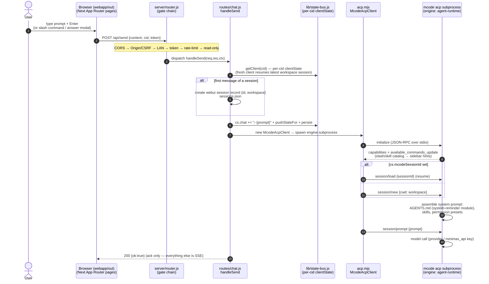
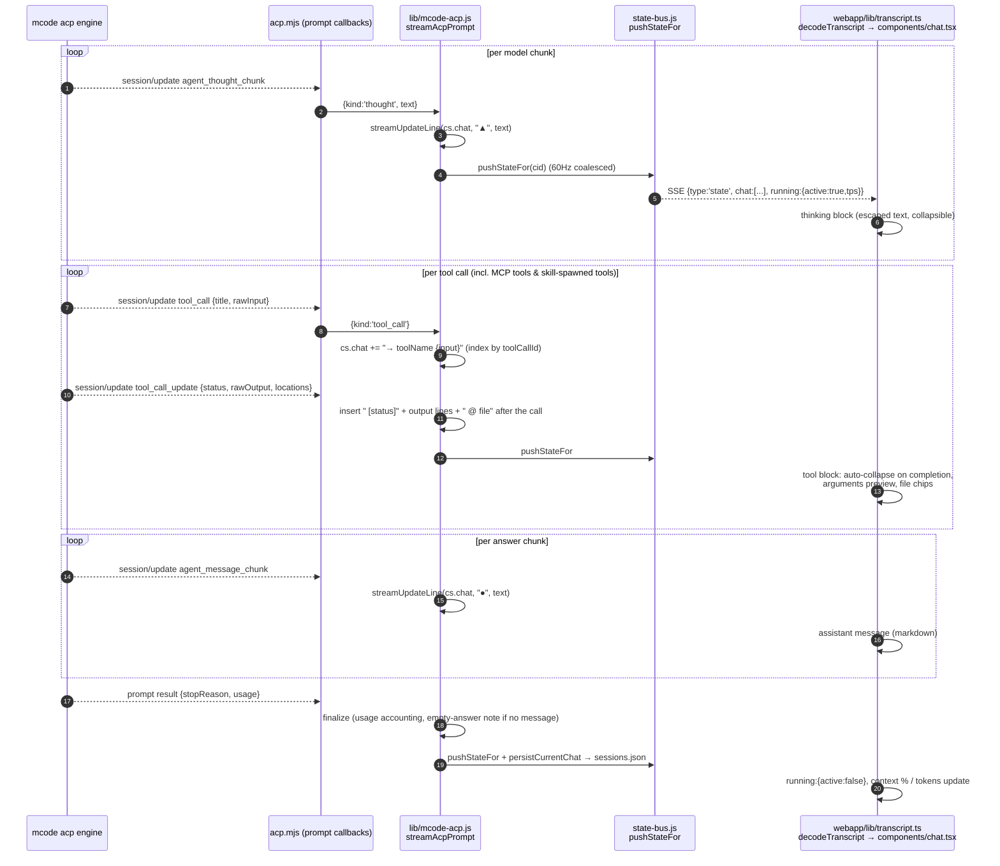
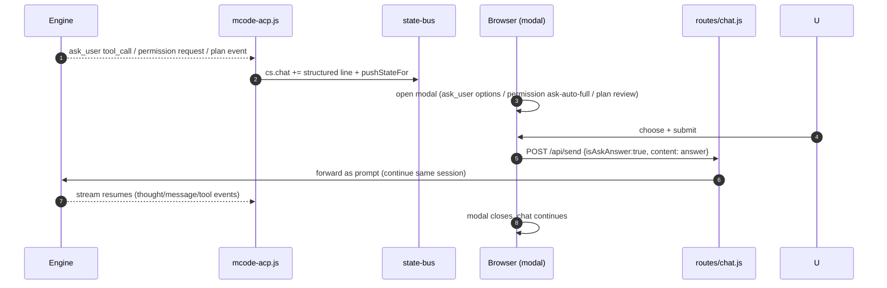
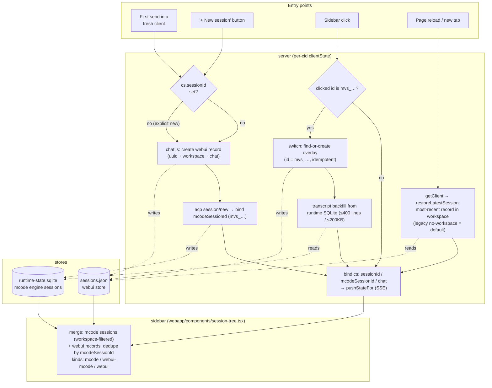

# Architecture

**English** | [简体中文](ARCHITECTURE.zh-CN.md)

> Companion to [README.md](../README.md). This document is for people
> modifying the webui or integrating with it. It describes the runtime
> topology, the module boundaries, the request lifecycle, and the SSE
> payload contract.
>
> **Scope boundary.** This document is the single source of truth for how the
> webui is built. The companion [DESKTOP-ARCHITECTURE.md](DESKTOP-ARCHITECTURE.md)
> covers a different subject: the measured architecture of the desktop client and
> the TUI, and the desktop-facing alignment contract. It deliberately does not
> restate the topology, modules, or payload schemas documented here.

## 1. High-level topology

```
                              ┌─────────────────────────────────────────────┐
                              │  Browser (webapp/out, Next static export)   │
                              │   • index.html + App Router pages           │
                              │   • _next/static/* (content-hashed)        │
                              │   • webapp/public/auth-gate.html (LAN gate) │
                              └─────────────────────────────────────────────┘
                                  │ ▲                          │ ▲
                  fetch / JSON   │ │  EventSource / SSE        │ │
                                  ▼ │                          ▼ │
   ┌──────────────────────────────────────────────────────────────────────┐
   │  server.js (source-mode) — registers @mavis/* → workspace TS resolver│
   │  server/bootstrap.js — actual startup (delegated to by server.js) │
   │  dist/webui/server.js — esbuild bundle of bootstrap.js (shipped)  │
   │   • installGlobalErrorHandlers()                                     │
   │   • preflight: mcode binary exists, upload dir writable, etc.       │
   │   • http.createServer(handleRequest)                                 │
   └──────────────────────────────────────────────────────────────────────┘
                                  │
                                  ▼
   ┌──────────────────────────────────────────────────────────────────────┐
   │  server/router.js — declarative route table                          │
   │                                                                      │
   │  Gate chain (Gates 1→5) live in server/lib/gates.js#runGates, which   │
   │  router.js delegates to; both layers share it:                        │
   │  LAN guard: !isLocalRequest(req) && !getLanBroadcast() → 403         │
   │                                                                      │
   │  ┌─ static  ┐ ┌─ /api/health  ┐  ┌─ /api/state  ┐ ┌─ /api/sessions ┐ │
   │  │ index   │ │ health.js     │  │ state.js     │ │ sessions.js    │ │
   │  │ .html   │ └───────────────┘  │ + /api/events│ │ + acp-         │ │
   │  │ .css/js │                    │   (SSE)      │ │   sessions/*   │ │
   │  │ .png    │                    └──────────────┘ └────────────────┘ │
   │  └─────────┘                                                       │
   │  ┌─ /api/send    ┐ ┌─ /api/usage  ┐ ┌─ /api/workspace  ┐             │
   │  │ chat.js      │ │ usage.js     │ │ workspace.js      │             │
   │  │ + /stop /cmd │ │ + -real      │ │ + /workspace/    │             │
   │  │              │ │ + /refresh   │ │   browse          │             │
   │  └──────────────┘ └──────────────┘ └──────────────────┘             │
   │  ┌─ /api/upload ┐ ┌─ /api/settings  ┐ ┌─ /api/models    ┐            │
   │  │ upload.js    │ │ settings.js     │ │ model.js         │            │
   │  └──────────────┘ └─────────────────┘ │ + /set-model     │            │
   │                                        │ + /permissions   │            │
   │                                        │ + /answer        │            │
   │                                        └──────────────────┘            │
   │  ┌─ /api/protocol/*  ┐ ┌─ /api/debug/*  ┐                            │
   │  │ protocol.js       │ │ debug.js       │                            │
   │  │ /set-mode         │ │ /inject (gated)│                            │
   │  │ /set-config-option│ │ /state         │                            │
   │  │ /cancel           │ └────────────────┘                            │
   │  │ /load-session …   │                                              │
   │  │ /capabilities     │                                              │
   │  └───────────────────┘                                              │
   └──────────────────────────────────────────────────────────────────────┘
                                  │
                                  ▼
   ┌──────────────────────────────────────────────────────────────────────┐
   │  server/lib/ — pure modules (one concern each)                      │
   │                                                                      │
   │  config · layout · lan · models · sqlite-resolver ·                │
   │  mcode-session-delete · sessions · state-bus · acp-client         │
   │  mcode-rpc · mcode-acp · mcode-exec · chat-line · context-percent  │
   │  mavis-usage · usage · settings · upload · workspace · slash ·     │
   │  static · gates · auth · alerts · trajectory                       │
   └──────────────────────────────────────────────────────────────────────┘
                                  │                          ▲
                                  ▼                          │  JSON-RPC over stdio
   ┌──────────────────────────────────────┐   ┌─────────────────────────────┐
   │  mcode exec subprocess                │   │  mcode acp subprocess        │
   │  (legacy single-turn, fallback)      │   │  (default multi-turn)        │
   │  stdio: line-delimited stream-json    │   │  stdio: newline-delimited    │
   │                                      │   │  JSON-RPC 2.0                │
   └──────────────────────────────────────┘   └─────────────────────────────┘
```

## 2. Request lifecycle

A user clicks **Send**. The events that follow:

```
browser           server/router.js           server/lib/*                mcode
   │ POST /api/send {content,…}    │                              │
   │ ──────────────────────────────►│                              │
   │                                │ chat.js: validate,           │
   │                                │   cs = getClient(cid)         │
   │                                │   cid → state-bus             │
   │                                │ ─────────────────►           │
   │                                │                              │ mcode-acp.js / mcode-exec.js
   │                                │                              │ ─── spawn / pipe stdin ───►
   │                                │                              │
   │                                │ state-bus: pushStateFor(cid) │
   │   ◄──────────── SSE event ────│   {type:'state', running:…}  │
   │   {type:'chat', lines:[…]}    │                              │
   │   ◄──────────── SSE event ────│   ◄── line  ◄─── stdout  ────│
   │   {type:'delta', text:'…'}    │                              │
   │   …                            │                              │
   │   ◄──────────── SSE event ────│   ◄── exec.result  ──────────│
   │   {type:'exec', status:'ok'}   │                              │
   │   ◄──────────── SSE event ────│                              │
   │   {type:'state', running:false}│                              │
   │   …                            │                              │
   │ connection closes / kept open   │                              │
```

Key invariants:

- **One `mcode` subprocess per active webui tab** (keyed by `cid` =
  client id, a UUID stored in `localStorage.webui_cid`). A new tab gets a new
  subprocess; a closed tab kills its subprocess. State is per-cid, not
  per-connection.
- **The SSE channel is the only source of state updates** for the client.
  REST endpoints mutate server state but do not push to the client. The
  client treats SSE as truth.
- **`pushStateFor(cid, opts)` is the only function that mutates per-cid
  state on the server.** Everything else is read-only. This is why
  `state-bus.js` is the size it is — it's the single chokepoint.

## 2.1 Conversation sequence — prompt → stream → render

How one user turn travels end to end, and where each engine surface
(AGENTS.md, thinking, tool calls, MCP tools, skills) is invoked and
rendered. Names are the real code symbols.


```mermaid
sequenceDiagram
    autonumber
    actor U as User
    participant B as Browser (webapp/out)<br/>(Next App Router pages)
    participant R as server/router.js<br/>(gate chain)
    participant C as routes/chat.js<br/>handleSend
    participant S as lib/state-bus.js<br/>(per-cid clientState)
    participant A as acp.mjs<br/>McodeAcpClient
    participant E as mcode acp subprocess<br/>(engine: agent-runtime)

    U->>B: type prompt + Enter<br/>(or slash command / answer modal)
    B->>R: POST /api/send {content, cid, token}
    Note over R: CORS → Origin/CSRF → LAN → token → rate-limit → read-only
    R->>C: dispatch handleSend(req,res,ctx)
    C->>S: getClient(cid) — per-cid clientState<br/>(fresh client resumes latest workspace session)
    alt first message of a session
        C->>C: create webui session record (id, workspace)<br/>sessions.json
    end
    C->>S: cs.chat += "› {prompt}" + pushStateFor + persist
    C->>A: new McodeAcpClient → spawn engine subprocess
    A->>E: initialize (JSON-RPC over stdio)
    E-->>A: capabilities + available_commands_update<br/>(slash/skill catalog → sidebar hints)
    alt cs.mcodeSessionId set
        A->>E: session/load {sessionId} (resume)
    else
        A->>E: session/new {cwd: workspace}
    end
    E->>E: assemble system prompt:<br/>AGENTS.md (system-reminder module),<br/>skills, permission presets
    A->>E: session/prompt {prompt}
    E->>E: model call (provider / minimax_api key)
    C-->>B: 200 {ok:true}  (ack only — everything else is SSE)
```

The stream that follows — every engine event becomes a chat line, every
chat mutation becomes an SSE state snapshot:


```mermaid
sequenceDiagram
    autonumber
    participant E as mcode acp engine
    participant A as acp.mjs (prompt callbacks)
    participant M as lib/mcode-acp.js<br/>streamAcpPrompt
    participant S as state-bus.js<br/>pushStateFor
    participant B as webapp/lib/transcript.ts<br/>decodeTranscript → components/chat.tsx

    loop per model chunk
        E-->>A: session/update agent_thought_chunk
        A->>M: {kind:'thought', text}
        M->>M: streamUpdateLine(cs.chat, "▲", text)
        M->>S: pushStateFor(cid)  (60Hz coalesced)
        S-->>B: SSE {type:'state', chat:[...], running:{active:true,tps}}
        B->>B: thinking block (escaped text, collapsible)
    end
    loop per tool call (incl. MCP tools & skill-spawned tools)
        E-->>A: session/update tool_call {title, rawInput}
        A->>M: {kind:'tool_call'}
        M->>M: cs.chat += "→ toolName  {input}" (index by toolCallId)
        E-->>A: session/update tool_call_update {status, rawOutput, locations}
        M->>M: insert "  [status]" + output lines + "  @ file" after the call
        M->>S: pushStateFor
        B->>B: tool block: auto-collapse on completion,<br/>arguments preview, file chips
    end
    loop per answer chunk
        E-->>A: session/update agent_message_chunk
        M->>M: streamUpdateLine(cs.chat, "●", text)
        B->>B: assistant message (markdown)
    end
    E-->>A: prompt result {stopReason, usage}
    M->>M: finalize (usage accounting, empty-answer note if no message)
    M->>S: pushStateFor + persistCurrentChat → sessions.json
    B->>B: running:{active:false}, context % / tokens update
```

Interactive surfaces and engine-side modules — who owns what:

| Surface | Engine side (mcode) | Wire | Web UI render |
|---|---|---|---|
| **AGENTS.md** | `agent-modules/system-reminder` injects it into the system prompt at session start (project instructions, project memory) | invisible in chat; visible in the trajectory studio (`/trajectory/`, session events) | nothing special — it shapes model behavior |
| **Thinking (思维链)** | model emits `agent_thought_chunk` | `kind:'thought'` → `▲` line | collapsible thinking block (escaped text) |
| **Builtin tools** (Bash/Read/Write/Edit/…) | agent-runtime executes with permission presets | `tool_call` / `tool_call_update` → `→ name` + indented output lines | tool block, auto-collapse, file chips |
| **Tool-call id marker** `##tc:<toolCallId>` | `mcode-acp.js#applyToolUpdate` writes it immediately before each `→ name` header | one chat line `##tc:<id>`, consumed by `decodeTranscript` | attaches `toolCallId` to the tool block so `ToolCard` matches `recentSubagents[]` by id (not by tool name); never reaches the chat body |
| **Processed-duration marker** `§§ processed_duration=Nms` | prompt finalise in `mcode-{acp,exec}.js#finalize` | one chat line `§§ processed_duration=Nms`, consumed by `decodeTranscript` | attaches `processedDuration` to the assistant block for the `turn_process_disclosure` bar; never reaches the chat body |
| **MCP tools** | engine spawns configured MCP servers (`mcp.json`); calls surface as `mcp__server__tool` | same tool_call wire | same tool block (server·tool naming) |
| **Skills** | `/skill` or prompt triggers `agent-modules/skills` → injected as system-reminder content | slash catalog from `available_commands_update`; invocation = normal prompt turn | slash hint UI; skill output = ordinary thought/message/tool stream |
| **ask_user tool** | engine emits `ask_user` tool call | chat line `→ ask_user {json}` | modal with options/multi-select/Other; answer → `POST /api/send {isAskAnswer:true}` |
| **Permission prompts** | engine requests approval for a tool call | permission events → modal (ask/auto/full) | answer forwarded on the send path |
| **Plan mode** | `Plan:`-prefixed prompt → structured plan event | plan-review modal | agree / skip / add context → forwarded |
| **Trajectory studio** | reads runtime SQLite projection (read-only) | `/trajectory/api/*` (its own backend, `server/trajectory/http.mjs`) | `/trajectory/` panel (turns, tokens, compaction, subagents) |

Round-trip for interactive prompts (ask_user / permission / plan):


```mermaid
sequenceDiagram
    autonumber
    participant E as Engine
    participant M as mcode-acp.js
    participant S as state-bus
    participant B as Browser (modal)
    participant C as routes/chat.js

    E-->>M: ask_user tool_call / permission request / plan event
    M->>S: cs.chat += structured line + pushStateFor
    B->>B: open modal (ask_user options / permission ask-auto-full / plan review)
    U->>B: choose + submit
    B->>C: POST /api/send {isAskAnswer:true, content: answer}
    C->>E: forward as prompt (continue same session)
    E-->>M: stream resumes (thought/message/tool events)
    B->>B: modal closes, chat continues
```

## 2.2 Session management flow

**One conversation = one identity**: the mcode session (`mvs_…`) IS the
session. The **webui store** (`sessions.json`) is an *overlay* keyed by
`mcodeSessionId` — it carries `title`, `workspace`, and a `chat[]`
snapshot for fast hydration, never a second session identity. New
overlay records use `id === mcodeSessionId`; drafts ("+" sessions that
have not sent yet) keep a uuid until the first turn promotes them
(`promoteDraftToMcodeSid`). Legacy uuid-keyed wrapper records still
resolve (every lookup matches `mcodeSessionId` first). The **mcode
runtime store** (`~/.minimax/v2/sqlite/runtime-state.sqlite`) is the
authoritative session list; the webui reads it for the sidebar and for
transcript backfill.


```mermaid
flowchart TD
    subgraph ENTRY["Entry points"]
        A1["First send in a<br/>fresh client"]
        A2["'+ New session' button"]
        A3["Sidebar click"]
        A4["Page reload / new tab"]
    end

    subgraph SERVER["server (per-cid clientState)"]
        B{"cs.sessionId<br/>set?"}
        C["chat.js: create webui record<br/>(uuid + workspace + chat)"]
        D["acp session/new → bind mcodeSessionId (mvs_…)"]
        E["getClient → restoreLatestSession:<br/>most-recent record in workspace<br/>(legacy no-workspace = default)"]
        F{"clicked id is mvs_…?"}
        G["switch: find-or-create overlay<br/>(id = mvs_…, idempotent)"]
        H["transcript backfill from<br/>runtime SQLite (≤400 lines / ≤200KB)"]
        I["bind cs: sessionId / mcodeSessionId / chat<br/>→ pushStateFor (SSE)"]
    end

    subgraph STORES["stores"]
        J[("sessions.json<br/>webui store")]
        K[("runtime-state.sqlite<br/>mcode engine sessions")]
    end

    subgraph SIDEBAR["sidebar (webapp/components/session-tree.tsx)"]
        L["merge: mcode sessions (workspace-filtered)<br/>+ webui records, dedupe by mcodeSessionId<br/>kinds: mcode / webui-mcode / webui"]
    end

    A1 --> B
    B -- "no" --> C --> D --> I
    A2 --> B
    B -- "no (explicit new)" --> C
    A3 --> F
    F -- "no" --> I
    F -- "yes" --> G --> H --> I
    A4 --> E --> I
    C -.writes.-> J
    D -.writes.-> K
    E -.reads.-> J
    G -.writes.-> J
    H -.reads.-> K
    J --> L
    K --> L
    I --> L
```

Lifecycle notes:

- **Delete** (`DELETE /api/sessions/:id`) removes the webui record AND
  cross-deletes the linked `mvs_…` rows from the runtime SQLite
  (`deleteMcodeSessionFromDb`, `?dryRun=true` to preview). Deleting the
  mcode record drops it from both lists in one transaction.
- **Startup cleanup** prunes records that are empty AND default-titled
  AND older than 24h — the "+"-then-never-typed leftovers.
- **Search** (`GET /api/sessions/search`) fuzzy-matches titles across
  workspaces; matches render with a `[ws-short]` prefix and switching
  into them rides the same switch path above.
- **Same conversation, one record**: a fresh client resumes the latest
  session instead of forking (§2.2 fix history), and continuing a chat
  reuses the bound `mcodeSessionId` — no new engine session per message.
- **Single identity (v2.4)**: switching to an `mvs_…` session resolves
  to exactly one overlay record — `ensureOverlayForMcodeSid` creates it
  with `id === mvs_…` on first contact and reuses it on every later
  switch. A first send promotes its draft to the same engine identity
  (merging into a pre-existing overlay when one exists). One
  conversation can therefore never appear as two records.


## 3. Module contracts

Each `server/lib/*.js` file exports a small set of named functions. No
file reaches into another's internals. The notable contracts:

### `config.js`
- Exports frozen-ish constants: `PACKAGE_ROOT` (alias for `WEBUI_ROOT`),
  `WEBUI_DATA_DIR`, `MCODE_CMD`, `PORT`, `PORT_PINNED`, `HOST`, `TOKEN`,
  `TOKEN_STDOUT`, `DEFAULT_MODEL`, `DEFAULT_TIMEOUT`, `DEFAULT_MAX_STEPS`,
  `MAX_CONCURRENT`, `UPLOAD_DIR`, `SESSIONS_DB`, `MCODE_RUNTIME_DB`,
  `MAVIS_DATA_DIR`, `MAVIS_DB_PATH`, `SQLITE3_BIN`, `DEFAULT_WORKSPACE`,
  `PROMPT_IDLE_TIMEOUT_MS`, `RATE_LIMIT_PER_MIN`, `RATE_LIMIT_BURST`,
  `MCODE_WEBUI_UPLOAD_DIR`, `MCODE_WEBUI_SETTINGS_PATH`,
  `MCODE_BETTER_SQLITE3`, `DEBUG_INJECT`.
- Exports functions: `getServingPort`, `setServingPort`, `resolveBindHost`,
  `getPlatformFallbackPaths`, `detectSqlite3Bin`, `detectTuiCwd`
  (re-export), `installGlobalErrorHandlers`.
- Reads `process.env.*` exactly once at module load. No per-request
  re-reading (port fallback is an exception — `setServingPort` updates
  the live port after boot).
- Data-dir precedence: `MINIMAX_DATA_DIR` > `MAVIS_DATA_DIR` > `~/.minimax`
  (one resolver shared with `MAVIS_DB_PATH`, which is the runtime SQLite).
- `installGlobalErrorHandlers()` writes uncaught exceptions to
  `.server.err` under `WEBUI_DATA_DIR` so they survive a process restart.

### `state-bus.js`
The chokepoint. Exports:

| Function | Purpose |
|---|---|
| `getClient(cid)` | Returns the per-cid `clientState` object, created by `makeClientState()` and restored via `restoreLatestSession()` on first call. The object *is* the state — there is no `clientState.state` wrapper. The per-cid side tables live beside it, not inside it: `sseByCid` (SSE response per cid) and `activeChildByCid` (child process per cid). |
| `pushStateFor(cid, opts)` | Build a normalized `state` object from `clientState` and broadcast it to the SSE channel unless `opts.silent`. |
| `pushOnlineCount(lanBroadcast)` | Count `sseByCid.size` and broadcast to all clients. Called on connect/disconnect. |
| `SSE_HEADERS` | Standard headers: `Content-Type: text/event-stream`, `Cache-Control: no-cache`, `Connection: keep-alive`, `X-Accel-Buffering: no`. |

The `state` payload is documented in § 4 below. A `clientState`
object is the **only** thing the rest of the codebase reads from.

### `acp.mjs` and `acp-client.js`
Two distinct files, and the split matters when you grep for a symbol:

- `acp.mjs` (at the package root, `packages/webui/acp.mjs`) is the
  zero-dependency JSON-RPC-over-stdio transport. It **defines**
  `class McodeAcpClient` — `start()`, `request(method, params)`,
  `notify(method, params)`, `stop()`, `events` EventEmitter — and
  answers every engine→client request.
- `server/lib/acp-client.js` is the webui-side cache and lifecycle
  wrapper *around* that transport. It imports `McodeAcpClient` from
  `acp.mjs`; it does not define or re-export it. Its own exports:
  `getMcodeAcpClient()` — the process-wide singleton, whose init is
  de-duplicated by the module-level `_mcodeAcpInitPromise` so
  concurrent callers share one subprocess — plus
  `getCatalogueHost()`, `listAllMcodeSessions()`,
  `getMcodeSessionsForWorkspace()`, `getMcodeSessionTitle()`,
  `invalidateMcodeSessionsCache()`, `shutdownMcodeAcpSingleton()`,
  `getMcodeServerInfo()`, `WEBUI_LOCAL_COMMANDS`, and
  `ensureMcodeCommands()`.
- Cache: `mcodeSessionsCache` and `getCachedMcodeCommands()` are both
  module state of `acp-client.js`. `state-bus.js` only *imports*
  `getCachedMcodeCommands()` when it builds a snapshot. Both caches
  avoid repeated JSON-RPC round-trips for `session/list` and
  `session/commands`.

### `mcode-rpc.js`

The acp-side wrapper. Each public function (`setMode`,
`setConfigOption`, `cancelSession`, `loadSession`, `activateSession`,
`listSessions`, `getAccountStatus`, …) dispatches through
`clientForCid(cid, requireLive)`:

  - if a `cid` is supplied, the cid's registered active child
    (the per-prompt `McodeAcpClient`) is preferred — that subprocess
    is the one whose `sessions` map holds the in-flight session;
  - `requireLive: true` (used by `cancelSession` / `setConfigOption`)
    returns `null` rather than falling back to the singleton when no
    active child is registered, because silent fallback would mask the
    dispatch bug that previous PRs reintroduced;
  - everything else falls back to the singleton, which keeps the
    commands-probe and session-list paths working without a cid.

The capability table webui advertises to itself:

```js
export const MCODE_ACP_CAPABILITIES = {
  set_mode: true,
  set_config_option: true,
  cancel: true,
  activate: true,
  fork: true,
  resume: true,
  // session/delete registers on the engine but no handler exists,
  // which is why deletes go through SQL on the local_runtime_*
  // tables (see sqlite-resolver.js).
  delete: false,
  load: true,
  close: true,
  list: true,
  new: true,
  prompt: true,
}
```

`callRpc(method, params)` returns `{ok:false, code:'unsupported',
error:'…'}` when the engine answers with `-32601 Method not found`
(or the equivalent in the jsonrpc envelope). The caller decides what
to do — usually a toast on the client.

### `mcode-acp.js` vs `mcode-exec.js`
Two transports with a shared shape. Which one a turn uses is decided
before the engine spawns, in two places: `routes/chat.js#handleSend`
forces `mcode exec` when the server environment has `MCODE_USE_ACP=0`
(the escape hatch for an ACP protocol regression), and `runMcodeAcp`
itself re-routes to `runMcodeExec` when the session's permission mode
is anything other than `Full access` (the first branch of
`runMcodeAcp`). There is no `/exec` command and no per-request
opt-in; `mcode-rpc.js` does not select transports — it only talks to
whatever child is currently registered.

Each exposes one entry point, named after its transport:
- `mcode-acp.js` → `runMcodeAcp(content, opts)` → `AsyncGenerator<NormalizedEvent>`
- `mcode-exec.js` → `runMcodeExec(content, opts)` → `AsyncGenerator<NormalizedEvent>`

> **Removed symbols.** Earlier revisions of this section documented a shared
> triple — `runMcode(content, opts)`, `stopExec()` and `isRunning()` — as
> exported by both transports. None of the three exists any more. The single
> entry point was split per transport, and the stop and status questions are
> answered elsewhere: cancellation goes through `mcode-rpc.js#cancelSession`,
> and run status is read off the `running` field of the per-cid `clientState`.
> There is no rename you can follow here — these are gone, not moved.

`NormalizedEvent` is a tagged union (`{type, …}`) with these types:
`state`, `chat`, `delta`, `tool`, `permission`, `plan`, `ask`,
`exec`, `usage`. See § 5.

### `agent-team-status.js`

DB → UI status projection for the Agent Team panel. The runtime db's column
vocabulary is **not** what the UI renders — stored value ≠ display value:

| Source column | Stored values | Note |
| --- | --- | --- |
| `local_runtime_sessions.status` | `idle \| interrupted \| aborted \| error` | Narrow; the runtime does not flip this while a session runs a turn — it stays `idle` |
| `local_runtime_background_tasks.status` (`kind=subagent`) | `running \| succeeded \| failed \| canceled` | The subagent's actual run state |

The UI renders `AGENT_TEAM_STATUS` = `idle \| queued \| running \| waiting \|
done \| stopped \| failed`. This module is the **only** place that decides the
mapping (`projectSessionStatus`, `projectTaskStatus`, `projectAgentStatus`);
raw db values never reach the wire. `projectAgentStatus` composes the two — the
task row's `running` wins (the session column alone can never report `running`),
a terminal task projection beats a stuck-`idle` session, else the session
projection. The TUI's finer vocabulary (`failed \| waiting \| running \| queued \|
done \| stopped`) is a projection-layer product, not a stored value; webui does
not import it but adopts the same shape. Unknown future statuses render as
`idle`, never a false `running`.

### `engine/` (capability declarations + the local-runtime-v2 host)

The engine abstraction lives at `server/engine/` (engine-abstraction
batch B1; migration state M1, plus M3 batches B0, B1, B2, B3, B4 and B5).
Fifteen files, one job each:

| File | Owns |
| --- | --- |
| `engine/capabilities.js` | The contract: `ENGINE_CAPABILITY_KEYS` (the 14 matrix keys), `validateEngineCapabilities`, `assertEngineCapability`, `summarizeUnavailableCapabilities` |
| `engine/errors.js` | `EngineCapabilityNotSupportedError` + `engineCapabilityHttpResponse` (the 501 payload shape) |
| `engine/host.js` | `getEngineCatalogueHost` — the lazy bridge to the one catalogue host. No static import of the host module: the getter body is a dynamic `import()` of `lib/acp-client.js`, so the facade costs a function, not a module load |
| `engine/index.js` | The facade: `getEngineProvider`, `listEngineProviderIds`, `getEngineCatalogueHost` (registry by provider id; transport selection arrives with migration step M4) |
| `engine/providers/local-runtime-v2.capabilities.js` | `LOCAL_RUNTIME_V2_CAPABILITIES` — **declaration only, and the split is load-bearing**: its sole import is `../capabilities.js`, so `/api/engine-capabilities` can read the capability table without pulling the v2 host's TypeScript dependency tree (~4.7 s of first-compile) into the boot path. That tree stays behind the same lazy boundary `acp-client.js` already documented |
| `engine/providers/local-runtime-v2.js` | `createCatalogueHost` (moved verbatim from `runtime-host.js`, which re-exports it) + re-exports the declaration above, so consumers keep one import shape. This is the heavy one — `@mavis/local-runtime-v2`, `@mavis/config`, `@minimax/code/runtime-adapter` — and no file `app.js` reaches may import it |
| `engine/providers/tui-runtime-adapter.js` | `TUI_RUNTIME_ADAPTER_CAPABILITIES` (declaration only — the adapter itself is constructed inside the v2 host) |
| `engine/session-reads.js` | The directory-read family's facade calls (`readEngineSessionList`, `readEngineSessionListForWorkspace`, `readEngineSessionTitle`, `readEngineVersion`) and the endpoint→capability table `SESSION_READ_ENDPOINTS` (step M3, batch B1) |
| `engine/session-tree-reads.js` | The session-tree family's facade call (`readEngineSessionTree`) and the endpoint→capability table `SESSION_TREE_ENDPOINTS` (step M3, batch B2). Gates **hard**: `assertSessionTreeCapability` throws → 501, because the tree is entirely engine data. Forwards to `lib/session-tree.js#getSessionTree`; the assembler is not duplicated |
| `engine/session-export.js` | The export family's facade call (`readEngineSessionTranscript`) and the endpoint→capability table `SESSION_EXPORT_ENDPOINTS` (step M3, batch B2). Gates **soft**: `checkSessionExportCapability` reports and never throws, because export's primary source is `sessions.json`, not the engine |
| `engine/usage-reads.js` | The usage family's facade calls (`readEngineAccountQuota`, `readEngineSessionUsage`, `readEngineQuotaForecast`), the derived figure `contextUsedTokens`, and the endpoint→capability table `USAGE_READ_ENDPOINTS` (step M3, batch B3). Gates **hard** on the two engine reads and declares **no capability at all** for #19, which touches no engine surface |
| `engine/account-reads.js` | The account family's facade call (`readEngineAccount`) and the endpoint→capability table `ACCOUNT_READ_ENDPOINTS` (step M3, batch B4). Gates **hard** on `authCredentials` · `getAccountStatus` — the same pair and the same provider method as `engine/usage-reads.js`, because #20 and #15/#16 read the same engine projection. Its read is **asynchronous** and it lives under the ordinary `await import()` boot-path rule |
| `engine/model-reads.js` | The model-catalogue family's facade call (`readEngineModelCatalogue`), the whole projection as named pure functions (`projectModelCatalogue`, `deriveModelSelection`, `buildModelCataloguePayload`, `catalogueSourceLabel`, `webuiFullModelId`, `providerOfModelId`, `attachContextWindowOptions`, `configOption`), and the endpoint→capability table `MODEL_READ_ENDPOINTS` (step M3, batch B4). Gates **soft**: `checkModelReadCapability` reports and never throws, because the catalogue's primary sources are files webui owns. Its read is **synchronous**, and it is the one engine module **not** re-exported from `engine/index.js` — see the boot-path note below |
| `engine/capability-reads.js` | The capability-declaration family's facade call (`readEngineCapabilityView`) and the endpoint→capability table `CAPABILITY_READ_ENDPOINTS` (step M3, batch B4). Declares **no capability for #73** — it IS the declaration endpoint, and gating the gate would let a `none` hide the declaration that says so. It is the only endpoint in the migration whose response CONTRACT changed (`capabilities` is now the 14-key declaration, replacing the ACP wire table) |
| `engine/session-writes.js` | The session WRITE family's facade calls (`planEngineSessionDelete`, `commitEngineSessionDelete`, `commitEngineOrphanSessionDelete`, `previewEngineSessionDelete`, `applyEngineSessionRename`, `readOrphanSessionWriteIds`), the pure derivations they are built from (`resolveSessionTarget`, `isMcodeSessionId`, `isOrphanSessionRecord`, `selectOrphanSessionIds`, the two fan-out predicates, the per-client state resets), and the endpoint→capability table `SESSION_WRITE_ENDPOINTS` (step M3, batch B5). Gates **hard** on `sessionCrud` · `deleteSession` for #7 and #6, and declares **no capability at all** for #4. Forwards the 32-table SQL to `lib/mcode-session-delete.js` rather than moving it — see the write-path section below |

Routes take the host from the facade and never from `lib/acp-client.js`:
`routes/plugins.js` and `routes/turn-diff.js` call
`getEngineCatalogueHost()`. Both keep a `deps`-injected data source
(`deps.getCliService`, `deps.getDiffApplication`) so the handler suites stay
hermetic.

Declaration discipline (admission rules for any future provider, enforced
by the snapshot tests in `test/lib/engine/capabilities.test.js`):

1. All 14 keys declared — no "absent means none". `partial` must enumerate
   `missing` sub-items and a `reason`; `none` must carry a `reason`
   distinguishing `interface-absent` from `implementation-absent`.
2. Declarations are static module constants — the first source of truth,
   code-reviewed. A level flip without re-auditing the provider surface
   goes red in CI (the tests pin every key of every provider).
3. Calling an undeclared capability throws
   `EngineCapabilityNotSupportedError`; both HTTP layers
   (`server/app.js#invokeHandler`, `server/router.js`) map it to
   `501 engine_capability_not_supported`. **Empty implementations are
   forbidden** — a missing capability must be legible before the call
   and loud after it (#110 fake-success discipline).
4. One host per provider process-wide: `createCatalogueHost` remains the
   single owner of the runtime instance, and the only way to reach it is the
   facade's `getEngineCatalogueHost()` (which forwards to
   `acp-client.js#getCatalogueHost` and its "Never build a second host" rule);
   `close()` stays bounded. Two `CliService` instances over one dataDir is a
   split brain against the plugin / local-disable tables, not a redundancy.
5. Levels drive the UI, never provider names: the frontend reads
   `GET /api/engine-capabilities` (`routes/engine-capabilities.js#handleEngineCapabilities`)
   and renders `full` / `partial`(+missing) / `none` — no hard-coded
   provider lists in UI code.

### Declaration-vs-implementation snapshot (M2)

A declaration is only as honest as the check behind it.
`test/lib/engine/capability-snapshot.test.js#auditProviderCapabilities`
audits every `full`/`partial` key of both registered providers against a
REAL catalogue host booted once per run on an isolated tmp data dir
(`MINIMAX_DATA_DIR` plus every `MCODE_WEBUI_*` path pinned BEFORE the
provider import — setting only `MCODE_WEBUI_DATA_DIR` would leave the
engine dir falling back to `~/.minimax` and rewriting the user's real
config):

- `full` — every tracked method of the key must be a function on the
  declared surface member (`adapter`, `cliService`, or
  `applications.session.diff`);
- `partial` — the present half must exist; every method-named `missing`
  item must be genuinely absent; an absent method that dropped out of
  `missing` goes red (under-declaration); and kebab-case sub-capability
  names (`file-write`, `git-diff`, …) go red the moment a covering
  method appears on the surface — a future `getWorkspaceGitDiff` forces
  the `git-diff` entry to be re-audited;
- `none` — deliberately not method-checked; a provider may expose no
  surface for the capability.

The tracked method table (`REQUIRED_METHODS` in the same file) was
derived from the live surfaces themselves (prototype-chain reflection:
91 adapter methods, 94 CliService methods, the session.diff facade), not
copied from the design matrix. The audit is a pure function over
(declaration, method sets), and the mutation tests in the same file pin
that each drift class — a flipped level, a deleted method, a grown
sub-capability — turns it red. A registry-driven static guard sweeps
every REGISTERED provider (`engine/index.js#listEngineProviderIds`) for
the exact 14-key set, so a typo'd or unknown key cannot pass silently,
and providers registered by M4 will be swept without editing the test.

Runtime probing (downgrading a declared level when the environment
disagrees) is deliberately absent in this batch — see `engine/index.js`
for the reasoning.

Boot-path discipline: `app.js` reaches `engine/index.js`, so that file and
everything it imports statically must stay free of `@mavis/*`,
`@minimax/*` and the host modules. M1 learned that by paying for it
(209ms → 2700ms at server start; the facade's own load 4685ms → 5ms after
declaration and construction were split). `test/lib/engine/host-facade.test.js`
enforces it against the real module graph rather than against source text.
`engine/session-reads.js`, `engine/session-tree-reads.js`,
`engine/session-export.js`, `engine/usage-reads.js`,
`engine/account-reads.js`, `engine/capability-reads.js` and
`engine/session-writes.js` all live under the
same rule: their static imports are `engine/capabilities.js` and
`engine/index.js` only, and every heavier dependency —
`lib/acp-client.js`, `lib/config.js`, `lib/session-tree.js`,
`lib/transcript.js`, `lib/usage.js`, `lib/mavis-usage.js`,
`lib/quota-forecast.js`, `lib/mcode-rpc.js` — is reached through
`await import()` inside the functions. `engine/session-writes.js` adds
`node:fs` at module scope (a builtin, and `engine/usage-reads.js`
already does the same) and reaches `lib/sessions.js`,
`lib/mcode-session-delete.js`, `lib/state-bus.js` and
`lib/config.js` dynamically — all six of its storage dependencies, which
is what lets it be re-exported from `engine/index.js` at all.

`engine/model-reads.js` is the one deliberate exception, and it deviates on
**both** sides of the import. Its four sources — `lib/config.js`,
`lib/engine-catalogue.js`, `lib/models.js`, `lib/providers-config.js` — are
static imports, because `routes/model.js` already imported all four
**before** M3-B4 and the server's boot cost is therefore exactly what it
was. They reach `@mavis/shared/local-runtime-paths` (via `lib/config.js`)
and `js-yaml` (via `engine-provider-sync.js`), so the module is deliberately
**not** re-exported from `engine/index.js`: making the shared facade — the
one import site the whole server shares, and the one `routes/plugins.js`
must stay light through — heavier than it has ever been would buy nothing.
`routes/model.js` therefore imports `../engine/model-reads.js` directly,
the same shape `routes/protocol.js` already uses for `engine/session-reads.js`.
`test/lib/engine/host-facade.test.js` is the gate that forced this, and it
is right to.

The price is a **synchronous** read. Making the four imports dynamic would
let the module re-export from the facade again, at the cost of turning
`handleGetModels` into an async handler — a contract change for any caller
that does not await, and the one thing this batch promises not to do. When
the catalogue read becomes async (M4, with a provider-backed source) the
module can move back behind `await import()` and be re-exported with the
rest.

#### Which endpoints read through the facade (step M3, batch B1)

`engine/session-reads.js` covers the five directory-read endpoints. Each
row names the capability it gates on and the provider method it depends
on, so a `partial` declaration that drops exactly that method answers 501
naming it:

| Endpoint | Capability · sub-item | Value source |
| --- | --- | --- |
| `GET /api/acp-sessions` | `sessionCrud` · `listSessions` | `acp-client.js#getMcodeSessionsForWorkspace` (30s cache, cwd normalisation) |
| `GET /api/acp-session-title` | `sessionCrud` · `getSession` | `acp-client.js#getMcodeSessionTitle` |
| `GET /api/protocol/list-sessions` | `sessionCrud` · `listSessions` | `acp-client.js#listAllMcodeSessions`; the route keeps its own cwd filter |
| `GET /api/state` | `sessionCrud` · `listSessions` | the `mcodeSessions` mirror only — `snapshotViewFields` / `mcodeSessionsSnapshotFields` are untouched |
| `GET /api/health` | none of the 14 keys | the ACP `initialize` `agentInfo.version` mirror; the catalogue host exposes no version accessor, so the facade reports the source instead of inventing one |

Three properties this layer holds, each with a test behind it:

1. **One normalizer.** The runtime path is projected by
   `lib/catalogue-sessions.js#projectTuiSessionToAcp`, which mirrors the
   ACP adapter's `toAcpSessionInfo` rule for rule — `title` and
   `updatedAt` are omitted when absent, never emitted as `null`. The
   facade forwards that projection; it does not re-project it.
2. **Where the bytes came from is reported, not assumed.** Every read
   answers a `source` of `catalogue`, `acp` or `acp-fallback` (the
   transport asked for the catalogue host and got `null`). It is
   metadata, not wire — the endpoints' payloads are byte-identical before
   and after the facade.
3. **The gate is real.** The registered provider declares `sessionCrud`
   `full`, so nothing 501s today; the tests drive a fixture declaration
   that lacks `listSessions` and assert the 501 payload. A gate nobody
   ever exercises is indistinguishable from no gate.

#### Which endpoints read through the facade (step M3, batch B3)

`engine/usage-reads.js` covers the four usage endpoints (#15, #16, #17,
#19). This family is where a refactor can be entirely silent, because three
of its four numbers are derived rather than counted — so the table below is
as much about where each number comes from as about which capability gates
it:

| Endpoint | Capability · sub-item | Value source |
| --- | --- | --- |
| `POST /api/usage` | `authCredentials` · `getAccountStatus` | `lib/usage.js#runUsageQuery` — the engine's `mcode/account/status` projection, copied into `cs.usage`; the payload is written byte-for-byte, `ok:false` / `error` shape included |
| `POST /api/usage-trigger` | `authCredentials` · `getAccountStatus` | the same read; the two endpoints differ only in the client's `record` flag, which is the difference between a reading and a measurement |
| `GET /api/usage-real` | `usageStats` · `getSessionUsage` | `lib/mavis-usage.js` over the engine's own `local_runtime_token_usage` table. `contextUsed` is derived here by `contextUsedTokens` |
| `GET /api/usage/forecast` | none of the 14 keys | webui's own `~/.mcode-webui/usage-history.ndjson`, via `lib/quota-forecast.js`. It calls no engine surface, so it declares none |

Four properties this family holds, each with a test behind it:

1. **`contextUsed` is cumulative, and the cache counters are not in it.**
   `totalInput + totalOutput + totalReasoning`. The cache counters are a
   SUBSET of `input`, so adding them double-counts; `totalCacheWrite` is
   not part of the context window at all. This is also NOT the chat flow's
   `lastTurnContextTokens`: the context bar shows one turn's worth, `#17`
   shows the session's spend, and `test/lib/engine/usage-reads.test.js`
   perturbs each of the seven numeric fields one at a time so a merged or
   "simplified" formula flips a row instead of quietly shipping.
2. **`totalReasoning` is the database's own `SUM`, forwarded.** The
   snapshot test reads the same aggregate with plain SQL and compares; a
   facade that re-derived it from anything else fails.
3. **The forecast is a pure function of a history prefix.** Every prefix of
   a growing history is compared against the module's own
   `forecastExhaustion(readHistory())` at the same instant, and the sample
   count's flat stretch across the deliberately-null sample is asserted, so
   a read that re-filtered, re-sorted or re-sampled would break the
   sequence rather than the shape.
4. **A `none` / `partial`-missing declaration would 501.** The registered
   provider declares both `authCredentials` and `usageStats` `full`, so only
   the fixture-driven tests can prove the gate bites. #19's `null` row is
   the counter-example with a reason: gating a read that touches no engine
   surface would remove a working endpoint in response to a declaration
   about something it does not depend on.

`#17` declares `usageStats` · `getSessionUsage` but does not yet CALL that
method; it reads the same SQLite table the method reads, through
`lib/mavis-usage.js`. Three measured reasons, stated in the module header:
the catalogue host only exists under the `runtime` transport
(`acp-client.js#transportWantsCatalogue`), and `acp` is the default;
`getSessionUsage` answers `{summary, rows: UsageView[]}` where the endpoint
answers a per-column aggregate with `rows` as a COUNT, so switching would
mean rebuilding `totalReasoning` and `contextUsed` from a different
starting point; and it would put the v2 TypeScript tree on an endpoint that
needs nothing from it. M4 is where the two are allowed to meet.

The transport→provider table has one entry (`runtime`). Under the default
`acp` transport no provider is registered yet, so the gate reports
`unregistered-transport` and passes through — M4 registers the ACP
provider and the table gains its row. Passing through is not the same as
claiming support, and the two are reported differently on purpose.

#### Which endpoints read through the facade (step M3, batch B2)

Batch B2 adds two endpoints, and they are the first two whose gate policies
**differ**. They are separate files for that reason; merging them would force
one to inherit the other's.

| Endpoint | Capability · sub-item | Enforcement | Value source |
| --- | --- | --- | --- |
| `GET /api/session-tree` | `sessionCrud` · `listSessions` | hard — 501 | `lib/session-tree.js#getSessionTree`, forwarded verbatim |
| `GET /api/sessions/:id/export` | `sessionCrud` · `getSession` | soft — reported | `lib/transcript.js#readMcodeTranscript` (the enrichment only) |

**Why one gate throws and the other does not.** `/api/session-tree` is
entirely engine data: the hierarchy is assembled from `local_runtime_sessions`
in the runtime db, so a provider that cannot list sessions genuinely has no
tree to return, and 501 is the honest answer. `/api/sessions/:id/export` is
mostly *not* engine data — the conversation comes from `sessions.json`, and
the engine only contributes a best-effort transcript enrichment the endpoint
has always promised never to block on. Gating it hard would delete working
functionality in response to a declaration about a capability the endpoint
does not depend on. So `checkSessionExportCapability` answers what the
provider declared and returns; the caller degrades `_meta.mcode_unavailable`
through the endpoint's own pre-existing channel, and the export still serves
the full webui chat. `test/lib/engine/session-export.test.js` pins this by
swapping in a provider that declares `sessionCrud: none` and asserting that
export reports while the tree family throws on the same fixture.

Four properties this batch holds, each with a test behind it:

1. **The node shape is unchanged, and it is asymmetric.** A root node
   carries `{id, title, agent, kind, status, updatedAt, children}`; a child
   node carries the same fields **without** `children`, because
   `buildTree` adds that key only in the output map that wraps each root.
   Measured on the real tree: 233 root nodes carry `children`, all 66 child
   nodes do not. "Normalising" this would change 66 nodes' shape in the
   sidebar.
2. **There is no `parent_session_id` in the response.** The hierarchy is
   structural — expressed through `children` — and `parent_session_id`
   exists only inside the db read. A future addition of that key to the node
   is a client-visible change, so the exact key set is asserted per depth.
3. **One assembler.** `buildTree` remains the only thing that decides which
   rows attach to which parent, and the route does not re-derive the
   hierarchy. Rows that cannot attach — an orphan whose parent is not in the
   row set, a cross-directory parent, a grandchild, a child of a `root`
   container row, anything in a cycle — are dropped, as they always were.
   That is why the batch was verified by exporting the tree before and
   after and diffing every node, not by counting rows.
4. **The tree's 501 is not swallowed.** The route's existing `try/catch`
   would otherwise fold the capability error into its own
   `{ok:false, reason:"session_tree_failed"}` soft-fail body and turn a 501
   into a 200. The route re-throws `EngineCapabilityNotSupportedError` and
   keeps the soft-fail path for everything else.

**`source` is not transport-switched for the tree.** The tree is read from
the engine's own runtime db, which both the `runtime` and the `acp`
transport can see, so `readEngineSessionTree` reports `source: "runtime-db"`
under every transport rather than claiming a catalogue answer. The
declaration check is still transport-keyed: which provider is active is a
transport question even when the read itself is not.

**Export's enrichment is currently inert against the v2 schema, by
design.** `lib/transcript.js` keeps its `v2-data-json` probe OUT of the
default probe set so that export's behaviour does not change, and the live
`local_runtime_message_rows` has no `content` column. So on a current
runtime db the enrichment answers `no_matching_table` and every export
reports `_meta.mcode_unavailable: true` with
`_meta.source: "webui"`. That is pre-existing and deliberately preserved —
re-enabling it is a behaviour change for a later slice, not a refactor.

#### Which endpoints read through the facade (step M3, batch B4)

Batch B4 adds three endpoints, and they are the first three whose gate
policies are **all different from each other**: one hard, one soft, one
declared-as-nothing. Three modules, for the reason B2 gave — a shared table
would force one family to inherit another's policy.

| Endpoint | Capability · sub-item | Enforcement | Value source |
| --- | --- | --- | --- |
| `GET /api/account` | `authCredentials` · `getAccountStatus` | hard — 501 | `lib/mcode-rpc.js#getAccountStatus`, the engine's `mcode/account/status` projection. The response body is built by the facade: `{ok:true, ...data}` on success, `{ok:false, reason}` at HTTP 200 otherwise |
| `GET /api/models` | `authCredentials` · `listModelProviders` | soft — reported | three layered sources: the engine session's `model` config option, the merged providers config (webui `env > cwd > user` over the engine's `custom_provider` tree, via `lib/engine-catalogue.js`), and the builtin cli-bundle extraction |
| `GET /api/protocol/capabilities` | none of the 14 keys | none — the gate is a reported no-op | the registered provider's 14-key declaration, its `summarizeUnavailableCapabilities` roll-up, and the ACP `initialize` `agentInfo` mirror |

**Why #20 gates hard and #57 does not.** The account card is 100% engine
data: there is no webui-side fallback for "who am I" or for a plan tier, so
a provider that cannot report an account has nothing to return and 501 is the
honest answer. The model catalogue is not: its primary sources are files
webui owns and can read without the engine — `models.json`,
`~/.mcode-webui/providers.json`, and a cli-bundle extraction — plus the
engine's own `config.yaml`. Gating #57 hard would delete a working picker in
response to a declaration about a capability it does not depend on, which is
the same reasoning `engine/session-export.js` records for #11. So
`checkModelReadCapability` reports and returns; the read is unaffected by
what it reports.

**Why #73 declares nothing.** It is the declaration endpoint. A gate on it
would be circular, and a `none` anywhere in the declaration could hide the
declaration that says so — the same reason B1's `/api/health` and B3's
`/api/usage/forecast` declare no capability. `checkCapabilityReadCapability`
is exported anyway, so the symmetry with the other families is visible and
testable.

Four properties this batch holds, each with a test behind it:

1. **#57 is a full snapshot, and the oracle is the pre-refactor code.**
   `test/lib/engine/model-reads.test.js` projects one rich fixture — engine
   session option, engine `custom_provider` layer, webui config layer,
   builtin layer, a builtin that **collides** with a config entry, a
   switchable variant model, an effort-list model, a `forced_on` model, two
   providers with overlapping upstream model ids, one provider with a key
   and one without — and compares the whole response body, field for field
   and key for key, against a literal captured from `3362c9be`. The oracle
   is not recomputed by the functions under test. The load-bearing part is
   what is **absent**: the config layer takes the `minimax_api/MiniMax-M3`
   slot wholesale, so that entry appears once, with the operator's label and
   `contextLimit`, and **without** the builtin's `thinkingLevels` and
   `contextWindowOptions`.
2. **Grouping is by provider, and the dedupe is per provider.** The webui id
   is always `<providerKey>/<engineModelKey>`, even when the upstream model id
   already contains `/` (ticket 09-02). `nousresearch/z-ai/glm-5.3` and
   `zai-max/z-ai/glm-5.3` are two rows in two groups; the previous
   behaviour let one swallow the other. The builtin shell is keyed by
   `minimax_api` **regardless of the recorded pick**, which is the
   "8 config + 6 misplaced builtins = 14 in `nousresearch`" replay.
3. **The two builtin-tree projections reach two sites, and a miss is a miss.**
   `readEngineBuiltinThinking` and `readEngineBuiltinContextWindows` are two
   views of `provider.minimax.models`, read once per request and consumed at
   the engine-session site (keyed by the wire form's **bare** model id) and at
   the builtin shell. A wire form whose model segment does not parse, or a
   model absent from the tree, produces a field-free entry — never a
   half-annotation. The section that perturbs the tree asserts which entries
   move for which record.
4. **#73's contract CHANGED, deliberately, and the declaration appears
   once.** `capabilities` used to be `MCODE_ACP_CAPABILITIES`, a
   hand-maintained flat `{method: boolean}` table of the ACP JSON-RPC
   surface; it is now the engine's **declared** 14-key object, forwarded by
   identity. The twelve old accessors are asserted gone, so a consumer
   reading `capabilities.set_mode` gets `undefined` and fails loudly
   rather than receiving a truthy object field. This is the one
   user-authorised endpoint contract change in the migration, and the
   first shape of it — an additive `engine` block carrying the view
   beside the old table — was rejected in review precisely because it
   would have carried the same 14 keys twice in one response. What
   survives from that shape is the provenance, hoisted to
   `capabilitiesProvider` / `capabilitiesProviderFor`, plus
   `capabilitiesUnavailable` for the derived roll-up. The test counts the
   declaration's occurrences structurally, so re-introducing a second
   carrier is a red bar. `providerFor` is the honest bit: a
   capability-detection endpoint must not report a standing-in
   declaration as though it were the connected engine's, and under the
   default `acp` transport that standing-in is the normal case until M4.
   `docs/API.md`, `docs/webui.md` and `docs/tui-capabilities.md` all
   record the new shape in both languages.

**The three "what is active" figures are derived once.** `current` prefers
the engine's `currentValue` and falls back to the recorded pre-session pick;
`currentThinking` prefers the engine's `thinkingEffort` option; and
`currentContextWindow` is the recorded window with the current model's
catalogue `contextLimit` as the fallback. When neither exists the answer is
`null`, never a default model — the old behaviour invented an active model
the engine never confirmed and the composer chip claimed it.

**`handleGetModels` is still a synchronous handler.** The facade read is
synchronous too, and the test asserts it: the body must be complete when the
handler returns, because that is what the pre-M3 handler guaranteed.

## 4. The `clientState` payload

This is the shape every SSE `state` event contains. The webui mirrors
it 1:1 into the `state` JS variable.

```ts
{
  version: string,                 // webui version (from package.json)
  running: { active: boolean,
             sessionId?: string,    // mcode acp session id (if any)
             cid: string,           // webui tab id
             startTime?: number,    // ms epoch
             pendingPermission?: object,
             pendingPlan?: object,
             pendingAsk?: object },
  workspace: { dir: string,         // absolute path, "" if unset
               branch?: string,     // git branch (best-effort, "" on error)
               treeState?: 'clean'|'dirty'|'unknown' },
  model: { name: string,            // e.g. "minimax_api/MiniMax-M3"
           ctx: string,            // e.g. "512k"
           thinking: 'On'|'Off'|string },
  permissions: string,             // mcode-side: 'ask'|'auto'|'full'|'plan'|...
  availableCommands: Record<        // mcode slash commands, grouped
    string,                         //   e.g. { mcode: [{name, description}, …] }
    Array<{ name: string,
            description?: string }>  // the composer flattens this to a name[] palette
  >,
  sessions: Array<{                // webui-side session list (merged w/ mcode)
    id: string,
    title: string,
    workspace: string,
    mcodeSessionId?: string,        // linked mcode session id
    updatedAt: number }>,
  mcodeSessions: Array<{            // mcode-side session list (raw)
    sessionId: string,
    title: string,
    cwd: string,
    updatedAt: number }>,
  mcodeSessionId?: string,         // currently-active mcode session
  context?: {                       // updated by SSE delta accumulation
    used: number,                   // tokens used (per-turn)
    percent: number,                // 0..100
    cacheRead: number,              // per-turn cache reads
    tps: number,                    // current tok/s
    source: 'mavis'|'mmx' },        // which backend provided the data
  usage?: {                         // from /api/usage
    remaining: number,              // percent
    resetAt: number,                // ms epoch
    weeklyResetAt: number,
    fetchedAt: number },
  plan?: { active: boolean, title: string, summary: string,
           options: Array<{label:string}>, totalLines: number,
           summaryLines: number },
  enterPlanMode?: { active: boolean },
  permissionChoice?: { active: boolean, current: string,
                        options: Array<{label:string}> },
  askUser?: { active: boolean, questions: Array<…> },
  goal?: { active: boolean, text: string, status: 'running'|'done'|'blocked',
           duration?: number },
  todo?: Array<{ content: string, status: 'pending'|'in_progress'|'done' }>,
  lanBroadcast: boolean,           // mirrors /api/settings
  onlineCount: number,              // from pushOnlineCount
  // 🆕 v1.0.1 — settings surface pushed over SSE state updates
  readOnly: boolean,                // read-only mode (server gate blocks remote POST/DELETE on /api/*)
  tokenEnabled: boolean,            // token auth master switch (default true)
  currentToken: string,             // 32-hex auto-generated token; "" after tokenAcknowledged=true
  tokenAcknowledged: boolean,       // operator confirmed they saved the token
  tokenRotatedAt: number            // ms-since-epoch of last rotation
}
```

The webui **does not** hold additional state outside this object. Any UI
panel that needs data reads it from `state` and reacts to `state`
changes via `render()`.

## 5. SSE event schema

Two channels, one data frame type. `/api/events` is the per-CID state stream
and carries `state` plus four named events; `/api/alerts` is a global anomaly
stream (see §5.1).

```
event: state
data: {"version":"1.0","running":{"active":true},"chat":["› …"],"…":…}

event: auth.token_rotated
data: <new-32-hex-token>     // raw string, NOT JSON-wrapped
```

That is the whole schema on this channel. There is **one** data frame type
(`state`) plus four named events that the server emits out of band:
`auth.token_rotated`, `token.first_run`, `needs_authorization` and
`authorization_decided`. The separate `chat` / `delta` / `tool` /
`permission` / `plan` / `ask` / `exec` / `usage` / `online` frames that an
earlier revision of this section listed were never emitted by this server —
those shapes travel as *fields inside* the single `state` snapshot
(`state.chat`, `state.plan`, `state.ask`, `state.context`, `state.usage`,
`state.onlineCount`). A client parses one payload and renders from it; it does
not switch on an event name. The one exception is the second channel,
`/api/alerts`, which does carry named events — see §5.1.

🆕 **v1.0.1** — a separate named event for live token rotation:

```
event: auth.token_rotated
data: <new-32-hex-token>     // raw string, NOT JSON-wrapped
```

Fires when the operator hits "重置 token" in the settings card (or
any future trigger that rotates the token). Each connected client
that receives the event updates its `localStorage` (`webui_token` key)
and the live `HEADERS.Authorization` object **in place** — subsequent
`fetch()` calls use the new token automatically, no reload required.
Clients that were offline when the event fired will get `401` on
their next request; they need to be re-sent the new URL manually.

The body is **raw text**, not JSON-encoded — it's obvious in devtools
that this is sensitive material, and `JSON.stringify` would not add
any value (and would obscure the token when copy-pasted from
network logs).

The webui treats each event as an idempotent update; replaying the
same event is safe. The server uses an at-most-once delivery model
(SSE drops on disconnect → no retry), which the client handles by
fetching `/api/state` on reconnect.

#### Which endpoints write through the facade (step M3, batch B5)

Batch B5 is the first family in the migration whose endpoints **destroy**
data rather than read it, and that changes what the gate question is
asking. For a read, hard or soft is decided by "is the data the engine's
or webui's". For a write it is decided by **who owns the rows the write
destroys** — and in this family that question does not have the same
answer twice in a row.

| Endpoint | Facade function | Capability · sub-item | Enforcement | Value source |
| --- | --- | --- | --- | --- |
| `DELETE /api/sessions/:id` (#7) | `engine/session-writes.js#planEngineSessionDelete` → `engine/session-writes.js#commitEngineSessionDelete` / `engine/session-writes.js#commitEngineOrphanSessionDelete` / `engine/session-writes.js#previewEngineSessionDelete` | `sessionCrud` · `deleteSession` | hard — 501 | the webui session store, the in-memory ACP session cache, the sidebar tree cache, and the engine's own `local_runtime_*` rows via `lib/mcode-session-delete.js#deleteMcodeSessionFromDb` |
| `POST /api/sessions/rename` (#4) | `engine/session-writes.js#applyEngineSessionRename` | none of the 14 keys | none — the gate is a reported no-op | webui's own session store, and nothing else. The engine's title is not written |
| `POST /api/sessions/cleanup-orphans` (#6) | `engine/session-writes.js#readOrphanSessionWriteIds`, then each selected id delegated to `engine/session-writes.js#commitEngineOrphanSessionDelete` | `sessionCrud` · `deleteSession` | hard — 501 | the same store, plus each selected id delegated to #7, so it reaches the same engine rows |

**Why #7 and #6 gate hard.** Both destroy rows in the engine's own
`local_runtime_*` tables, and there is no webui-side copy of a transcript
that survives: once those rows are gone, the conversation is gone. A
provider that declares no session deletion genuinely cannot have these
endpoints serve a truthful answer, so 501 is the honest one. #6
deliberately declares the *same* pair as #7 — the sweep selects webui-side
orphan records, but each selected id goes through #7's real-delete branch,
and a record carrying an `mcodeSessionId` takes the engine's rows with it.
Gating the sweep soft would let a provider that cannot delete engine
sessions reach those tables through a back door, and would also produce a
worse failure than a 501: an authorized destructive sweep that writes its
intent audit event and then fails every single delegated delete.

**Why #4 declares nothing.** Rename writes `title` / `titleCustom` /
`updatedAt` into webui's own store and touches no engine surface at all.
Its one engine touch is `invalidateSessionTree()` — a cache drop, which is
the read-side consequence of the sidebar projecting titles from the engine,
and that projection is B2's `GET /api/session-tree` with its own gate.
Naming a capability here would be a lie of the kind B3 declined for
`GET /api/usage/forecast`: gating a working endpoint on a declaration
about something it does not depend on.

This family also deviates from its siblings in one deliberate way: every
row of `SESSION_WRITE_ENDPOINTS` carries the same three keys —
`capability`, `subItem`, `enforcement` — including the row that has no
capability. B3 expressed "no engine surface" as a `null` table entry;
here two of three endpoints *do* cross the seam, and a `null` hole in the
middle of the table reads like "not filled in yet" rather than like a
decision. The gate **descriptor** keeps the six fields every family
returns, plus `enforcement`.

**The plan/commit split, and why the route did not shrink to nothing.**
#7 is exported as a pair rather than one `deleteSession(options)`:

1. `engine/session-writes.js#planEngineSessionDelete` resolves the id and
   runs the gate. It mutates nothing, so it is safe to run *before* the
   user is asked anything.
2. `authorize()` and the write-ahead `session.delete.intent` audit happen
   **between** the plan and the commit. The intent line has to be durably
   recorded before any row is removed, and it records the match kind and
   chat length the plan produced.
3. `engine/session-writes.js#commitEngineSessionDelete` /
   `engine/session-writes.js#commitEngineOrphanSessionDelete` /
   `engine/session-writes.js#previewEngineSessionDelete` perform the write
   and fan-out.

A facade that owned the whole operation would have had to swallow that
ordering into a callback. The route keeps request parsing, the authorize
modal, the audit ordering and every status code; the facade keeps the
sequencing, the gate and the response bodies.

**The ordering inside a commit is the feature, and it is asserted as a
sequence.** `test/lib/engine/session-writes.test.js` journals every
mutation and asserts the order, because an end-state assertion cannot see
a resurrected session:

```
invalidate-tree → kill-acp-child → drop-cache:<sid> → sql:<sid> → push:<cid>
```

The tree cache is dropped *before* the engine write so a concurrent read
cannot repopulate it from the pre-delete database. The ACP child is
stopped *before* the rows are removed, because it holds the session in
memory and rewrites its registry row on its next request — that is the
"deleted session reappears" bug. Only the **one** deleted sid leaves the
cache: invalidating the whole cache empties the sidebar, refills it, and
reads to the user like the delete failed.

**The 32-table SQL was not moved, and that is recorded rather than
quietly dropped.** The plan for this batch annotated
`lib/mcode-session-delete.js` "delete". It is kept because
`lib/acp-client.js` imports `deleteMcodeSessionFromDb` from it and four
test files bind to that specifier; collecting it means moving those
first. The facade reaches it through `await import()` and issues no SQL
of its own — the same split B3 drew for `lib/mavis-usage.js` and B4 for
`lib/mcode-rpc.js`. A test asserts both halves: the table list is still
32 entries exported from the lib module, and the facade contains no SQL
verb at all.

**#6's response shape is this batch's byte-for-byte red line, so the
payload is built in the facade and never re-assembled in the route.** The
preview is four keys, in that order: `{ok, dryRun, count, ids}`; the
real path's no-op is `{ok, dryRun:false, deleted, ids}`. The file read
stays in the facade rather than the route because the rule and the bytes
it reads are one decision: a sweep that read a different file than the
one whose rule it applies would be a bug waiting for a config change.
The BOM strip is the store's own on-disk convention (written by an
editor, not by webui) and is preserved exactly; a parse failure answers
`[]`, which the pre-facade code did too, and a corrupt store must not
turn a cleanup request into a 500. `dryRun` suppresses the kill and the
cache drop, because a preview mutates nothing and a preview that shuts
down the user's ACP child is a side effect the `?dryRun=true` contract
does not include; the COUNT still runs, read-only, inside
`lib/mcode-session-delete.js`.

**Three things this batch records as known debt instead of deciding:**

1. The 32-table SQL is still in `lib/mcode-session-delete.js`, for the
   consumer reasons above.
2. A rename is a **webui-side label only**. The engine's own title in
   `local_runtime_sessions` is untouched while the sidebar tree reads its
   titles from the engine, so for an engine-backed session a rename can be
   visible in the wrapper list and not in the tree. This is pre-existing
   behaviour and the batch did not change it; closing it means deciding
   which store is authoritative for a display title, which is a product
   call.
3. #7 does not detect "this session is running right now". Deleting an
   in-flight session stops the ACP child out from under the turn and then
   proceeds. That is the pre-facade behaviour and arguably the correct
   one (the user asked), but refusing to delete a running session is a
   defensible alternative and the choice is not the batch's to make. A
   test pins the semantics that exist so the behaviour is at least stated.

#### Which endpoints route through the facade (step M3, batch B6)

`engine/session-switch.js` covers one endpoint, and it is the busiest
single endpoint in the migration: #3 answers a question whose failure
modes are all user-visible at once — a wrong answer loses the
conversation on screen, re-roots the file tree on the wrong project, or
resurrects the "extra untitled entry" sidebar confusion. The route kept
the id resolution, the overlay creation, the title lookup, the
transcript backfill, the workspace containment, the per-client state
mutation and the response body; it now keeps only request parsing, the
status write and the audit append.

| Endpoint | Facade function | Capability · sub-item | Enforcement | Value source |
| --- | --- | --- | --- | --- |
| `POST /api/sessions/switch` (#3) | `engine/session-switch.js#applyEngineSessionSwitch` | `sessionCrud` · `getSession` | soft — reports | webui's own `sessions.json` for the record, its title, its chat and its workspace; the engine touches are two enrichments — the walked-session cache title, and `transcript.js#loadTranscriptChatLines` |

**Why #3 gates soft, when #7 and #11 gate hard.** The question is
"if a provider declares this capability absent, can the endpoint still
serve a truthful answer?" and for #3 the answer is yes. The payload's
primary data is webui's own store; both engine touches already have a
defined degradation — the title falls back to the cache and then to the
"Mcode session" placeholder, the transcript falls back to the stored
chat, and neither failure is visible as a failure. Gating hard would
**remove a working endpoint** in response to a declaration about a
capability it does not depend on, and would do so under exactly the
transport that has the most users. So `checkSessionSwitchCapability`
reports and never throws; the 501 machinery in `engine/errors.js` stays unused
by this family, and the suite pins that it stays unused. That is the
`engine/session-export.js` argument reused rather than re-argued — the #110
fake-success discipline applied in the other direction, since a missing
enrichment must not be dressed up as a failure.

**The backfill decision is a data decision, not a route decision.**
`engine/session-switch.js#selectTranscriptBackfill` is the whole rule,
and it has exactly three branches, each of which the operator log
distinguishes by name:

| `reason` | Stored buffer | Action |
| --- | --- | --- |
| `empty` | no chat yet | read the engine transcript and re-persist — unchanged since the first version of this path, because a session that was never rendered must show its history rather than "No messages yet" |
| `stored_cumulative` | polluted by the segment-accumulator bug | prefer the engine read and re-persist. The original rule only backfilled an empty buffer, so a polluted buffer saved via `saveSessions` won forever |
| `stored_shrinks` | clean | keep the stored chat. transcript-sync overwrites the stored buffer from the engine within ~4s, so stored-only lines are lost regardless, and clobbering a clean buffer on **every** switch is the worse failure |

The predicate behind the middle branch is
`engine/session-switch.js#chatLooksCumulative`: a cumulative buffer has
at least one later `●` line whose text is a strict superset of an
earlier one, because the accumulator never reset between segments. It is
O(n²) in the `●` line count, and that is affordable because a session's
`chat` is capped at ~400 lines. It is conservative on both sides: a
single-`●` buffer is never cumulative, non-`●` rows (system, tool, `▲`
thought) are ignored, and equal-length lines are a tie rather than a
superset. The third branch deliberately does **not** promise draft
preservation — the composer keeps its own draft in its own state.

**The read must never break the switch.**
`engine/session-switch.js#readEngineSwitchTranscript` never throws.
Every failure path — missing db, unloadable `better-sqlite3`, schema
drift, a throwing probe — lands as `{ok: false, reason}` and the caller
keeps the stored chat, so a switch that 501s because an enrichment was
unavailable never becomes a dead endpoint. The `reason` strings are the
reader's own, forwarded verbatim, because the operator log that reports
them and the reader's own vocabulary are one contract.

**The workspace write is a containment-gated side effect, and it runs
before any `cs` mutation.** The target's stored `workspace` is
historical input: it may name a directory the user has since removed
from the allowed roots. `engine/session-switch.js#resolveSwitchWorkspace`
resolves target-first and passes the candidate through the same
`workspace.js#assertWorkspacePath` that the workspace picker,
`handleNewSession` and the fs routes use. Two properties are
load-bearing. The switch **never** falls back to the workspace the user
is currently in — that is the reported "file tree still shows the
previous project" defect, and it is why `currentWs` is not a parameter
of that function. And a refused switch answers 400
(`workspace_refused`, a third outcome next to `ok` and `not_found`
rather than an exception) with the client state left exactly as it was.
A new first-touch overlay is created with `workspace: ""`, so
target-first resolution lands on `DEFAULT_WORKSPACE` for it instead of
stamping it with whatever project the switch happened to start from.

**Resolution order is `mvs_` first, and that is the single-base-session
rule.** `engine/session-switch.js#resolveSwitchTarget` matches the
engine session id before the webui uuid — the **opposite** of the write
family's `resolveSessionTarget`, and the difference is a product rule
rather than a style choice. A switch addressed by `mvs_` must land on
the record that *is* that engine session, because the endpoint's whole
point is one conversation with one identity; the delete and rename paths
are addressed by a user who already has the record in front of them and
look the uuid up first. A first-touch `mvs_` therefore creates exactly
one overlay record whose id **is** the `mvs_` sid, via
`sessions.js#ensureOverlayForMcodeSid`, and `matchKind` stays `null` so
the audit payload's `matchKind || "new_from_mcode"` fallback still
labels what operators read as an invented wrapper. The client-state
write (`cs.sessionId`, `cs.mcodeSessionId`, title, chat buffer, the
three cumulative usage counters, and a re-rooted `cs.workspace`) lives
next to `state-bus.js#runChatViewChat`, which is what puts the mid-run
mirror into the response payload.

**`lastUsedWorkspace` is deliberately left alone.** Last-used is
written only by the send path, because switching is browsing. Pinning
the browsed workspace to the top of the sidebar is the reported "click
any session in C and C auto-sorts first" behaviour, and this batch keeps
it true rather than tidying it up.

**Three things this batch records as known debt instead of deciding:**

1. The **3-candidate transcript probe** is still here, and this batch is
   the batch the plan named for retiring it. It could not be retired
   here without breaking the batch's own red line, for four reasons:
   (a) the default `acp` transport has **no engine surface** —
   `cliService.getMessages` is reachable only through the v2 catalogue
   host, which only the `runtime` transport boots, so deleting the
   probe empties the backfill on the default transport and on half of
   the two-transport test matrix; (b) the two reads **cap different
   things** — the probe reads a whole session and caps the mapped
   *lines* at 400 / 200KB, while `getMessages` paginates and caps
   *messages*, and the two are interchangeable only after proving that a
   bounded message page's tail yields the same 400 lines; (c) the
   **ordering is not the same ordering** — the probe orders
   `created_at_ms ASC, rowid ASC` and `getMessages` orders by
   `MessageQueryService`'s own key, so ties disagree, and a transcript
   whose order flips is a transcript the user reads wrong; and (d)
   **export still owns the legacy candidates** — B2 left
   `GET /api/sessions/:id/export` on the legacy-only probe set on
   purpose, because its `mcode_unavailable` shape is byte-pinned by
   existing tests against exactly those three candidates, and widening
   export's set would turn its enrichment from "unavailable" into
   "answering", which is a product change rather than a migration step.
   What this batch *did* collect is the coupling that made the probe
   look unremovable: `routes/sessions.js` no longer names
   `transcript.js` at all, the read has one seam, and the candidate list
   is now an engine-layer implementation detail instead of something two
   routes import. The remaining work is a seam swap that belongs to
   **M4-1** — the batch that registers an ACP provider and therefore
   makes an engine surface reachable under the default transport — and
   it should land together with an equivalence test against a live v2
   host and with export's probe set widened in the same commit.
2. The **first-touch overlay is still a webui-side write**. A bare
   `mvs_` switch creates a record in `sessions.json` that the engine
   knows nothing about, so the engine's session list and webui's wrapper
   list are two different questions that happen to agree. Pre-existing,
   unchanged here; closing it means deciding who owns session identity.
3. The **usage sync is not gated**. `applyMavisUsageToCs` reads webui's
   own mavis tables, so it declares no capability and its failure is
   still swallowed with a debug-only warning. That asymmetry — identity
   and transcript are degraded, usage is dropped silently — predates
   this batch. Naming `usageStats` would gate a working endpoint on a
   capability whose absence changes nothing visible; the real question
   is whether a silent drop is the right product behaviour, and that is
   not this batch's to decide.

#### Which endpoints route through the facade (step M3, batch B7)

Batch B7 contributes four endpoints across two modules, and the four
have **two** gate policies between them — which is the first batch whose
answer to the gate question is not uniform within its own family. The
split is a fact about the endpoints, not a compromise between opinions.

| Endpoint | Facade function | Capability · sub-item | Enforcement | Value source |
| --- | --- | --- | --- | --- |
| `POST /api/stop` (#13) | `engine/interrupt.js#applyEngineStop` | `interrupt` · `abortSession` | soft — reports | `mcode-rpc.js#cancelSession` (a notification) plus `state-bus.js#getActiveChild` and the child-process kill — webui's own process management, which consults no provider |
| `POST /api/protocol/cancel` (#69) | `engine/interrupt.js#sendEngineSessionCancel` | `interrupt` · `abortSession` | soft — reports | the same notification alone; the refusal shape is the endpoint's own truthful "I could not deliver it" answer |
| `POST /api/protocol/load-session` (#70) | `engine/session-load.js#loadEngineSession` | `sessionCrud` · `loadSession` | **hard — 501** | `mcode-rpc.js#loadSession`; the sidebar entry is a webui-side write that is only allowed *after* the engine answers |
| `POST /api/protocol/activate-session` (#71) | `engine/session-load.js#activateEngineSession` | `sessionCrud` · `activateSession` | soft — reports | `mcode-rpc.js#activateSession`, then the client-state rebind |

**`cancelled` does not mean "the prompt stopped".** `session/cancel` is
a **notification**: the engine registers it with `app.onNotification`
and aborts the active prompt's `AbortController`, so a request would
come back "Method not found". A notification carries no reply, which
means a success here means "sent" — the response field is `cancelled`
for historical reasons. #13 and #69 answer that differently on purpose
and both differences are pinned by the suite: #13 pairs `cancelled:true`
with `hardKilled:false` and never escalates, while #69 pairs a refusal
with a pointer to the endpoint that can.

**`hardKilled` is a report about the first decision, not about the
process.** It is true exactly when a child was registered **and** the
gentle path did not take (`child && !cancelled`) — i.e. webui called
`child.kill()` on its way out of the handler. It is written into the
response body before the bounded escalation timer can possibly fire, so
`hardKilled:true` never certifies that anything is dead. The same
asymmetry is why the `note` string says "hard kill (session/cancel
could not be delivered)" even when no kill ran at all: the note names
*why* the gentle path did not happen, not what followed. Both wordings
are load-bearing and both are pinned.

**The escalation is bounded, and the bound is part of the contract.**
`engine/interrupt.js#STOP_FORCE_KILL_MS` is 5000 ms, and it is exported
because it is a contract value rather than an implementation detail: the
window is what makes "已停止" mean "已停止". The file this batch
migrated ran 2000 ms; the batch plan transcribed the bound as "abort
5s" and the product call (2026-10-03) took the plan's value, accepting
that a stubborn child gets three extra seconds to finalize at the cost
of "already stopped" being a lie for three extra seconds. Two guards on
the timer are load-bearing. It is `unref()`ed, so an unexpired stop
timer can never hold the process open. And it re-checks the **cached**
raw `child_process` handle captured *before* the timer was armed —
`child.child` may be nulled by the runner's own `stop()` in the
meantime, and a nulled handle read at fire time would silently skip the
very escalation the cascade exists for.

**Two scoping rules make the cascade act on the right turn.** The child
lookup is narrowed to `(cid, cs.mcodeSessionId)` — the **viewed**
session's child, not "any child of this tab", because a tab may run two
conversations at once and stopping must not signal the other turn's
subprocess. And the zombie-claim reset is a *decision* in the engine
layer, not a mutation: `engine/interrupt.js#stopLeftStaleClaim` answers
`claimStale`, and the route performs `resetThinkingClaim` only when it
is true, because that helper is shared with `handleSend` and moving it
would have been a second, unrelated change to the send route.

**Why the interrupt family gates soft.** #13's escalation is webui's own
child-process management — the child was registered on webui's state bus
by webui's own runner, and killing it consults no provider. Hard-gating
#13 would delete the user's only way out of a stuck 思考中 panel in
order to express a doubt about the *gentle half* of a two-mechanism
endpoint. #69 already has a truthful "I could not do it" answer, and it
is its documented contract: 200
`{ok:true, cancelled:false, warning, code, killEndpoint}`; a provider
with no interrupt surface produces exactly that shape, so a hard gate
would replace an accurate 200 with a 501 and teach the frontend a shape
it does not have today.

**#70 is the only hard gate in this batch, and the invariant behind it
is an ordering.** The sidebar entry `createWebuiEntry` adds to
`sessions.json` must be **downstream of the engine's answer, never a peer
of it**. A provider that cannot load must not be able to leave a sidebar
entry pointing at a session the engine never opened, and a failed load
must not leave one either — a 200 carrying an entry and no session is
precisely the fake-success failure #110 exists to prevent. So
`engine/session-load.js#assertSessionLoadCapability` throws, the 501
machinery in `engine/errors.js` is genuinely in use for this endpoint, and the
router's existing central mapping answers it — no route has to remember
to catch it. The entry itself is idempotent **on the `mcodeSessionId`
match, not on the caller**: a second call for a session webui already
wraps returns the existing record without re-saving, so repeated calls
cannot grow duplicate sidebar entries for one conversation.

**#71 gates soft because hard-gating it would *be* the decision a human
has not made yet.** One ACP client tracks a single active session, so
"activate another" is how the client is re-pointed; the in-process host
has no single-active-session concept at all; and the plan gives the
endpoint's fate as an either/or — "语义塌缩（cs 切换 + resume）, 或
501". Those are two different products, and choosing the 501 branch
here would be choosing it silently, by a capability table, with no
changelog and no frontend work. So `checkSessionActivateCapability`
reports, and the route keeps the pre-M3 shape and status mapping byte
for byte. The endpoint's *meaning* is the order `cs.mcodeSessionId =
sessionId` first and `sessions.js#resetContext` second; reversing the
two leaves the context panel describing the session the user just left.

**The three status mappings are separate tables, and the differences are
pinned.** `engine/session-load.js#loadFailureStatus` answers 503 for
`no_client`, 404 for a not-found/invalid code and **500** for
`unsupported` — deliberately *not* the 501 that `set-mode` answers for
the same code, because that asymmetry is the pre-existing contract.
`engine/session-load.js#activateFailureStatus` is the same table plus
an `unsupported → 501` row, which is again the pre-M3 mapping. And
`loadFailureWireCode` rewrites a "Resource not found" answer to
`session_not_found`, because `-32004` and `resource_not_found` do not
read as a session problem to a frontend; an undefined code stays
undefined so `JSON.stringify` drops the key exactly as before.

**One module, two gate functions, rather than two modules.** B2 split
`engine/session-tree-reads.js` from `engine/session-export.js` because those two
endpoints declare *different* capabilities and their gate mechanics
differ for unrelated reasons. Here both endpoints share one capability,
one store, one client state and one route module, and the mechanics are
the two functions every other family already uses; splitting would
duplicate the transport table, the resolver and the two status mappers
to preserve a distinction that is one `enforcement` field wide — the
same shape B5's mixed `engine/session-writes.js` table already carries.

**Three things this batch records as known debt instead of deciding:**

1. **#71's semantic collapse is undecided, and this batch's only move
   was to not decide it.** Both branches are costed in the module
   header. Collapsing #71 into "switch + resume" is very nearly the
   composition of #3 and #70, but the cost is the *response shape*:
   today's body is `{ok, activeSessionId, data}` where `data` is the
   engine's raw reply, and a collapsed endpoint has no such reply to
   forward, so it would have to grow B6's byte-pinned switch payload or
   invent a new one — changing the frontend, the docs and both language
   versions at once. It would also change the endpoint's meaning, since
   "activate" today mutates nothing beyond the two lines above while
   "switch" re-roots the workspace, the chat buffer and the context
   counters; a frontend that keeps calling it as activate would suddenly
   get a workspace change. The 501 branch is cheap to build — the hard
   gate already exists in this very file for #70 — but it is a
   user-visible behaviour change that needs the UI degradation (hide or
   disable the entry point, not an error toast) and it would fire for
   every provider without single-active-session semantics, which per
   the plan is the in-process host the default runtime transport is
   built on. The tie-breaker is product knowledge this batch does not
   have: who calls #71, and what they expect to happen to the sidebar,
   the chat buffer and the workspace when it returns 200.
2. **#13 kills a running turn without asking whether it may.** The
   cascade runs on the viewed session's child without checking whether
   that child belongs to a turn the user still wants. That is the
   pre-facade behaviour and arguably the right one (the user pressed
   stop), but "refuse to stop a turn that has not yet produced output"
   and "escalate only after a second attempt" are both defensible
   alternatives. The same shape is recorded in B5's known debt for the
   delete family, where the mirror-image question is "refuse to delete a
   running session" — between them they are one policy question about
   running sessions that deserves one decision rather than two.
3. **#70's 501 is the gate's 501, not the route's.** `loadSession`
   answers 500 for `code === "unsupported"`, while a provider that
   declares `sessionCrud.loadSession` absent answers 501 with
   `engineCapabilityHttpResponse`'s body. Two different 501s can reach
   this one route and only the second has ever existed; the router's
   central mapping is what keeps them from being confused for each
   other. Worth confirming against the frontend before M4 registers a
   provider that can trip it. A fourth, narrower item: the "Resource not
   found" rewrite only matches the string form, so a numeric JSON-RPC
   code would reach the frontend verbatim behind a 500 — both behaviours
   are pinned as-is, because widening the regex changes a wire shape and
   the wider question (normalise once in `mcode-rpc.js` for every
   caller) is a change to the RPC wrapper's contract, not to this
   endpoint.

#### Which endpoint routes through the facade (step M3, batches B8a and B8b)

`POST /api/send` (#12) was the single endpoint whose whole behaviour
lived in one route body: it claims the turn, answers, and then runs a
turn whose output never crosses the HTTP response — it crosses the
`/api/events` SSE channel as webui chat lines (`▲` thinking, `●` answer,
`→ tool`, `##tc:<id>` markers). B8 is the migration of that endpoint, and
it is the first batch to **light up a second transport** rather than only
re-house an existing one: after B8b, `MCODE_WEBUI_TRANSPORT=runtime`
runs a real turn, and the default `acp` path is byte-for-byte what it was
at 32277c3a — that invariance is the batch's survival condition, and
`mcode-acp.js#runMcodeAcp` and `mcode-acp.js#streamAcpPrompt` were not
edited to achieve it.

| Endpoint | Facade function | Capability · sub-item | Enforcement | Value source |
| --- | --- | --- | --- | --- |
| `POST /api/send` (#12) | `engine/streaming-send.js#assertStreamingSendCapability` | `streamingSend` · `sendMessage` | **hard — 501** | `engine/streaming-send.js#openEngineSendStream` on the runtime transport; the acp path's source, `mcode-acp.js#streamAcpPrompt`, is deliberately **not** named by the declaration |

The declaration itself is `engine/streaming-send.js#STREAMING_SEND_ENDPOINTS`,
a one-row table whose `subItem` is the runtime method name `sendMessage` —
the name a provider author would recognise from the source, and the name
a `partial` declaration would have to list in `missing`. Its reporting
sibling, `engine/streaming-send.js#checkStreamingSendCapability`, never
throws a capability error: a typo in webui's own endpoint key is a plain
`Error`, because caller confusion is not a capability question and the
HTTP layer must never answer 501 for a bug in this repository.

**Why two batches for one endpoint.** B8a shipped the declaration, the
gate and the derivations as a layer with no runner and no route branch —
nothing user-visible changed and nothing called the gate, so a module
whose entire value is that it has no IO could be reviewed on its own.
B8b added the data plane at the bottom: the one place in the family that
touches the engine, plus the route's third branch. The split mattered
because the purity was provable only while it held —
`engine/streaming-send.js#openEngineSendStream` and
`engine/streaming-send.js#projectSendAttachments` are the only exports
that are not total functions over their arguments, and they are the only
reason the module now reaches for `await import()`.

**The escape hatch still wins.** The branch in `chat.js#handleSend` is
ordered, and the ordering is load-bearing:

| Condition | Runner | Stream source |
| --- | --- | --- |
| `MCODE_USE_ACP === "0"` | `runMcodeExec` (exec) | none — a non-streaming runner with no run-mirror |
| `MCODE_WEBUI_TRANSPORT === "runtime"` | `mcode-acp.js#runMcodeRuntime` → `mcode-acp.js#streamRuntimePrompt` | runtime frames, already projected to `TuiStreamEvent` |
| otherwise (the default `acp`) | `mcode-acp.js#runMcodeAcp` → `mcode-acp.js#streamAcpPrompt` | `mcode acp` session-update notifications |

`MCODE_USE_ACP=0` is evaluated first because `lib/config.js` documents
the precedence as "transport=exec regardless of `MCODE_WEBUI_TRANSPORT`",
and that is the right order for the thing the variable is: the escape
hatch exists for exactly the moment a transport is misbehaving, so an
operator who reaches for it must not have to unset a second variable
first. The runtime branch passes the **same** options object the acp one
does, `owningWebuiSessionId` included, which is what makes the whole tail
below that line transport-agnostic — both runners return the same `r` and
write through the same `state-bus.js#createRunChat` buffer.

**Why this family gates HARD, and where the gate is called.** #12's
response is `{ok:true}` written *before* the engine is called —
fire-and-forget by contract, because the output arrives on a different
channel. That is exactly what makes the gate hard, and it is the mirror
image of B7: a stop whose escalation is webui's own child management
still stops the turn, and a cancel already has a documented "I could not
do it" 200, so both have a truthful degradation. #12 has **none**. A
provider with no `streamingSend` surface cannot produce a truthful answer
to any of the three things a user would notice — the turn never runs, the
panel shows 思考中 with no stream behind it, and nothing resets the
claim. That is #110's fake success in its purest form, so
`engine/streaming-send.js#assertStreamingSendCapability` throws and
`app.js#invokeHandler` maps it to 501 with
`engine/errors.js#engineCapabilityHttpResponse`'s shared body. The route
builds nothing: no response code is added to `chat.js#handleSend` at all.

**The gate sits before `state-bus.js#beginRun`, and that is the second
half of the argument.** The throw would otherwise land outside the `try`
whose `finally` calls `state-bus.js#endRun`, and a leaked claim refuses
every later send in that conversation with a 409 that names a turn
nobody is running. A gate that protects against a fake success by
creating a permanent fake busy is worse than no gate, so the call site
is `chat.js#handleSend`'s, at exactly one place, immediately before the
claim.

**The gate is currently unreachable, and that is stated rather than
assumed.** `engine/streaming-send.js#providerByTransport` maps only
`runtime` to a registered provider id; the default `acp` transport has
none yet, because the registry is M4's. So under `acp` the gate answers
`unregistered-transport` and returns without throwing — the pre-M3
behaviour, not a hole — and under `runtime` the local-runtime-v2 provider
declares `streamingSend: full`, so the answer is `checked`. The suite
pins both halves, which makes "the provider no longer declares a send
surface" a deliberate edit rather than a discovery. The table is built
per call rather than frozen at module scope, because
`engine/index.js` re-exports this module and a module-level table would
read `engine/index.js#DEFAULT_ENGINE_PROVIDER_ID` while that binding is
still in its temporal dead zone on a cold import.

**The bridge joins two vocabularies, and it starts above the wire.**
ACP delivers an *event* vocabulary (`thought` / `message` / `tool_call` /
`tool_update` / `plan_update`) that happens to sit close to webui's line
syntax. The runtime delivers a *frame* vocabulary (SSE `dataJson`
envelopes) that webui has never consumed — but the per-turn wrapper in
`runtime-host.js` already projects those frames into structured
`TuiStreamEvent`s, so `engine/streaming-send.js` starts one level above
the wire and never sees a frame. `engine/streaming-send.js#SEND_EVENT_KINDS`
is webui's own vocabulary, not the runtime's: `thought` / `message` /
`tool` are the three families the ACP path accumulates separately,
`authoritative` is the settled message that **overwrites** the accumulator
instead of appending to it (the runtime emits deltas *and*, at close, one
complete message — the same fact `result.answer` delivers once instead of
thousands of times), `terminal` is a turn outcome, and the rest are facts
about the stream that produce no line at all.

**The classification never throws, and that asymmetry is deliberate.**
`engine/streaming-send.js#classifySendEvent` returns
`{kind: ignore}` for a shape it does not recognise rather than killing a
turn that is otherwise streaming correctly. A bridge that throws on an
unknown frame turns every future runtime addition into an outage of the
chat endpoint, which is strictly worse than not rendering one line.

**Four properties carry the weight, and all four are stated as shared
functions rather than re-derived per transport.**

1. **The still-viewing test has three forms.**
   `engine/streaming-send.js#sendStillViewing` is the single predicate
   both runners consult, at bind time and at finalize time. Mid-turn the
   user can switch conversations, which re-points `cs` at *another*
   record, and a `cs` mutation after that point would stamp this turn's
   engine id or title onto the session the user switched **to**. The
   three forms are: no owning record id at all (a direct caller, not a
   route — treat as still viewing); `cs.sessionId` equals the owning
   record id (the pre-promotion form); `cs.sessionId` equals the engine
   sid (the post-promotion form, because the record was renamed to the
   engine id at bind time). Anything else means the user switched away,
   and the turn's lines go to the owning record through
   `sessions.js#promoteDraftToMcodeSid`'s sibling path instead of to the
   viewed `cs.chat`.
2. **The finalize drain rewrites the last `●` line, over a detached
   list.** `state-bus.js#drainRunChat` hands the route a copy of the
   run's lines, and `engine/streaming-send.js#rewriteDrainedAnswerLine`
   mirrors the route's in-place rewrite, which only ever runs while the
   user is still viewing; the runtime path needs the same operation over
   a detached array, because a turn that ended while the user was
   elsewhere must still record its final answer against the run's own
   lines rather than the other session's chat. Two behaviours are
   load-bearing: the
   **last** `●` line wins, scanning from the end, because a turn with a
   tool call between two answer segments has more than one; and when
   there is none the answer is **appended**, because dropping it would
   lose the turn's only output on a runtime that streams no `●` at all.
   The function is pure — the input array is never mutated — so a caller
   can compare before and after.
3. **The draft promotion is deliberately *not* re-derived.** This is the
   one red line with no predicate in the module, and its absence is the
   decision. The promotion's condition — "the viewed session has an
   engine id" — is already correct for both transports, because
   `sessions.js#promoteDraftToMcodeSid` is itself a no-op when
   `cs.sessionId === cs.mcodeSessionId`, which is the post-bind state of
   every turn. Narrowing it with a second predicate would be a behaviour
   change on the acp path — the survival condition — in exchange for a
   guarantee the existing guard already makes. Its evidence is a route
   test, not a function, and the suite pins that no such predicate exists.
4. **The 409 claim is keyed by `(cid, sessionId)`, and the runtime
   branch does not change it.** `state-bus.js#beginRun` is called with
   the conversation key, not `cid` alone, so a long turn in one
   conversation does not refuse sends in every other conversation of the
   same tab; a second send into the *same* conversation is still the
   duplicate-execution guard and is still refused. The runtime runner
   keeps the same three mechanics the ACP runner has: the owning webui
   record is captured before the first await, the draft→engine bind goes
   through the same two helpers, and the first-turn session-busy guard
   is backfilled with `state-bus.js#updateRunSid` at the same instant —
   because the route claimed the run before the turn existed, so on a
   session's first turn the claim was registered with `sid: null` and
   the engine-session guard never covered it.

**The line grammar has exactly one home, which is why the runtime path
reuses the ACP reducer instead of writing a second one.** Tool calls go
through `mcode-acp.js#applyToolUpdate`, so the indented body syntax, the
`@ path` lines, the `! error` line and the subagent-detection wiring are
inherited by producing the same input; a second implementation would be a
second place for the `→ name` header to disagree with the body beneath
it. Two details are the runtime's own judgement and are pinned
separately. Stage mapping: `engine/streaming-send.js#sendToolUpdate`
reads the numeric
`ToolCallStatus` and maps the still-moving stages to `pending` (a body
here would print a half-streamed argument as if it were the tool's
input), `finished` to `completed` and `failed` to `error` — the ACP
path's own words. And header emission: the runtime re-sends the whole
call on every chunk of its lifecycle, so a call already announced
contributes no second `→ name`; the header for a new id is written by the
runner through `engine/streaming-send.js#sendToolHeaderLine` with its
arguments — which the reducer's synthesized header deliberately omits —
and the index is pre-registered so the reducer takes its "header already
known" branch and writes only the body. The double space in
`→ name  <args>` is transcribed rather than tidied, because that spacing
is what the ACP line looks like and what the decoder splits on.

**The stream is closed exactly once, and "it just stopped" is a
failure.** `mcode-acp.js#streamRuntimePrompt` is structurally the same
machine as `mcode-acp.js#streamAcpPrompt`: an accumulator `r`, a
per-event write into the run-chat buffer through
`chat-line.js#streamUpdateLine` (the same "replace the line with this
prefix, otherwise append" primitive both transports use), a bounded idle
watchdog, and a
`finalize()` guarded by a `_finalized` flag. The runtime's per-turn
wrapper converts an engine throw into an `{type:"error"}` frame rather
than a rejected iterator, so the loop never has to distinguish "the
engine crashed" from "the engine reported a crash" — and a stream that
ends with no terminal event at all is recorded as `failed`, not as
success, because treating a truncated turn as a complete one renders an
unfinished answer as a finished one. The same finalize appends the
`§§` marker lines, strips the `▍` streaming cursor, closes the per-turn
host, re-queries the mavis usage tables and reads the title back; the
title read-back and the usage re-query are the *same* calls the ACP
finalize makes, because both are already transport-aware, and duplicating
them here would be a second copy of a decision `acp-client.js` already
makes.

**One pure function is where the "invisible" regressions live.**
`engine/streaming-send.js#sendSegmentAdvance` is the piece easiest to get
subtly wrong and the hardest to notice when it is: a missing reset makes
the next `●` line contain every previous segment's text, which still
renders and still looks like an answer. The rule matches the ACP path's
own `lastChunkKind` discriminator — a delta of the same family appends to
the buffer, a delta of a different family (or of any family after a tool
call) starts a fresh segment. The two other small mappings are pinned in
the same spirit: `engine/streaming-send.js#sendTerminalOutcome` reports
`aborted`/`interrupted` as `aborted` and **not** as a failure, because
the user pressed stop and firing an error alert for a user action is
wrong; and `engine/streaming-send.js#sendUsageTotals` returns `null`
rather than a zeroed object, because the finalize's "no usage" branch is
what falls back to a length-based estimate and a zeroed object would take
that branch away and leave the context panel reading zero tokens.

**Boot-path weight stayed flat.** `chat.js` imports the module, so it is
on the boot path, but its static imports are `engine/capabilities.js`,
`engine/index.js` and the node builtins — all cheap. The host getter, the
per-turn host wrapper and the attachments helper are reached through
`await import()` inside `engine/streaming-send.js#openEngineSendStream`
and nowhere else, so an acp-only server never boots the runtime graph.
That is the M1 lesson, and it is what lets the module be re-exported from
the facade at all.

**Eight things this batch records as known debt instead of deciding:**

1. **The hard gate is declared but not exercised.** It is unreachable on
   both transports today — the local-runtime-v2 provider declares
   `streamingSend: full`, and `acp` has no registered provider at all —
   so the honest description of the 501 is "a policy that is stated,
   tested in isolation, and not yet reachable". The suite pins both
   halves of that sentence, so making it reachable is a deliberate edit
   rather than a surprise.
2. **`resync-required`, `messages-replaced` and `messages-rewound` are
   all classified as ignored.** The runtime can tell webui that its view
   of the turn diverged — that is what `resync-required` means — and
   webui keeps the last rendered line buffer and says nothing to the
   user. The runner's only surface is a log line, which is the right
   minimum but not a resolution. Whether webui should re-derive the turn
   from the engine's own spine on a resync is a product question, and it
   interacts with the mirror-retirement work in `transcript.js` (#126),
   where the question of which lines are authoritative is already being
   re-argued. Deciding it twice, in two files, is how the two answers
   drift.
3. **The bridge produces a lossy mirror, deliberately.** `●` carries a
   single flattened line and `→ name` carries the call's arguments as they
   were at first sighting — the same lossy form the ACP path has always
   produced, and producing anything richer here would make the two
   transports' transcripts incomparable. The consequence is that the
   #126 mirror-retirement criterion must recognize the **runtime form** of
   a lossy mirror as well as the ACP one; the two are the same fact, so
   the criterion should be written once against the line grammar rather
   than twice against the transports.
4. **`/api/stop` cannot stop a runtime turn, and it says so.** The
   runtime runner registers no active child, because the runtime has no
   subprocess for B7's kill cascade to signal, and inventing a second
   interrupt protocol outside B7's family would be a worse answer than
   none. A user pressing stop under the runtime transport therefore gets
   B7's documented degradation: the gentle `session/cancel` refuses
   (there is no ACP client), no child is registered so `hardKilled` is
   false — and `engine/interrupt.js#stopLeftStaleClaim` is true, so the
   route resets the thinking claim and pushes an at-rest state. The panel
   recovers; the turn keeps running in the runtime. That is a truthful
   "I could not stop it", and it is strictly better than the alternative,
   but it is not "stopped". The fix belongs to B7's family — route
   `abortSession` through the facade when the transport is `runtime`, the
   way the interrupt gate already resolves the provider for that family.
   Until then the runtime transport has no user-reachable abort, and that
   difference between transports is a product decision about when
   `runtime` becomes the default, not a refactor.
5. **Attachments reach the runtime without a MIME type.** webui's upload
   pipeline (`attachments.js#resolveAttachment`) keeps `{path, name, size}`
   and discards everything else, so
   `engine/streaming-send.js#projectSendAttachments` sends
   `application/octet-stream` — a truthful default rather than a guess,
   and a real limitation, because a runtime that dispatches on MIME type
   will treat an image as a file. The fix is upstream of this module (retain
   the type at upload time) and changes the stored record shape, so it is
   a separate change with its own compatibility question.
6. **The context limit is not bridged from the stream.** The runtime's
   `TokenUsage` carries `context_window`, but the TUI projection does not
   forward it, so `engine/streaming-send.js#sendUsageTotals` can produce
   the three totals the finalize accumulates and nothing for
   `cs.context.limit`. The limit therefore arrives, as it does on acp,
   only through the post-finalize mavis re-query. Writing a projection
   change in the TUI package from a webui batch would invert the
   dependency direction the M1 split established, so it is recorded
   rather than done.
7. **The runtime does not receive the user's model pick.** The ACP
   runner pre-applies a recorded model to a brand-new session so the
   engine runs the model the chip claims; the runtime runner does not,
   because that helper speaks ACP's `session/set_config_option` and the
   runtime's equivalent belongs to a later batch. So under `runtime` a
   *first* turn runs the runtime's own default and the chip may disagree
   — the exact defect the pre-apply was written to prevent, bounded to a
   session's first turn. The disagreement is visible rather than silent,
   and `runtime` stays opt-in until that lands.
8. **Transport selection is an env read, not a registry lookup.** The
   branch in `chat.js#handleSend` compares `MCODE_WEBUI_TRANSPORT`
   against the literal `"runtime"`, where the plan says selection should
   read the provider registry. M4 owns the registry, and hard-coding a
   second place that knows provider ids before one exists is precisely
   the thing M4 exists to remove. This batch deliberately does not create
   a premature registry.
#### Which endpoints route through the facade (step M3, batch B10)

Batch B10 takes the write half of the model / permission family — the half B4 left
behind when it moved the read side into `engine/model-reads.js` — into
`engine/model-writes.js`. It is the first write family in this migration with
**zero observable change**: every status, every field and field order, every
warning string and every push order #58 and #59 produce is the one they produced
before the batch, and the suite pins each of them as a value. What moved is
*where the reasoning lives*. The webui-id → engine-wire translation, the
variant-versus-effort channel decision, the two `set_config_option` pushes and
the permission label mapping are now named, exported and testable on their own
inputs instead of being inline branches in a route; `routes/model.js` is net
−100 lines as a result.

| Endpoint | Facade function | Capability · sub-item | Enforcement | Value source |
| --- | --- | --- | --- | --- |
| `POST /api/set-model` (#58) | `engine/model-writes.js#pushEngineModelSelection` | none declared | **not gated** | `mcode-rpc.js#setConfigOption` at most twice; everything recorded lands in webui's own `cs.model` |
| `POST /api/permissions` (#59) | `engine/model-writes.js#pushEnginePermissionMode` | none declared | **not gated** | `mcode-rpc.js#setConfigOption` once; the recorded label is webui's own `cs.permissions` |

The concern split inside those two rows is the shape B9 drew for the mode-write
family: the engine-facing half moved, the client-state half stayed.

| Concern | Home after B10 |
| --- | --- |
| webui model id → the engine's wire value | `engine/model-writes.js#resolveEngineModelConfigValue` |
| the model a request is aimed at | `engine/model-writes.js#modelSelectionTarget` |
| variant channel vs effort channel, and what each push carries | `engine/model-writes.js#planModelSelectionPush` |
| the `set_config_option` pushes, in the plan's order | `engine/model-writes.js#pushEngineModelSelection` |
| permission mode → label **and** engine value | `engine/model-writes.js#resolvePermissionSelection` |
| the permission-mode push | `engine/model-writes.js#pushEnginePermissionMode` |
| the `configOptions` snapshot mirror rule | `engine/model-writes.js#applyThinkingEffortMirror` (the rule here, the write in the route) |
| the `*PickedAt` race stamps | `engine/model-writes.js#planModelPickStamps` |
| body parsing, the 400s, the 200, `cs.model` / `cs.permissions`, `state-bus.js#pushStateFor` | `routes/model.js#handleSetModel` and `routes/model.js#handleSetPermissions` |

**The id translation exists because the two sides spell a model differently.**
webui records `cs.model.name` in `<providerKey>/<engineModelKey>` form; the
engine's `model` config id accepts only its own wire encoding, and rejects
anything else. Without the translation a mid-session pick of a multi-segment id
(`nousresearch/deepseek/x`) would 400 from the engine.
`engine/model-writes.js#resolveEngineModelConfigValue` is the seam, and it
returns `null` — rather than guessing — when the engine has no `model` option in
the snapshot yet, which is the state before the first session event lands. The
caller then falls back to the recorded id and `mcode-acp.js#applyRecordedModel`
re-applies it on the next boot, so the mid-session push and the boot-time replay
share one resolver instead of two.

**The two channels are mutually exclusive, and the order is the engine's
contract.** `engine/model-writes.js#planModelSelectionPush` returns a plan — data,
not a side effect — and the plan has one of two shapes:

| Channel | When | Pushes | Why |
| --- | --- | --- | --- |
| `variant` | the target is a switchable builtin (the engine advertises `thinking_config.mode: switchable` plus a variant tree) | **one** `model` push carrying both the model and the on/off level; `thinkingPush` is null | such a model has no effort vocabulary at all — the engine rejects every `thinkingEffort` value for it and advertises the level only as part of the model wire value, so a second push has nothing to say |
| `effort` | everything else | a `model` push when the request names a model, then a `thinkingEffort` push when it names a non-empty level | the engine rejects a `thinkingEffort` set while no model is selected, so model first, effort second — the order is a contract, not a style |

`engine/model-writes.js#modelSelectionTarget` is what makes the effort channel's
model-only request possible: the fallback to the already-recorded model is why a
thinking-only update on a switchable builtin lands at all, and it is exported
rather than inlined so the executor and the planner cannot derive it twice and
drift.

**What counts as "carried" differs per channel, on purpose.** A plan field,
`carriedThinking`, answers "did *this* push carry a level". On the variant
channel an unchanged recorded level is still carried by the model push, so an
absent `thinking` field falls back to the recorded value. On the effort channel
a level is carried only when the request carried one — an absent field means
"leave the recorded effort alone", and there is no wire form here that could
carry it without also re-selecting the model. A **cleared** field is carried on
neither channel. Collapsing the three into one predicate reads like a
simplification and changes `thinkingSynced` on real, successful pushes, so the
test pins them separately.

**`mcodeSynced` reports the model, and only the model.** It is false for a
thinking-only update even when that update succeeded, because the field means
"the model is in the engine" and there was no model in the request;
`thinkingSynced` reports the level. On the effort channel a second failure only
escalates the warning when the model push left it untouched, so a model
rejection is never overwritten by the effort rejection it caused — and that is
why a three-way disjunction in the old route collapsed to a two-way one here.

**The permission endpoint needs two forms of one mode, and the seam that
produces both is the point.** `engine/model-writes.js#resolvePermissionSelection`
answers a label *and* an engine value from one input, because the endpoint needs
both and a fifth form added to one mapper and forgotten in the other is the
failure this prevents.

| webui mode | label recorded and pushed to every tab (`server/lib/interaction/permission-presets.js#webuiModeToLabel`) | engine value (`mcode-rpc.js#webuiPermissionToMcode`) |
| --- | --- | --- |
| `ask` | Ask | `default` |
| `auto` | Auto | `auto` |
| `read` | Read | `read` |
| `off` | Off | `off` |
| `full` | Full access | `bypassPermissions` |
| anything else | Full access | **null** |

The last row is load-bearing, not an oversight. The two mappers **disagree on
purpose** about an unrecognised mode: the label mapper falls back to `full` so
the UI always has something to render, while the engine mapper returns null
because there is no engine word for a mode the user invented. So
`POST /api/permissions {"mode":"nonsense"}` records "Full access", pushes
nothing, and answers `mcodeSynced:false` with no warning — and that guard is the
difference between "the engine is in this mode" and "we hope it is".

**The 4-second window is a two-sided contract, and this batch owns the write
side of it.** The engine's `config_option_update` re-asserts its own wire-form
`currentValue`; without a marker it lands that wire form on the user's pick a
few milliseconds after the optimistic write, and the composer chip flickers
between the friendly recorded form and the engine's. `mcode-acp.js` reads
`modelPickedAt` / `thinkingPickedAt` and defers its mirror while the stamp is
fresh (`mcode-acp.js#PICK_DEFER_WINDOW_MS`, 4000). The reader is not this
batch's to change; `engine/model-writes.js#planModelPickStamps` is the writer's
half, and it carries two properties the suite pins separately:

| Property | Form | The half of the race it closes |
| --- | --- | --- |
| **one** timestamp for every field of one request | the caller passes `pickAt` in, taken once before the engine is called, and all stamped fields share it by construction | the forward half — a pick that takes 30 ms must not leave the model field expiring 30 ms before the effort field |
| **only** the fields the body actually carried | `modelPickedAt` only when a model was named, `thinkingPickedAt` only when `thinking` was present in the body, `contextWindowPickedAt` only when `contextWindow` was | the reverse half — a thinking-only update must not refresh `modelPickedAt`, or a later cross-client model change is suppressed by a pick the user never made; a "stamp everything" simplification breaks this silently |

`contextWindowPickedAt` rides along for symmetry with the two fields the mirror
reads. It is recorded and nothing consumes it today, because the engine has no
context-window channel; it was stamped before this batch and stays stamped.

**The mirror rule is half in the facade and half in the route, and the split is
B9's.** `engine/model-writes.js#applyThinkingEffortMirror` owns the *rule* —
after an accepted effort push the local snapshot should claim the engine's new
value; after a cleared pick it should claim none — and returns how many options
it touched, which is what makes "no `thinkingEffort` option in the snapshot yet"
observable instead of a silent no-op. The *write* stays in the route, because
`cs.configOptions` is webui's own view and is mutated in place exactly as before,
on exactly the same conditions. The three arms:

| Mirror | When | Local `configOptions` |
| --- | --- | --- |
| `{kind: "set", value}` | a non-empty level was pushed and the engine accepted it | claim the engine's new `currentValue` |
| `{kind: "clear"}` | the level was cleared **and** a model also changed | **drop** the local value — the engine picks its own default for the new model, so a mirror left showing the cleared value would be a state the engine never reported |
| `null` | every other case, including a clear on its own | untouched |

A clear on its own is deliberately **not** mirrored: the next
`config_option_update` applies it, and dropping locally would invent an engine
state. The clear also does not depend on the model push having succeeded, which
is pre-existing behaviour and is preserved as-is rather than tidied up.

**Three things this batch records as known debt instead of deciding:**

1. **Neither endpoint is gated, and that is a decision left open for a human.**
   B9's gate already exempts exactly the two config ids these endpoints write —
   `model` → `selectModel`, `permissionMode` → `setPermissionMode`, the table in
   `engine/mode-writes.js#MODE_WRITE_BRIDGED_CONFIG_IDS` — so both sub-items are known
   names and neither needs rediscovering. What stops the gate from being armed
   here is one more config id, and it is #58's:

   | Branch | Cost | Benefit |
   | --- | --- | --- |
   | **(a) bridge** `thinkingEffort` as a third id in `MODE_WRITE_BRIDGED_CONFIG_IDS`, pointed at a sub-item meaning "the dedicated thinking-effort writer" | a third name in a table the frontend mirrors, and a third declaration the snapshot audit must then prove exists on both surfaces — today's probe found no `setThinkingEffort` / `selectThinkingEffort` on either, so the name has to be agreed with the engine team first | #58 becomes gateable on the same table as #59, and the two controls stay symmetric |
   | **(b) accept** the 501 and degrade the UI | the thinking-effort control disappears for every provider that denies the generic config write — under M4's ACP provider, most of them — and #58 loses a working half to keep an enrichment; `engine-capabilities.ts` would need a third bridged id for the control to follow the same fail-open rule | the capability declaration stops being a lie about a control that still works |

   `thinkingEffort` is a **generic** config id — the one the plan (§3a, row 68)
   says has nowhere to be delivered under a provider with no generic write — so
   gating #58 the way #59 could be gated makes the thinking-effort control answer
   501 for the same reason #68 does for an unrecognised id. Until a human picks
   a branch, #58 keeps its pre-B10 behaviour. **#59 alone is the zero-risk half:**
   gating it hard on `engine/capabilities.js#assertEngineCapability` is behaviourally
   inert today (no registered provider lists that sub-item as missing, and the
   snapshot audit proves both providers really have the method) and is safe
   against the shipped UI, which already hides the permission selector under
   exactly that declaration (`webapp/lib/engine-capabilities.ts` +
   `webapp/components/composer.tsx`). It is still not taken here, because taking
   it would be making a product decision by capability table, with no changelog
   and no frontend work — the same argument B7 recorded for #71. The module is
   gate-ready either way: the push is one call site per endpoint, so arming
   either gate is one line.
2. **`contextWindow` is recorded and never pushed.** The engine's ACP surface has
   no channel for it — `session/set_config_option` accepts exactly three config
   ids and the model wire encoding has no context segment — so the pick is a
   webui-side preference the picker reflects immediately. Pre-existing, unchanged
   here, and listed because this batch is the one that owns the whole #58 write:
   a reader of the facade should not assume the whole request reaches the
   engine. Wiring it is engine-side work, and the seam is the output of
   `engine/model-writes.js#planModelSelectionPush`, which a future engine
   channel would extend with a third push.
3. **B9's bridge-naming debt is closed by this batch, and the record is the
   snapshot audit.** `selectModel` and `setPermissionMode` are now in
   `REQUIRED_METHODS`, so
   `test/lib/engine/capability-snapshot.test.js#auditProviderCapabilities`
   asserts they are functions on both the adapter and the cliService surface of
   a real booted host. They were verified present before being added.
   `engine/mode-writes.js` is a read-only reference in this batch, so its own
   debt text is left exactly as written; this entry is the closure record.

## 6. Frontend topology

```
packages/webui/webapp/                Next.js 14.2.35 app (React 18 + Tailwind)
├── app/                              App Router: layout.tsx, page.tsx
├── components/                       shell, chat, composer, toolbar, panels, modals, icons
├── lib/                              transcript, sse, api, cid, store, markdown, i18n, theme, types
├── styles/tokens.css                 design tokens (verbatim from desktop)
├── styles/desktop-typography.css     typography preset cascade
├── styles/official-utilities.css     copied upstream utility classes
├── public/                           static assets Next copies into the export
│   ├── auth-gate.html                LAN token gate (served by the same static root)
│   ├── favicon_v2.ico                site icon
│   └── favicon_v2.png                site icon
└── out/                              next export — served by server/lib/static.js

packages/webui/public/trajectory/     standalone Trajectory Studio (its own backend,
                                    CSP, token posture) — only legacy subtree left
                                    under public/; routed at /trajectory/ before any
                                    static lookup.
```

The frontend is a **Next static export**, not the legacy vanilla-JS SPA. The
export is rebuilt by `pnpm run webui:build` (which `pnpm build` runs) and
copied into `dist/webui/webapp/out/` so the bundled runtime serves it from
the same relative location as a source checkout. There is exactly one
static root: `server/lib/static.js` reads from `NEXT_EXPORT_DIR` (the Next
export) only — there is no `PUBLIC_DIR` fallback for the main UI. The
Trajectory Studio under `public/trajectory/` is mounted at `/trajectory/`
by the trajectory handler (its own backend / CSP / token posture), not by
the static root. Internal layout:

1. **App Router** — `app/layout.tsx` (theme bootstrap, global styles), `app/page.tsx` (composition)
2. **Components** — `shell`, `chat`, `chat-virtual-list`, `composer`, `toolbar`, `panels`, `modals`, `inbox`, `session-tree`, `context-meter`, `action-error-banner`, `icons`
3. **Logic** — `lib/transcript`, `lib/sse`, `lib/api`, `lib/cid`, `lib/store`, `lib/markdown`, `lib/i18n`, `lib/theme`, `lib/types`, `lib/action-errors`, `lib/alerts`, `lib/use-locale`, `lib/workspace-filter`
4. **Styles** — `styles/tokens.css` (verbatim from desktop), `styles/desktop-typography.css`, `styles/official-utilities.css`; `app/globals.css` is the App Router global stylesheet
5. **Public** — `public/auth-gate.html` (the LAN token gate, served by the same static root), `public/favicon_v2.ico`, `public/favicon_v2.png`
6. **Output** — `out/` is the `next export`; the server's static handler serves it as the single root

## 7. Runtime vs. build dependencies

The server is **bundled, not copied** and is no longer required to be
dependency-free. `scripts/build.mjs` produces `dist/webui/server.js` from
`packages/webui/server/bootstrap.js`, reusing the shared workspace-source
esbuild plugin (the same plugin the `cli` bundle uses); that bundle is
the only runtime form shipped in the published archive. In a source
checkout, `packages/webui/server.js` is a small source-mode bootstrap:
it registers the `tsx` loader and an import resolver that maps every
`@mavis/*` specifier to the workspace's TypeScript sources, then
delegates to the same `server/bootstrap.js`. Source runs, tests, and the
shipped bundle all resolve the same way.

### 7.1 Tiered dependency policy

Use the tier that matches the surface you are touching.

**Tier 1 — must be reused, never re-implemented.** Contracts and pure logic
that a workspace package already owns. Drift between a copy and its source is
silent and expensive, so anything in this tier has to be imported by subpath
from `@mavis/*`:

- data-directory and path contracts (`@mavis/shared` paths, the
  `~/.mcode-webui` layout)
- model catalogues and provider presets
- questionnaire / question schemas and the corresponding ACP method shapes
- retry / redaction / formatting helpers
- any contract duplicated elsewhere in the workspace — if two packages would
  diverge on a field rename, it is Tier 1 by definition.

**Tier 2 — may be owned locally.** Process- and platform-bound surfaces of
this HTTP server that no other surface shares:

- MIME map, multipart parsing
- LAN / IP allow-list and CORS handling for this server's listener
- port-fallback policy, static-asset serving, `/api/*` auth middleware
- this server's own settings/token state, idle watchdog, upload directory.

These are Web UI-shaped by design; pulling them out would just create a
second package to version.

**Tier 3 — must not be imported.** Internals of packages that ship native
modules with platform-bound prebuilds (TUI native binaries, sandbox-runtime).
The reason is platform reach, not purity: depending on them from a JS bundle
that runs on every supported Node turns the package into a native-module
package. Depend on the ACP protocol, not on TUI internals (this is already
the rule recorded in `DESKTOP-ARCHITECTURE.md` §6 row 7).

### 7.2 The frontend rule, unchanged

New *frontend* libraries are held to the same rule that was correct in the
previous text: prefer one the workspace already depends on (as `marked` is,
via `packages/tui`) so the lockfile, the licence inventory and the
standalone boundary all stay as they are. Tier 1 / Tier 2 / Tier 3 apply to
the server only.

### 7.3 Enforcement

"Add a dependency and import it" is now a supported, checked path, not a
forbidden one:

- `pnpm webui:typecheck` covers the frontend TS; `scripts/check-webui-bundle.mjs`
  inspects the produced bundle and fails on any bare external import that is
  not declared in `cliExternalModules`. The bundle check is what would have
  caught `hono` shipping without being declared in the release manifest.
- `scripts/verify.mjs` runs both gates; a red bundle check is a red `pnpm verify`.

### 7.4 Why the old "dependency-free" rule existed, and why it no longer applies

The old rule was written for the plugin era, when the webui was distributed
as a directory the user dropped into a `mcode` install: no build pipeline, no
lockfile, no release archive. In that world, every runtime dependency was
another thing the user had to install or whose absence could silently break
the plugin; the safe answer was "no dependencies at all". That reasoning no
longer holds: the webui is now an in-tree workspace member with a build step,
its server is produced by `scripts/build.mjs` as `dist/webui/server.js`, and
the published archive pins every external module: `cliExternalModules` in
`scripts/lib/cli-release.mjs` lists the allow-list, and `releaseManifest()`
in `scripts/package-cli-release.mjs` builds the manifest itself. The cost of
a hand-copied implementation is now higher than the cost of importing a real
package, because the copy cannot be checked by the build pipeline.

The "no bundling" comment in `scripts/build.mjs` is owned by workstream 1 and
will be removed when its bundle entry point lands. This document is the
authority on the policy; treat any source comment that contradicts §7 as
stale.

## 8. Failure modes

| Failure | Detection | Recovery |
|---|---|---|
| mcode acp subprocess crashes | `child.on('exit')` listener | pushStateFor with `running.active=false`; client shows "agent stopped" toast |
| mcode acp returns "Method not found" | `mcode-rpc.js` whitelist | returns `{ok:false, code:'unsupported'}` synchronously; route handler returns 501 Not Implemented; client shows toast |
| SSE connection drops | `EventSource.onerror` | auto-reconnect with backoff; on reconnect, fetch `/api/state` and resync |
| LAN request from a non-whitelisted IP | `server/lib/gates.js#runGates` (called from `router.js`) | 403 + friendly HTML page (or JSON for /api/*) |
| Server out of file descriptors | `installGlobalErrorHandlers` EMFILE sink | written to `.server.err`; user sees an empty page; reload usually fixes it |
| mcode exec encoding is GBK (Windows) | Node defaults to UTF-8 in `spawn`; no fix needed | documented in README as a pitfall for future Python ports |

## 9. Adding a new endpoint

The pattern (see `docs/DEVELOPMENT.md` for the full walk-through):

1. Create `server/routes/foo.js`, export `async function handleFoo(req, res, ctx, pathname)`
2. Register it — with the layer that owns it today:
   - Most endpoints are **Hono-owned**. Add the `METHOD /api/foo` literal to
     `OWNED_ROUTES` in `server/app.js` and wire `app.post("/api/foo", …)`
     there. `OWNED_ROUTES` is the ledger of what Hono serves.
   - The legacy `ROUTES` table in `server/router.js` still owns a small set
     (`/api/health`, `GET /api/events`, `GET /api/alerts`, `POST
     /api/settings`) plus the static and `/trajectory/` handling. Add a
     `{ method, match, handler }` entry only if the endpoint belongs there.
3. If the new endpoint mutates state, call `pushStateFor(cid, {...})` from
   the handler. Never write to the `clientState` object directly.
4. If the endpoint is invoked by the webui, add a typed method to
   `packages/webui/webapp/lib/api.ts`. It builds the request through the
   local `request()` helper, which appends the `cid` query parameter
   itself; there is no `API_SUFFIX` constant — earlier revisions of this
   document named one, and it has been removed.
5. If the endpoint depends on an engine capability, gate it with
   `assertEngineCapability` from `server/engine/capabilities.js`
   before dispatching: an undeclared capability then answers the
   structured `501 engine_capability_not_supported` automatically (both
   HTTP layers map it). Never return an empty implementation for a
   capability the engine does not have.

## 10. Future directions

- **mcode `acp` capability parity**: methods the engine has not yet
  implemented stay in the unsupported path of `mcode-rpc.js`; the
  corresponding `/api/protocol/*` routes answer `501 unsupported`.
  `GET /api/protocol/capabilities` exposes the current table so the
  webui can grey out controls that the engine does not yet back.
- **WebSocket transport**: SSE is fine for unidirectional push. If
  bidirectional low-latency control becomes a need (e.g. live
  cursor tracking in a shared session), replace the EventSource
  with a WebSocket and keep the same message schema.
- **Multi-user session sharing**: per-cid state can be replaced with
  per-session state and a session-id routing key. The architecture
  already separates per-cid state from per-session data; the
  migration is renaming, not restructuring.
