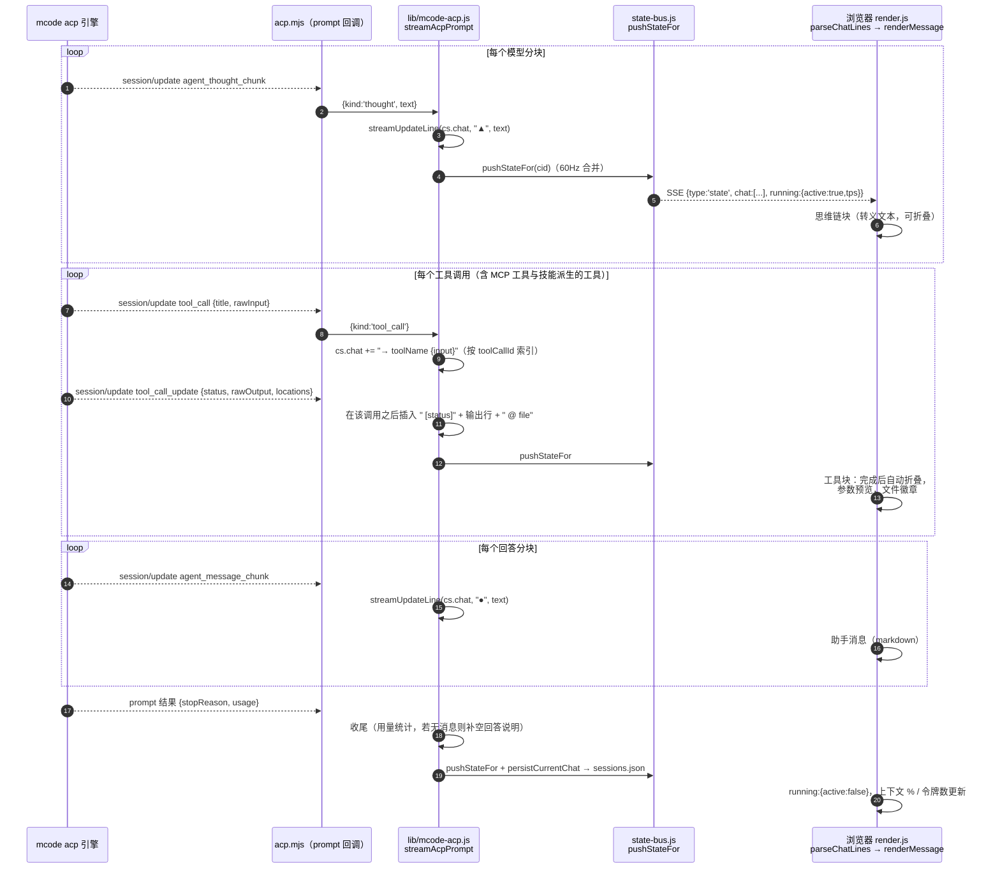
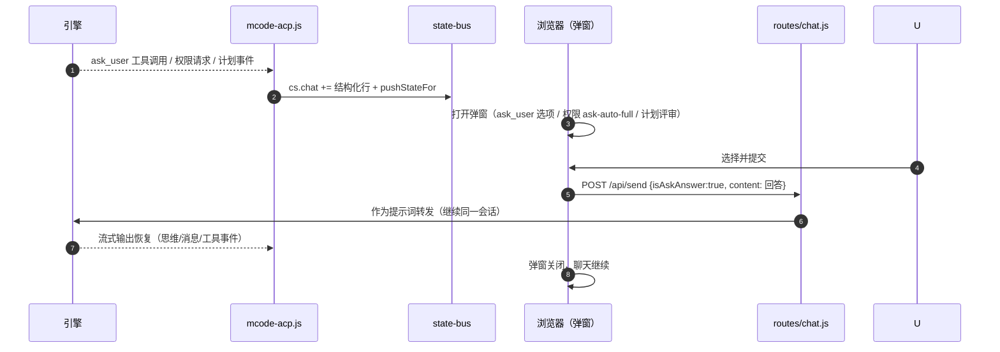
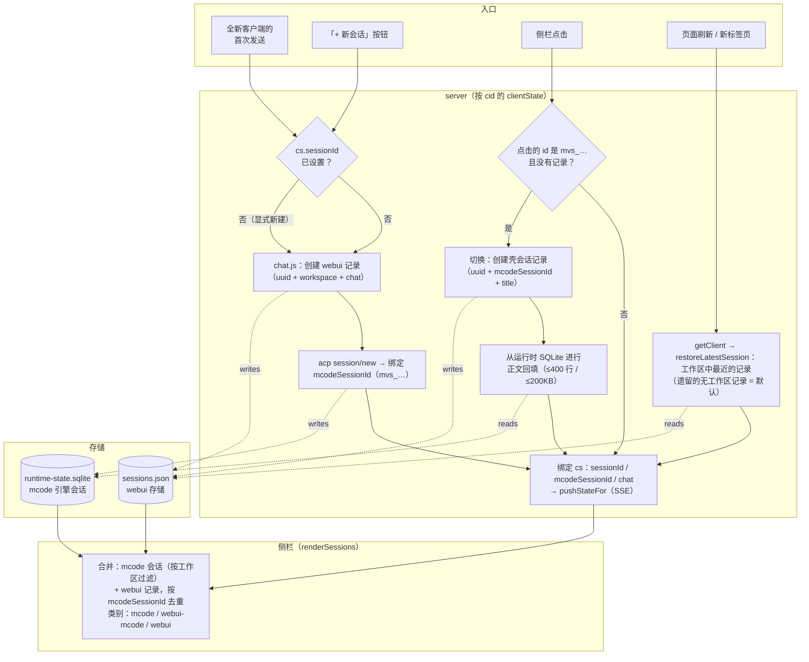

# 架构

> 简体中文 | [English](ARCHITECTURE.md)

> 本文档是 [README.md](../README.md) 的配套文档，面向需要
> 修改 webui 或与其集成的人员。它描述了运行时
> 拓扑、模块边界、请求生命周期以及 SSE
> 载荷契约。

## 1. 高层拓扑

```
                              ┌─────────────────────────────────────────────┐
                              │  Browser (public/)                          │
                              │   • index.html (markup)                     │
                              │   • app/main.js (ES module)                 │
                              │   • styles/main.css                         │
                              └─────────────────────────────────────────────┘
                                  │ ▲                          │ ▲
                  fetch / JSON   │ │  EventSource / SSE        │ │
                                  ▼ │                          ▼ │
   ┌──────────────────────────────────────────────────────────────────────┐
   │  server.js — bootstrap only (≈ 100 lines)                            │
   │   • installGlobalErrorHandlers()                                     │
   │   • preflight: mcode.cmd exists, upload dir writable, etc.            │
   │   • http.createServer(handleRequest)                                 │
   └──────────────────────────────────────────────────────────────────────┘
                                  │
                                  ▼
   ┌──────────────────────────────────────────────────────────────────────┐
   │  server/router.js — declarative route table                          │
   │                                                                      │
   │  LAN guard: !isLocalRequest(req) && !getLanBroadcast() → 403         │
   │                                                                      │
   │  ┌─ static  ┐ ┌─ /api/health  ┐  ┌─ /api/state  ┐ ┌─ /api/sessions ┐ │
   │  │ index   │ │ health.js     │  │ state.js     │ │ sessions.js    │ │
   │  │ .html   │ └───────────────┘  │ + /api/events│ │ + acp-         │ │
   │  │ .css/js │                    │   (SSE)      │ │   sessions/*   │ │
   │  │ .png    │                    └──────────────┘ └────────────────┘ │
   │  └─────────┘                                                       │
   │  ┌─ /api/send    ┐ ┌─ /api/usage  ┐ ┌─ /api/workspace  ┐             │
   │  │ chat.js      │ │ usage.js     │ │ workspace.js      │             │
   │  │ + /stop /cmd │ │ + -real      │ │ + /workspace/    │             │
   │  │              │ │ + /refresh   │ │   browse          │             │
   │  └──────────────┘ └──────────────┘ └──────────────────┘             │
   │  ┌─ /api/upload ┐ ┌─ /api/settings  ┐ ┌─ /api/models    ┐            │
   │  │ upload.js    │ │ settings.js     │ │ model.js         │            │
   │  └──────────────┘ └─────────────────┘ │ + /set-model     │            │
   │                                        │ + /permissions   │            │
   │                                        │ + /answer        │            │
   │                                        └──────────────────┘            │
   │  ┌─ /api/protocol/*  ┐ ┌─ /api/debug/*  ┐                            │
   │  │ protocol.js       │ │ debug.js       │                            │
   │  │ /set-mode         │ │ /inject (gated)│                            │
   │  │ /set-config-option│ │ /state         │                            │
   │  │ /cancel           │ └────────────────┘                            │
   │  │ /load-session …   │                                              │
   │  │ /capabilities     │                                              │
   │  └───────────────────┘                                              │
   └──────────────────────────────────────────────────────────────────────┘
                                  │
                                  ▼
   ┌──────────────────────────────────────────────────────────────────────┐
   │  server/lib/ — pure modules (one concern each)                      │
   │                                                                      │
   │  config · lan · models · db · sessions                              │
   │  state-bus · acp-client · mcode-rpc · mcode-acp · mcode-exec        │
   │  mavis-usage · usage · settings · upload · workspace · slash        │
   └──────────────────────────────────────────────────────────────────────┘
                                  │                          ▲
                                  ▼                          │  JSON-RPC over stdio
   ┌──────────────────────────────────────┐   ┌─────────────────────────────┐
   │  mcode exec subprocess                │   │  mcode acp subprocess        │
   │  (legacy single-turn, fallback)      │   │  (default multi-turn)        │
   │  stdio: line-delimited stream-json    │   │  stdio: newline-delimited    │
   │                                      │   │  JSON-RPC 2.0                │
   └──────────────────────────────────────┘   └─────────────────────────────┘
```

## 2. 请求生命周期

用户点击 **发送**。随后发生的事件：

```
browser           server/router.js           server/lib/*                mcode
   │ POST /api/send {content,…}    │                              │
   │ ──────────────────────────────►│                              │
   │                                │ chat.js: validate,           │
   │                                │   cs = getClient(cid)         │
   │                                │   cid → state-bus             │
   │                                │ ─────────────────►           │
   │                                │                              │ mcode-acp.js / mcode-exec.js
   │                                │                              │ ─── spawn / pipe stdin ───►
   │                                │                              │
   │                                │ state-bus: pushStateFor(cid) │
   │   ◄──────────── SSE event ────│   {type:'state', running:…}  │
   │   {type:'chat', lines:[…]}    │                              │
   │   ◄──────────── SSE event ────│   ◄── line  ◄─── stdout  ────│
   │   {type:'delta', text:'…'}    │                              │
   │   …                            │                              │
   │   ◄──────────── SSE event ────│   ◄── exec.result  ──────────│
   │   {type:'exec', status:'ok'}   │                              │
   │   ◄──────────── SSE event ────│                              │
   │   {type:'state', running:false}│                              │
   │   …                            │                              │
   │ connection closes / kept open   │                              │
```

关键不变量：

- **每个活动的 webui 标签页对应一个 `mcode` 子进程**（以 `cid` =
  客户端 id 为键，即存储在 `localStorage.webui_cid` 中的 UUID）。
  新标签页会获得一个新子进程；关闭标签页会杀死其子进程。状态是按
  cid 划分的，而不是按连接划分的。
- **SSE 通道是客户端状态更新的唯一来源**。
  REST 端点会改变服务器状态，但不会推送给客户端。
  客户端将 SSE 视为事实来源。
- **`pushStateFor(cid, opts)` 是服务器上唯一会修改
  按 cid 划分的状态的函数。** 其他一切都是只读的。这就是
  `state-bus.js` 有如此体量的原因——它是唯一的收口点（chokepoint）。

## 2.1 会话时序——提示词 → 流式输出 → 渲染

一个用户回合如何端到端地流转，以及每个引擎界面
（AGENTS.md、思维链、工具调用、MCP 工具、技能）在何处被调用
和渲染。名称均为真实代码符号。


随后的流式输出——每个引擎事件都变成一行聊天内容，每次
聊天变更都变成一个 SSE 状态快照：



交互界面与引擎侧模块——谁拥有什么：

| 界面 | 引擎侧 (mcode) | 传输线上 | Web UI 渲染 |
|---|---|---|---|
| **AGENTS.md** | `agent-modules/system-reminder` 在会话开始时将其注入系统提示词（项目指令、项目记忆） | 在聊天中不可见；在轨迹工作室（`/trajectory/`，会话事件）中可见 | 无特殊处理——它塑造模型行为 |
| **思维链（Thinking）** | 模型发出 `agent_thought_chunk` | `kind:'thought'` → `▲` 行 | 可折叠的思维链块（转义文本） |
| **内置工具**（Bash/Read/Write/Edit/…） | agent-runtime 按权限预设执行 | `tool_call` / `tool_call_update` → `→ name` + 缩进的输出行 | 工具块，自动折叠，文件徽章 |
| **MCP 工具** | 引擎启动已配置的 MCP 服务器（`mcp.json`）；调用以 `mcp__server__tool` 形式出现 | 与 tool_call 相同的传输线 | 同样的工具块（server·tool 命名） |
| **技能（Skills）** | `/skill` 或提示词触发 `agent-modules/skills` → 作为 system-reminder 内容注入 | 斜杠目录来自 `available_commands_update`；调用 = 普通提示词回合 | 斜杠提示 UI；技能输出 = 普通的思维/消息/工具流 |
| **ask_user 工具** | 引擎发出 `ask_user` 工具调用 | 聊天行 `→ ask_user {json}` | 带选项/多选/其他的弹窗；回答 → `POST /api/send {isAskAnswer:true}` |
| **权限提示** | 引擎为某个工具调用请求批准 | 权限事件 → 弹窗（ask/auto/full） | 回答经发送路径转发 |
| **计划模式（Plan mode）** | 以 `Plan:` 为前缀的提示词 → 结构化计划事件 | 计划评审弹窗 | 同意 / 跳过 / 补充上下文 → 转发 |
| **轨迹工作室** | 读取运行时 SQLite 投影（只读） | `/api/trajectory/*` | `/trajectory/` 面板（回合、令牌、压缩、子代理） |

交互式提示（ask_user / 权限 / 计划）的往返流程：



## 2.2 会话管理流程

两个存储协同工作。**webui 存储**（`sessions.json`，最近
会话列表）为每个 webui 会话保存一条记录：`id`（uuid）、
`mcodeSessionId`（绑定的 `mvs_…`）、`title`、`workspace`、`chat[]`。
**mcode 运行时存储**（`~/.minimax/v2/sqlite/runtime-state.sqlite`）
保存引擎自己的会话；webui 读取它用于侧栏
以及正文回填。



生命周期说明：

- **删除**（`DELETE /api/sessions/:id`）会移除 webui 记录，并
  从运行时 SQLite 中交叉删除关联的 `mvs_…` 行
  （`deleteMcodeSessionFromDb`，用 `?dryRun=true` 预览）。删除
  mcode 记录会在一个事务中把它从两个列表里都移除。
- **启动清理**会剔除那些为空、且仍是默认标题、
  且超过 24 小时的记录——即点了「+」却从未输入的残留。
- **搜索**（`GET /api/sessions/search`）跨工作区对标题做
  模糊匹配；匹配结果以 `[ws-short]` 前缀渲染，切入它们
  走的是上面同一条切换路径。
- **同一会话，一条记录**：全新客户端会恢复最近的
  会话而不是分叉（§2.2 修复历史），继续聊天
  会复用已绑定的 `mcodeSessionId`——不会为每条消息
  新建引擎会话。
- 点击 `mvs_…` 时创建的壳会话记录会被**持久化**（标题来自
  缓存优先的查找，回退到 ACP 标题探测），因此重复
  切换不会创建重复记录。


## 3. 模块契约

每个 `server/lib/*.js` 文件导出一小组命名函数。没有
文件会伸手进另一个文件的内部。值得注意的契约：

### `config.js`
- 导出近似冻结的常量：`MCODE_ROOT`、`MCODE_CMD`、`PORT`、`HOST`、
  `TOKEN`、`DEFAULT_MODEL`、`DEFAULT_TIMEOUT`、`DEFAULT_MAX_STEPS`、
  `MAX_CONCURRENT`、`UPLOAD_DIR`、`SESSIONS_DB`、`MCODE_RUNTIME_DB`、
  `MAVIS_DATA_DIR`、`MAVIS_DB_PATH`、`SQLITE3_BIN`、`DEFAULT_WORKSPACE`。
- 导出函数：`getPlatformFallbackPaths`、`detectSqlite3Bin`、
  `detectTuiCwd`（再导出）、`installGlobalErrorHandlers`。
- 在模块加载时恰好读取一次 `process.env.*`。不做按请求的
  重新读取。
- `installGlobalErrorHandlers()` 将未捕获的异常写入
  `.server.err`，使其在进程重启后仍然保留。

### `state-bus.js`
收口点。导出：

| 函数 | 用途 |
|---|---|
| `getClient(cid)` | 返回 `clientState` 对象：`state`、`sse`、`activeChild`、`chatHistory`、`requestSeq`。首次调用时惰性创建。 |
| `pushStateFor(cid, opts)` | 构建规范化的 `state` 对象并写入 `clientState.state`。除非 `opts.silent`，否则向 SSE 通道广播。 |
| `pushOnlineCount(lanBroadcast)` | 统计 `sseByCid.size` 并广播给所有客户端。在连接/断开时调用。 |
| `SSE_HEADERS` | 标准头：`Content-Type: text/event-stream`、`Cache-Control: no-cache`、`Connection: keep-alive`、`X-Accel-Buffering: no`。 |

`state` 载荷在下文 § 5 中说明。`clientState.state`
对象是代码库其余部分**唯一**读取的东西。

### `acp-client.js`
封装 mcode 的基于 stdio 的 JSON-RPC 协议。导出：

- `McodeAcpClient` 类——`start()`、`request(method, params)`、
  `notify(method, params)`、`stop()`、`events` EventEmitter。
- `getMcodeAcpClient()`——进程级单例。初始化由
  `pInitPromise` 去重，因此并发的 `start()` 调用者共享
  同一个子进程。
- 缓存：`mcodeSessionsCache`（位于 `acp-client.js`）和
  `getCachedMcodeCommands()`（位于 `state-bus.js`）避免
  对 `session/list` 和 `session/commands` 的
  重复 JSON-RPC 往返。

### `mcode-rpc.js`
针对 mcode 0.1.5 未实现的方法的垫片（shim）：

```js
const UNSUPPORTED = new Set([
  'session/set_mode',
  'session/set_config_option',
  'session/cancel',
  'session/activate', 'session/fork', 'session/resume', 'session/delete',
  'session/request_permission', 'session/subscribe',
])
```

当方法不受支持时，`callRpc(method, params)` 同步返回
`{ok:false, code:'unsupported', error:'…'}`。由调用者决定
如何处理——通常是客户端弹一个 toast。

### `mcode-acp.js` 与 `mcode-exec.js`
两种传输，共享同一形状。传输层由 `mcode-rpc.js`
根据 `mcode version >= 0.1.4` 以及按请求的
`/exec` 显式选择来决定。

两者都暴露：
- `runMcode(content, opts)` → `AsyncGenerator<NormalizedEvent>`
- `stopExec()` → `void`
- `isRunning()` → `boolean`

`NormalizedEvent` 是一个带标签的联合类型（`{type, …}`），包含这些类型：
`state`、`chat`、`delta`、`tool`、`permission`、`plan`、`ask`、
`exec`、`usage`。见 § 5。

## 4. `clientState.state` 载荷

这是每个 SSE `state` 事件所包含的形状。webui 将其
1:1 镜像到 `state` JS 变量中。

```ts
{
  version: string,                 // webui version (from package.json)
  running: { active: boolean,
             sessionId?: string,    // mcode acp session id (if any)
             cid: string,           // webui tab id
             startTime?: number,    // ms epoch
             pendingPermission?: object,
             pendingPlan?: object,
             pendingAsk?: object },
  workspace: { dir: string,         // absolute path, "" if unset
               branch?: string,     // git branch (best-effort, "" on error)
               treeState?: 'clean'|'dirty'|'unknown' },
  model: { name: string,            // e.g. "minimax_api/MiniMax-M3"
           ctx: string,            // e.g. "512k"
           thinking: 'On'|'Off'|string },
  permissions: string,             // mcode-side: 'ask'|'auto'|'full'|'plan'|...
  commands: Array<{                // mcode slash commands
    cmd: string, zh: string, en: string,
    description_zh?: string, description_en?: string,
    hint?: string,
    input_hint?: string,
    destructive?: boolean }>,
  sessions: Array<{                // webui-side session list (merged w/ mcode)
    id: string,
    title: string,
    workspace: string,
    mcodeSessionId?: string,        // linked mcode session id
    updatedAt: number }>,
  mcodeSessions: Array<{            // mcode-side session list (raw)
    sessionId: string,
    title: string,
    cwd: string,
    updatedAt: number }>,
  mcodeSessionId?: string,         // currently-active mcode session
  context?: {                       // updated by SSE delta accumulation
    used: number,                   // tokens used (per-turn)
    percent: number,                // 0..100
    cacheRead: number,              // per-turn cache reads
    tps: number,                    // current tok/s
    source: 'mavis'|'mmx' },        // which backend provided the data
  usage?: {                         // from /api/usage
    remaining: number,              // percent
    resetAt: number,                // ms epoch
    weeklyResetAt: number,
    fetchedAt: number },
  plan?: { active: boolean, title: string, summary: string,
           options: Array<{label:string}>, totalLines: number,
           summaryLines: number },
  enterPlanMode?: { active: boolean },
  permissionChoice?: { active: boolean, current: string,
                        options: Array<{label:string}> },
  askUser?: { active: boolean, questions: Array<…> },
  goal?: { active: boolean, text: string, status: 'running'|'done'|'blocked',
           duration?: number },
  todo?: Array<{ content: string, status: 'pending'|'in_progress'|'done' }>,
  lanBroadcast: boolean,           // mirrors /api/settings
  onlineCount: number,              // from pushOnlineCount
  // 🆕 v1.0.1 — settings surface pushed over SSE state updates
  readOnly: boolean,                // read-only mode (server gate blocks remote POST/DELETE on /api/*)
  tokenEnabled: boolean,            // token auth master switch (default true)
  currentToken: string,             // 32-hex auto-generated token; "" after tokenAcknowledged=true
  tokenAcknowledged: boolean,       // operator confirmed they saved the token
  tokenRotatedAt: number            // ms-since-epoch of last rotation
}
```

webui **不会**在此对象之外持有额外状态。任何需要数据的
UI 面板都从 `state` 读取，并通过 `render()` 响应
`state` 的变化。

## 5. SSE 事件模式

两种事件类型——`state`（标准状态推送）和一个 🆕
v1.0.1 的命名事件 `auth.token_rotated`，仅在
令牌变更时触发。

```
event: state
data: {"version":"0.1.3","running":{"active":true,…},…}

event: chat
data: {"lines":[{"role":"user","content":"…"}]}

event: delta
data: {"sessionId":"mvs_…","text":"hello","isPartial":true}

event: tool
data: {"name":"Bash","input":{…},"output":"…","status":"ok"|"err"|"running"}

event: permission
data: {"id":"perm_…","tool":"Bash","input":{…},"options":["ask","auto","full"]}

event: plan
data: {"title":"…","summary":"…","options":[…],"totalLines":N,"summaryLines":N}

event: ask
data: {"questions":[{"header":"…","question":"…","options":[…], "multiSelect":false}]}

event: exec
data: {"status":"ok"|"err"|"aborted","durationMs":N,"errorMessage"?:string}

event: usage
data: {"remaining":N,"resetAt":N,…}

event: online
data: {"count":N,"lanBroadcast":true}
```

🆕 **v1.0.1**——用于实时令牌轮换的独立命名事件：

```
event: auth.token_rotated
data: <new-32-hex-token>     // raw string, NOT JSON-wrapped
```

当操作员在设置卡片中点击「重置 token」（或
未来任何轮换令牌的触发源）时触发。每个收到该事件的
已连接客户端会就地更新其 `localStorage`（`webui_token` 键）
和当前的 `HEADERS.Authorization` 对象——后续的
`fetch()` 调用会自动使用新令牌，无需重新加载。
事件触发时离线的客户端将在下一次请求时收到 `401`；
需要手动把新 URL 重新发给它们。

正文是**原始文本**，而非 JSON 编码——在 devtools 中
一眼就能看出这是敏感材料，而 `JSON.stringify` 不会增加
任何价值（并且在从网络日志复制粘贴时还会遮蔽令牌）。

webui 将每个事件视为幂等更新；重放同一
事件是安全的。服务器采用至多一次投递模型
（SSE 在断连时丢弃 → 不重试），客户端通过在
重连时拉取 `/api/state` 来应对。

## 6. 前端拓扑

```
public/index.html         (markup only, no inline <script> or <style>)
public/app/main.js        (single ES module, ~4200 lines)
public/styles/main.css    (single stylesheet)
public/lib/marked.min.js  (third-party markdown)
```

`main.js` 是有意做成单体的。代码库选择单文件
而非构建步骤，因为：
- 无打包器 → 零构建时间、零 source map、零配置
- 更易 grep（一个文件 = 一次搜索）
- 通过 `<script src>` 上的 `?v=N` 查询串做缓存刷新

内部结构（自上而下）：
1. **配置**——env、`CID`、`TOKEN`、`API_SUFFIX`
2. **I18N 表**——`zh`、`en` 对象；`t(key)` 查找；`applyI18n()` 遍历
3. **DOM 缓存**——`els = {...}`，在 `init()` 时填充
4. **渲染函数**——`render()`、`renderChat()`、`renderSessions()`、`renderUsage()`、`renderRight()`、`renderGoal()`、`renderTodo()`、`renderContext()`
5. **状态同步**——`connect()`（SSE），`pushStateFor` 镜像
6. **事件处理器**——`attachEvents()`（委托 + 逐元素），`attachModalEvents()`
7. **动作函数**——`send()`、`stopExec()`、`setMode()`、`setModel()`、`submitWorkspaceChange()`、`cancelConfirm()`、`refreshSessions()`、`refreshUsage()`
8. **辅助函数**——`parseChatLines()`、`parseMarkdown()`、`renderMessage()`、`escapeHtml()`
9. **初始化**——try { init(); attachModalEvents() } catch { 显示红色错误 }

## 7. 为什么零 npm 依赖

webui 有意做到无依赖。原因：

- `mcode.cmd` 本身就是一个自带依赖的工具链
- 一个需要 `npm install` 才能启动的 webui 是多一个可能出错的环节
- 所有必需功能（HTTP 服务器、EventSource、JSON、multipart
  解析）都在 Node 标准库中

`package.json` 存在是为了 `name`/`version`/`scripts` 字段
以及编辑器工具链（Node 类型检测）。`npm start` 是
一行命令，只是运行 `node server.js`。

如果未来的变更需要新增依赖，规则是：添加它，说明原因，
并尽可能保持该依赖可选（try/catch + 回退）。

## 8. 故障模式

| 故障 | 检测 | 恢复 |
|---|---|---|
| mcode acp 子进程崩溃 | `child.on('exit')` 监听器 | 以 `running.active=false` 调用 pushStateFor；客户端显示「agent stopped」toast |
| mcode acp 返回 "Method not found" | `mcode-rpc.js` 允许列表 | 同步返回 `{ok:false, code:'unsupported'}`；路由处理器返回 501 Not Implemented；客户端显示 toast |
| SSE 连接断开 | `EventSource.onerror` | 带退避的自动重连；重连后拉取 `/api/state` 并重新同步 |
| 来自非白名单 IP 的 LAN 请求 | `router.js` L120 | 403 + 友好的 HTML 页面（/api/* 则返回 JSON） |
| 服务器文件描述符耗尽 | `installGlobalErrorHandlers` 的 EMFILE 兜底 | 写入 `.server.err`；用户看到空白页；重新加载通常可修复 |
| mcode exec 编码为 GBK（Windows） | Node 在 `spawn` 中默认使用 UTF-8；无需修复 | 已在 README 中记录为面向未来 Python 移植的坑 |

## 9. 添加新端点

模式（完整演练见 `docs/DEVELOPMENT.md`）：

1. 创建 `server/routes/foo.js`，导出 `async function handleFoo(req, res, ctx, pathname)`
2. 在 `server/router.js` 中导入
3. 添加到路由表：
   ```js
   { method: 'POST', match: (p) => p === '/api/foo', handler: fooRoute.handleFoo }
   ```
4. 如果新端点会修改状态，在处理器中调用 `pushStateFor(cid, {...})`。
   绝不要直接写入 `clientState.state`。
5. 如果该端点由 webui 调用，将其添加到
   `public/app/main.js` 中的 fetch 辅助函数（`API_SUFFIX` 会自动附加）。

## 10. 未来方向

- **mcode `acp` 能力对齐**：一旦 mcode 实现了缺失的
  方法（`set_mode`、`cancel` 等），`mcode-rpc.js` 中的
  `UNSUPPORTED` 集合就会缩小；相应的 `/api/protocol/*` 端点
  将变得可用。`protocol/capabilities` 端点已经
  对外宣告了这一点。
- **WebSocket 传输**：SSE 对单向推送已经足够。如果
  双向低延迟控制成为需求（例如在共享会话中实时
  跟踪光标），可以用 WebSocket 替换 EventSource
  并保持相同的消息模式。
- **多用户会话共享**：按 cid 的状态可以替换为
  按会话的状态加上会话 id 路由键。该架构
  已经把按 cid 的状态与按会话的数据分离；
  迁移只是改名，而非重构。
