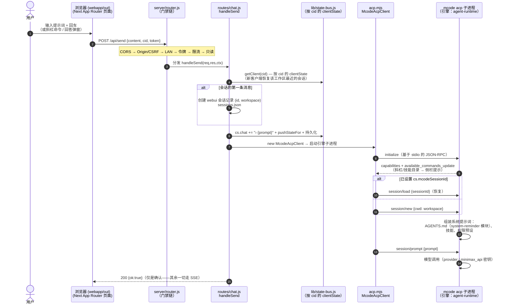
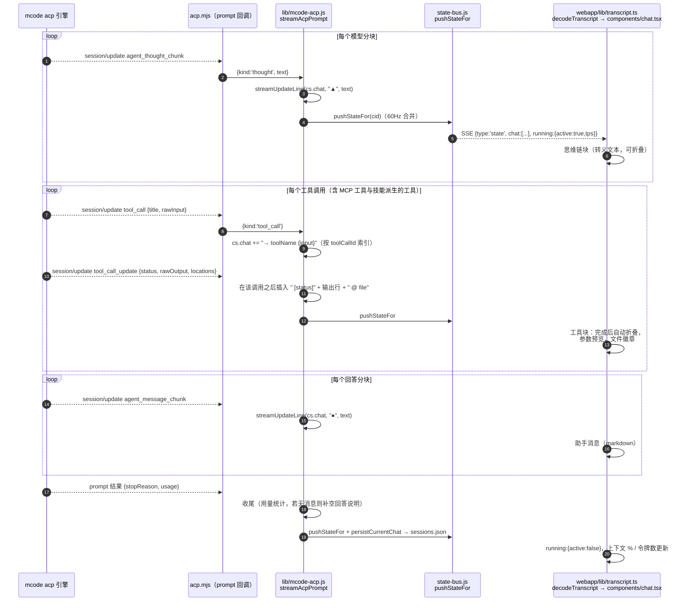
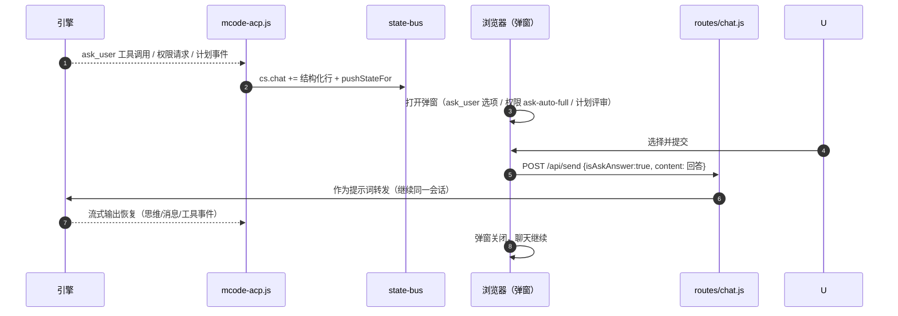
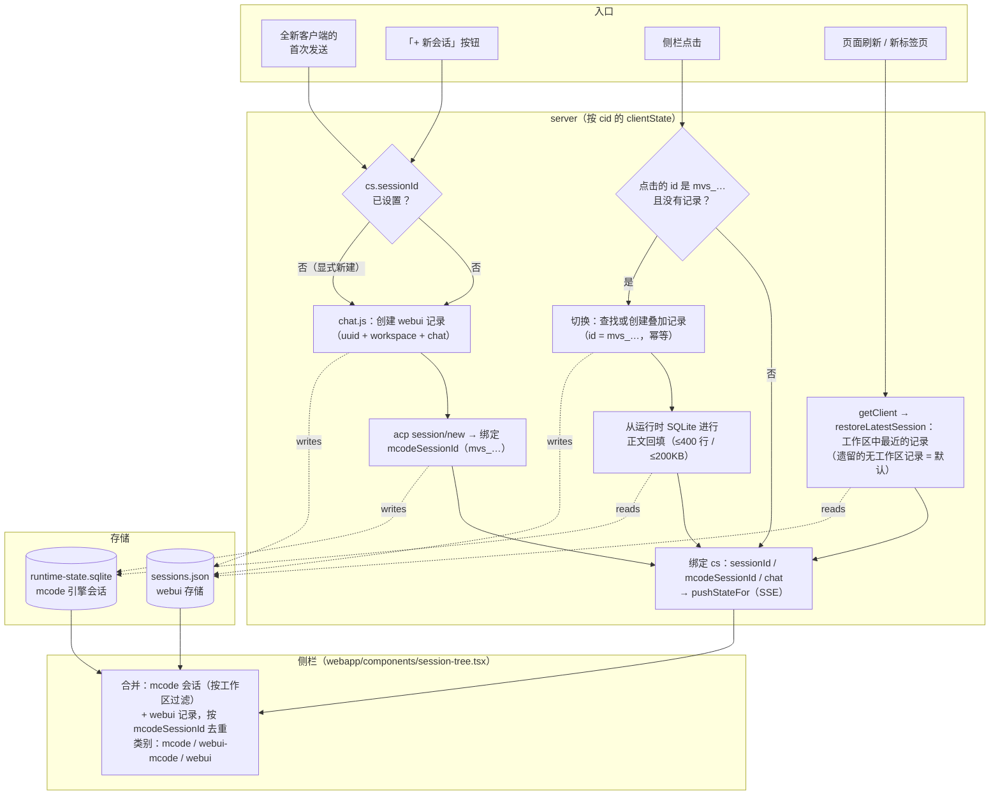
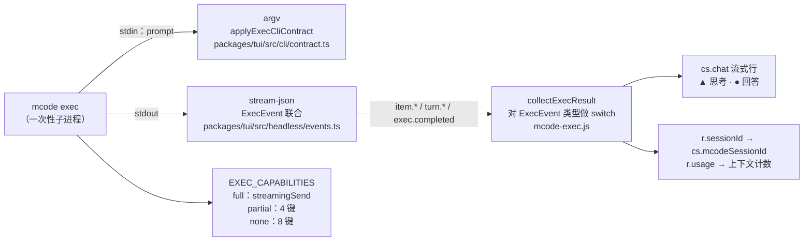

# 架构

> 简体中文 | [English](ARCHITECTURE.md)

> 本文档是 [README.md](../README.md) 的配套文档，面向需要
> 修改 webui 或与其集成的人员。它描述了运行时
> 拓扑、模块边界、请求生命周期以及 SSE
> 载荷契约。

## 1. 高层拓扑

```
                              ┌─────────────────────────────────────────────┐
                              │  Browser (webapp/out，Next 静态导出)         │
                              │   • index.html + App Router 页面            │
                              │   • _next/static/*（内容哈希）             │
                              │   • webapp/public/auth-gate.html（LAN 门禁）│
                              └─────────────────────────────────────────────┘
                                  │ ▲                          │ ▲
                  fetch / JSON   │ │  EventSource / SSE        │ │
                                  ▼ │                          ▼ │
   ┌──────────────────────────────────────────────────────────────────────┐
   │  server.js（源码模式）——注册 @mavis/* → 工作区 TS 的解析器        │
   │  server/bootstrap.js ——真正的启动（由 server.js 委派进来）         │
   │  dist/webui/server.js ——bootstrap.js 的 esbuild bundle（发布版本） │
   │   • installGlobalErrorHandlers()                                     │
   │   • preflight: mcode binary exists, upload dir writable, etc.       │
   │   • http.createServer(handleRequest)                                 │
   │   • http.createServer(handleRequest)                                 │
   └──────────────────────────────────────────────────────────────────────┘
                                  │
                                  ▼
   ┌──────────────────────────────────────────────────────────────────────┐
   │  server/router.js — declarative route table                          │
   │                                                                      │
   │  门禁链（Gates 1→5）位于 server/lib/gates.js#runGates，             │
   │  router.js 委派给它；两个 HTTP 层共用同一条链：                        │
   │  LAN guard: !isLocalRequest(req) && !getLanBroadcast() → 403         │
   │                                                                      │
   │  ┌─ static  ┐ ┌─ /api/health  ┐  ┌─ /api/state  ┐ ┌─ /api/sessions ┐ │
   │  │ index   │ │ health.js     │  │ state.js     │ │ sessions.js    │ │
   │  │ .html   │ └───────────────┘  │ + /api/events│ │ + acp-         │ │
   │  │ .css/js │                    │   (SSE)      │ │   sessions/*   │ │
   │  │ .png    │                    └──────────────┘ └────────────────┘ │
   │  └─────────┘                                                       │
   │  ┌─ /api/send    ┐ ┌─ /api/usage  ┐ ┌─ /api/workspace  ┐             │
   │  │ chat.js      │ │ usage.js     │ │ workspace.js      │             │
   │  │ + /stop /cmd │ │ + -real      │ │ + /workspace/    │             │
   │  │              │ │ + /refresh   │ │   browse          │             │
   │  └──────────────┘ └──────────────┘ └──────────────────┘             │
   │  ┌─ /api/upload ┐ ┌─ /api/settings  ┐ ┌─ /api/models    ┐            │
   │  │ upload.js    │ │ settings.js     │ │ model.js         │            │
   │  └──────────────┘ └─────────────────┘ │ + /set-model     │            │
   │                                        │ + /permissions   │            │
   │                                        │ + /answer        │            │
   │                                        └──────────────────┘            │
   │  ┌─ /api/protocol/*  ┐ ┌─ /api/debug/*  ┐                            │
   │  │ protocol.js       │ │ debug.js       │                            │
   │  │ /set-mode         │ │ /inject (gated)│                            │
   │  │ /set-config-option│ │ /state         │                            │
   │  │ /cancel           │ └────────────────┘                            │
   │  │ /load-session …   │                                              │
   │  │ /capabilities     │                                              │
   │  └───────────────────┘                                              │
   └──────────────────────────────────────────────────────────────────────┘
                                  │
                                  ▼
   ┌──────────────────────────────────────────────────────────────────────┐
   │  server/lib/ — pure modules (one concern each)                      │
   │                                                                      │
   │  config · layout · lan · models · sqlite-resolver ·                │
   │  sessions · state-bus · acp-client                               │
   │  mcode-rpc · mcode-acp · mcode-exec · chat-line · context-percent  │
   │  mavis-usage · usage · settings · upload · workspace · slash ·     │
   │  static · gates · auth · alerts · trajectory                       │
   └──────────────────────────────────────────────────────────────────────┘
                                  │                          ▲
                                  ▼                          │  JSON-RPC over stdio
   ┌──────────────────────────────────────┐   ┌─────────────────────────────┐
   │  mcode exec subprocess                │   │  mcode acp subprocess        │
   │  (legacy single-turn, fallback)      │   │  (default multi-turn)        │
   │  stdio: line-delimited stream-json    │   │  stdio: newline-delimited    │
   │                                      │   │  JSON-RPC 2.0                │
   └──────────────────────────────────────┘   └─────────────────────────────┘
```

## 2. 请求生命周期

用户点击 **发送**。随后发生的事件：

```
browser           server/router.js           server/lib/*                mcode
   │ POST /api/send {content,…}    │                              │
   │ ──────────────────────────────►│                              │
   │                                │ chat.js: validate,           │
   │                                │   cs = getClient(cid)         │
   │                                │   cid → state-bus             │
   │                                │ ─────────────────►           │
   │                                │                              │ mcode-acp.js / mcode-exec.js
   │                                │                              │ ─── spawn / pipe stdin ───►
   │                                │                              │
   │                                │ state-bus: pushStateFor(cid) │
   │   ◄──────────── SSE event ────│   {type:'state', running:…}  │
   │   {type:'chat', lines:[…]}    │                              │
   │   ◄──────────── SSE event ────│   ◄── line  ◄─── stdout  ────│
   │   {type:'delta', text:'…'}    │                              │
   │   …                            │                              │
   │   ◄──────────── SSE event ────│   ◄── exec.result  ──────────│
   │   {type:'exec', status:'ok'}   │                              │
   │   ◄──────────── SSE event ────│                              │
   │   {type:'state', running:false}│                              │
   │   …                            │                              │
   │ connection closes / kept open   │                              │
```

关键不变量：

- **每个活动的 webui 标签页对应一个 `mcode` 子进程**（以 `cid` =
  客户端 id 为键，即存储在 `localStorage.webui_cid` 中的 UUID）。
  新标签页会获得一个新子进程；关闭标签页会杀死其子进程。状态是按
  cid 划分的，而不是按连接划分的。
- **SSE 通道是客户端状态更新的唯一来源**。
  REST 端点会改变服务器状态，但不会推送给客户端。
  客户端将 SSE 视为事实来源。
- **`pushStateFor(cid, opts)` 是服务器上唯一会修改
  按 cid 划分的状态的函数。** 其他一切都是只读的。这就是
  `state-bus.js` 有如此体量的原因——它是唯一的收口点（chokepoint）。

## 2.1 会话时序——提示词 → 流式输出 → 渲染

一个用户回合如何端到端地流转，以及每个引擎界面
（AGENTS.md、思维链、工具调用、MCP 工具、技能）在何处被调用
和渲染。名称均为真实代码符号。


```mermaid
sequenceDiagram
    autonumber
    actor U as 用户
    participant B as 浏览器 (webapp/out)<br/>(Next App Router 页面)
    participant R as server/router.js<br/>（门禁链）
    participant C as routes/chat.js<br/>handleSend
    participant S as lib/state-bus.js<br/>（按 cid 的 clientState）
    participant A as acp.mjs<br/>McodeAcpClient
    participant E as mcode acp 子进程<br/>（引擎：agent-runtime）

    U->>B: 输入提示词 + 回车<br/>（或斜杠命令 / 回答弹窗）
    B->>R: POST /api/send {content, cid, token}
    Note over R: CORS → Origin/CSRF → LAN → 令牌 → 限流 → 只读
    R->>C: 分发 handleSend(req,res,ctx)
    C->>S: getClient(cid) — 按 cid 的 clientState<br/>（新客户端恢复该工作区最近的会话）
    alt 会话的第一条消息
        C->>C: 创建 webui 会话记录 (id, workspace)<br/>sessions.json
    end
    C->>S: cs.chat += "› {prompt}" + pushStateFor + 持久化
    C->>A: new McodeAcpClient → 启动引擎子进程
    A->>E: initialize（基于 stdio 的 JSON-RPC）
    E-->>A: capabilities + available_commands_update<br/>（斜杠/技能目录 → 侧栏提示）
    alt 已设置 cs.mcodeSessionId
        A->>E: session/load {sessionId}（恢复）
    else
        A->>E: session/new {cwd: workspace}
    end
    E->>E: 组装系统提示词：<br/>AGENTS.md（system-reminder 模块）、<br/>技能、权限预设
    A->>E: session/prompt {prompt}
    E->>E: 模型调用（provider / minimax_api 密钥）
    C-->>B: 200 {ok:true}（仅是确认——其余一切走 SSE）
```

随后的流式输出——每个引擎事件都变成一行聊天内容，每次
聊天变更都变成一个 SSE 状态快照：


```mermaid
sequenceDiagram
    autonumber
    participant E as mcode acp 引擎
    participant A as acp.mjs（prompt 回调）
    participant M as lib/mcode-acp.js<br/>streamAcpPrompt
    participant S as state-bus.js<br/>pushStateFor
    participant B as webapp/lib/transcript.ts<br/>decodeTranscript → components/chat.tsx

    loop 每个模型分块
        E-->>A: session/update agent_thought_chunk
        A->>M: {kind:'thought', text}
        M->>M: streamUpdateLine(cs.chat, "▲", text)
        M->>S: pushStateFor(cid)（60Hz 合并）
        S-->>B: SSE {type:'state', chat:[...], running:{active:true,tps}}
        B->>B: 思维链块（转义文本，可折叠）
    end
    loop 每个工具调用（含 MCP 工具与技能派生的工具）
        E-->>A: session/update tool_call {title, rawInput}
        A->>M: {kind:'tool_call'}
        M->>M: cs.chat += "→ toolName  {input}"（按 toolCallId 索引）
        E-->>A: session/update tool_call_update {status, rawOutput, locations}
        M->>M: 在该调用之后插入 "  [status]" + 输出行 + "  @ file"
        M->>S: pushStateFor
        B->>B: 工具块：完成后自动折叠，<br/>参数预览，文件徽章
    end
    loop 每个回答分块
        E-->>A: session/update agent_message_chunk
        M->>M: streamUpdateLine(cs.chat, "●", text)
        B->>B: 助手消息（markdown）
    end
    E-->>A: prompt 结果 {stopReason, usage}
    M->>M: 收尾（用量统计，若无消息则补空回答说明）
    M->>S: pushStateFor + persistCurrentChat → sessions.json
    B->>B: running:{active:false}，上下文 % / 令牌数更新
```

交互界面与引擎侧模块——谁拥有什么：

| 界面 | 引擎侧 (mcode) | 传输线上 | Web UI 渲染 |
|---|---|---|---|
| **AGENTS.md** | `agent-modules/system-reminder` 在会话开始时将其注入系统提示词（项目指令、项目记忆） | 在聊天中不可见；在轨迹工作室（`/trajectory/`，会话事件）中可见 | 无特殊处理——它塑造模型行为 |
| **思维链（Thinking）** | 模型发出 `agent_thought_chunk` | `kind:'thought'` → `▲` 行 | 可折叠的思维链块（转义文本） |
| **内置工具**（Bash/Read/Write/Edit/…） | agent-runtime 按权限预设执行 | `tool_call` / `tool_call_update` → `→ name` + 缩进的输出行 | 工具块，自动折叠，文件徽章 |
| **工具调用 ID 标记** `##tc:<toolCallId>` | `mcode-acp.js#applyToolUpdate` 在每个 `→ name` 标题行紧之前写入 | 一行聊天记录 `##tc:<id>`，由 `decodeTranscript` 消费 | 把 `toolCallId` 挂到工具块上，`ToolCard` 据此按 id（而非工具名）匹配 `recentSubagents[]`；不进聊天正文 |
| **处理时长标记** `§§ processed_duration=Nms` | 提示词 finalize（`mcode-{acp,exec}.js#finalize`） | 一行聊天记录 `§§ processed_duration=Nms`，由 `decodeTranscript` 消费 | 把 `processedDuration` 挂到助手回合上，用于 `turn_process_disclosure` 折叠条；不进聊天正文 |
| **MCP 工具** | 引擎启动已配置的 MCP 服务器（`mcp.json`）；调用以 `mcp__server__tool` 形式出现 | 与 tool_call 相同的传输线 | 同样的工具块（server·tool 命名） |
| **技能（Skills）** | `/skill` 或提示词触发 `agent-modules/skills` → 作为 system-reminder 内容注入 | 斜杠目录来自 `available_commands_update`；调用 = 普通提示词回合 | 斜杠提示 UI；技能输出 = 普通的思维/消息/工具流 |
| **ask_user 工具** | 引擎发出 `ask_user` 工具调用 | 聊天行 `→ ask_user {json}` | 带选项/多选/其他的弹窗；回答 → `POST /api/send {isAskAnswer:true}` |
| **权限提示** | 引擎为某个工具调用请求批准 | 权限事件 → 弹窗（ask/auto/full） | 回答经发送路径转发 |
| **计划模式（Plan mode）** | 以 `Plan:` 为前缀的提示词 → 结构化计划事件 | 计划评审弹窗 | 同意 / 跳过 / 补充上下文 → 转发 |
| **轨迹工作室** | 读取运行时 SQLite 投影（只读） | `/trajectory/api/*`（自带后端，`server/trajectory/http.mjs`） | `/trajectory/` 面板（回合、令牌、压缩、子代理） |

交互式提示（ask_user / 权限 / 计划）的往返流程：


```mermaid
sequenceDiagram
    autonumber
    participant E as 引擎
    participant M as mcode-acp.js
    participant S as state-bus
    participant B as 浏览器（弹窗）
    participant C as routes/chat.js

    E-->>M: ask_user 工具调用 / 权限请求 / 计划事件
    M->>S: cs.chat += 结构化行 + pushStateFor
    B->>B: 打开弹窗（ask_user 选项 / 权限 ask-auto-full / 计划评审）
    U->>B: 选择并提交
    B->>C: POST /api/send {isAskAnswer:true, content: 回答}
    C->>E: 作为提示词转发（继续同一会话）
    E-->>M: 流式输出恢复（思维/消息/工具事件）
    B->>B: 弹窗关闭，聊天继续
```

## 2.2 会话管理流程

**一次对话 = 一个身份**：mcode 会话（`mvs_…`）即会话本身。**webui 存储**
（`sessions.json`）是按 `mcodeSessionId` 键控的*叠加层*——承载 `title`、
`workspace` 与 `chat[]` 快照（用于快速加载），绝不制造第二身份。新的
叠加记录 `id === mcodeSessionId`；草稿（还没发过消息的 "+" 会话）保留
uuid，首轮回合后由 `promoteDraftToMcodeSid` 晋升。旧的 uuid 壳记录依然
可解析（所有查找先按 `mcodeSessionId` 命中）。**mcode 运行时存储**
（`~/.minimax/v2/sqlite/runtime-state.sqlite`）是权威会话列表；webui
读取它用于侧栏与正文回填。


```mermaid
flowchart TD
    subgraph ENTRY["入口"]
        A1["全新客户端的<br/>首次发送"]
        A2["「+ 新会话」按钮"]
        A3["侧栏点击"]
        A4["页面刷新 / 新标签页"]
    end

    subgraph SERVER["server（按 cid 的 clientState）"]
        B{"cs.sessionId<br/>已设置？"}
        C["chat.js：创建 webui 记录<br/>（uuid + workspace + chat）"]
        D["acp session/new → 绑定 mcodeSessionId（mvs_…）"]
        E["getClient → restoreLatestSession：<br/>工作区中最近的记录<br/>（遗留的无工作区记录 = 默认）"]
        F{"点击的 id 是 mvs_…<br/>且没有记录？"}
        G["切换：查找或创建叠加记录<br/>（id = mvs_…，幂等）"]
        H["从运行时 SQLite 进行<br/>正文回填（≤400 行 / ≤200KB）"]
        I["绑定 cs：sessionId / mcodeSessionId / chat<br/>→ pushStateFor（SSE）"]
    end

    subgraph STORES["存储"]
        J[("sessions.json<br/>webui 存储")]
        K[("runtime-state.sqlite<br/>mcode 引擎会话")]
    end

    subgraph SIDEBAR["侧栏（webapp/components/session-tree.tsx）"]
        L["合并：mcode 会话（按工作区过滤）<br/>+ webui 记录，按 mcodeSessionId 去重<br/>类别：mcode / webui-mcode / webui"]
    end

    A1 --> B
    B -- "否" --> C --> D --> I
    A2 --> B
    B -- "否（显式新建）" --> C
    A3 --> F
    F -- "否" --> I
    F -- "是" --> G --> H --> I
    A4 --> E --> I
    C -.writes.-> J
    D -.writes.-> K
    E -.reads.-> J
    G -.writes.-> J
    H -.reads.-> K
    J --> L
    K --> L
    I --> L
```

生命周期说明：

- **删除**（`DELETE /api/sessions/:id`）会移除 webui 记录，并
  请求引擎删除关联的 `mvs_…` 会话
  （`engine/session-delete.js#deleteSessionThroughEngine`，用 `?dryRun=true`
  预览——预览是逐表只读计数，因为引擎的删除没有预览形态）。删除
  mcode 记录会把它从两个列表里都移除。
- **启动清理**会剔除那些为空、且仍是默认标题、
  且超过 24 小时的记录——即点了「+」却从未输入的残留。
- **搜索**（`GET /api/sessions/search`）跨工作区对标题做
  模糊匹配；匹配结果以 `[ws-short]` 前缀渲染，切入它们
  走的是上面同一条切换路径。
- **同一会话，一条记录**：全新客户端会恢复最近的
  会话而不是分叉（§2.2 修复历史），继续聊天
  会复用已绑定的 `mcodeSessionId`——不会为每条消息
  新建引擎会话。
- **单一身份（v2.4）**：切换到 `mvs_…` 会话只会解析到**同一条**叠加
  记录——`ensureOverlayForMcodeSid` 首次接触时以 `id === mvs_…` 创建，
  此后每次切换复用它。首轮发送把草稿晋升为同一引擎身份（已有叠加记
  录时并入）。因此一次对话绝不可能以两条记录出现。


## 3. 模块契约

每个 `server/lib/*.js` 文件导出一小组命名函数。没有
文件会伸手进另一个文件的内部。值得注意的契约：

### `config.js`
- 导出近似冻结的常量：`PACKAGE_ROOT`（`WEBUI_ROOT` 的别名）、
  `WEBUI_DATA_DIR`、`MCODE_CMD`、`PORT`、`PORT_PINNED`、`HOST`、
  `TOKEN`、`TOKEN_STDOUT`、`DEFAULT_MODEL`、`DEFAULT_TIMEOUT`、
  `DEFAULT_MAX_STEPS`、`MAX_CONCURRENT`、`UPLOAD_DIR`、`SESSIONS_DB`、
  `MCODE_RUNTIME_DB`、`MAVIS_DATA_DIR`、`MAVIS_DB_PATH`、`SQLITE3_BIN`、
  `DEFAULT_WORKSPACE`、`PROMPT_IDLE_TIMEOUT_MS`、`RATE_LIMIT_PER_MIN`、
  `RATE_LIMIT_BURST`、`MCODE_WEBUI_UPLOAD_DIR`、`MCODE_WEBUI_SETTINGS_PATH`、
  `MCODE_BETTER_SQLITE3`、`DEBUG_INJECT`。
- 导出函数：`getServingPort`、`setServingPort`、`resolveBindHost`、
  `getPlatformFallbackPaths`、`detectSqlite3Bin`、`detectTuiCwd`
  （再导出）、`installGlobalErrorHandlers`。
- 在模块加载时恰好读取一次 `process.env.*`。不做按请求的
  重新读取（端口回退是例外——`setServingPort` 在启动后更新实时端口）。
- 数据目录优先级：`MINIMAX_DATA_DIR` > `MAVIS_DATA_DIR` > `~/.minimax`
  （同一个解析器同时给 `MAVIS_DB_PATH` 用，保证运行时 SQLite 路径
  与工作区其他部分一致）。
- `installGlobalErrorHandlers()` 将未捕获的异常写入
  `WEBUI_DATA_DIR/.server.err`，使其在进程重启后仍然保留。

### `state-bus.js`
收口点。导出：

| 函数 | 用途 |
|---|---|
| `getClient(cid)` | 返回按 cid 的 `clientState` 对象，由 `makeClientState()` 创建、首次调用时经 `restoreLatestSession()` 恢复。该对象**本身就是**状态——不存在 `clientState.state` 这层包装。按 cid 的旁表位于它之外而非其中：`sseByCid`（每个 cid 的 SSE 响应）与 `activeChildByCid`（每个 cid 的子进程）。 |
| `pushStateFor(cid, opts)` | 从 `clientState` 组装规范化的 `state` 对象，除非 `opts.silent`，否则向 SSE 通道广播。 |
| `pushOnlineCount(lanBroadcast)` | 统计 `sseByCid.size` 并广播给所有客户端。在连接/断开时调用。 |
| `SSE_HEADERS` | 标准头：`Content-Type: text/event-stream`、`Cache-Control: no-cache`、`Connection: keep-alive`、`X-Accel-Buffering: no`。 |

`state` 载荷在下文 § 4 中说明。`clientState` 对象是代码库其余部分
**唯一**读取的东西。

### `acp.mjs` 与 `acp-client.js`
两个不同的文件，需要 grep 符号时务必分清：

- `acp.mjs`（位于包根 `packages/webui/acp.mjs`）是零依赖的、基于
  stdio 的 JSON-RPC 传输层。它**定义** `class McodeAcpClient`——
  `start()`、`request(method, params)`、`notify(method, params)`、
  `stop()`、`events` EventEmitter——并应答引擎发往客户端的每一个请求。
- `server/lib/acp-client.js` 是包裹该传输层的 webui 侧缓存与生命周期
  管理器。它从 `acp.mjs` **导入** `McodeAcpClient`，既不定义也不再导出它。
  它自己的导出是：`getMcodeAcpClient()`——进程级单例，其初始化由模块级
  `_mcodeAcpInitPromise` 去重，因此并发调用者共享同一个子进程——以及
  `getCatalogueHost()`、`listAllMcodeSessions()`、
  `getMcodeSessionsForWorkspace()`、`getMcodeSessionTitle()`、
  `invalidateMcodeSessionsCache()`、`shutdownMcodeAcpSingleton()`、
  `getMcodeServerInfo()`、`WEBUI_LOCAL_COMMANDS`、`ensureMcodeCommands()`。
- 缓存：`mcodeSessionsCache` 与 `getCachedMcodeCommands()` 同为
  `acp-client.js` 的模块级状态。`state-bus.js` 只是**导入**
  `getCachedMcodeCommands()` 来组装快照。两者都避免了
  对 `session/list` 与 `session/commands` 的重复 JSON-RPC 往返。

### `mcode-rpc.js`
acp 侧的封装。每一个公共函数（`setMode`、`setConfigOption`、
`cancelSession`、`loadSession`、`activateSession`、`listSessions`、
`getAccountStatus` …）都通过 `clientForCid(cid, requireLive)`
来派发：

  - 如果传入了 `cid`，则优先选用该 cid 注册的活动子进程
    （即每次提示词对应的 `McodeAcpClient`）——那个子进程的
    `sessions` 表持有当前在飞的会话；
  - `requireLive: true`（`cancelSession` / `setConfigOption` 使用）
    在没有活动子进程注册时返回 `null`，**不会**回退到单例，
    因为静默回退会掩盖前面几个 PR 重新引入的派发 bug；
  - 其余调用回退到单例，这能让 commands 探测与会话列
    表路径在没有 cid 时也正常工作。

webui 对自己宣告的能力表：

```js
export const MCODE_ACP_CAPABILITIES = {
  set_mode: true,
  set_config_option: true,
  cancel: true,
  activate: true,
  fork: true,
  resume: true,
  // session/delete 在引擎侧注册了，但不存在处理器——这正是
  // 删除需要通过 SQL 走 local_runtime_* 表的原因
  //（见 sqlite-resolver.js）。
  delete: false,
  load: true,
  close: true,
  list: true,
  new: true,
  prompt: true,
}
```

当引擎以 `-32601 Method not found`（或 jsonrpc 信封中的
等价错误）应答时，`callRpc(method, params)` 返回
`{ok:false, code:'unsupported', error:'…'}`。由调用者决定
如何处理——通常是客户端弹一个 toast。

### `mcode-acp.js` 与 `mcode-exec.js`
两种传输，共享同一形状。一个回合用哪种传输在引擎启动前就已决定，判定散落两处：`routes/chat.js#handleSend` 在服务端环境变量 `MCODE_USE_ACP=0` 时强制走 `mcode exec`（ACP 协议回归时的逃生阀）；`runMcodeAcp` 自身在会话权限模式不是 `Full access` 时改道 `runMcodeExec`（`runMcodeAcp` 的首个分支）。不存在 `/exec` 命令，也没有按请求的显式选择；`mcode-rpc.js` 不做传输选择——它只与当前已注册的子进程通信。

两者各自暴露一个入口，名字随传输方式而定：
- `mcode-acp.js` → `runMcodeAcp(content, opts)` → `AsyncGenerator<NormalizedEvent>`
- `mcode-exec.js` → `runMcodeExec(content, opts)` → `AsyncGenerator<NormalizedEvent>`

> **已移除的符号。** 本节早期版本记载过一个由两种传输共同导出的三件套——
> `runMcode(content, opts)`、`stopExec()` 与 `isRunning()`。三者如今都不存在。
> 单一入口已按传输方式拆分；停止与状态这两个问题改由别处回答：取消走
> `mcode-rpc.js#cancelSession`，运行状态读取按 cid 的 `clientState` 上的
> `running` 字段。这里没有可追踪的改名——它们是被删掉了，不是搬走了。

`NormalizedEvent` 是一个带标签的联合类型（`{type, …}`），包含这些类型：
`state`、`chat`、`delta`、`tool`、`permission`、`plan`、`ask`、
`exec`、`usage`。见 § 5。

### `agent-team-status.js`

Agent Team 面板的 DB → UI 状态投影。运行时库的列词表**不是**界面渲染的
词表——存储值 ≠ 展示值：

| 来源列 | 存储值 | 说明 |
| --- | --- | --- |
| `local_runtime_sessions.status` | `idle \| interrupted \| aborted \| error` | 窄；会话跑回合时引擎不改这列，一直是 `idle` |
| `local_runtime_background_tasks.status`（`kind=subagent`） | `running \| succeeded \| failed \| canceled` | 子代理的真实运行态 |

界面渲染的是 `AGENT_TEAM_STATUS` = `idle \| queued \| running \| waiting \|
done \| stopped \| failed`。本模块是**唯一**决定这个映射的地方
（`projectSessionStatus`、`projectTaskStatus`、`projectAgentStatus`），
db 原始值从不上线。`projectAgentStatus` 合成两列——任务列的 `running`
优先（光看会话列永远报不出"运行中"），任务已终态则以任务投影为准，
否则用会话投影。TUI 那套更细的词表（`failed \| waiting \| running \|
queued \| done \| stopped`）是投影层产物、不是存储值；webui 不导入它，
但采用同样的形状。未识别的未来状态渲染为 `idle`，绝不误报"运行中"。

### `engine/`（能力声明 + local-runtime-v2 host）

引擎抽象层位于 `server/engine/`（engine-abstraction 批次 B1；迁移
状态 M1，外加 M3 的 B0、B1、B2、B3 与 B4 五批）。十四个文件，各管一件事：

| 文件 | 职责 |
| --- | --- |
| `engine/capabilities.js` | 契约本体：`ENGINE_CAPABILITY_KEYS`（14 个矩阵键）、`validateEngineCapabilities`、`assertEngineCapability`、`summarizeUnavailableCapabilities`、`summarizeCapabilityHosting` |
| `engine/errors.js` | `EngineCapabilityNotSupportedError` 与 `engineCapabilityHttpResponse`（501 载荷形状） |
| `engine/host.js` | `getEngineCatalogueHost`——通往那唯一 catalogue host 的惰性桥。对 host 模块零静态 import：函数体里是 `lib/acp-client.js` 的动态 `import()`，所以门面付出的是一个函数，不是一次模块加载 |
| `engine/index.js` | 门面兼注册表：`getEngineProvider`、`listEngineProviderIds`、`resolveCapabilityHostProvider`、`getEngineCatalogueHost`。**「注册一个 provider」与「某个消费方触达它」是两个独立决定**（迁移步 M4）——注册表条目是声明，在它自己的 `providerByTransport()` 表点头之前，没有任何路由会走到它 |
| `engine/providers/local-runtime-v2.capabilities.js` | `LOCAL_RUNTIME_V2_CAPABILITIES`——**只有声明，且这个拆分是有承重意义的**：它唯一的 import 是 `../capabilities.js`，所以 `/api/engine-capabilities` 读能力表时**不会把 v2 host 的 TypeScript 依赖树（首次编译约 4.7 秒）拖进 boot 路径**。那棵依赖树仍留在 `acp-client.js` 早已注明的 lazy 边界之后 |
| `engine/providers/local-runtime-v2.js` | `createCatalogueHost`（自 `runtime-host.js` 原样移入，后者转发导出）+ 转发导出上面的声明，消费方的 import 形状因此不变。它是重的那一个——`@mavis/local-runtime-v2`、`@mavis/config`、`@minimax/code/runtime-adapter`——`app.js` 能触达的文件里绝不许 import 它 |
| `engine/providers/tui-runtime-adapter.js` | `TUI_RUNTIME_ADAPTER_CAPABILITIES`（仅声明——adapter 本体在 v2 host 内构造） |
| `engine/providers/acp.capabilities.js` | `ACP_CAPABILITIES`——`mcode acp` 协议的 14 键声明，也是第一个**传输**而非进程内**面**的 provider（迁移步 M4-1）。同样只有声明：不构造任何协议客户端，所以 `?provider=acp` 可从 boot 路径作答 |
| `engine/providers/exec.capabilities.js` | `EXEC_CAPABILITIES`——`mcode exec` 传输的 14 键声明（迁移步 M4-2），外加 `EXEC_INTERFACE`（CLI 选项与 stream-json 事件类型，它们**就是**这条传输的接口面，因为它没有方法）、`EXEC_COVERAGE`（审计的输入）与 `auditExecCapabilities`（acp 线路审计的 exec 对应物）。同样只有声明且零依赖，理由与启动路径纪律相同 |
| `engine/session-reads.js` | 目录读族的面板调用（`readEngineSessionList`、`readEngineSessionListForWorkspace`、`readEngineSessionTitle`、`readEngineVersion`）与端点→能力对照表 `SESSION_READ_ENDPOINTS`（迁移步 M3 批次 B1） |
| `engine/session-tree-reads.js` | 会话树族的面板调用 `readEngineSessionTree` 与端点→能力对照表 `SESSION_TREE_ENDPOINTS`（迁移步 M3 批次 B2）。**硬门控**：`assertSessionTreeCapability` 抛出 → 501，因为树完全由引擎数据构成。转发到 `lib/session-tree.js#getSessionTree`，树的装配逻辑不复制第二份 |
| `engine/session-export.js` | 导出族的面板调用 `readEngineSessionTranscript` 与端点→能力对照表 `SESSION_EXPORT_ENDPOINTS`（迁移步 M3 批次 B2）。**软门控**：`checkSessionExportCapability` 只报告、从不抛出，因为导出的主数据源是 `sessions.json` 而非引擎 |
| `engine/usage-reads.js` | 用量族的面板调用（`readEngineAccountQuota`、`readEngineSessionUsage`、`readEngineQuotaForecast`）、派生量 `contextUsedTokens`，与端点→能力对照表 `USAGE_READ_ENDPOINTS`（迁移步 M3 批次 B3）。两个引擎读**硬门控**；#19 **完全不声明能力**，因为它不触达任何引擎面 |
| `engine/account-reads.js` | 账户族的面板调用 `readEngineAccount` 与端点→能力对照表 `ACCOUNT_READ_ENDPOINTS`（迁移步 M3 批次 B4）。**硬门控**，门控在 `authCredentials` · `getAccountStatus`——与 `engine/usage-reads.js` 同一对、同一个 provider 方法，因为 #20 与 #15/#16 读的是同一份引擎投影。它的读是**异步的**，服从普通的 `await import()` 启动路径纪律 |
| `engine/model-reads.js` | 模型目录族的面板调用 `readEngineModelCatalogue`、整套投影的具名纯函数（`projectModelCatalogue`、`deriveModelSelection`、`buildModelCataloguePayload`、`catalogueSourceLabel`、`webuiFullModelId`、`providerOfModelId`、`attachContextWindowOptions`、`configOption`），与端点→能力对照表 `MODEL_READ_ENDPOINTS`（迁移步 M3 批次 B4）。**软门控**：`checkModelReadCapability` 只报告、从不抛出，因为目录的主数据源是 webui 自己拥有的文件。它的读是**同步的**，并且它是唯一一个**没有**从 `engine/index.js` 转发导出的引擎模块——见下面的启动路径说明 |
| `engine/capability-reads.js` | 能力声明族的面板调用 `readEngineCapabilityView` 与端点→能力对照表 `CAPABILITY_READ_ENDPOINTS`（迁移步 M3 批次 B4）。#73 **不声明任何能力**——它本身就是声明端点，给门控上门控会让某个 `none` 把声明它的那份声明藏起来。它是本次迁移中唯一一个响应**契约**发生变更的端点（`capabilities` 现在是 14 键声明，顶替了 ACP wire 表） |

路由从门面取 host，不从 `lib/acp-client.js` 取：`routes/plugins.js` 与
`routes/turn-diff.js` 调 `getEngineCatalogueHost()`。两者都保留 `deps`
注入的数据源（`deps.getCliService`、`deps.getDiffApplication`），
handler 层测试因此保持封闭。

声明纪律（未来任何 provider 的准入规则，由
`test/lib/engine/capabilities.test.js` 的快照测试强制）：

1. 14 键全声明——不存在「缺键当作 none」。`partial` 必须枚举 `missing`
   子项并附 `reason`；`none` 必须附 `reason`，并区分「接口无」与
   「实现无」。
2. 声明是静态模块常量——第一真源，走代码评审。不经重新审计就翻转档位，
   CI 直接红（测试钉住每个 provider 的每个键）。
3. 调用未声明的能力抛 `EngineCapabilityNotSupportedError`；两个 HTTP 层
   （`server/app.js#invokeHandler`、`server/router.js`）统一映射为
   `501 engine_capability_not_supported`。**禁止空实现**——缺能力必须在
   调用前可读、调用后响亮（#110 假成功纪律）。
4. 每 provider 进程内单 host：`createCatalogueHost` 仍是运行时实例的
   唯一所有者，触达它的唯一入口是门面的 `getEngineCatalogueHost()`
   （转发到 `acp-client.js#getCatalogueHost`，其「绝不建第二个 host」
   规则不变）；`close()` 保持有界。同一 dataDir 上两个 `CliService`
   实例是对 plugin / local-disable 表的脑裂，不是冗余。
5. 驱动 UI 的是档位，不是 provider 名单：前端读
   `GET /api/engine-capabilities`
   （`routes/engine-capabilities.js#handleEngineCapabilities`），
   按 `full` / `partial`（+missing）/ `none` 三档渲染——UI 代码里不出现
   硬编码的 provider 名单。

### 声明与实现的快照校验（M2）

声明有多诚实，取决于背后的校验有多硬。
`test/lib/engine/capability-snapshot.test.js#auditProviderCapabilities`
对两个已注册 provider 的每个 `full`/`partial` 键做审计，对象是**真实**
的 catalogue host——每次运行在隔离的临时数据目录上起一个
（`MINIMAX_DATA_DIR` 与全部 `MCODE_WEBUI_*` 路径在 provider import
**之前**钉死；只设 `MCODE_WEBUI_DATA_DIR` 不够，引擎目录会回落到
`~/.minimax` 改写用户真实配置）：

- `full`——该键跟踪的方法必须在声明的 surface 成员上
  （`adapter`、`cliService` 或 `applications.session.diff`）全部为函数；
- `partial`——存在的部分必须在；方法名形态的 `missing` 项必须真的
  不存在；某缺席方法从 `missing` 里被拿掉会红（声明不完整）；kebab-case
  子能力名（`file-write`、`git-diff` 等）在 surface 上出现覆盖方法的那一刻
  变红——将来引擎长出 `getWorkspaceGitDiff`，`git-diff` 这条就必须重新审计；
- `none`——刻意不做方法校验；provider 允许对该能力完全不设接口面。

方法跟踪表（同文件内的 `REQUIRED_METHODS`）取自真实 surface 本身
（原型链反射：adapter 91 个方法、CliService 94 个、session.diff 门面），
不是从设计矩阵抄的。审计是对（声明, 方法集）的纯函数，同文件的变异测试
钉住每类漂移——改档位、删方法、子能力长出方法——各自必然变红。另有
注册表驱动的静态守卫扫过每个**已注册** provider
（`engine/index.js#listEngineProviderIds`）的 14 键集合，拼错或多写的键
无法静默通过；M4 注册 acp/exec provider 时无需改测试即被覆盖。

运行时探测（环境不符时把声明档位降级）本批刻意未做——理由见
`engine/index.js` 头注释。

### 传输成为 provider（M4-1）

以上描述的 provider 都是**面**：两个，都是进程内的，都经同一门面触达。
M4-1 加入第三类——**传输**。`mcode acp` 子进程协议不是 webui 能调方法的
对象，而是一条 stdio JSON 行线路；自引擎层存在之前，`MCODE_WEBUI_TRANSPORT`
的缺省值就是它。它在任何地方都没有声明，于是整个能力层唯一要回答的问题
——「这条传输能做什么？」——对几乎所有部署实际使用的那条传输，是无解的。

注册它不改变任何路由，这正是设计的要点：

```mermaid
graph LR
    ENV["MCODE_WEBUI_TRANSPORT"] -->|缺省 acp| CHAT["routes/chat.js"]
    ENV -->|runtime| CHAT
    CHAT --> ACPRUN["runMcodeAcp<br/>（acp.mjs 子进程）"]
    CHAT --> RTRUN["runMcodeRuntime<br/>（进程内 v2 host）"]

    CHAT --> GATE{"assertStreamingSendCapability"}
    GATE -->|resolve*Provider(transport)| TBL["providerByTransport()<br/>{ runtime: local-runtime-v2 }"]
    TBL -.->|无 acp 条目——M4-3 才加| ACP["acp provider<br/>（M4-1 已注册）"]

    ACP --> DECL["ACP_CAPABILITIES<br/>14 键，如实 none"]
    ACP --> HOSTED["turnDiff / plugins<br/>level none + servedBy"]
    HOSTED --> V2["local-runtime-v2 host<br/>经 getEngineCatalogueHost()"]

    TD["/api/turn-diff ×3<br/>/api/plugins ×10"] --> V2
```

两条事实承载整批。

**注册不等于路由。** 每道能力门控都经自己家族模块里的「传输→provider」
表解析 provider，那张表只映射 `runtime`。那里出现 `null` 意为「尚无
provider 认领这条传输」，门控原样通过。于是只往注册表加一条 `acp` 条目、
别的什么都不动，就能让每道门控的判定在每条传输、每个调用方上分毫不差地
留在原处。说出这一点的不是注释而是测试：`test/lib/engine/capabilities.test.js` 遍历全部
十六个 `resolve*Provider` 函数，断言 acp 传输仍解析不到 provider，再断言
同样这些函数在 `runtime` 上仍解析正确——空转的遍历会被抓住。

**「none 但仍被服务」需要第二个字段。** `turnDiff` 与 `plugins` 是 M3 计划
里唯一的反向例外。协议既无 diff 方法也无插件方法——`routes/plugins.js`
自己就是这么写的——然而那三个 `/api/turn-diff` 与十个 `/api/plugins`
端点在缺省 acp 传输上一直可用，因为它们投影的是**进程内 v2 host**
（经 `getEngineCatalogueHost()`），且不按任何 provider 声明门控。只声明成
`none` 就收手，是诚实的档位，也是一次回归：前端第一次改为读传输的 provider
而非缺省 provider 时，能力驱动 UI 会删掉两个能用的功能。

因此 `none` 条目可带一个可选的 `servedBy`，指明**实际应答**的 provider：

| 字段 | 回答的问题 | acp 的 `turnDiff` |
| --- | --- | --- |
| `level` | 这个 provider 自己能做什么 | `none` |
| `servedBy` | 那请求由谁应答 | `local-runtime-v2` |

规则刻意收得很窄。`servedBy` 在 `full` 与 `partial` 上被拒——部分实现的
provider 不叫「由别处服务」，让这个词有两种含义，门控迟早会信错字段。
`servedBy` 指向未注册的 provider 是**启动时抛错**，不是运行期 404，因为
「有托管声明却无 host」否则会以某道没人门控过的路由的 501 形式现身。
被托管的键仍留在 `summarizeUnavailableCapabilities` 里：provider 确实没有
该能力，而那份 roll-up 是已发布的 `{none, partial}` 应答形状，所以路由事实
改由另一个函数读（`summarizeCapabilityHosting`，外加供 M4-3 门控用的
`resolveCapabilityHostProvider`），而不是去改变一个既有调用方的应答。

acp 声明的审计方式与另两个一致，只是审计对象不同。两个运行时 provider 靠
反射真实 host 对象核对；子进程协议没有对象可反射，于是
`packages/webui/test/lib/engine/capability-snapshot.test.js` 改为核对 `MCODE_ACP_CAPABILITIES`——
`lib/mcode-rpc.js` 为前端导出的那份扁平线路表，它是在库常量而非手打清单。
检查分三桶，第三桶最要紧：`present`（线路上有）、`absent`（注册了但无
handler——线上活例是 `session/delete`，正是它让 `sessionCrud` 成为诚实的
`partial` 而非悲观的 `full`）、`notification`。`cancel` 在线路上是 `true`，
`interrupt` 仍声明为 `none`——通知不带应答，因此无法证明回合真的停了。
若有人凭「协议有 cancel」把 `interrupt` 提为 `full`，审计会转红，并把这条
理由附在报错里。

有两处 acp 列比运行时列**更强**，抹平它们才是矩阵所禁止的无功声称：协议把
`session/set_mode` 注册为真正的 request（所以这里的
`toolSkillInvocation` **不**缺 `setMode`，与两个运行时面都不同）；且
`session/set_config_option` 会派发 `model` 与 `permissionMode` 两个配置
id，因此 `MODE_WRITE_BRIDGED_CONFIG_IDS` 的三个桥接写入者里有两个在 acp
上确实可达。

### 第二条传输：`exec`（M4-2）

`mcode exec` 是 `MCODE_WEBUI_TRANSPORT` 的第三个合法取值
（`lib/config.js:224`），此前同样没有声明。它既不是 acp 传输的一种模式，
也不是 tui 包的别名——它是**另一种线路形态**，而这个差别正是本批的工作内容。


```mermaid
graph LR
    EXEC["mcode exec<br/>（一次性子进程）"]
    ARGS["argv<br/>applyExecCliContract<br/>packages/tui/src/cli/contract.ts"]
    WIRE["stream-json<br/>ExecEvent 联合<br/>packages/tui/src/headless/events.ts"]
    PARSE["collectExecResult<br/>对 ExecEvent 类型做 switch<br/>mcode-exec.js"]

    EXEC -->|stdin：prompt| ARGS
    EXEC -->|stdout| WIRE
    WIRE -->|"item.* / turn.* / exec.completed"| PARSE
    PARSE --> CHAT["cs.chat 流式行<br/>▲ 思考 · ● 回答"]
    PARSE --> SID["r.sessionId → cs.mcodeSessionId<br/>r.usage → 上下文计数"]

    EXEC --> DECL["EXEC_CAPABILITIES<br/>full：streamingSend<br/>partial：4 键<br/>none：8 键"]
```

**没有请求通道，因此没有方法。** `mcode-exec.js` 把 prompt 写进 stdin，
从 stdout 解析换行分隔的 JSON。没有请求可发，因而没有方法可调——决定 acp
列的那整个问题（「`session/delete` 是不是注册了却没有 handler？」）在这里根本
不成立。实际存在的是两个轴：进程被**告知**什么（CLI 选项），以及进程
**回报**什么（事件类型）。`EXEC_INTERFACE` 记录两者，声明就对着它们审计。

| 线路类型 | 消费为 |
| --- | --- |
| `ExecEventBase.sessionId`（每一行都带） | 本次运行进入的引擎会话，写回 `cs.mcodeSessionId`，使下一轮能用 `--session` 续接 |
| `item.started` / `item.updated` | `item.contentDelta` 追加进 `r.answer` / `r.thinking`，并以 `●` / `▲` 流式行呈现 |
| `item.completed` | `item.content`，仅对从未流出增量的 item 采纳 |
| `turn.completed` | `usage` 与 `durationMs` |
| `turn.failed` | `status` 与 `error` |
| `exec.completed` | 终态 `ExecResult`（status、error、duration、最终 `output`）以及 `finalize()` 的调用 |
| `exec.started`、`session.started`、`session.resumed`、`turn.started` | 除基类字段外无内容——即 `EXEC_INTERFACE.baseOnlyEvents` |

`tool_call` item 会被消费但不会被渲染：它携带的是 `toolCall` 负载而非文本，
所以工具面在这条传输上被生产出来、却始终不可见。这正是
`EXEC_CAPABILITIES.toolSkillInvocation` 记录的事实，也是该键停在 `partial`
而非 `full` 的原因。

**`streamingSend` 是唯一的 `full`。** 发送 prompt 就是这条传输本身。其余全是
削减，且这些削减是结构性的，不是没写完的活：

| 键 | acp | exec | 两者为何不同 |
| --- | --- | --- | --- |
| `interrupt` | `none`（有通知但无应答） | `none`（什么都没有） | acp 有 `session/cancel`，但它不带应答。exec 根本没有可声明的通道；`packages/tui/src/cli/run-exec-command.ts:51-53` 注册了 SIGINT/SIGTERM/SIGHUP，但那是 webui 发给自己 spawn 的子进程的**信号**——那是 webui 的 kill 级联，不是传输提供的能力 |
| `subagents` | `partial` | `none` | acp 至少能从流里解析出子 agent 活动。exec 的事件联合里根本没有 delegation 类型，`packages/tui/src/headless/runner.ts:899-902` 从引擎侧印证了这条边界 |
| `authCredentials` | `partial` | `none` | `mcode/account/status` 与 `session/set_config_option` 都是 RPC 方法。`--model` 与 `--effort` 是每次运行的 spawn 标志：它们改变下一个进程，无法被查询，也不承载任何凭据、套餐或 OAuth 状态 |
| `usageStats` | `partial` | `partial`——且**更强** | `turn.completed.usage` 会出现在 exec 线路上，所以这条传输在三个缺失名之下真有东西，acp 没有 |
| `sessionCrud` | `partial` | `partial`——更弱 | `--session` / `--continue` 能重新进入已有会话；但没有列举、创建、加载、关闭或删除 |

**审计查出的一处错配，以及最终的处理。** 在 D1 之前，`collectExecResult` 匹配的
三个名字——`delta`、`message`、`exec.result`——是**supervisor 内部**的流事件名。
`stream-json` 格式只写 `ExecEventProjector` 产出的东西（`packages/tui/src/headless/output.ts:34-36`
在没有 projector 时直接拒绝该格式，`packages/tui/src/headless/runner.ts:218-232` 总会提供一个，
而编码器的 `result()` 那条腿走的是 `projector.complete()` 而非直接写出 `ExecResult`
本身——`packages/tui/src/headless/output.ts:47-53`），因此线路上跑的是那十个 `ExecEvent` 类型，而
**两个名字族并不相交**。后果不是缺一个功能，而是一整条死掉的数据面：没有流式
增量、没有会话 id、没有用量、没有终态，于是这条传输上的每一轮都以
`status: "unknown"` 和空回答收场，无论 agent 实际说了什么。D1 把消费面改回
线路本身。`EXEC_INTERFACE.consumedEvents` 现在列出解析器 dispatch 的六个带负载
的类型，`test/lib/engine/capability-snapshot.test.js` 断言该清单与解析器的
`switch` 分支是同一集合、其中每个名字都是线路真能发出的名字、且补集恰好是
`baseOnlyEvents`——也就是把 M4-2 那颗钉子反过来钉。

**反向例外属于那两个路由，不属于 acp。** `exec` 同样把 `turnDiff` 与
`plugins` 声明为 `none` 并带上同样的 `servedBy: "local-runtime-v2"`，而这是
一条发现而非复制：`routes/turn-diff.js` 与 `routes/plugins.js` 投影的是经
`getEngineCatalogueHost()` 触达的进程内 v2 host，且不按任何传输门控，所以每条
传输都继承这个例外。说出这一点的测试，是那条遍历两个 provider、断言同样两个
键配同样的 host、再断言 host 自身在这两个键上都是 `full` 的测试。

**审计一张无法被 import 的表。** acp 的审计能成立是因为
`MCODE_ACP_CAPABILITIES` 是活的——路由读的就是那份常量。exec 的契约是另一个
包里的 TypeScript，import 它会把 `@mavis/*` 放上启动路径，所以
`EXEC_INTERFACE` 是一张转录表，而转录表会烂。两条活的交叉核对守住它，都在
`packages/webui/test/lib/engine/capability-snapshot.test.js` 里：`applyExecCliContract` 的每个选项、
`ExecEvent` 联合的每个类型、`ExecItem` 的每个 kind、`run-exec-command`
注册的每个信号，都从真实源码里读出来逐一比对；还有 `buildExecArgs()`（一个
纯函数）被直接调用，使这张表永远不会缩到比 webui 实际发出的内容更小。

`auditExecCapabilities` 只有两条规则而非三条，被省掉的那条第三规则是一个
**决定**而非疏漏。「某个 `partial` 的 `missing` 不得列出接口已暴露的机制」
在这里是**空转**的：`missing` 装的是 provider 方法名（`deleteSession`）或
短横线子能力名（`mcp-configure`），而覆盖表装的是机制名（`--session`、
`tool_call`），两个命名空间不可能相交。一条永远不会失败的检查，在一个以诚实
为唯一职责的文件里读起来却像是有覆盖，所以它不在——并且有一条测试断言这两个
命名空间确实不相交，让这份省略始终是一个被核对的事实而不是习惯。

启动路径纪律：`app.js` 会触达 `engine/index.js`，因此该文件及其全部
静态依赖必须不含 `@mavis/*`、`@minimax/*` 与任何 host 模块。M1 是交过
学费才换来这条（server 启动 209ms → 2700ms；声明与构造拆成两个文件后，
门面自身加载 4685ms → 5ms）。`test/lib/engine/host-facade.test.js`
对着真实模块图强制它，而不是对着源码文本。
`engine/session-reads.js`、`engine/session-tree-reads.js`、
`engine/session-export.js`、`engine/usage-reads.js`、
`engine/account-reads.js` 与 `engine/capability-reads.js` 全部服从同一条
纪律：静态 import 只有 `engine/capabilities.js` 与 `engine/index.js`，
而每个更重的依赖——`lib/acp-client.js`、`lib/config.js`、
`lib/session-tree.js`、`lib/transcript.js`、`lib/usage.js`、
`lib/mavis-usage.js`、`lib/quota-forecast.js`、`lib/mcode-rpc.js`——都在
函数体内用 `await import()` 触达。

`engine/model-reads.js` 是唯一一处刻意例外，而且它在 import 的**两侧**
都刻意偏离。它的四个数据源——`lib/config.js`、
`lib/engine-catalogue.js`、`lib/models.js`、`lib/providers-config.js`——
是静态 import，因为 M3-B4 之前 `routes/model.js` 就静态 import 了这四个，
所以 server 的启动成本分文未增。但它们会经 `lib/config.js` 抵达
`@mavis/shared/local-runtime-paths`、经 `engine/provider-store.js` 抵达
`js-yaml`，所以这个模块**刻意没有**从 `engine/index.js` 转发导出：让
共享门面——整个 server 唯一的共享 import 站点，也是
`routes/plugins.js` 必须保持轻量的那个——比它历来更重，换不来任何东西。
因此 `routes/model.js` 直接 import `../engine/model-reads.js`，这与
`routes/protocol.js` 对 `engine/session-reads.js` 的写法同形。
`test/lib/engine/host-facade.test.js` 正是逼出这个决定的那道门禁，而它
是对的。

代价是一次**同步**读。把那四个 import 改成动态的，就能让这个模块重新
被门面前转发，代价是把 `handleGetModels` 变成异步处理器——这对任何不
await 的调用方都是契约变更，也正是本批承诺不做的那件事。等目录读变成
异步时（M4，接上 provider 支撑的数据源），这个模块就可以退回
`await import()` 之后，与其余各族一起被转发导出。

#### 哪些端点走门面读（迁移步 M3 批次 B1）

`engine/session-reads.js` 覆盖 5 个目录读端点。每一行写明它门控的
能力键与它依赖的 provider 方法，因此一份恰好缺该方法的 `partial`
声明会 501 并点名是哪个方法：

| 端点 | 能力 · 子项 | 取值来源 |
| --- | --- | --- |
| `GET /api/acp-sessions` | `sessionCrud` · `listSessions` | `acp-client.js#getMcodeSessionsForWorkspace`（30s 缓存 + cwd 归一化） |
| `GET /api/acp-session-title` | `sessionCrud` · `getSession` | `acp-client.js#getMcodeSessionTitle` |
| `GET /api/protocol/list-sessions` | `sessionCrud` · `listSessions` | `acp-client.js#listAllMcodeSessions`；cwd 过滤仍留在路由里 |
| `GET /api/state` | `sessionCrud` · `listSessions` | 只作用于 `mcodeSessions` 镜像——`snapshotViewFields` / `mcodeSessionsSnapshotFields` 一字未动 |
| `GET /api/health` | 14 键中无对应键 | ACP `initialize` 的 `agentInfo.version` 镜像；catalogue host 没有版本访问器，面板如实报告来源而不是凭空造一个方法 |

本层守住三条性质，每条背后都有测试：

1. **只有一个 normalizer。** runtime 路径由
   `lib/catalogue-sessions.js#projectTuiSessionToAcp` 投影，逐条镜像
   ACP adapter 的 `toAcpSessionInfo` 规则——`title` 与 `updatedAt`
   缺失时**省略该键**，绝不输出 `null`。面板原样转发这份投影，不做
   二次投影。
2. **字节来自哪里是报告出来的，不是假设的。** 每次读都回答一个
   `source`：`catalogue` / `acp` / `acp-fallback`（传输要了 catalogue
   host 但拿到 `null`）。它是元数据，不上线——端点载荷在接面板前后
   逐字节相同。
3. **门控是真的。** 已注册的 provider 声明 `sessionCrud` 为 `full`，
   所以今天没有任何端点会 501；测试用一份缺 `listSessions` 的样本声明
   驱动出 501 载荷。没人跑过的门控与没有门控无法区分。

#### 哪些端点走门面读（迁移步 M3 批次 B3）

`engine/usage-reads.js` 覆盖 4 个用量端点（#15、#16、#17、#19）。
这一族是「重构全程静默」的重灾区：四个数字里有三个是**算出来的**
而不是数出来的，所以下表不只写门控哪个能力，更写清每个数字从哪来：

| 端点 | 能力 · 子项 | 取值来源 |
| --- | --- | --- |
| `POST /api/usage` | `authCredentials` · `getAccountStatus` | `lib/usage.js#runUsageQuery`——引擎的 `mcode/account/status` 投影，抄进 `cs.usage`；载荷逐字节写出，含 `ok:false` / `error` 形状 |
| `POST /api/usage-trigger` | `authCredentials` · `getAccountStatus` | 同一次读；两个端点只差客户端的 `record` 标志，而它决定这次是「读数」还是「采样」 |
| `GET /api/usage-real` | `usageStats` · `getSessionUsage` | `lib/mavis-usage.js` 读引擎自己的 `local_runtime_token_usage` 表；`contextUsed` 由 `contextUsedTokens` 在此派生 |
| `GET /api/usage/forecast` | 14 键中无对应键 | webui 自己的 `~/.mcode-webui/usage-history.ndjson`，经 `lib/quota-forecast.js`。它不触达任何引擎面，所以不声明任何能力 |

本层守住四条性质，每条背后都有测试：

1. **`contextUsed` 是累计值，且不含缓存计数。** 公式是
   `totalInput + totalOutput + totalReasoning`。缓存计数是 `input` 的
   **子集**，加上会重复计数；`totalCacheWrite` 根本不在上下文窗口里。
   它也**不是**聊天流程的 `lastTurnContextTokens`：上下文条显示的是
   一轮的量，`#17` 显示的是整会话的花费。
   `test/lib/engine/usage-reads.test.js` 对七个数值字段逐个扰动，
   被合并或被「简化」的公式会翻掉某一行，而不是悄悄发版。
2. **`totalReasoning` 是数据库自己的 `SUM`，原样转发。** 快照测试用
   裸 SQL 独立算出同一个聚合再比对；门面若从别处重新派生，此测试即红。
3. **预测是历史前缀的纯函数。** 增长中的历史的每一个前缀，都在同一时刻
   与模块自己的 `forecastExhaustion(readHistory())` 比对，并且断言样本数
   在那条故意置 `null` 的样本处出现的「平台期」——所以重新过滤、重新排序
   或重新采样会破坏**序列**而不只是破坏形状。
4. **`none` / 缺子项的 `partial` 声明会 501。** 已注册的 provider 把
   `authCredentials` 与 `usageStats` 都声明为 `full`，所以只有样本驱动
   的测试能证明门控会咬。#19 那一行 `null` 是带理由的反例：给一个
   根本不触达引擎面的读加硬门控，等于用一条与它无关的声明去关掉一个
   正常工作的端点。

`#17` 声明了 `usageStats` · `getSessionUsage`，但**尚未调用**该方法：
它经 `lib/mavis-usage.js` 读的是该方法读的同一张 SQLite 表。三条实测
理由写在模块头注释里——catalogue host 只在 `runtime` 传输下存在
（`acp-client.js#transportWantsCatalogue`），而 `acp` 是默认值；
`getSessionUsage` 回答的是 `{summary, rows: UsageView[]}`，端点回答的是
按列聚合且 `rows` 是 COUNT 的形状，换过去就意味着从另一个起点重建
`totalReasoning` 与 `contextUsed`；而且它会把 v2 的 TypeScript 依赖树压到
一个本来不需要它的端点的应答路径上。M4 才是两者允许会合的地方。

传输→provider 表目前只有 `runtime` 一条。默认 `acp` 传输下尚无已注册
provider，于是门控报告 `unregistered-transport` 并放行——M4 注册 ACP
provider 后该表补上对应行。放行不等于声称支持，二者刻意分开报告。

#### 哪些端点走门面读（迁移步 M3 批次 B2）

批次 B2 收编 2 个端点，它们是前两个**门控策略不同**的端点。正因如此才
拆成两个文件：合并会迫使其中一个继承另一个的策略。

| 端点 | 能力 · 子项 | 强制方式 | 取值来源 |
| --- | --- | --- | --- |
| `GET /api/session-tree` | `sessionCrud` · `listSessions` | 硬——501 | `lib/session-tree.js#getSessionTree`，原样转发 |
| `GET /api/sessions/:id/export` | `sessionCrud` · `getSession` | 软——只报告 | `lib/transcript.js#readMcodeTranscript`（仅增强部分） |

**为什么一个门控抛错、另一个不抛。** `/api/session-tree` 完全是引擎数据：
层级由运行时库 `local_runtime_sessions` 装配，所以一个列不出会话的
provider 确实没有树可返回，501 才是诚实答案。
`/api/sessions/:id/export` 则**主要不是**引擎数据——对话来自
`sessions.json`，引擎只贡献一份尽力而为的 transcript 增强，而该端点一直
承诺绝不因此阻断导出。把它改成硬门控，等于因为一条关于「本端点并不依赖的
能力」的声明而删掉本来能用的功能。所以 `checkSessionExportCapability`
只回答 provider 声明了什么然后返回；调用方通过端点既有的通道降级
`_meta.mcode_unavailable`，导出照旧完整返回 webui 的对话。
`test/lib/engine/session-export.test.js` 用一份声明 `sessionCrud: none`
的 provider 钉住这一点：同一份样本下，导出族报告、树族抛错。

本批守住的四条性质，每条背后都有测试：

1. **节点形状未变，而且它是不对称的。** 根节点带
   `{id, title, agent, kind, status, updatedAt, children}`；子节点带同样
   这些字段但**没有** `children`——因为 `buildTree` 只在包裹每个根节点的
   输出映射里补这个键。在真实树上实测：233 个根节点带 `children`，
   66 个子节点全都不带。「顺手规范化」会让侧边栏里 66 个节点的形状改变。
2. **响应里没有 `parent_session_id`。** 层级是结构性的——由 `children`
   表达——`parent_session_id` 只存在于读库阶段。将来把这个键加到节点上
   就是客户端可见的变更，所以测试按深度逐字断言键集合。
3. **只有一个装配器。** `buildTree` 仍是唯一决定哪些行挂到哪个父节点
   的地方，路由不重新推导层级。挂不上的行——父节点不在结果集里的孤儿、
   跨目录的父节点、孙节点、挂在 `root` 容器行下的子节点、任何处于环中的
   行——照旧被丢弃。正因如此，本批的验证方式是改前改后各导一次树、
   逐节点比对，而不是数行数。
4. **树的 501 不被吞掉。** 路由原有的 `try/catch` 否则会把能力错误
   折进它自己的 `{ok:false, reason:"session_tree_failed"}` 软失败体里，
   把 501 变成 200。路由重新抛出 `EngineCapabilityNotSupportedError`，
   其余错误仍走软失败。

**树的 `source` 不随传输切换。** 树读自引擎自己的运行时库，`runtime`
与 `acp` 两种传输都看得到，所以 `readEngineSessionTree` 在任何传输下都
报告 `source: "runtime-db"`，而不是假称拿到了目录宿主。声明检查仍按传输
分派：当前哪个 provider 生效是传输问题，即使这次读本身不是。

**export 的增强在 v2 表结构下当前是失效的，且这是刻意为之。**
`lib/transcript.js` 把 `v2-data-json` 探针留在默认探针集**之外**，
以保证 export 的行为不变；而线上真实的 `local_runtime_message_rows`
根本没有 `content` 列。因此在当前运行时库上增强会返回
`no_matching_table`，每次导出都报告 `_meta.mcode_unavailable: true` 与
`_meta.source: "webui"`。这是既有行为且被刻意保留——重新启用它是一次行为
变更，属于后续切片，不属于这次收编。

#### 哪些端点走门面读（迁移步 M3 批次 B4）

批次 B4 加入 3 个端点，它们是首批**门控策略彼此全都不同**的三个：
一个硬门控、一个软门控、一个声明为「什么都不声明」。因此是三个模块，
理由与 B2 相同——共用一张表会逼其中一族继承另一族的策略。

| 端点 | 能力 · 子项 | 强制方式 | 取值来源 |
| --- | --- | --- | --- |
| `GET /api/account` | `authCredentials` · `getAccountStatus` | 硬——501 | `lib/mcode-rpc.js#getAccountStatus`，即引擎的 `mcode/account/status` 投影。响应体由门面组装：成功是 `{ok:true, ...data}`，失败在 HTTP 200 上是 `{ok:false, reason}` |
| `GET /api/models` | `authCredentials` · `listModelProviders` | 软——只报告 | 三个分层来源：引擎会话的 `model` 配置项、合并后的 provider 配置（webui 的 `env > cwd > user` 叠在引擎 `custom_provider` 树之上，经 `lib/engine-catalogue.js`）、以及内建 cli 包抽取 |
| `GET /api/protocol/capabilities` | 14 个键里的任何一个都不适用 | 不门控——门控是「被报告的空操作」 | 已注册 provider 的 14 键声明、它的 `summarizeUnavailableCapabilities` 汇总，以及 ACP `initialize` 的 `agentInfo` 镜像 |

**为什么 #20 硬门控而 #57 不硬。** 账户卡 100% 由引擎数据构成：
「我是谁」和「什么套餐」都没有 webui 侧的兜底，所以报不出账户的
provider 确实无物可报，501 才是诚实答案。模型目录不是：它的主数据源是
webui 自己拥有、不依赖引擎就能读的文件——`models.json`、
`~/.mcode-webui/providers.json`、cli 包抽取——再加上引擎自己的
`config.yaml`。对 #57 硬门控，等于用一份它并不依赖的能力声明去删掉一个
能用的选择器，这与 `engine/session-export.js` 为 #11 记下的理由同源。所以
`checkModelReadCapability` 只报告然后返回；这次读不受它报告结果的影响。

**为什么 #73 什么都不声明。** 它就是声明端点。给它上门控是循环论证，而且
声明里任何一处 `none` 都能把声明它的那份声明藏起来——这与 B1 的
`/api/health`、B3 的 `/api/usage/forecast` 不声明能力同源。即便如此
`checkCapabilityReadCapability` 仍然导出，好让与其他各族的对称关系可见、
可测。

本批持有的四条性质，每条背后都有一个测试：

1. **#57 是全量快照，且预言机取自收编前的代码。**
   `test/lib/engine/model-reads.test.js` 用一套内容丰富的 fixture 做投影
   ——引擎会话配置项、引擎 `custom_provider` 层、webui 配置层、内建层、
   一个与配置项**撞 id** 的内建模型、一个可切换 variant 模型、一个
   effort 列表模型、一个 `forced_on` 模型、两个上游模型 id 重叠的
   provider、一个有 key 与一个没 key 的 provider——并把整个响应体逐字段、
   逐键地与一份从 `3362c9be` 抓下来的字面量比对。预言机不是被测函数自己
   算出来的。承重的是**缺席**的那部分：配置层整体接管了
   `minimax_api/MiniMax-M3` 这个位置，所以该条目只出现一次，带着运维的
   label 与 `contextLimit`，而**没有**内建模型的 `thinkingLevels` 与
   `contextWindowOptions`。
2. **分组按 provider，去重也按 provider。** webui id 恒为
   `<providerKey>/<engineModelKey>`，即使上游模型 id 本身已含 `/`
   （ticket 09-02）。`nousresearch/z-ai/glm-5.3` 与
   `zai-max/z-ai/glm-5.3` 是两组里的两行；旧行为会让其中一个吞掉另一个。
   内建外壳**无论当前记录选了什么**都归到 `minimax_api`——这正是
   「8 个配置 + 6 个错位的内建 = `nousresearch` 里 14 个」那次回放的
   结论。
3. **两棵内建树投影会抵达两个站点，而「查不到」就是查不到。**
   `readEngineBuiltinThinking` 与 `readEngineBuiltinContextWindows` 是
   `provider.minimax.models` 的两个视图，每次请求读一次，分别在引擎会话
   站点（按 wire 形式的**裸**模型 id 查）与内建外壳处被消费。wire 形式的
   模型段解析不出来、或模型不在树里，产出的就是一个无这些字段的条目，
   绝不会是「半吊子标注」。扰动那棵树的那一节断言了：哪条引擎记录会让
   哪些条目发生变化。
4. **#73 的契约是「变更」了，且是刻意的，声明只出现一次。** `capabilities`
   过去是 `MCODE_ACP_CAPABILITIES`——一张手工维护的扁平 `{方法: 布尔}`
   表，描述 ACP JSON-RPC 面；现在是引擎**声明的** 14 键对象，按引用
   转发。那 12 个旧访问器被断言为**已消失**，所以读
   `capabilities.set_mode` 的消费方拿到 `undefined`、响亮地失败，而不是
   收到一个真值对象字段。这是本次迁移里唯一一处经用户授权的端点契约
   变更；它的第一个形状——在旧表旁边增一个 `engine` 块承载视图——在评审
   中被否掉，正因为那会让同一份 14 键声明在一次响应里出现两次。留下来的是
   出处信息，上提为 `capabilitiesProvider` /
   `capabilitiesProviderFor`，外加派生汇总
   `capabilitiesUnavailable`。测试用结构化计数断言声明的出现次数，所以再
   引入第二个承载者就是一条红条。`providerFor` 是诚实位：能力探测端点
   绝不能把顶替声明当作已连接引擎的声明报出去，而在默认 `acp` 传输下，
   直到 M4 之前这种顶替都是常态。`docs/API.md`、`docs/webui.md`、
   `docs/tui-capabilities.md` 都以两种语言记录了新形状。

**三个「当前生效」的量只派生一次。** `current` 优先取引擎的
`currentValue`，回落到记录在案的会话前选择；`currentThinking` 优先取引擎的
`thinkingEffort` 配置项；`currentContextWindow` 是记录在案的窗口，回落
到当前模型在目录里的 `contextLimit`。两者都没有时答案是 `null`，而不是
某个默认模型——旧行为会凭空造出一个引擎从未确认的活跃模型，而 composer
的芯片会把它当成正在跑的模型宣称出去。

**`handleGetModels` 仍是同步处理器。** 门面的读同样是同步的，测试对此有
断言：处理器返回时响应体必须已经写完，因为这是 M3 之前处理器给出的保证。

## 4. `clientState` 载荷

这是每个 SSE `state` 事件所包含的形状。webui 将其
1:1 镜像到 `state` JS 变量中。

```ts
{
  version: string,                 // webui version (from package.json)
  running: { active: boolean,
             sessionId?: string,    // mcode acp session id (if any)
             cid: string,           // webui tab id
             startTime?: number,    // ms epoch
             pendingPermission?: object,
             pendingPlan?: object,
             pendingAsk?: object },
  workspace: { dir: string,         // absolute path, "" if unset
               branch?: string,     // git branch (best-effort, "" on error)
               treeState?: 'clean'|'dirty'|'unknown' },
  model: { name: string,            // e.g. "minimax_api/MiniMax-M3"
           ctx: string,            // e.g. "512k"
           thinking: 'On'|'Off'|string },
  permissions: string,             // mcode-side: 'ask'|'auto'|'full'|'plan'|...
  availableCommands: Record<        // mcode 斜杠命令，按组划分
    string,                         //   例如 { mcode: [{name, description}, …] }
    Array<{ name: string,
            description?: string }>  // composer 将其摊平成 name[] 补全面板
  >,
  sessions: Array<{                // webui-side session list (merged w/ mcode)
    id: string,
    title: string,
    workspace: string,
    mcodeSessionId?: string,        // linked mcode session id
    updatedAt: number }>,
  mcodeSessions: Array<{            // mcode-side session list (raw)
    sessionId: string,
    title: string,
    cwd: string,
    updatedAt: number }>,
  mcodeSessionId?: string,         // currently-active mcode session
  context?: {                       // updated by SSE delta accumulation
    used: number,                   // tokens used (per-turn)
    percent: number,                // 0..100
    cacheRead: number,              // per-turn cache reads
    tps: number,                    // current tok/s
    source: 'mavis'|'mmx' },        // which backend provided the data
  usage?: {                         // from /api/usage
    remaining: number,              // percent
    resetAt: number,                // ms epoch
    weeklyResetAt: number,
    fetchedAt: number },
  plan?: { active: boolean, title: string, summary: string,
           options: Array<{label:string}>, totalLines: number,
           summaryLines: number },
  enterPlanMode?: { active: boolean },
  permissionChoice?: { active: boolean, current: string,
                        options: Array<{label:string}> },
  askUser?: { active: boolean, questions: Array<…> },
  goal?: { active: boolean, text: string, status: 'running'|'done'|'blocked',
           duration?: number },
  todo?: Array<{ content: string, status: 'pending'|'in_progress'|'done' }>,
  lanBroadcast: boolean,           // mirrors /api/settings
  onlineCount: number,              // from pushOnlineCount
  // 🆕 v1.0.1 — settings surface pushed over SSE state updates
  readOnly: boolean,                // read-only mode (server gate blocks remote POST/DELETE on /api/*)
  tokenEnabled: boolean,            // token auth master switch (default true)
  currentToken: string,             // 32-hex auto-generated token; "" after tokenAcknowledged=true
  tokenAcknowledged: boolean,       // operator confirmed they saved the token
  tokenRotatedAt: number            // ms-since-epoch of last rotation
}
```

webui **不会**在此对象之外持有额外状态。任何需要数据的
UI 面板都从 `state` 读取，并通过 `render()` 响应
`state` 的变化。

## 5. SSE 事件模式

两条通道、一种数据帧。`/api/events` 是按 CID 的状态流，携带 `state` 加四个
命名事件；`/api/alerts` 是全局异常流（见 §5.1）。

```
event: state
data: {"version":"1.0","running":{"active":true},"chat":["› …"],"…":…}

event: auth.token_rotated
data: <new-32-hex-token>     // raw string, NOT JSON-wrapped
```

这就是该通道的全部模式。此通道只有**一种**数据帧类型（`state`），外加服务端
带外发出的四个命名事件：`auth.token_rotated`、`token.first_run`、
`needs_authorization`、`authorization_decided`。本节早先版本列出的
`chat` / `delta` / `tool` / `permission` / `plan` / `ask` / `exec` / `usage` /
`online` 这些独立帧，本服务端**从未发出过**——那些形状是作为*字段*存在于
唯一那份 `state` 快照里的（`state.chat`、`state.plan`、`state.ask`、
`state.context`、`state.usage`、`state.onlineCount`）。客户端解析一份负载并从
其中渲染，不会按事件名分支。唯一的例外是第二条通道 `/api/alerts`，它确实
带命名事件——见 §5.1。

🆕 **v1.0.1**——用于实时令牌轮换的独立命名事件：

```
event: auth.token_rotated
data: <new-32-hex-token>     // raw string, NOT JSON-wrapped
```

当操作员在设置卡片中点击「重置 token」（或
未来任何轮换令牌的触发源）时触发。每个收到该事件的
已连接客户端会就地更新其 `localStorage`（`webui_token` 键）
和当前的 `HEADERS.Authorization` 对象——后续的
`fetch()` 调用会自动使用新令牌，无需重新加载。
事件触发时离线的客户端将在下一次请求时收到 `401`；
需要手动把新 URL 重新发给它们。

正文是**原始文本**，而非 JSON 编码——在 devtools 中
一眼就能看出这是敏感材料，而 `JSON.stringify` 不会增加
任何价值（并且在从网络日志复制粘贴时还会遮蔽令牌）。

webui 将每个事件视为幂等更新；重放同一
事件是安全的。服务器采用至多一次投递模型
（SSE 在断连时丢弃 → 不重试），客户端通过在
重连时拉取 `/api/state` 来应对。

#### 哪些端点走门面写（迁移步 M3 批次 B5）

批次 B5 是整场迁移里第一个端点会**销毁**数据而非读取数据的族，而这改变了门控问题
所问的东西。对读来说，硬门控还是软门控取决于「这份数据是引擎的还是 webui 的」；
对写来说，取决于**这次写所销毁的那些行归谁所有**——而在这个族里，这个问题的答案
没有连续两次是一样的。

| 端点 | 门面函数 | 能力 · 子项 | 强制方式 | 取值来源 |
| --- | --- | --- | --- | --- |
| `DELETE /api/sessions/:id`（#7） | `engine/session-writes.js#planEngineSessionDelete` → `engine/session-writes.js#commitEngineSessionDelete` / `engine/session-writes.js#commitEngineOrphanSessionDelete` / `engine/session-writes.js#previewEngineSessionDelete` | `sessionCrud` · `deleteSession` | 硬——501 | webui 的会话存储、内存中的 ACP 会话缓存、侧栏树缓存，以及经 `engine/session-delete.js#deleteSessionThroughEngine` 触达的、由引擎自己的 `deleteSession` 移除的 `local_runtime_*` 行 |
| `POST /api/sessions/rename`（#4） | `engine/session-writes.js#applyEngineSessionRename` | 14 个键里的任何一个都不适用 | 不门控——门控是「被报告的空操作」 | 只有 webui 自己的会话存储。引擎的标题**不**被写入 |
| `POST /api/sessions/cleanup-orphans`（#6） | `engine/session-writes.js#readOrphanSessionWriteIds`，随后逐个委派给 `engine/session-writes.js#commitEngineOrphanSessionDelete` | `sessionCrud` · `deleteSession` | 硬——501 | 同一份存储，加上每个被选中的 id 都走 #7 的真实删除分支，因此抵达同一批引擎行 |

**为什么 #7 与 #6 硬门控。** 两者都销毁引擎自己 `local_runtime_*` 表里的行，
而不存在一份能存活下来的 webui 侧转录副本：那些行一旦没了，对话就没了。一个
声明自己没有会话删除能力的 provider，确实无法让这两个端点给出诚实的答案，
所以 501 才是诚实的那个。#6 刻意声明与 #7 **相同**的一对能力·子项——这次清扫选出的是
webui 侧的孤儿记录，但每个被选中的 id 都走 #7 的真实删除分支，而一条带着
`mcodeSessionId` 的记录会连同它的引擎行一起被带走。给这次清扫软门控，等于让一个
删不掉引擎会话的 provider 走后门抵达那些表，而且还会产生一种比 501 更糟的故障：
一次已授权的破坏性清扫写下了它的意图审计事件，然后让每一条委派删除全部失败。

**为什么 #4 什么都不声明。** 改名把 `title` / `titleCustom` / `updatedAt` 写进
webui 自己的存储，完全不触碰任何引擎面。它唯一一次接触引擎是
`lib/session-tree.js#invalidateSessionTree()`——一次缓存丢弃，那是侧栏从引擎投影
标题这件事的读侧后果，而那个投影是 B2 的 `GET /api/session-tree`，它有自己的门控。
在这里给出一个能力名，正是 B3 为 `GET /api/usage/forecast` 拒绝过的那类谎言：
拿一份它并不依赖的东西的声明，去门控一个能用的端点。

这一族在一处刻意偏离了它的同族：`SESSION_WRITE_ENDPOINTS` 的每一行都带同样的
三个键——`capability`、`subItem`、`enforcement`——**包括那个没有能力的那一行**。
B3 把「无引擎面」表达成表里的一个 `null` 条目；这里三个端点里有**两个**确实跨越了
这条缝，于是夹在表中间的一个 `null` 空洞读起来像「还没填」而不像一个决定。
门控**描述符**保留每一族都返回的六个字段，再加上 `enforcement`。

**plan/commit 的拆分，以及路由为什么没有缩成空壳。** #7 被导出为一对，而不是
一个 `deleteSession(options)`：

1. `engine/session-writes.js#planEngineSessionDelete` 解析 id 并跑门控。它不改写
   任何东西，因此可以在**向用户问任何问题之前**安全地运行。
2. `authorize()` 与写前（write-ahead）审计 `session.delete.intent` 发生在 plan 与
   commit **之间**。这条意图行必须在移除任何行之前被持久记录下来，而它记录的正是
   plan 产出的匹配种类与 chat 长度。
3. `engine/session-writes.js#commitEngineSessionDelete` /
   `engine/session-writes.js#commitEngineOrphanSessionDelete` /
   `engine/session-writes.js#previewEngineSessionDelete` 执行写入与扇出。

一个把这整个操作都据为己有的门面，会不得不把那个顺序吞进一个回调里。路由保留
请求解析、authorize 弹窗、审计顺序与每一个状态码；门面保留编排、门控与响应体。

**commit 内部的顺序就是那个特性，而且它是作为序列被断言的。**
`test/lib/engine/session-writes.test.js` 记录每一次改写并断言它们的顺序，因为
一个只断言终态的测试看不见一具复活的会话：

```
invalidate-tree → kill-acp-child → drop-cache:<sid> → sql:<sid> → push:<cid>
```

树缓存在引擎写入**之前**被丢弃，好让一次并发读无法从删除前的数据库里把它重新填满。
ACP 子进程在行被移除**之前**被停掉，因为它在内存里持有那个会话，并会在它的下一次
请求里重写自己的注册行——那就是「已删除的会话又冒出来」这个 bug。离开缓存的只有
**那一个**被删的 sid：把整份缓存作废会清空侧栏、再把它填满，读到用户那里就像删除失败。

**M4-3a 收集了本批记录下来的那笔债：32 张表的删行 SQL 已经退场，行由引擎删除。**
被退役的模块（裸 SQL 会话删除）曾打开引擎的运行时数据库，在一份手工维护的表清单上
逐表删除；那个破坏性步骤现在是引擎自己的 `deleteSession`，经由进程内的 catalogue host
从 `engine/session-delete.js` 触达——也就是插件路由与 turn-diff 路由所用的同一个
`getEngineCatalogueHost()` 接缝。门面通过 `await import()` 触达那个模块，自己仍然不发
任何 SQL。

**留下的是只读的那一半，理由是事实而不是谨慎：引擎的删除没有 dry-run 或预览形态。**
`?dryRun=true` 是 #7 与 #6 契约的一部分，因此逐表 COUNT 仍然存在，仍然对着同一份
32 表清单，并且就住在现在驱动引擎调用的那个模块里。webui 仍然**读**一份自己手工维护
的 schema 布局；它不再**写**这一份。真实删除的 `log` 与 `totalRowsDeleted` 取自紧邻
引擎调用之前的那次只读统计，因此 HTTP 层由它们派生的 `rowsAffected` 与
`mcodeRowsAffected` 字段携带的仍是它们一直携带的数值。

`test/lib/engine/session-delete-ownership.test.js` 是那道红线：任何 server 模块都不得
导入被退役的模块、对 `local_runtime_*` 表发 DELETE、或以非 `readonly: true` 的方式
打开引擎的数据库。它刻意是静态源码检查——行为测试无法区分「引擎删的」与「webui 删的」。

**#6 的响应形状是本批逐字节的红线，因此载荷在门面里组装、绝不在路由里重装。**
预览是四个键、且就是这个顺序的 `{ok, dryRun, count, ids}`；而真实路径的空操作是
`{ok, dryRun:false, deleted, ids}`。对应的文件读取也留在门面里而不是路由里，因为
规则与它所读的字节是同一个决策：一次读取了与「它所应用的规则」不是同一个文件的
清扫，是一次等在某次配置改动上引爆的 bug。BOM 剥离是存储自己在盘上的约定
（由编辑器而非 webui 写入）并被原样保留；解析失败回答 `[]`——门面前代码也是这么做的，
而一份损坏的存储不得把一次清理请求变成 500。`dryRun` 会抑制子进程 kill 与缓存丢弃，
因为一次预览不改写任何东西，而一次关掉用户 ACP 子进程的预览是 `?dryRun=true` 契约
并不包含的副作用；那条 COUNT 仍会跑，只读地跑在 `engine/session-delete.js` 里。

**本批记为已知债而不予决定的三件事：**

1. M4-3a 已收集：32 张表的删行 SQL。同一笔债剩下的是**读**的一侧——
   `engine/session-delete.js` 仍在对着手工维护的表清单做统计，因为引擎的删除没有预览
   形态。关掉它需要在引擎自身上加一个计数接口，那是 local-runtime-v2 的改动。
2. 改名只是**一个 webui 侧的标签**。`local_runtime_sessions` 里引擎自己的标题没有被
   触碰，而侧栏树是从引擎读标题的。因此对一个由引擎支撑的会话，一次改名可能在包装
   列表里看得见、在树里看不见。这是既有行为，本批没有改动它；关掉它意味着决定哪一份
   存储对「展示用标题」是权威的，那是产品拍板。
3. #7 不检测「这个会话此刻正在跑」。删除一个进行中的会话会从那个回合底下把 ACP
   子进程停掉，然后照常继续。那是门面前的行为，也可以说正是正确的行为（用户要求了），
   但「拒绝删除一个正在跑的会话」是站得住的替代方案，而这个选择不是本批该做的。
   一个测试钉住了既有的语义，好让这个行为至少是被写下来的。

#### 哪些端点经由门面路由（迁移步 M3 批次 B6）

`engine/session-switch.js` 覆盖一个端点，而它是整场迁移里最忙的单个端点：
#3 回答的那个问题，一旦答错，三种故障会同时被用户看见——屏幕上的对话丢掉、
文件树被重新挂到别的项目上、或者侧栏那种「多出一条无名条目」的困惑重新出现。
路由原本承担了 id 解析、覆盖记录创建、标题查询、转录回填、工作区包含性校验、
逐客户端状态改写与响应体组装；现在它只保留请求解析、状态码写入与审计追加。

| 端点 | 门面函数 | 能力 · 子项 | 强制方式 | 取值来源 |
| --- | --- | --- | --- | --- |
| `POST /api/sessions/switch`（#3） | `engine/session-switch.js#applyEngineSessionSwitch` | `sessionCrud` · `getSession` | 软——只报告 | 记录本身、标题、chat 与工作区全部来自 webui 自己的 `sessions.json`；两处引擎接触都属于富化——已遍历会话缓存里的标题，以及 `transcript.js#loadTranscriptChatLines` |

**为什么 #3 软门控，而 #7 与 #11 硬门控。** 判据是「若 provider 声明该能力缺失，
端点还能不能给出诚实的答案」，#3 的答案是能。载荷的主数据是 webui 自己的存储；
两处引擎接触都已有明确的降级路径——标题回落到缓存、再回落到「Mcode session」
占位符，转录回落到已存的 chat，而任何一处失败都不会以失败的形式被看见。硬门控
等于**拿一份它并不依赖的能力声明去删掉一个能用的端点**，而且恰好删在用户最多的
那个传输上。所以 `checkSessionSwitchCapability` 只报告、从不抛错；`engine/errors.js` 里的
501 机制在这一族保持未被使用，测试也钉住了它保持未使用这一条。这是
`engine/session-export.js` 已经论证过、此处复用而非重证的理由——把 #110 的假成功纪律
用在了相反方向：缺失的富化不得被包装成失败。

**回填决策是数据决策，不是路由决策。**
`engine/session-switch.js#selectTranscriptBackfill` 就是整条规则，它恰好有三个
分支，每个分支在运维日志里都有各自的 `reason` 名称：

| `reason` | 已存缓冲 | 动作 |
| --- | --- | --- |
| `empty` | 从未有过 chat | 读引擎转录并重新落盘——自这条路径的第一版起未变，因为从未渲染过的会话应当显示自己的历史，而不是「暂无消息」 |
| `stored_cumulative` | 被分段累加器缺陷污染 | 优先采用引擎读并重新落盘。原始规则只在缓冲为空时回填，因此经 `saveSessions` 落盘的污染缓冲会永远赢下去 |
| `stored_shrinks` | 干净 | 保留已存 chat。transcript-sync 会在约 4 秒内用引擎数据覆盖已存缓冲，因此仅存于 webui 的行无论如何都会丢，而在**每一次**切换上都覆盖一个干净缓冲是更糟的故障 |

中间那个分支背后的判定式是 `engine/session-switch.js#chatLooksCumulative`：
被污染的缓冲至少存在一条 `●` 行，其文本是另一条更早 `●` 行的严格超集，
因为累加器在分段之间从未复位。它在 `●` 行数上是 O(n²)，而这是可负担的，
因为单个会话的 `chat` 被上限截在约 400 行。它两侧都保守：只有一条 `●` 的缓冲
不算被污染，非 `●` 行（system、tool、`▲` 思考）被忽略，等长的两行是并列而非超集。
第三个分支刻意**不**承诺草稿保全——composer 把草稿存在它自己的状态里。

**这次读绝不能让切换失败。** `engine/session-switch.js#readEngineSwitchTranscript`
从不抛错。每一条失败路径——缺 db、`better-sqlite3` 装载不上、schema 漂移、探针
抛错——都落成 `{ok: false, reason}`，调用方保留已存 chat，因此一次因为富化不可用
而 501 的切换永远不会变成死端点。`reason` 字符串是读方自己的、原样透传，
因为报告它们的运维日志与读方自身的词汇表是一份契约。

**工作区写入是一个被包含性门控的副作用，并且跑在任何 `cs` 改写之前。**
目标的已存 `workspace` 是历史输入：它可能指向一个用户此后已从允许根目录中移除的
目录。`engine/session-switch.js#resolveSwitchWorkspace` 先按目标解析，并把候选值
交给工作区选择器、`handleNewSession` 与各 fs 路由共用的那道
`workspace.js#assertWorkspacePath`。其中两条性质是承重的。切换**绝不**回落到
用户当前所在的工作区——那正是「文件树仍显示上一个项目」这条已报缺陷，
也正因如此 `currentWs` 不是这个函数的参数。而被拒绝的切换回 400
（`workspace_refused`，是 `ok` 与 `not_found` 之外的第三个取值而不是异常），
且客户端状态原封不动。新建的首次触达覆盖记录以 `workspace: ""` 创建，
因此按目标优先的解析会落到 `DEFAULT_WORKSPACE`，而不是把切换发起时所在的项目盖上去。

**解析顺序是 `mvs_` 优先，而这就是「单一基础会话身份」这条规则。**
`engine/session-switch.js#resolveSwitchTarget` 先匹配引擎会话 id，再匹配 webui 的
uuid——与写族的 `resolveSessionTarget` **正好相反**，这个差异是产品规则而非风格选择。
一个以 `mvs_` 发起的切换必须落在**就是**那个引擎会话的记录上，因为这个端点的全部
意义就是「一段对话、一个身份」；而删除与改名路径由一个已经把记录摆在眼前的用户发起，
先查 uuid。首次触达的 `mvs_` 因此恰好创建一条覆盖记录，其 id **就是**该 `mvs_` sid，
经由 `sessions.js#ensureOverlayForMcodeSid`；`matchKind` 仍保持 `null`，
好让审计载荷里的 `matchKind || "new_from_mcode"` 兜底继续把运维眼中的
「凭空造出的包装」标成那样。客户端状态改写（`cs.sessionId`、`cs.mcodeSessionId`、
标题、chat 缓冲、三个按会话累加的用量计数器，以及重新生根的 `cs.workspace`）
与 `state-bus.js#runChatViewChat` 相邻，后者正是把运行中镜像放进响应载荷的那一步。

**`lastUsedWorkspace` 是刻意不动的。** 最近使用只由发送路径写入，因为切换属于浏览。
把浏览过的工作区顶到侧栏最前，是「在 C 里点任意一条会话、C 就自动排到最前」这条
已报行为，本批把它保持为真，而不是顺手「整理」掉。

**本批记为已知债而不予决定的三件事：**

1. **三候选转录探针仍然存在**，而本批正是计划书点名要退役它的那一批。在此退役会
   破坏本批自己的红线，理由有四条：(a) 默认 `acp` 传输**没有引擎面**——
   `cliService.getMessages` 只能经 v2 目录 host 触达，而只有 `runtime` 传输会去
   启动它，所以删掉探针会让默认传输上的回填、以及本批门禁所依赖的两传输测试矩阵的
   一半变成空转；(b) 两种读**截断的东西不同**——探针读整个会话并把映射后的*行*截在
   400 行 / 200KB，而 `getMessages` 是分页的、截断的是*消息*，只有先证明一个有界
   消息页的尾部能产出同样的 400 行，两者才可互换；(c) **排序不是同一种排序**——探针按
   `created_at_ms ASC, rowid ASC`，`getMessages` 按 `MessageQueryService` 自己的键，
   并列时二者会分歧，而顺序翻转的转录就是被用户读错的转录；(d) **导出仍独占旧候选集**
   ——B2 刻意把 `GET /api/sessions/:id/export` 留在仅旧探针集上，因为它的
   `mcode_unavailable` 形状被既有测试按字节钉在那三个候选上，而扩大导出的候选集会让
   它的富化从「不可用」变成「有答案」，那是产品变更而不是迁移步骤。本批**真正**收拢的
   是让探针看起来无法移除的那层耦合：`routes/sessions.js` 已完全不再提及
   `transcript.js`，读只有一条缝，候选清单成了引擎层的实现细节，而不是两个路由各自
   导入的东西。剩下的工作是**换缝**，属于 **M4-1**——注册 ACP provider、从而让引擎面在
   默认传输下可触达的那一批——并且应当与一份针对真实 v2 host 的等价性测试、
   以及同一提交里扩大的导出探针集一起落地。
2. **首次触达的覆盖记录仍是 webui 侧写入。** 一次裸 `mvs_` 切换会在 `sessions.json`
   里创建一条引擎一无所知的记录，于是引擎的会话列表与 webui 的包装列表是两个恰好
   答案相同的不同问题。这是既有行为、本批未动；关掉它意味着决定会话身份归谁所有。
3. **用量同步不受门控。** `applyMavisUsageToCs` 读的是 webui 自己的 mavis 表，
   因此不声明任何能力，其失败仍被吞掉、只留一条 debug 级告警。这种不对称——身份与
   转录会降级、用量被静默丢弃——早于本批存在。给这里补上 `usageStats` 会用一份
   「缺失时用户看不见任何变化」的能力声明去门控一个能用的端点；真正的问题是静默丢弃
   到底是不是正确的产品行为，而那不是本批该定的。

#### 哪些端点经由门面路由（迁移步 M3 批次 B7）

批次 B7 用两个模块收了四个端点，而这四个端点之间只有**两种**门控策略——这是第一批
族内答案并不统一的批次。这个分裂是端点的事实，不是两种意见之间的妥协。

| 端点 | 门面函数 | 能力 · 子项 | 强制方式 | 取值来源 |
| --- | --- | --- | --- | --- |
| `POST /api/stop`（#13） | `engine/interrupt.js#applyEngineStop` | `interrupt` · `abortSession` | 软——只报告 | `mcode-rpc.js#cancelSession`（一条通知）加上 `state-bus.js#getActiveChild` 与子进程 kill——webui 自己的进程管理，不咨询任何 provider |
| `POST /api/protocol/cancel`（#69） | `engine/interrupt.js#sendEngineSessionCancel` | `interrupt` · `abortSession` | 软——只报告 | 同一条通知本身；拒绝形状就是该端点自己那份诚实的「我没能送达」 |
| `POST /api/protocol/load-session`（#70） | `engine/session-load.js#loadEngineSession` | `sessionCrud` · `loadSession` | **硬——501** | `mcode-rpc.js#loadSession`；侧栏条目是 webui 侧写入，且只允许发生在引擎应答**之后** |
| `POST /api/protocol/activate-session`（#71） | `engine/session-load.js#activateEngineSession` | `sessionCrud` · `activateSession` | 软——只报告 | `mcode-rpc.js#activateSession`，随后是客户端状态重绑 |

**`cancelled` 不等于「提示词已停」。** `session/cancel` 是一条**通知**：引擎用
`app.onNotification` 注册它并中止当前提示词的 `AbortController`，所以若以请求形式
发过去会得到「Method not found」。通知没有回包，因此这里的一次成功意味着
「已发出」——响应字段之所以叫 `cancelled` 是历史原因。#13 与 #69 刻意用不同方式
回答它，且两种差异都被测试钉住：#13 把 `cancelled:true` 与 `hardKilled:false`
配在一起且从不升级；而 #69 在拒绝时配上一个指向真正能升级的那个端点的指针。

**`hardKilled` 报告的是第一次决策，不是进程状态。** 它恰在「注册过子进程**且**
温和路径没走通」（即 `child && !cancelled`）时为真——也就是 webui 在离开处理函数
的路上调用了 `child.kill()`。它被写进响应体的时刻早于有界升级定时器可能触发的
时刻，因此 `hardKilled:true` 从不证明任何东西已经死掉。同样的不对称也是为什么
`note` 字符串即使在根本没发生任何 kill 的情况下（没有子进程、没有 session id）
仍然写着「hard kill（session/cancel 无法送达）」：这条 note 说的是温和路径
**为何**没有发生，而不是之后发生了什么。两处措辞都是承重的，也都被钉住。

**升级是有界的，而那个界本身就是契约的一部分。**
`engine/interrupt.js#STOP_FORCE_KILL_MS` 是 5000 毫秒，它被导出是因为它属于契约取值
而不是实现细节：这个窗口才是让「已停止」真正等于「已停止」的东西。本批迁移过来的
那个文件跑的是 2000 毫秒；批次计划把该界转写为「abort 5s」，产品拍板
（2026-10-03）采纳了计划书的取值，等于接受顽固子进程多拿三秒去做收尾、代价是
「已经停了」多撒谎三秒。定时器上有两条承重的守卫。它被 `unref()`，因此一个未到期的
停止定时器永远不会把进程吊住。它重新检查的是**在装定时器之前就已捕获**的裸
`child_process` 句柄——`child.child` 很可能在此期间被运行器自己的 `stop()` 置空，
而在触发时刻读到被置空的句柄，会静默地跳过这整条级联存在的意义。

**两条作用域规则让级联打在正确的那个回合上。** 子进程查找被收窄到
`(cid, cs.mcodeSessionId)`——是**正在查看的**那个会话的子进程，不是「这个标签页的
任意子进程」，因为一个标签页可能同时跑两段对话，停止不能去打断另一个回合的子进程。
而僵尸声明的重置在引擎层是**决策**而非改写：`engine/interrupt.js#stopLeftStaleClaim`
给出 `claimStale`，由路由在它为真时才执行 `resetThinkingClaim`，因为那个辅助函数与
`routes/chat.js#handleSend` 共用，把它搬走会是对发送路由的第二次、不相干的改动。

**为什么中断族软门控。** #13 的升级是 webui 自己的子进程管理——那个子进程是
webui 自己的运行器注册到 webui 自己的状态总线上的，杀它不咨询任何 provider。
给 #13 硬门控，等于为了表达对「两机制端点里**温和那一半**」的怀疑，删掉用户
摆脱卡死「思考中」面板的唯一出路。#69 本来就有一个诚实的「我做不到」的答案，
而且那就是它的成文契约：200 `{ok:true, cancelled:false, warning, code, killEndpoint}`；
一个没有中断面的 provider 产出的正是这个形状，所以硬门控只会把一个准确的 200
换成 501，并教前端一个它今天并不拥有的形状。

**#70 是本批唯一的硬门控，其背后的不变量是一个顺序。** `createWebuiEntry` 往
`sessions.json` 里加的那条侧栏条目，必须**在引擎应答的下游，绝不是它的对等物**。
一个不能装载的 provider 不得留下指向引擎从未打开过的会话的侧栏条目，一次失败的
装载同样不得留下——一份带着条目却没有会话的 200，正是 #110 要防的假成功。所以
`engine/session-load.js#assertSessionLoadCapability` 抛错，`engine/errors.js` 里的 501 机制
在这个端点上确实被用上，答案由路由层既有的集中映射给出——没有任何路由需要记得去
捕获它。条目本身的幂等性**取决于 `mcodeSessionId` 匹配，而不是取决于调用方**：
对 webui 已包装过的会话再次调用会直接返回既有记录而不重新落盘，因此重复调用无法
为同一段对话长出重复的侧栏条目。

**#71 软门控，是因为给它硬门控本身**就是那个尚未由人做出的决定**。** 一个 ACP 客户端
只跟踪一个活动会话，所以「激活另一个」正是客户端被重新指向的方式；进程内 host
根本没有「单活动会话」这个概念；而计划书把这个端点的归宿写成二选一——
「语义塌缩（cs 切换 + resume），或 501」。这是两种不同的产品，在这里选 501 那一支
就是由一张能力表静默地选掉它，既没有变更记录也没有前端工作。所以
`checkSessionActivateCapability` 只报告，路由逐字节保持迁移前的形状与状态码映射。
这个端点的**意义**就是顺序：先 `cs.mcodeSessionId = sessionId`，再
`sessions.js#resetContext`；两者颠倒，会让上下文面板继续描述用户刚离开的那个会话。

**三张状态映射表是分开的，其差异都被钉住。**
`engine/session-load.js#loadFailureStatus` 对 `no_client` 回 503、对 not-found/invalid
类错误回 404、对 `unsupported` 回 **500**——刻意**不**用 `set-mode` 对同一 code 回的
501，因为那种不对称就是既有契约。`engine/session-load.js#activateFailureStatus` 是
同一张表再加一行 `unsupported → 501`，同样是迁移前的映射。而 `loadFailureWireCode`
把「Resource not found」改写成 `session_not_found`，因为 `-32004` 与
`resource_not_found` 在前端看来都不像会话问题；未定义的 code 保持未定义，
于是 `JSON.stringify` 照旧丢弃这个键。

**一个模块、两个门控函数，而不是两个模块。** B2 拆出
`engine/session-tree-reads.js` 与 `engine/session-export.js`，是因为那两个端点声明的是**不同**能力、
且门控机制因无关理由而不同。这里两个端点共用一份能力声明、一份存储、一份客户端状态
和一个路由模块，机制也就是其他各族已经在用的那两个函数；拆开会把传输表、解析器和
两张状态映射表各复制一份，只为保住一个宽度仅一个 `enforcement` 字段的区分——
这正是 B5 那张混合的 `engine/session-writes.js` 表已经承载的形状。

**本批记为已知债而不予决定的三件事：**

1. **#71 的语义塌缩未决，而本批唯一的动作就是不去决定它。** 两个分支的代价都写在
   模块头里。把 #71 塌缩成「switch + resume」几乎就是 #3 与 #70 的复合，但代价在
   *响应形状*上：今天的响应体是 `{ok, activeSessionId, data}`，其中 `data` 是引擎
   `session/activate` 的原始回包，而塌缩后的端点没有这样的回包可转发，它要么长成
   B6 那份按字节钉住的 switch 载荷、要么另造一份——两者都会同时改动前端、文档与
   两个语言版本。它还会改变这个端点的**意义**：今天的「activate」除了上面那两行
   之外不改 webui 的任何状态，而「switch」会重新生根工作区、chat 缓冲与上下文
   计数器；一个继续按 activate 调用它的前端会突然得到一次工作区变更。501 那一支
   造价很低——硬门控机制就在这个文件里、已经为 #70 建好——但它是一次用户可见的
   行为变更，需要配套的 UI 降级（隐藏或禁用入口，而不是弹一个错误提示），而且它会
   对**每一个**没有单活动会话语义的 provider 触发；按计划书，那恰恰就是默认
   runtime 传输所建立的那个进程内 host。打破平局需要的是本批并不具备的产品知识：
   谁在调 #71，以及当它返回 200 时，他们期望侧栏、chat 缓冲和工作区发生什么。
2. **#13 不问一声就杀掉正在跑的回合。** 级联作用在正在查看的那个会话的子进程上，
   却不检查那个子进程是否属于用户仍想要的回合。那是门面前的行为，也可以说正是
   正确的行为（用户按了停止），但「拒绝停止尚未产出任何输出的回合」与「第二次尝试
   之后才升级」都是站得住的替代方案。同一形状也记在 B5 关于删除族的已知债里，
   那里镜像的问题是「拒绝删除一个正在跑的会话」——两者其实是同一个关于运行中会话
   的策略问题，值得一次决定而不是两次。
3. **#70 的 501 是门控的 501，不是路由的 501。** `loadSession` 对
   `code === "unsupported"` 回 500，而一个声明 `sessionCrud.loadSession` 缺失的
   provider 回的是 501 加 `engineCapabilityHttpResponse` 的响应体。两种不同的 501
   都可能到达这一条路由，而只有后者曾经存在过；正是路由层的集中映射让二者不被
   彼此混淆。在 M4 注册某个能触发它的 provider 之前，值得与前端确认一次。另有
   一条更窄的：`Resource not found` 的改写只匹配字符串形式，因此一个数字型 JSON-RPC
   code 会以 500 状态原样抵达前端——两种行为都按现状钉住，因为放宽正则会改动一份
   wire 形状，而更大的问题（是否在 `mcode-rpc.js` 里为所有调用方统一归一化）是
   对 RPC 包装层契约的改动，不是对这个端点的改动。

#### 哪个端点经由门面路由（迁移步 M3 批次 B8a 与 B8b）

`POST /api/send`（#12）是唯一一个全部行为都住在一个路由函数体里的端点：它认领
这个回合、给出应答，然后跑一个输出永远不经过 HTTP 响应的回合——输出走
`/api/events` 这条 SSE 通道，以 webui 聊天行的形式出现（`▲` 思考、`●` 回答、
`→ 工具`、`##tc:<id>` 标记）。B8 就是这个端点的迁移，也是第一个**点亮第二套
传输**而不只是给既有传输换个住处的批次：B8b 之后，`MCODE_WEBUI_TRANSPORT=runtime`
会真的跑起一个回合，而默认的 `acp` 路径逐字节保持 32277c3a 时的样子——这条不变性
就是本批的存活条件，而且 `mcode-acp.js#runMcodeAcp` 与 `mcode-acp.js#streamAcpPrompt`
并没有为了达成它而被改动过。

| 端点 | 门面函数 | 能力 · 子项 | 强制方式 | 取值来源 |
| --- | --- | --- | --- | --- |
| `POST /api/send`（#12） | `engine/streaming-send.js#assertStreamingSendCapability` | `streamingSend` · `sendMessage` | **硬——501** | runtime 传输上来自 `engine/streaming-send.js#openEngineSendStream`；acp 路径的取值来源 `mcode-acp.js#streamAcpPrompt` 刻意**不**写进这份声明 |

声明本身是 `engine/streaming-send.js#STREAMING_SEND_ENDPOINTS`——一张只有一行的表，
其 `subItem` 取的是 runtime 的方法名 `sendMessage`：这是 provider 作者从源码里就能
认出来的名字，也正是 `partial` 声明必须列进 `missing` 的那个名字。它那支只报告、
不抛错的兄弟函数 `engine/streaming-send.js#checkStreamingSendCapability`，从不抛能力
错误：webui 自己写错端点键只是一个普通 `Error`，因为调用方搞错了不是能力问题，而
HTTP 层绝不该为本仓库自身的缺陷回 501。

**为什么一个端点要分两批。** B8a 把声明、门控与派生函数作为一个「没有运行器、
也没有路由分支」的层交付——没有任何用户可见变化，也没有任何东西调用那扇门，
于是一个全部价值就在于「它不做 I/O」的模块可以被单独审阅。B8b 在底部补上数据面：
这一族里唯一触碰引擎的那一处，再加上路由的第三个分支。这个拆分之所以有意义，
是因为那份纯粹性只在它还成立时才是可证的——
`engine/streaming-send.js#openEngineSendStream` 与
`engine/streaming-send.js#projectSendAttachments` 是仅有的两个不是「对参数的全函数」
的导出，也正是它们让这个模块不得不去用 `await import()`。

**逃生舱仍然优先。** `chat.js#handleSend` 里的分支是有序的，而这个顺序是承重的：

| 条件 | 运行器 | 流的来源 |
| --- | --- | --- |
| `MCODE_USE_ACP === "0"` | `runMcodeExec`（exec） | 无——一个非流式运行器，也没有 run-mirror |
| `MCODE_WEBUI_TRANSPORT === "runtime"` | `mcode-acp.js#runMcodeRuntime` → `mcode-acp.js#streamRuntimePrompt` | runtime 帧，且已被投影为 `TuiStreamEvent` |
| 其余（默认的 `acp`） | `mcode-acp.js#runMcodeAcp` → `mcode-acp.js#streamAcpPrompt` | `mcode acp` 的 session-update 通知 |

先判 `MCODE_USE_ACP=0`，是因为 `lib/config.js` 把优先级写成「无论
`MCODE_WEBUI_TRANSPORT` 为何，transport=exec」，而对这个变量本身的目的来说这正是
正确的顺序：逃生舱存在的意义，恰好是某套传输正在出问题的那个时刻，所以一个伸手去
拉它的人不该还得先取消另一个变量。runtime 分支传的是与 acp 分支**同一个**选项对象，
其中就包含 `owningWebuiSessionId`——正是它让该行以下的整条尾巴都与传输无关：两个
运行器返回同一个 `r`，并写进同一份 `state-bus.js#createRunChat` 缓冲。

**为什么这一族是硬门控，以及门控在哪里被调用。** #12 的应答是 `{ok:true}`，
写在调用引擎**之前**——按契约是 fire-and-forget，因为输出走的是另一条通道。这恰恰是
它必须硬门控的原因，也正好是 B7 的镜像：一个停止请求的升级动作是 webui 自己的子进程
管理，因此它仍然停得掉那个回合；一个取消端点本来就有一个成文的「我做不到」200。
而 #12 **一个都没有**。一个没有 `streamingSend` 面的 provider，无法对用户会注意到的
三件事给出任何如实答案——回合根本没跑、面板显示「思考中」而背后没有任何流、声明
没有任何东西去重置。这就是 #110 那个假成功最纯粹的形态，所以
`engine/streaming-send.js#assertStreamingSendCapability` 抛错，由 `app.js#invokeHandler`
映射成 501 加 `engine/errors.js#engineCapabilityHttpResponse` 那份共享响应体。路由
自己什么都不构造：`chat.js#handleSend` 里根本没有新增任何响应码。

**门控位于 `state-bus.js#beginRun` 之前，而这就是论证的另一半。** 否则那一次抛出
会落在 `try` 之外，而释放声明的 `finally`（也就是 `state-bus.js#endRun`）就在那个
`try` 里；一个泄漏的声明会让这段对话之后每一次发送都收到 409，而那个 409 描述的是
一个根本不存在的回合。一扇为了防止
假成功、却制造出永久假繁忙的门，比没有门更糟，所以调用点就在
`chat.js#handleSend` 里、只有那一处，紧挨在认领之前。

**这扇门当前不可达，而这一点是被陈述出来的，不是被假定的。**
`engine/streaming-send.js#providerByTransport` 只把 `runtime` 映射到一个已注册的
provider id；默认的 `acp` 传输目前一个都没有，因为那份注册表属于 M4。所以在 `acp`
下门控回的是 `unregistered-transport` 且不抛错——那是迁移前的行为，而不是门上的洞；
而在 `runtime` 下，local-runtime-v2 provider 声明了 `streamingSend: full`，于是答案是
`checked`。测试把这半句和那半句都钉住了，这让「provider 不再声明 send 面」成为一次
刻意编辑而不是一次意外。这张表是每次调用现建的，而不是在模块作用域里冻结，因为
`engine/index.js` 会再导出这个模块，而模块级表在冷导入时会在
`engine/index.js#DEFAULT_ENGINE_PROVIDER_ID` 仍处于暂时性死区的那一刻读到它。

**这座桥连接的是两套词表，而它是从协议线之上起步的。** ACP 送来的是一套**事件**词表
（`thought` / `message` / `tool_call` / `tool_update` / `plan_update`），它碰巧与 webui
的行语法相当接近。runtime 送来的是一套**帧**词表（SSE 的 `dataJson` 信封），webui 从
未消费过它——但 `runtime-host.js` 里的逐回合包装器已经把这些帧投影成结构化的
`TuiStreamEvent`，因此 `engine/streaming-send.js` 从协议线之上一层起步，从头到尾没见
过帧。`engine/streaming-send.js#SEND_EVENT_KINDS` 是 webui 自己的词表，不是 runtime 的：
`thought` / `message` / `tool` 是 acp 路径分别累积的三族，`authoritative` 是那条**覆盖**
而非追加到累加器上的已落定消息（runtime 既发增量、又在收尾时发一条完整消息——与
`result.answer` 把同一件事说一次而不是上千次是同一个事实），`terminal` 是回合结局，
其余都是关于这条流、但不产生任何行的事实。

**分类永不抛错，而这种不对称是刻意的。**
`engine/streaming-send.js#classifySendEvent` 对不认识的形状返回 `{kind: ignore}`，
而不是掐掉一个本来流得很好的回合。一座遇到未知帧就抛错的桥，会把 runtime 未来每
一次新增都变成聊天端点的一次故障，那严格地比少渲染一行更糟。

**四条性质承着重量，而且四条都被表述为共享函数，而不是每套传输各自重新推导一遍。**

1. **still-viewing 判定有三种形态。**
   `engine/streaming-send.js#sendStillViewing` 是两个运行器在绑定时与 finalize 时都会
   查的那一个谓词。回合进行中用户可以切换对话，那会把 `cs` 重新指向**另一条**记录，
   而此后任何一次 `cs` 改写都会把本回合的引擎 id 或标题盖到用户刚切过去的那个会话上。
   三种形态是：根本没有归属记录 id（直接调用方而非路由——按仍在查看处理）；
   `cs.sessionId` 等于归属记录 id（提升前的形态）；`cs.sessionId` 等于引擎 sid
   （提升后的形态，因为记录在绑定那一刻已被改名为引擎 id）。其余情况都意味着用户切走了，
   于是本回合的行改由 `sessions.js#promoteDraftToMcodeSid` 的那条姊妹路径写进归属记录，
   而不是写进正在查看的 `cs.chat`。
2. **finalize drain 重写末条 `●` 行，且作用在一个已分离的列表上。**
   `state-bus.js#drainRunChat` 把本回合行的副本交给路由，
   `engine/streaming-send.js#rewriteDrainedAnswerLine` 则镜像路由那份就地改写——后者只在
   用户仍在查看时才会跑；runtime 路径需要在脱离的数组上做同一件事，因为一个在用户
   去往别处时结束的回合，仍必须把它的最终答案记在**本回合自己的**行上，而不是记在另一个
   会话的聊天里。有两条行为是承重的：**最后**一条 `●` 行获胜，从尾部往前扫，因为一个
   在两个回答段之间插了工具调用的回合不止有一条；而当一条都没有时，答案是**追加**，
   因为丢掉它就等于在一个根本不流 `●` 的 runtime 上丢掉这个回合唯一的输出。这个函数
   是纯的——输入数组从不被改写——因此调用方可以拿改写前后作对比。
3. **草稿提升被刻意*不*重新推导。** 这是三条红线里唯一在模块中没有对应谓词的一条，
   而它的缺席就是那个决定。提升的条件——「正在查看的会话有引擎 id」——对两套传输
   本来就都是正确的，因为 `sessions.js#promoteDraftToMcodeSid` 自身在
   `cs.sessionId === cs.mcodeSessionId` 时就是空操作，而那正是每个回合绑定之后的状态。
   再用第二个谓词去收窄它，等于拿存活条件（acp 路径的行为变更）去换一个既有守卫
   本来就已经做出的保证。它的证据是一条路由测试而不是一个函数，测试同时钉住了这里
   不存在这样一个谓词。
4. **409 声明以 `(cid, sessionId)` 为键，而 runtime 分支没有改动它。**
   `state-bus.js#beginRun` 是拿会话键调用的，而不是只拿 `cid`，因此一个标签页里某段
   对话中的长回合不会连带拒掉同一标签页里其他对话的发送；而对**同一段**对话的第二次
   发送仍然是那个重复执行守卫，仍然被拒绝。runtime 运行器保留了 ACP 运行器原有的三处
   机制：归属 webui 记录在第一个 await 之前捕获、草稿→引擎的绑定走同样那两个辅助函数、
   首回合的会话繁忙守卫在同一时刻用 `state-bus.js#updateRunSid` 补写——因为路由在回合
   存在之前就认领了声明，所以某个会话的首回合上，那次声明是以 `sid: null` 登记的，
   引擎会话的守卫从未覆盖到它。

**行语法只有一个家，这正是 runtime 路径复用 ACP 归约器、而不是另写一份的原因。**
工具调用走 `mcode-acp.js#applyToolUpdate`，于是缩进正文语法、`@ path` 行、`! error` 行
与子代理识别接线全都被「产出同样输入」这一件事继承下来；另写一份实现，就等于多出
一个让 `→ name` 表头与它下面正文产生分歧的地方。有两处细节属于 runtime 自己的判断，
并被单独钉住。阶段映射：`engine/streaming-send.js#sendToolUpdate` 读取数字形态的
`ToolCallStatus`，把仍在推进的阶段映射为 `pending`（此刻产出正文，等于把半流式参数
当成工具输入打印出来），把 `finished` 映射为 `completed`、把 `failed` 映射为 `error`——
都是 acp 路径自己的词。表头产出：runtime 会在一次调用的整个生命周期里反复重发整个
调用，因此一个已经宣告过的调用不会贡献第二条 `→ name`；新 id 的表头由运行器通过
`engine/streaming-send.js#sendToolHeaderLine` 连同它的参数写出——而归约器自己合成的
那条表头刻意不带参数——同时把索引预先登记好，好让归约器走「表头已知」那一支、只写
正文。`→ name  <args>` 里那个双空格是照抄而不是整理的，因为那个间距正是 acp 行的样子，
也正是解码器据以切分的东西。

**这条流恰好关闭一次，而「它就这么停了」是一次失败。**
`mcode-acp.js#streamRuntimePrompt` 与 `mcode-acp.js#streamAcpPrompt` 在结构上是同一台
机器：一个累加器 `r`、通过 `chat-line.js#streamUpdateLine` 逐事件写入 run-chat 缓冲
（两套传输共用的那个「同前缀则替换该行、否则追加」的原子操作）、一个有界的空闲
看门狗，以及一个由 `_finalized` 标志守卫的 `finalize()`。runtime 的逐回合包装器把引擎
抛出的一次异常转成一个 `{type:"error"}` 帧而不是一次被拒绝的迭代器，因此这个循环永远
不必去区分「引擎崩了」和「引擎报告了一次崩溃」；而一条没有以终止事件收尾的流会被记为
`failed` 而不是成功，因为把一个被截断的回合当成完整回合，等于把一段没写完的回答渲染
成一段写完的。同一份 finalize 还会追加 `§§` 标记行、剥掉 `▍` 流式游标、关闭逐回合
host、重新查询 mavis 用量表并回读标题；标题回读与用量重查与 ACP finalize 调的是
**同样那两个调用**，因为两者都已经具备传输感知，而在这里复制一份，就是把
`acp-client.js` 已经做过的决定再做一遍。

**有一处纯函数正是「不可见」回归的所在。**
`engine/streaming-send.js#sendSegmentAdvance` 是最容易悄悄弄错、而出错时最难被察觉的
那一块：漏掉一次重置，会让下一条 `●` 行包含此前每一段的文本，而它照样渲染、照样看起来
像一条像样的回答。这条规则与 acp 路径自己的 `lastChunkKind` 判别器一致——同族的增量
追加到缓冲，不同族的增量（或任何出现在工具调用之后的增量）另起一段。另外两个小映射也
以同样的方式被钉住：`engine/streaming-send.js#sendTerminalOutcome` 把
`aborted`/`interrupted` 报成 `aborted` 而**不是**失败，因为那是用户按了停止，为一次用户
动作弹出错误提示是错的；而 `engine/streaming-send.js#sendUsageTotals` 返回 `null` 而不是
一个清零的对象，因为 finalize 里「没有用量」那一支才是回退到按长度估算的地方，一个
清零对象会把那一支拿走，让上下文面板一直显示零 token。

**启动路径的重量保持不变。** `chat.js` 会导入这个模块，所以它在启动路径上；但它的静态
导入只有 `engine/capabilities.js`、`engine/index.js` 与 node 内建模块——全都便宜。host
getter、逐回合 host 包装器与附件辅助函数只通过 `await import()` 在
`engine/streaming-send.js#openEngineSendStream` 内部被触达，别处一概没有，因此一台
纯 acp 的服务器永远不会把 runtime 那张图启动起来。这就是 M1 的教训，也正是这个模块
之所以能够从门面上再导出的原因。

**本批记为已知债而不予决定的八件事：**

1. **硬门控已被声明，但从未被触发。** 它在两套传输上都还不可达——local-runtime-v2
   provider 声明了 `streamingSend: full`，而 `acp` 根本没有已注册的 provider——因此关于
   那个 501，诚实的描述是「一条被陈述、被隔离测试、但尚不可达的策略」。测试把这句话的
   两半都钉住，于是让它变得可达是一次刻意编辑而不是一次意外。
2. **`resync-required`、`messages-replaced` 与 `messages-rewound` 全都被归为忽略。**
   runtime 可以告诉 webui 它对本回合的视图已经分叉——那正是 `resync-required` 的含义
   ——而 webui 保留最后一次渲染出的行缓冲，什么都不对用户说。运行器唯一的出口是一行
   日志，那是正确的下限，但不构成一个解法。遇到 resync 时 webui 是否应当从引擎自己的
   骨架重新推导出这个回合，是一个产品问题，而且它与 `transcript.js`（#126）里的镜像退役
   工作相互纠缠——那里「哪些行才是权威的」这个问题已经在被重新辩论。在两个文件里各
   决定一次，正是两个答案产生漂移的方式。
3. **这座桥刻意产出一个有损镜像。** `●` 承载一条被压平的行，`→ name` 承载的是首次
    sighting 时那个调用的参数——正是 acp 路径一直产出的那种有损形态，而在这里产出任何
   更丰富的东西，都会让两套传输的转录变得不可比。其后果是：#126 的镜像退役判据必须
   同时认出有损镜像的 **runtime 形态**与 acp 形态；两者是同一个事实，所以这条判据应当
   针对行语法只写一次，而不是针对两套传输写两次。
4. **`/api/stop` 停不掉一个 runtime 回合，而它如实这么说。** runtime 运行器不注册任何
   活动子进程，因为 runtime 没有子进程可供 B7 的 kill 级联去发信号，而在 B7 那一族
   之外另造一套中断协议，比没有答案更糟。因此在 runtime 传输下按停止的用户拿到的是 B7
   那个有文档的降级：温和的 `session/cancel` 被拒绝（没有 ACP 客户端），没有子进程被
   注册，所以 `hardKilled` 为假——而 `engine/interrupt.js#stopLeftStaleClaim` 为真，于是
   路由重置思考声明并推送一个静止态。面板恢复了；回合在 runtime 里继续跑。那是一句如实的
   「我停不掉它」，严格地优于另一种选择，但它不等于「已停止」。修法属于 B7 那一族——当
   传输是 `runtime` 时把 `abortSession` 也经由门面路由，就像中断门控已经为那一族解析
   provider 那样。在那之前 runtime 传输没有任何用户可达的中止，而两套传输之间的这个
   差异，是关于 `runtime` 何时成为默认传输的产品决定，不是重构。
5. **附件到达 runtime 时没有 MIME 类型。** webui 的上传流水线
   （`attachments.js#resolveAttachment`）只保留 `{path, name, size}`，其余全部丢弃，因此
   `engine/streaming-send.js#projectSendAttachments` 送出的是
   `application/octet-stream`——一个如实的默认值而不是猜测，同时也是一条真实限制：按
   MIME 类型分派的 runtime 会把图片当成文件。修法在本模块上游（在上传时留存类型），且
   会改变已存记录的形状，因此那是另一次带自己兼容性问题的改动。
6. **上下文上限没有从流里桥接过来。** runtime 的 `TokenUsage` 带有 `context_window`，
   但 TUI 投影没有转发它，因此 `engine/streaming-send.js#sendUsageTotals` 能产出 finalize
   所累积的那三个总量，却产不出 `cs.context.limit` 需要的任何东西。于是这个上限只能像在
   acp 上一样，经由 finalize 之后的 mavis 重查询抵达。从一个 webui 批次去改 TUI 包里的
   投影，会把 M1 那次拆分确立的依赖方向倒过来，所以这里只记录、不动手。
7. **runtime 收不到用户在界面上选的模型。** ACP 运行器会对一个全新会话预先套用已记录的
   模型，让引擎跑的就是那个标签所声称的模型；runtime 运行器不这么做，因为那个辅助函数
   说的是 ACP 的 `session/set_config_option`，而 runtime 的对应物属于更后面的批次。因此
   在 `runtime` 下，**首个**回合跑的是 runtime 自己的默认值，界面标签可能与实际不符——
   正是那次「预先套用」本要防的缺陷，范围限定在一个会话的首个回合。这个不符是可见的
   而不是静默的，而且在它落地之前 `runtime` 保持可选启用。
8. **传输选择是一次环境变量读取，不是注册表查询。** `chat.js#handleSend` 里的分支把
   `MCODE_WEBUI_TRANSPORT` 与字面量 `"runtime"` 比较，而计划书写的是选择应当读 provider
   注册表。注册表归 M4 所有，而在它存在之前就硬写第二处知道 provider id 的地方，正是
   M4 要消灭的东西。本批刻意不去造一个提前到来的注册表。
#### 哪些端点经由门面路由（迁移步 M3 批次 B10）

批次 B10 把模型 / 权限族的写侧收进 `engine/model-writes.js`——正是 B4 把读侧搬进
`engine/model-reads.js` 时留下的另一半。它是本次迁移里第一个**可观察行为零变化**的
写族：#58 与 #59 产出的每一个状态码、每一个字段及其顺序、每一条 warning 字符串、
每一次推送顺序都与本批之前完全相同，测试套件把它们逐个作为取值钉住。变的是
**推理放在哪里**：webui id → 引擎 wire 值的翻译、variant 与 effort 两条通道的判定、
两次 `set_config_option` 推送、权限标签映射，如今都是有名、有导出、可单独针对入参
测试的函数，而不再是路由里的行内分支；`routes/model.js` 因此净减 100 行。

| 端点 | 门面函数 | 能力 · 子项 | 强制方式 | 取值来源 |
| --- | --- | --- | --- | --- |
| `POST /api/set-model`（#58） | `engine/model-writes.js#pushEngineModelSelection` | 未声明 | **未挂门** | 至多两次 `mcode-rpc.js#setConfigOption`；被记录的一切都落在 webui 自己的 `cs.model` 里 |
| `POST /api/permissions`（#59） | `engine/model-writes.js#pushEnginePermissionMode` | 未声明 | **未挂门** | 一次 `mcode-rpc.js#setConfigOption`；被记录的标签是 webui 自己的 `cs.permissions` |

这两行内部的关切切分沿用 B9 为模式写族定下的形状：面向引擎的那一半搬走了，客户端
状态的那一半留了下来。

| 关切 | B10 之后的归属 |
| --- | --- |
| webui 模型 id → 引擎 wire 值 | `engine/model-writes.js#resolveEngineModelConfigValue` |
| 一次请求瞄准的是哪个模型 | `engine/model-writes.js#modelSelectionTarget` |
| variant 通道与 effort 通道，以及各自推送什么 | `engine/model-writes.js#planModelSelectionPush` |
| 按计划顺序发出的 `set_config_option` 推送 | `engine/model-writes.js#pushEngineModelSelection` |
| 权限模式 → 标签**与**引擎值 | `engine/model-writes.js#resolvePermissionSelection` |
| 权限模式推送 | `engine/model-writes.js#pushEnginePermissionMode` |
| `configOptions` 快照镜像规则 | `engine/model-writes.js#applyThinkingEffortMirror`（规则在门面，写入在路由） |
| `*PickedAt` 竞态戳 | `engine/model-writes.js#planModelPickStamps` |
| 请求体解析、各个 400、200、`cs.model` / `cs.permissions`、`state-bus.js#pushStateFor` | `routes/model.js#handleSetModel` 与 `routes/model.js#handleSetPermissions` |

**id 翻译之所以存在，是因为两侧拼写模型的方式不同。** webui 记录的
`cs.model.name` 是 `<providerKey>/<engineModelKey>` 形式，而引擎的 `model` 配置 id
只接受它自己的 wire 编码，其余一律拒绝。没有这层翻译，会话中途选中一个多段 id
（`nousresearch/deepseek/x`）会被引擎 400 掉。
`engine/model-writes.js#resolveEngineModelConfigValue` 是那道缝，而且它在引擎快照里
还没有 `model` 选项时返回 `null` 而不是猜一个——那正是首个会话事件落地之前的状态；
调用方随后退回已记录的 id，由 `mcode-acp.js#applyRecordedModel` 在下次启动时重新
套用，于是会话中途的推送与启动时的回放共用同一个解析器，而不是各有一份。

**两条通道互斥，而顺序是引擎的契约。** `engine/model-writes.js#planModelSelectionPush`
返回一个计划——是数据，不是副作用——而计划只有两种形状：

| 通道 | 何时 | 推送 | 原因 |
| --- | --- | --- | --- |
| `variant` | 目标是可切换内置模型（引擎声明 `thinking_config.mode: switchable` 并给出 variant 树） | **一次** `model` 推送，同时携带模型与开关档位；`thinkingPush` 为 null | 这类模型根本没有档位词汇表——引擎对它拒绝任何 `thinkingEffort` 取值，只把档位作为模型 wire 值的一部分对外声明，因此第二次推送无话可说 |
| `effort` | 其余全部情况 | 请求点名模型时推一次 `model`，请求点名非空档位时再推一次 `thinkingEffort` | 引擎在未选中模型时拒绝设置 `thinkingEffort`，所以先模型、后档位——这是契约而非风格 |

`engine/model-writes.js#modelSelectionTarget` 正是 effort 通道上「只带档位」的请求得以
成立的原因：退回当前已记录的模型，正是可切换内置模型上的纯档位更新能够落地的原因；
它被导出而不是内联，是为了让执行器与计划器不会各推一份、彼此漂移。

**「本次推送是否携带了档位」按通道分别判定，且是刻意的。** 计划里的
`carriedThinking` 字段回答的是「**这次**推送有没有带档位」。在 variant 通道上，
即便档位与已记录值相同，它仍由那次模型推送携带，所以缺失的 `thinking` 字段会退回
已记录值；在 effort 通道上，只有请求本身携带了档位才算携带——字段缺失的含义是
「别动已记录的 effort」，而这里没有任何 wire 形式能在不同时重选模型的前提下把它带
过去。被**清空**的字段在两条通道上都不算携带。把这三种情形塌缩成一个判定看起来像
简化，却会在真实成功的推送上改变 `thinkingSynced`，因此测试分别把它们钉住。

**`mcodeSynced` 报告的是模型，且只报告模型。** 对一次纯档位更新，即使该更新成功，
它也是 false，因为这个字段的含义是「模型已在引擎里」，而请求里根本没有模型；
`thinkingSynced` 报告档位。在 effort 通道上，第二次失败只有在模型推送没有动过
warning 时才升级它，因此模型被拒不会被它自己引发的档位被拒覆盖——这也正是旧路由里
那个三项析取在这里塌缩为两项判断的原因。

**权限端点需要同一个模式的两种形态，而同时产出两者的那道缝才是重点。**
`engine/model-writes.js#resolvePermissionSelection` 从一个入参同时给出标签**与**引擎值，
因为端点两者都需要，而「只给一个映射器加上第五种形态、忘了另一个」正是这道缝要防
的失败。

| webui 模式 | 记录并推给每个标签页的标签（`server/lib/interaction/permission-presets.js#webuiModeToLabel`） | 引擎值（`mcode-rpc.js#webuiPermissionToMcode`） |
| --- | --- | --- |
| `ask` | Ask | `default` |
| `auto` | Auto | `auto` |
| `read` | Read | `read` |
| `off` | Off | `off` |
| `full` | Full access | `bypassPermissions` |
| 任何其他值 | Full access | **null** |

最后一行是承重的，不是疏漏。两个映射器对无法识别的模式**刻意不一致**：标签映射器
退回 `full`，好让界面总有东西可渲染；引擎映射器返回 null，因为对于用户自己编出来的
模式，引擎根本没有对应的词。于是 `POST /api/permissions {"mode":"nonsense"}` 记录下
"Full access"、什么都不推、回 `mcodeSynced:false` 且不带 warning——而这道守卫正是
「引擎确实处于这个模式」与「我们希望它是」之间的分界。

**4 秒窗口是一份双向契约，本批拥有它的写侧。** 引擎的 `config_option_update` 会重新
声明它自己的 wire 形态 `currentValue`；没有标记的话，它会在乐观写入后几毫秒把这个
wire 形态盖到用户的选择上，composer 里的芯片于是会在友好的记录形态与引擎形态之间
闪烁。`mcode-acp.js` 读取 `modelPickedAt` / `thinkingPickedAt`，并在戳还新鲜时推迟
镜像（`mcode-acp.js#PICK_DEFER_WINDOW_MS`，4000）。读侧不归本批改动；
`engine/model-writes.js#planModelPickStamps` 是写侧的一半，它带着两条被测试分别钉住
的性质：

| 性质 | 形态 | 它堵住竞态的哪一半 |
| --- | --- | --- |
| 一次请求的所有字段共用**一个**时间戳 | 调用方把 `pickAt` 传进来，在调用引擎之前取一次，因此所有被戳字段按构造就共享它 | 正向那一半——一次耗时 30 毫秒的选择，绝不能让模型字段比 effort 字段早 30 毫秒过期 |
| 只戳请求体真正携带的字段 | 点名了模型才写 `modelPickedAt`，请求体里有 `thinking` 才写 `thinkingPickedAt`，有 `contextWindow` 才写 `contextWindowPickedAt` | 反向那一半——一次纯档位更新不得刷新 `modelPickedAt`，否则之后来自其他客户端的模型变更会被一次用户从未做出的选择压制掉；「全部都戳」的简化正是悄无声息地破坏这一半 |

`contextWindowPickedAt` 是为了与镜像读取的两个字段对称而顺带记录的。今天没有任何东西
消费它，因为引擎没有上下文窗口通道；本批之前它就已被戳上，本批继续戳。

**镜像规则一半在门面、一半在路由，切分沿用 B9。**
`engine/model-writes.js#applyThinkingEffortMirror` 拥有*规则*——档位推送被接受之后，
本地快照应当认领引擎的新值；一次清空选择之后，本地快照应当什么都不认领——并返回它
改动了多少个选项，这正是「快照里还没有 `thinkingEffort` 选项」成为可观察事件、而
不是一次静默空操作的原因。*写入*留在路由里，因为 `cs.configOptions` 是 webui 自己
的视图，且是原地改写、条件与此前逐字相同。三个分支：

| 镜像 | 何时 | 本地 `configOptions` |
| --- | --- | --- |
| `{kind: "set", value}` | 非空档位已推送且引擎接受了 | 认领引擎新的 `currentValue` |
| `{kind: "clear"}` | 档位被清空**且**模型也发生了变化 | **丢弃**本地取值——引擎会为新模型挑自己的默认值，留着一个显示清空值的镜像，等于宣称一个引擎从未上报过的状态 |
| `null` | 其余全部情况，包括单独的清空 | 不动 |

单独一次清空被刻意**不**镜像：下一次 `config_option_update` 会应用它，而本地丢弃会
凭空造出一个引擎状态。该清空同样不依赖模型推送是否成功，这是既有行为，此处原样保留
而不去「收拾干净」。

**本批记为已知债而不予决定的三件事：**

1. **两个端点都没有挂门，而这是一个留给人决定的问题。** B9 的门控已经豁免了这两个
   端点写入的**恰好那两个** config id——`model` → `selectModel`、`permissionMode` →
   `setPermissionMode`，即 `engine/mode-writes.js#MODE_WRITE_BRIDGED_CONFIG_IDS` 里的那张表
   ——因此两个子项都是已知名字，谁也不需要重新发现。挡住在这里挂门的还有**一个**
   config id，而它是 #58 的：

   | 分支 | 代价 | 收益 |
   | --- | --- | --- |
   | **(a) 桥接**：把 `thinkingEffort` 作为第三个 id 写进 `MODE_WRITE_BRIDGED_CONFIG_IDS`，指向一个含义为「专用的思考档位写入方」的子项 | 在一张前端也要镜像的表里多加一个名字，外加一份快照审计从此必须证明存在的第三项声明——今天的探测在两侧都没找到 `setThinkingEffort` / `selectThinkingEffort`，所以这个名字得先与引擎团队商定 | #58 可以与 #59 共用同一张表挂门，两个控件保持对称 |
   | **(b) 接受** 501 并降级界面 | 思考档位控件会对每一个拒绝通用配置写入的 provider 消失——在 M4 的 ACP provider 下是大多数——#58 为保住一项能力增强而失去可用的一半；`engine-capabilities.ts` 还需要第三个被桥接的 id，控件才能遵循同样的 fail-open 规则 | 能力声明不再对一个仍然可用的控件撒谎 |

   `thinkingEffort` 是**通用** config id——正是计划书（§3a 第 68 行）说在「没有通用
   写入的 provider」下无处投递的那一个——因此用 #59 那样的方式给 #58 挂门，会让
   思考档位控件因为与 #68 对无法识别的 id 完全相同的理由而回 501。在人选定分支
   之前，#58 保持本批之前的行为。**#59 单独看是零风险的那一半**：按
   `engine/capabilities.js#assertEngineCapability` 硬门控它，在今天是无行为影响的（没有任何
   已注册 provider 把该子项列为缺失，而快照审计证明两个 provider 确实都有这个方法），
   且对已发布的界面是安全的——界面本来就在同一份声明下隐藏权限选择器
   （`webapp/lib/engine-capabilities.ts` + `webapp/components/composer.tsx`）。这里
   仍然没有动手，因为动手就等于用一张能力表、既无变更记录也无前端工作地做出一个
   产品决定——这正是 B7 为 #71 记下的同一条理由。无论如何这个模块已是挂门就绪的：
   每个端点的推送都只有一个调用点，所以打开任何一个门都是一行的事。
2. **`contextWindow` 只记录、从不推送。** 引擎的 ACP 面上没有它的通道——
   `session/set_config_option` 只接受三个 config id，而模型 wire 编码里没有上下文
   段——所以这个选择是一个 webui 侧偏好，选择器会立即反映它。这是既有行为，本批
   未改；之所以列出来，是因为本批是拥有整个 #58 写侧的那一批：读门面的人不应假定
   整个请求都抵达了引擎。接线是引擎侧的工作，而那道缝就是
   `engine/model-writes.js#planModelSelectionPush` 的输出——将来的引擎通道会以第三次
   推送扩展它。
3. **B9 那条「桥接靠编造子项」的债由本批关闭，记录在快照审计里。**
   `selectModel` 与 `setPermissionMode` 现在都在 `REQUIRED_METHODS` 里，于是
   `test/lib/engine/capability-snapshot.test.js#auditProviderCapabilities` 会断言它们
   在真实启动的 host 上、adapter 与 cliService 两个面上都是函数；加入之前先核实过它们
   确实存在。本批只是只读引用 `engine/mode-writes.js`，因此它自己的债文本原样保留；
   这一条就是那张关闭凭据。

## 6. 前端拓扑

```
packages/webui/webapp/                Next.js 14.2.35 应用（React 18 + Tailwind）
├── app/                              App Router：layout.tsx、page.tsx
├── components/                       shell、chat、composer、toolbar、panels、modals、icons
├── lib/                              transcript、sse、api、cid、store、markdown、i18n、theme、types
├── styles/tokens.css                 设计令牌（自桌面端逐字复制）
├── styles/desktop-typography.css     排版预设级联
├── styles/official-utilities.css     自上游逐字复制的工具类
├── public/                           Next 复制到导出中的静态资源
│   ├── auth-gate.html                LAN 令牌门禁（由同一静态根提供）
│   ├── favicon_v2.ico                站点图标
│   └── favicon_v2.png                站点图标
└── out/                              next export——由 server/lib/static.js 提供

packages/webui/public/trajectory/     独立轨迹工作室（自带后端、CSP、
                                    令牌策略）——public/ 下仅存的旧版子树；
                                    在任何静态查找之前挂载到 /trajectory/。
```

前端是 **Next 静态导出**，而非旧版的 vanilla-JS SPA。导出产物由
`pnpm run webui:build`（`pnpm build` 会运行它）重建，并被复制到
`dist/webui/webapp/out/`，让打包后的运行时与服务源代码 checkout 时
都从同一相对位置提供它。**只有一个静态根**：`server/lib/static.js`
只从 `NEXT_EXPORT_DIR`（Next 导出）读取——主 UI **没有** `PUBLIC_DIR`
回退。`public/trajectory/` 下的轨迹工作室由其自身处理器（独立后端、
CSP、令牌策略）挂载到 `/trajectory/`，不经过静态根。内部布局：

1. **App Router**——`app/layout.tsx`（主题引导、全局样式）、`app/page.tsx`（组合）
2. **组件**——`shell`、`chat`、`chat-virtual-list`、`composer`、`toolbar`、`panels`、`modals`、`inbox`、`session-tree`、`context-meter`、`action-error-banner`、`icons`
3. **逻辑**——`lib/transcript`、`lib/sse`、`lib/api`、`lib/cid`、`lib/store`、`lib/markdown`、`lib/i18n`、`lib/theme`、`lib/types`、`lib/action-errors`、`lib/alerts`、`lib/use-locale`、`lib/workspace-filter`
4. **样式**——`styles/tokens.css`（自桌面端逐字复制）、`styles/desktop-typography.css`、`styles/official-utilities.css`；`app/globals.css` 是 App Router 的全局样式表
5. **公共**——`public/auth-gate.html`（LAN 令牌门禁，由同一静态根提供）、`public/favicon_v2.ico`、`public/favicon_v2.png`
6. **输出**——`out/` 即 `next export`，是服务器静态处理器的唯一静态根

## 7. 运行时与构建期依赖

服务器现在是**打包产物而非副本**，也不再要求无依赖。
`scripts/build.mjs` 从 `packages/webui/server/bootstrap.js` 产出
`dist/webui/server.js`，复用了与 `cli` 打包共享的 workspace-source
esbuild 插件；发布归档里只有这一份打包产物。在源代码 checkout 中，
`packages/webui/server.js` 是一份轻量的源码模式引导：注册 `tsx`
加载器和一个把每个 `@mavis/*` 解析到 workspace TypeScript 源码的
解析器，然后委派给同一份 `server/bootstrap.js`。源码运行、测试、
以及发布后的包都以同一方式解析模块。

### 7.1 分层依赖策略

根据你接触的层次选择对应规则。

**第 1 层 — 必须复用，绝不重新实现。** workspace 包已经拥有的契约和
纯逻辑。本层条目的副本与上游之间的漂移是静默且昂贵的，所以必须通过
`@mavis/*` 的子路径直接导入：

- 数据目录与路径契约（`@mavis/shared` 路径、`~/.mcode-webui` 布局）
- 模型目录与 provider 预设
- 问卷 / 问题 schema 与对应的 ACP 方法形状
- 重试 / 脱敏 / 格式化辅助函数
- 任何在 workspace 中其他地方已经重复的契约——若两个包会因字段重命名
  而漂移，按定义就是第 1 层。

**第 2 层 — 可由本服务本地拥有。** 仅本 HTTP 服务器特有的、与进程和
平台绑定的能力，没有其他模块复用：

- MIME 表、multipart 解析
- 本服务监听器的 LAN / IP 白名单与 CORS 处理
- 端口回退策略、静态资源服务、`/api/*` 的认证中间件
- 本服务自己的设置 / token 状态、空闲看门狗、上传目录。

这些本就为 webui 形态而存在；抽出去只会多一个需要发布的包。

**第 3 层 — 不得导入。** 自带平台相关原生预构建的包（TUI 原生二进制、
sandbox-runtime）。原因不是“纯净”，而是平台可达性：在跨 Node 平台
运行的 JS 包里去依赖它们，会把这个包变成原生模块包。依赖 ACP 协议，
而不是 TUI 内部实现（`DESKTOP-ARCHITECTURE.md` §6 第 7 行已有此规则）。

### 7.2 前端规则保持不变

新增 *前端* 库沿用先前正确的规则：优先选 workspace 已依赖的库（正如
`marked` 通过 `packages/tui` 被依赖），让 lockfile、license 清单、
standalone 边界都保持原状。第 1 / 第 2 / 第 3 层只适用于服务器。

### 7.3 强制约束

“加一个依赖并导入它”现在是受支持且被检查的路径：

- `pnpm webui:typecheck` 覆盖前端 TypeScript；
  `scripts/check-webui-bundle.mjs` 检查打包产物，任何不在
  `cliExternalModules` 里的裸导入都会让检查失败。这正是当初
  `hono` 漏掉 release manifest 时应当触发的检查。
- `scripts/verify.mjs` 把这两个门禁都纳入；bundle 检查红就是
  `pnpm verify` 红。

### 7.4 旧的“无依赖”规则为何存在、为何不再适用

旧规则诞生于 webui 作为插件被打包进用户 `mcode` 安装目录的年代：
没有构建流水线，没有 lockfile，没有发布归档。那时每多一个运行时依赖
都意味着用户必须再装一次，或者让插件因缺失依赖而无法启动；最稳妥的
答案就是“无依赖”。这条推理今天已不再成立：webui 现在是 workspace
内成员、有构建步骤，服务器由 `scripts/build.mjs` 产出为
`dist/webui/server.js`，发布归档会固定每一条外部模块：
`scripts/lib/cli-release.mjs` 的 `cliExternalModules` 给出允许清单，
`scripts/package-cli-release.mjs` 的 `releaseManifest()` 负责生成清单本身。
手抄实现现在的代价比真接一个包更高，因为副本无法被构建流水线验证。

`scripts/build.mjs` 中的 “no bundling” 注释由 workstream 1 拥有，
在其打包入口落地时会移除。本文档是策略权威；任何源码注释若与 §7
相矛盾，以本文为准。

## 8. 故障模式

| 故障 | 检测 | 恢复 |
|---|---|---|
| mcode acp 子进程崩溃 | `child.on('exit')` 监听器 | 以 `running.active=false` 调用 pushStateFor；客户端显示「agent stopped」toast |
| mcode acp 返回 "Method not found" | `mcode-rpc.js` 允许列表 | 同步返回 `{ok:false, code:'unsupported'}`；路由处理器返回 501 Not Implemented；客户端显示 toast |
| SSE 连接断开 | `EventSource.onerror` | 带退避的自动重连；重连后拉取 `/api/state` 并重新同步 |
| 来自非白名单 IP 的 LAN 请求 | `server/lib/gates.js#runGates`（由 `router.js` 调用） | 403 + 友好的 HTML 页面（/api/* 则返回 JSON） |
| 服务器文件描述符耗尽 | `installGlobalErrorHandlers` 的 EMFILE 兜底 | 写入 `.server.err`；用户看到空白页；重新加载通常可修复 |
| mcode exec 编码为 GBK（Windows） | Node 在 `spawn` 中默认使用 UTF-8；无需修复 | 已在 README 中记录为面向未来 Python 移植的坑 |

## 9. 添加新端点

模式（完整演练见 `docs/DEVELOPMENT.md`）：

1. 创建 `server/routes/foo.js`，导出 `async function handleFoo(req, res, ctx, pathname)`
2. 注册到当前拥有它的那个层：
   - 绝大多数端点由 **Hono 拥有**。在 `server/app.js` 的 `OWNED_ROUTES`
     中加入 `METHOD /api/foo` 字面量，并在那里接上
     `app.post("/api/foo", …)`。`OWNED_ROUTES` 就是 Hono 所服务内容的账本。
   - 遗留的 `ROUTES` 表（`server/router.js`）仍拥有一小部分端点
     （`/api/health`、`GET /api/events`、`GET /api/alerts`、
     `POST /api/settings`）以及静态资源与 `/trajectory/` 的处理。
     只有当端点确实属于那里时，才添加 `{ method, match, handler }` 条目。
3. 如果新端点会修改状态，在处理器中调用 `pushStateFor(cid, {...})`。
   绝不要直接写入 `clientState` 对象。
4. 如果该端点由 webui 调用，在 `packages/webui/webapp/lib/api.ts` 中
   添加一个带类型的方法。它经本地的 `request()` 辅助函数发请求，该函数
   自己会追加 `cid` 查询参数；并不存在 `API_SUFFIX` 常量——本文档早期
   版本提到过，它已被移除。
5. 如果端点依赖某个引擎能力，分发前先用
   `server/engine/capabilities.js` 的 `assertEngineCapability` 门控：
   未声明的能力会自动答出结构化的 `501 engine_capability_not_supported`
   （两个 HTTP 层都做了映射）。引擎没有的能力，绝不返回空实现。

## 10. 未来方向

- **mcode `acp` 能力对齐**：引擎尚未实现的方法仍会走
  `mcode-rpc.js` 的 unsupported 路径；相应的 `/api/protocol/*`
  路由会返回 `501 unsupported`。`GET /api/protocol/capabilities`
  暴露当前能力表，webui 据此可以把引擎尚未支持的控制项
  灰显出来。
- **WebSocket 传输**：SSE 对单向推送已经足够。如果
  双向低延迟控制成为需求（例如在共享会话中实时
  跟踪光标），可以用 WebSocket 替换 EventSource
  并保持相同的消息模式。
- **多用户会话共享**：按 cid 的状态可以替换为
  按会话的状态加上会话 id 路由键。该架构
  已经把按 cid 的状态与按会话的数据分离；
  迁移只是改名，而非重构。
