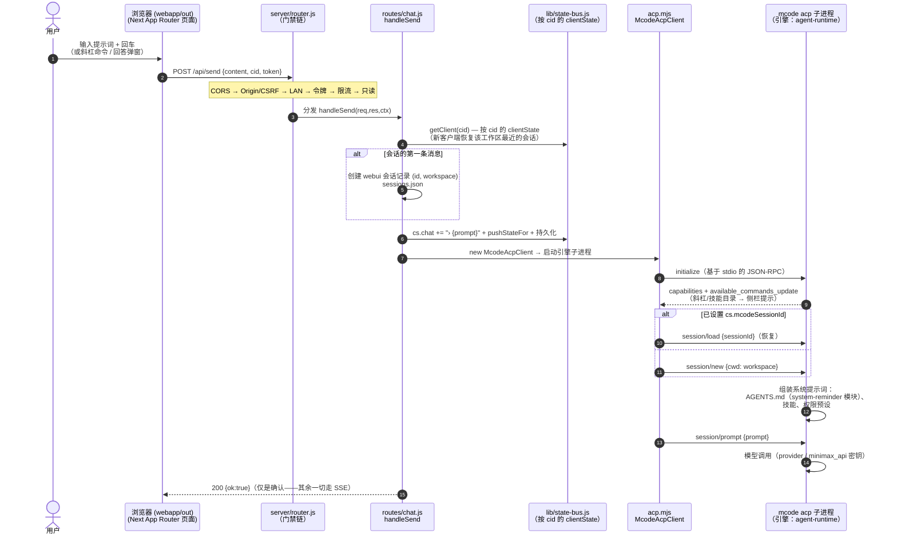
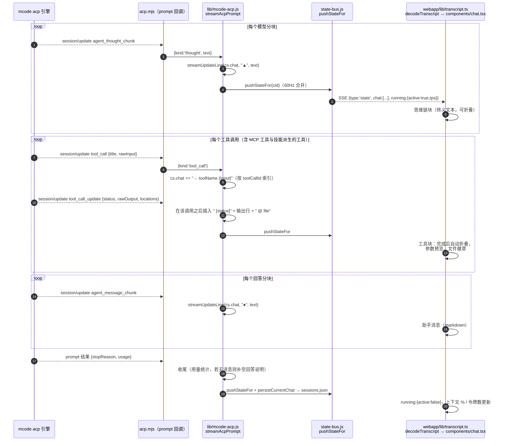
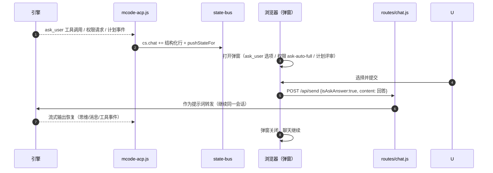
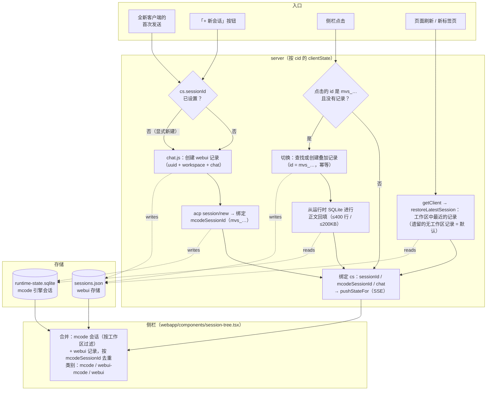

# 架构

> 简体中文 | [English](ARCHITECTURE.md)

> 本文档是 [README.md](../README.md) 的配套文档，面向需要
> 修改 webui 或与其集成的人员。它描述了运行时
> 拓扑、模块边界、请求生命周期以及 SSE
> 载荷契约。

## 1. 高层拓扑

```
                              ┌─────────────────────────────────────────────┐
                              │  Browser (webapp/out，Next 静态导出)         │
                              │   • index.html + App Router 页面            │
                              │   • _next/static/*（内容哈希）             │
                              │   • webapp/public/auth-gate.html（LAN 门禁）│
                              └─────────────────────────────────────────────┘
                                  │ ▲                          │ ▲
                  fetch / JSON   │ │  EventSource / SSE        │ │
                                  ▼ │                          ▼ │
   ┌──────────────────────────────────────────────────────────────────────┐
   │  server.js（源码模式）——注册 @mavis/* → 工作区 TS 的解析器        │
   │  server/bootstrap.js ——真正的启动（由 server.js 委派进来）         │
   │  dist/webui/server.js ——bootstrap.js 的 esbuild bundle（发布版本） │
   │   • installGlobalErrorHandlers()                                     │
   │   • preflight: mcode binary exists, upload dir writable, etc.       │
   │   • http.createServer(handleRequest)                                 │
   │   • http.createServer(handleRequest)                                 │
   └──────────────────────────────────────────────────────────────────────┘
                                  │
                                  ▼
   ┌──────────────────────────────────────────────────────────────────────┐
   │  server/router.js — declarative route table                          │
   │                                                                      │
   │  门禁链（Gates 1→5）位于 server/lib/gates.js#runGates，             │
   │  router.js 委派给它；两个 HTTP 层共用同一条链：                        │
   │  LAN guard: !isLocalRequest(req) && !getLanBroadcast() → 403         │
   │                                                                      │
   │  ┌─ static  ┐ ┌─ /api/health  ┐  ┌─ /api/state  ┐ ┌─ /api/sessions ┐ │
   │  │ index   │ │ health.js     │  │ state.js     │ │ sessions.js    │ │
   │  │ .html   │ └───────────────┘  │ + /api/events│ │ + acp-         │ │
   │  │ .css/js │                    │   (SSE)      │ │   sessions/*   │ │
   │  │ .png    │                    └──────────────┘ └────────────────┘ │
   │  └─────────┘                                                       │
   │  ┌─ /api/send    ┐ ┌─ /api/usage  ┐ ┌─ /api/workspace  ┐             │
   │  │ chat.js      │ │ usage.js     │ │ workspace.js      │             │
   │  │ + /stop /cmd │ │ + -real      │ │ + /workspace/    │             │
   │  │              │ │ + /refresh   │ │   browse          │             │
   │  └──────────────┘ └──────────────┘ └──────────────────┘             │
   │  ┌─ /api/upload ┐ ┌─ /api/settings  ┐ ┌─ /api/models    ┐            │
   │  │ upload.js    │ │ settings.js     │ │ model.js         │            │
   │  └──────────────┘ └─────────────────┘ │ + /set-model     │            │
   │                                        │ + /permissions   │            │
   │                                        │ + /answer        │            │
   │                                        └──────────────────┘            │
   │  ┌─ /api/protocol/*  ┐ ┌─ /api/debug/*  ┐                            │
   │  │ protocol.js       │ │ debug.js       │                            │
   │  │ /set-mode         │ │ /inject (gated)│                            │
   │  │ /set-config-option│ │ /state         │                            │
   │  │ /cancel           │ └────────────────┘                            │
   │  │ /load-session …   │                                              │
   │  │ /capabilities     │                                              │
   │  └───────────────────┘                                              │
   └──────────────────────────────────────────────────────────────────────┘
                                  │
                                  ▼
   ┌──────────────────────────────────────────────────────────────────────┐
   │  server/lib/ — pure modules (one concern each)                      │
   │                                                                      │
   │  config · layout · lan · models · sqlite-resolver ·                │
   │  mcode-session-delete · sessions · state-bus · acp-client         │
   │  mcode-rpc · mcode-acp · mcode-exec · chat-line · context-percent  │
   │  mavis-usage · usage · settings · upload · workspace · slash ·     │
   │  static · gates · auth · alerts · trajectory                       │
   └──────────────────────────────────────────────────────────────────────┘
                                  │                          ▲
                                  ▼                          │  JSON-RPC over stdio
   ┌──────────────────────────────────────┐   ┌─────────────────────────────┐
   │  mcode exec subprocess                │   │  mcode acp subprocess        │
   │  (legacy single-turn, fallback)      │   │  (default multi-turn)        │
   │  stdio: line-delimited stream-json    │   │  stdio: newline-delimited    │
   │                                      │   │  JSON-RPC 2.0                │
   └──────────────────────────────────────┘   └─────────────────────────────┘
```

## 2. 请求生命周期

用户点击 **发送**。随后发生的事件：

```
browser           server/router.js           server/lib/*                mcode
   │ POST /api/send {content,…}    │                              │
   │ ──────────────────────────────►│                              │
   │                                │ chat.js: validate,           │
   │                                │   cs = getClient(cid)         │
   │                                │   cid → state-bus             │
   │                                │ ─────────────────►           │
   │                                │                              │ mcode-acp.js / mcode-exec.js
   │                                │                              │ ─── spawn / pipe stdin ───►
   │                                │                              │
   │                                │ state-bus: pushStateFor(cid) │
   │   ◄──────────── SSE event ────│   {type:'state', running:…}  │
   │   {type:'chat', lines:[…]}    │                              │
   │   ◄──────────── SSE event ────│   ◄── line  ◄─── stdout  ────│
   │   {type:'delta', text:'…'}    │                              │
   │   …                            │                              │
   │   ◄──────────── SSE event ────│   ◄── exec.result  ──────────│
   │   {type:'exec', status:'ok'}   │                              │
   │   ◄──────────── SSE event ────│                              │
   │   {type:'state', running:false}│                              │
   │   …                            │                              │
   │ connection closes / kept open   │                              │
```

关键不变量：

- **每个活动的 webui 标签页对应一个 `mcode` 子进程**（以 `cid` =
  客户端 id 为键，即存储在 `localStorage.webui_cid` 中的 UUID）。
  新标签页会获得一个新子进程；关闭标签页会杀死其子进程。状态是按
  cid 划分的，而不是按连接划分的。
- **SSE 通道是客户端状态更新的唯一来源**。
  REST 端点会改变服务器状态，但不会推送给客户端。
  客户端将 SSE 视为事实来源。
- **`pushStateFor(cid, opts)` 是服务器上唯一会修改
  按 cid 划分的状态的函数。** 其他一切都是只读的。这就是
  `state-bus.js` 有如此体量的原因——它是唯一的收口点（chokepoint）。

## 2.1 会话时序——提示词 → 流式输出 → 渲染

一个用户回合如何端到端地流转，以及每个引擎界面
（AGENTS.md、思维链、工具调用、MCP 工具、技能）在何处被调用
和渲染。名称均为真实代码符号。


```mermaid
sequenceDiagram
    autonumber
    actor U as 用户
    participant B as 浏览器 (webapp/out)<br/>(Next App Router 页面)
    participant R as server/router.js<br/>（门禁链）
    participant C as routes/chat.js<br/>handleSend
    participant S as lib/state-bus.js<br/>（按 cid 的 clientState）
    participant A as acp.mjs<br/>McodeAcpClient
    participant E as mcode acp 子进程<br/>（引擎：agent-runtime）

    U->>B: 输入提示词 + 回车<br/>（或斜杠命令 / 回答弹窗）
    B->>R: POST /api/send {content, cid, token}
    Note over R: CORS → Origin/CSRF → LAN → 令牌 → 限流 → 只读
    R->>C: 分发 handleSend(req,res,ctx)
    C->>S: getClient(cid) — 按 cid 的 clientState<br/>（新客户端恢复该工作区最近的会话）
    alt 会话的第一条消息
        C->>C: 创建 webui 会话记录 (id, workspace)<br/>sessions.json
    end
    C->>S: cs.chat += "› {prompt}" + pushStateFor + 持久化
    C->>A: new McodeAcpClient → 启动引擎子进程
    A->>E: initialize（基于 stdio 的 JSON-RPC）
    E-->>A: capabilities + available_commands_update<br/>（斜杠/技能目录 → 侧栏提示）
    alt 已设置 cs.mcodeSessionId
        A->>E: session/load {sessionId}（恢复）
    else
        A->>E: session/new {cwd: workspace}
    end
    E->>E: 组装系统提示词：<br/>AGENTS.md（system-reminder 模块）、<br/>技能、权限预设
    A->>E: session/prompt {prompt}
    E->>E: 模型调用（provider / minimax_api 密钥）
    C-->>B: 200 {ok:true}（仅是确认——其余一切走 SSE）
```

随后的流式输出——每个引擎事件都变成一行聊天内容，每次
聊天变更都变成一个 SSE 状态快照：


```mermaid
sequenceDiagram
    autonumber
    participant E as mcode acp 引擎
    participant A as acp.mjs（prompt 回调）
    participant M as lib/mcode-acp.js<br/>streamAcpPrompt
    participant S as state-bus.js<br/>pushStateFor
    participant B as webapp/lib/transcript.ts<br/>decodeTranscript → components/chat.tsx

    loop 每个模型分块
        E-->>A: session/update agent_thought_chunk
        A->>M: {kind:'thought', text}
        M->>M: streamUpdateLine(cs.chat, "▲", text)
        M->>S: pushStateFor(cid)（60Hz 合并）
        S-->>B: SSE {type:'state', chat:[...], running:{active:true,tps}}
        B->>B: 思维链块（转义文本，可折叠）
    end
    loop 每个工具调用（含 MCP 工具与技能派生的工具）
        E-->>A: session/update tool_call {title, rawInput}
        A->>M: {kind:'tool_call'}
        M->>M: cs.chat += "→ toolName  {input}"（按 toolCallId 索引）
        E-->>A: session/update tool_call_update {status, rawOutput, locations}
        M->>M: 在该调用之后插入 "  [status]" + 输出行 + "  @ file"
        M->>S: pushStateFor
        B->>B: 工具块：完成后自动折叠，<br/>参数预览，文件徽章
    end
    loop 每个回答分块
        E-->>A: session/update agent_message_chunk
        M->>M: streamUpdateLine(cs.chat, "●", text)
        B->>B: 助手消息（markdown）
    end
    E-->>A: prompt 结果 {stopReason, usage}
    M->>M: 收尾（用量统计，若无消息则补空回答说明）
    M->>S: pushStateFor + persistCurrentChat → sessions.json
    B->>B: running:{active:false}，上下文 % / 令牌数更新
```

交互界面与引擎侧模块——谁拥有什么：

| 界面 | 引擎侧 (mcode) | 传输线上 | Web UI 渲染 |
|---|---|---|---|
| **AGENTS.md** | `agent-modules/system-reminder` 在会话开始时将其注入系统提示词（项目指令、项目记忆） | 在聊天中不可见；在轨迹工作室（`/trajectory/`，会话事件）中可见 | 无特殊处理——它塑造模型行为 |
| **思维链（Thinking）** | 模型发出 `agent_thought_chunk` | `kind:'thought'` → `▲` 行 | 可折叠的思维链块（转义文本） |
| **内置工具**（Bash/Read/Write/Edit/…） | agent-runtime 按权限预设执行 | `tool_call` / `tool_call_update` → `→ name` + 缩进的输出行 | 工具块，自动折叠，文件徽章 |
| **工具调用 ID 标记** `##tc:<toolCallId>` | `mcode-acp.js#applyToolUpdate` 在每个 `→ name` 标题行紧之前写入 | 一行聊天记录 `##tc:<id>`，由 `decodeTranscript` 消费 | 把 `toolCallId` 挂到工具块上，`ToolCard` 据此按 id（而非工具名）匹配 `recentSubagents[]`；不进聊天正文 |
| **处理时长标记** `§§ processed_duration=Nms` | 提示词 finalize（`mcode-{acp,exec}.js#finalize`） | 一行聊天记录 `§§ processed_duration=Nms`，由 `decodeTranscript` 消费 | 把 `processedDuration` 挂到助手回合上，用于 `turn_process_disclosure` 折叠条；不进聊天正文 |
| **MCP 工具** | 引擎启动已配置的 MCP 服务器（`mcp.json`）；调用以 `mcp__server__tool` 形式出现 | 与 tool_call 相同的传输线 | 同样的工具块（server·tool 命名） |
| **技能（Skills）** | `/skill` 或提示词触发 `agent-modules/skills` → 作为 system-reminder 内容注入 | 斜杠目录来自 `available_commands_update`；调用 = 普通提示词回合 | 斜杠提示 UI；技能输出 = 普通的思维/消息/工具流 |
| **ask_user 工具** | 引擎发出 `ask_user` 工具调用 | 聊天行 `→ ask_user {json}` | 带选项/多选/其他的弹窗；回答 → `POST /api/send {isAskAnswer:true}` |
| **权限提示** | 引擎为某个工具调用请求批准 | 权限事件 → 弹窗（ask/auto/full） | 回答经发送路径转发 |
| **计划模式（Plan mode）** | 以 `Plan:` 为前缀的提示词 → 结构化计划事件 | 计划评审弹窗 | 同意 / 跳过 / 补充上下文 → 转发 |
| **轨迹工作室** | 读取运行时 SQLite 投影（只读） | `/trajectory/api/*`（自带后端，`server/trajectory/http.mjs`） | `/trajectory/` 面板（回合、令牌、压缩、子代理） |

交互式提示（ask_user / 权限 / 计划）的往返流程：


```mermaid
sequenceDiagram
    autonumber
    participant E as 引擎
    participant M as mcode-acp.js
    participant S as state-bus
    participant B as 浏览器（弹窗）
    participant C as routes/chat.js

    E-->>M: ask_user 工具调用 / 权限请求 / 计划事件
    M->>S: cs.chat += 结构化行 + pushStateFor
    B->>B: 打开弹窗（ask_user 选项 / 权限 ask-auto-full / 计划评审）
    U->>B: 选择并提交
    B->>C: POST /api/send {isAskAnswer:true, content: 回答}
    C->>E: 作为提示词转发（继续同一会话）
    E-->>M: 流式输出恢复（思维/消息/工具事件）
    B->>B: 弹窗关闭，聊天继续
```

## 2.2 会话管理流程

**一次对话 = 一个身份**：mcode 会话（`mvs_…`）即会话本身。**webui 存储**
（`sessions.json`）是按 `mcodeSessionId` 键控的*叠加层*——承载 `title`、
`workspace` 与 `chat[]` 快照（用于快速加载），绝不制造第二身份。新的
叠加记录 `id === mcodeSessionId`；草稿（还没发过消息的 "+" 会话）保留
uuid，首轮回合后由 `promoteDraftToMcodeSid` 晋升。旧的 uuid 壳记录依然
可解析（所有查找先按 `mcodeSessionId` 命中）。**mcode 运行时存储**
（`~/.minimax/v2/sqlite/runtime-state.sqlite`）是权威会话列表；webui
读取它用于侧栏与正文回填。


```mermaid
flowchart TD
    subgraph ENTRY["入口"]
        A1["全新客户端的<br/>首次发送"]
        A2["「+ 新会话」按钮"]
        A3["侧栏点击"]
        A4["页面刷新 / 新标签页"]
    end

    subgraph SERVER["server（按 cid 的 clientState）"]
        B{"cs.sessionId<br/>已设置？"}
        C["chat.js：创建 webui 记录<br/>（uuid + workspace + chat）"]
        D["acp session/new → 绑定 mcodeSessionId（mvs_…）"]
        E["getClient → restoreLatestSession：<br/>工作区中最近的记录<br/>（遗留的无工作区记录 = 默认）"]
        F{"点击的 id 是 mvs_…<br/>且没有记录？"}
        G["切换：查找或创建叠加记录<br/>（id = mvs_…，幂等）"]
        H["从运行时 SQLite 进行<br/>正文回填（≤400 行 / ≤200KB）"]
        I["绑定 cs：sessionId / mcodeSessionId / chat<br/>→ pushStateFor（SSE）"]
    end

    subgraph STORES["存储"]
        J[("sessions.json<br/>webui 存储")]
        K[("runtime-state.sqlite<br/>mcode 引擎会话")]
    end

    subgraph SIDEBAR["侧栏（webapp/components/session-tree.tsx）"]
        L["合并：mcode 会话（按工作区过滤）<br/>+ webui 记录，按 mcodeSessionId 去重<br/>类别：mcode / webui-mcode / webui"]
    end

    A1 --> B
    B -- "否" --> C --> D --> I
    A2 --> B
    B -- "否（显式新建）" --> C
    A3 --> F
    F -- "否" --> I
    F -- "是" --> G --> H --> I
    A4 --> E --> I
    C -.writes.-> J
    D -.writes.-> K
    E -.reads.-> J
    G -.writes.-> J
    H -.reads.-> K
    J --> L
    K --> L
    I --> L
```

生命周期说明：

- **删除**（`DELETE /api/sessions/:id`）会移除 webui 记录，并
  从运行时 SQLite 中交叉删除关联的 `mvs_…` 行
  （`deleteMcodeSessionFromDb`，用 `?dryRun=true` 预览）。删除
  mcode 记录会在一个事务中把它从两个列表里都移除。
- **启动清理**会剔除那些为空、且仍是默认标题、
  且超过 24 小时的记录——即点了「+」却从未输入的残留。
- **搜索**（`GET /api/sessions/search`）跨工作区对标题做
  模糊匹配；匹配结果以 `[ws-short]` 前缀渲染，切入它们
  走的是上面同一条切换路径。
- **同一会话，一条记录**：全新客户端会恢复最近的
  会话而不是分叉（§2.2 修复历史），继续聊天
  会复用已绑定的 `mcodeSessionId`——不会为每条消息
  新建引擎会话。
- **单一身份（v2.4）**：切换到 `mvs_…` 会话只会解析到**同一条**叠加
  记录——`ensureOverlayForMcodeSid` 首次接触时以 `id === mvs_…` 创建，
  此后每次切换复用它。首轮发送把草稿晋升为同一引擎身份（已有叠加记
  录时并入）。因此一次对话绝不可能以两条记录出现。


## 3. 模块契约

每个 `server/lib/*.js` 文件导出一小组命名函数。没有
文件会伸手进另一个文件的内部。值得注意的契约：

### `config.js`
- 导出近似冻结的常量：`PACKAGE_ROOT`（`WEBUI_ROOT` 的别名）、
  `WEBUI_DATA_DIR`、`MCODE_CMD`、`PORT`、`PORT_PINNED`、`HOST`、
  `TOKEN`、`TOKEN_STDOUT`、`DEFAULT_MODEL`、`DEFAULT_TIMEOUT`、
  `DEFAULT_MAX_STEPS`、`MAX_CONCURRENT`、`UPLOAD_DIR`、`SESSIONS_DB`、
  `MCODE_RUNTIME_DB`、`MAVIS_DATA_DIR`、`MAVIS_DB_PATH`、`SQLITE3_BIN`、
  `DEFAULT_WORKSPACE`、`PROMPT_IDLE_TIMEOUT_MS`、`RATE_LIMIT_PER_MIN`、
  `RATE_LIMIT_BURST`、`MCODE_WEBUI_UPLOAD_DIR`、`MCODE_WEBUI_SETTINGS_PATH`、
  `MCODE_BETTER_SQLITE3`、`DEBUG_INJECT`。
- 导出函数：`getServingPort`、`setServingPort`、`resolveBindHost`、
  `getPlatformFallbackPaths`、`detectSqlite3Bin`、`detectTuiCwd`
  （再导出）、`installGlobalErrorHandlers`。
- 在模块加载时恰好读取一次 `process.env.*`。不做按请求的
  重新读取（端口回退是例外——`setServingPort` 在启动后更新实时端口）。
- 数据目录优先级：`MINIMAX_DATA_DIR` > `MAVIS_DATA_DIR` > `~/.minimax`
  （同一个解析器同时给 `MAVIS_DB_PATH` 用，保证运行时 SQLite 路径
  与工作区其他部分一致）。
- `installGlobalErrorHandlers()` 将未捕获的异常写入
  `WEBUI_DATA_DIR/.server.err`，使其在进程重启后仍然保留。

### `state-bus.js`
收口点。导出：

| 函数 | 用途 |
|---|---|
| `getClient(cid)` | 返回按 cid 的 `clientState` 对象，由 `makeClientState()` 创建、首次调用时经 `restoreLatestSession()` 恢复。该对象**本身就是**状态——不存在 `clientState.state` 这层包装。按 cid 的旁表位于它之外而非其中：`sseByCid`（每个 cid 的 SSE 响应）与 `activeChildByCid`（每个 cid 的子进程）。 |
| `pushStateFor(cid, opts)` | 从 `clientState` 组装规范化的 `state` 对象，除非 `opts.silent`，否则向 SSE 通道广播。 |
| `pushOnlineCount(lanBroadcast)` | 统计 `sseByCid.size` 并广播给所有客户端。在连接/断开时调用。 |
| `SSE_HEADERS` | 标准头：`Content-Type: text/event-stream`、`Cache-Control: no-cache`、`Connection: keep-alive`、`X-Accel-Buffering: no`。 |

`state` 载荷在下文 § 4 中说明。`clientState` 对象是代码库其余部分
**唯一**读取的东西。

### `acp.mjs` 与 `acp-client.js`
两个不同的文件，需要 grep 符号时务必分清：

- `acp.mjs`（位于包根 `packages/webui/acp.mjs`）是零依赖的、基于
  stdio 的 JSON-RPC 传输层。它**定义** `class McodeAcpClient`——
  `start()`、`request(method, params)`、`notify(method, params)`、
  `stop()`、`events` EventEmitter——并应答引擎发往客户端的每一个请求。
- `server/lib/acp-client.js` 是包裹该传输层的 webui 侧缓存与生命周期
  管理器。它从 `acp.mjs` **导入** `McodeAcpClient`，既不定义也不再导出它。
  它自己的导出是：`getMcodeAcpClient()`——进程级单例，其初始化由模块级
  `_mcodeAcpInitPromise` 去重，因此并发调用者共享同一个子进程——以及
  `getCatalogueHost()`、`listAllMcodeSessions()`、
  `getMcodeSessionsForWorkspace()`、`getMcodeSessionTitle()`、
  `invalidateMcodeSessionsCache()`、`shutdownMcodeAcpSingleton()`、
  `getMcodeServerInfo()`、`WEBUI_LOCAL_COMMANDS`、`ensureMcodeCommands()`。
- 缓存：`mcodeSessionsCache` 与 `getCachedMcodeCommands()` 同为
  `acp-client.js` 的模块级状态。`state-bus.js` 只是**导入**
  `getCachedMcodeCommands()` 来组装快照。两者都避免了
  对 `session/list` 与 `session/commands` 的重复 JSON-RPC 往返。

### `mcode-rpc.js`
acp 侧的封装。每一个公共函数（`setMode`、`setConfigOption`、
`cancelSession`、`loadSession`、`activateSession`、`listSessions`、
`getAccountStatus` …）都通过 `clientForCid(cid, requireLive)`
来派发：

  - 如果传入了 `cid`，则优先选用该 cid 注册的活动子进程
    （即每次提示词对应的 `McodeAcpClient`）——那个子进程的
    `sessions` 表持有当前在飞的会话；
  - `requireLive: true`（`cancelSession` / `setConfigOption` 使用）
    在没有活动子进程注册时返回 `null`，**不会**回退到单例，
    因为静默回退会掩盖前面几个 PR 重新引入的派发 bug；
  - 其余调用回退到单例，这能让 commands 探测与会话列
    表路径在没有 cid 时也正常工作。

webui 对自己宣告的能力表：

```js
export const MCODE_ACP_CAPABILITIES = {
  set_mode: true,
  set_config_option: true,
  cancel: true,
  activate: true,
  fork: true,
  resume: true,
  // session/delete 在引擎侧注册了，但不存在处理器——这正是
  // 删除需要通过 SQL 走 local_runtime_* 表的原因
  //（见 sqlite-resolver.js）。
  delete: false,
  load: true,
  close: true,
  list: true,
  new: true,
  prompt: true,
}
```

当引擎以 `-32601 Method not found`（或 jsonrpc 信封中的
等价错误）应答时，`callRpc(method, params)` 返回
`{ok:false, code:'unsupported', error:'…'}`。由调用者决定
如何处理——通常是客户端弹一个 toast。

### `mcode-acp.js` 与 `mcode-exec.js`
两种传输，共享同一形状。一个回合用哪种传输在引擎启动前就已决定，判定散落两处：`routes/chat.js#handleSend` 在服务端环境变量 `MCODE_USE_ACP=0` 时强制走 `mcode exec`（ACP 协议回归时的逃生阀）；`runMcodeAcp` 自身在会话权限模式不是 `Full access` 时改道 `runMcodeExec`（`runMcodeAcp` 的首个分支）。不存在 `/exec` 命令，也没有按请求的显式选择；`mcode-rpc.js` 不做传输选择——它只与当前已注册的子进程通信。

两者各自暴露一个入口，名字随传输方式而定：
- `mcode-acp.js` → `runMcodeAcp(content, opts)` → `AsyncGenerator<NormalizedEvent>`
- `mcode-exec.js` → `runMcodeExec(content, opts)` → `AsyncGenerator<NormalizedEvent>`

> **已移除的符号。** 本节早期版本记载过一个由两种传输共同导出的三件套——
> `runMcode(content, opts)`、`stopExec()` 与 `isRunning()`。三者如今都不存在。
> 单一入口已按传输方式拆分；停止与状态这两个问题改由别处回答：取消走
> `mcode-rpc.js#cancelSession`，运行状态读取按 cid 的 `clientState` 上的
> `running` 字段。这里没有可追踪的改名——它们是被删掉了，不是搬走了。

`NormalizedEvent` 是一个带标签的联合类型（`{type, …}`），包含这些类型：
`state`、`chat`、`delta`、`tool`、`permission`、`plan`、`ask`、
`exec`、`usage`。见 § 5。

### `agent-team-status.js`

Agent Team 面板的 DB → UI 状态投影。运行时库的列词表**不是**界面渲染的
词表——存储值 ≠ 展示值：

| 来源列 | 存储值 | 说明 |
| --- | --- | --- |
| `local_runtime_sessions.status` | `idle \| interrupted \| aborted \| error` | 窄；会话跑回合时引擎不改这列，一直是 `idle` |
| `local_runtime_background_tasks.status`（`kind=subagent`） | `running \| succeeded \| failed \| canceled` | 子代理的真实运行态 |

界面渲染的是 `AGENT_TEAM_STATUS` = `idle \| queued \| running \| waiting \|
done \| stopped \| failed`。本模块是**唯一**决定这个映射的地方
（`projectSessionStatus`、`projectTaskStatus`、`projectAgentStatus`），
db 原始值从不上线。`projectAgentStatus` 合成两列——任务列的 `running`
优先（光看会话列永远报不出"运行中"），任务已终态则以任务投影为准，
否则用会话投影。TUI 那套更细的词表（`failed \| waiting \| running \|
queued \| done \| stopped`）是投影层产物、不是存储值；webui 不导入它，
但采用同样的形状。未识别的未来状态渲染为 `idle`，绝不误报"运行中"。

### `engine/`（能力声明 + local-runtime-v2 host）

引擎抽象层位于 `server/engine/`（engine-abstraction 批次 B1；迁移
状态 M1，外加 M3 的 B0 与 B1 两批）。八个文件，各管一件事：

| 文件 | 职责 |
| --- | --- |
| `engine/capabilities.js` | 契约本体：`ENGINE_CAPABILITY_KEYS`（14 个矩阵键）、`validateEngineCapabilities`、`assertEngineCapability`、`summarizeUnavailableCapabilities` |
| `engine/errors.js` | `EngineCapabilityNotSupportedError` 与 `engineCapabilityHttpResponse`（501 载荷形状） |
| `engine/host.js` | `getEngineCatalogueHost`——通往那唯一 catalogue host 的惰性桥。对 host 模块零静态 import：函数体里是 `lib/acp-client.js` 的动态 `import()`，所以门面付出的是一个函数，不是一次模块加载 |
| `engine/index.js` | 门面：`getEngineProvider`、`listEngineProviderIds`、`getEngineCatalogueHost`（按 provider id 的注册表；按 `MCODE_WEBUI_TRANSPORT` 选传输在迁移步 M4 引入） |
| `engine/providers/local-runtime-v2.capabilities.js` | `LOCAL_RUNTIME_V2_CAPABILITIES`——**只有声明，且这个拆分是有承重意义的**：它唯一的 import 是 `../capabilities.js`，所以 `/api/engine-capabilities` 读能力表时**不会把 v2 host 的 TypeScript 依赖树（首次编译约 4.7 秒）拖进 boot 路径**。那棵依赖树仍留在 `acp-client.js` 早已注明的 lazy 边界之后 |
| `engine/providers/local-runtime-v2.js` | `createCatalogueHost`（自 `runtime-host.js` 原样移入，后者转发导出）+ 转发导出上面的声明，消费方的 import 形状因此不变。它是重的那一个——`@mavis/local-runtime-v2`、`@mavis/config`、`@minimax/code/runtime-adapter`——`app.js` 能触达的文件里绝不许 import 它 |
| `engine/providers/tui-runtime-adapter.js` | `TUI_RUNTIME_ADAPTER_CAPABILITIES`（仅声明——adapter 本体在 v2 host 内构造） |
| `engine/session-reads.js` | 目录读族的面板调用（`readEngineSessionList`、`readEngineSessionListForWorkspace`、`readEngineSessionTitle`、`readEngineVersion`）与端点→能力对照表 `SESSION_READ_ENDPOINTS`（迁移步 M3 批次 B1） |

路由从门面取 host，不从 `lib/acp-client.js` 取：`routes/plugins.js` 与
`routes/turn-diff.js` 调 `getEngineCatalogueHost()`。两者都保留 `deps`
注入的数据源（`deps.getCliService`、`deps.getDiffApplication`），
handler 层测试因此保持封闭。

声明纪律（未来任何 provider 的准入规则，由
`test/lib/engine/capabilities.test.js` 的快照测试强制）：

1. 14 键全声明——不存在「缺键当作 none」。`partial` 必须枚举 `missing`
   子项并附 `reason`；`none` 必须附 `reason`，并区分「接口无」与
   「实现无」。
2. 声明是静态模块常量——第一真源，走代码评审。不经重新审计就翻转档位，
   CI 直接红（测试钉住每个 provider 的每个键）。
3. 调用未声明的能力抛 `EngineCapabilityNotSupportedError`；两个 HTTP 层
   （`server/app.js#invokeHandler`、`server/router.js`）统一映射为
   `501 engine_capability_not_supported`。**禁止空实现**——缺能力必须在
   调用前可读、调用后响亮（#110 假成功纪律）。
4. 每 provider 进程内单 host：`createCatalogueHost` 仍是运行时实例的
   唯一所有者，触达它的唯一入口是门面的 `getEngineCatalogueHost()`
   （转发到 `acp-client.js#getCatalogueHost`，其「绝不建第二个 host」
   规则不变）；`close()` 保持有界。同一 dataDir 上两个 `CliService`
   实例是对 plugin / local-disable 表的脑裂，不是冗余。
5. 驱动 UI 的是档位，不是 provider 名单：前端读
   `GET /api/engine-capabilities`
   （`routes/engine-capabilities.js#handleEngineCapabilities`），
   按 `full` / `partial`（+missing）/ `none` 三档渲染——UI 代码里不出现
   硬编码的 provider 名单。

### 声明与实现的快照校验（M2）

声明有多诚实，取决于背后的校验有多硬。
`test/lib/engine/capability-snapshot.test.js#auditProviderCapabilities`
对两个已注册 provider 的每个 `full`/`partial` 键做审计，对象是**真实**
的 catalogue host——每次运行在隔离的临时数据目录上起一个
（`MINIMAX_DATA_DIR` 与全部 `MCODE_WEBUI_*` 路径在 provider import
**之前**钉死；只设 `MCODE_WEBUI_DATA_DIR` 不够，引擎目录会回落到
`~/.minimax` 改写用户真实配置）：

- `full`——该键跟踪的方法必须在声明的 surface 成员上
  （`adapter`、`cliService` 或 `applications.session.diff`）全部为函数；
- `partial`——存在的部分必须在；方法名形态的 `missing` 项必须真的
  不存在；某缺席方法从 `missing` 里被拿掉会红（声明不完整）；kebab-case
  子能力名（`file-write`、`git-diff` 等）在 surface 上出现覆盖方法的那一刻
  变红——将来引擎长出 `getWorkspaceGitDiff`，`git-diff` 这条就必须重新审计；
- `none`——刻意不做方法校验；provider 允许对该能力完全不设接口面。

方法跟踪表（同文件内的 `REQUIRED_METHODS`）取自真实 surface 本身
（原型链反射：adapter 91 个方法、CliService 94 个、session.diff 门面），
不是从设计矩阵抄的。审计是对（声明, 方法集）的纯函数，同文件的变异测试
钉住每类漂移——改档位、删方法、子能力长出方法——各自必然变红。另有
注册表驱动的静态守卫扫过每个**已注册** provider
（`engine/index.js#listEngineProviderIds`）的 14 键集合，拼错或多写的键
无法静默通过；M4 注册 acp/exec provider 时无需改测试即被覆盖。

运行时探测（环境不符时把声明档位降级）本批刻意未做——理由见
`engine/index.js` 头注释。

启动路径纪律：`app.js` 会触达 `engine/index.js`，因此该文件及其全部
静态依赖必须不含 `@mavis/*`、`@minimax/*` 与任何 host 模块。M1 是交过
学费才换来这条（server 启动 209ms → 2700ms；声明与构造拆成两个文件后，
门面自身加载 4685ms → 5ms）。`test/lib/engine/host-facade.test.js`
对着真实模块图强制它，而不是对着源码文本。
`engine/session-reads.js` 服从同一条纪律：它的静态 import 只有
`engine/capabilities.js` 与 `engine/index.js`，`lib/acp-client.js` + `lib/config.js`
都在函数体内用 `await import()` 触达。

#### 哪些端点走门面读（迁移步 M3 批次 B1）

`engine/session-reads.js` 覆盖 5 个目录读端点。每一行写明它门控的
能力键与它依赖的 provider 方法，因此一份恰好缺该方法的 `partial`
声明会 501 并点名是哪个方法：

| 端点 | 能力 · 子项 | 取值来源 |
| --- | --- | --- |
| `GET /api/acp-sessions` | `sessionCrud` · `listSessions` | `acp-client.js#getMcodeSessionsForWorkspace`（30s 缓存 + cwd 归一化） |
| `GET /api/acp-session-title` | `sessionCrud` · `getSession` | `acp-client.js#getMcodeSessionTitle` |
| `GET /api/protocol/list-sessions` | `sessionCrud` · `listSessions` | `acp-client.js#listAllMcodeSessions`；cwd 过滤仍留在路由里 |
| `GET /api/state` | `sessionCrud` · `listSessions` | 只作用于 `mcodeSessions` 镜像——`snapshotViewFields` / `mcodeSessionsSnapshotFields` 一字未动 |
| `GET /api/health` | 14 键中无对应键 | ACP `initialize` 的 `agentInfo.version` 镜像；catalogue host 没有版本访问器，面板如实报告来源而不是凭空造一个方法 |

本层守住三条性质，每条背后都有测试：

1. **只有一个 normalizer。** runtime 路径由
   `lib/catalogue-sessions.js#projectTuiSessionToAcp` 投影，逐条镜像
   ACP adapter 的 `toAcpSessionInfo` 规则——`title` 与 `updatedAt`
   缺失时**省略该键**，绝不输出 `null`。面板原样转发这份投影，不做
   二次投影。
2. **字节来自哪里是报告出来的，不是假设的。** 每次读都回答一个
   `source`：`catalogue` / `acp` / `acp-fallback`（传输要了 catalogue
   host 但拿到 `null`）。它是元数据，不上线——端点载荷在接面板前后
   逐字节相同。
3. **门控是真的。** 已注册的 provider 声明 `sessionCrud` 为 `full`，
   所以今天没有任何端点会 501；测试用一份缺 `listSessions` 的样本声明
   驱动出 501 载荷。没人跑过的门控与没有门控无法区分。

传输→provider 表目前只有 `runtime` 一条。默认 `acp` 传输下尚无已注册
provider，于是门控报告 `unregistered-transport` 并放行——M4 注册 ACP
provider 后该表补上对应行。放行不等于声称支持，二者刻意分开报告。

## 4. `clientState` 载荷

这是每个 SSE `state` 事件所包含的形状。webui 将其
1:1 镜像到 `state` JS 变量中。

```ts
{
  version: string,                 // webui version (from package.json)
  running: { active: boolean,
             sessionId?: string,    // mcode acp session id (if any)
             cid: string,           // webui tab id
             startTime?: number,    // ms epoch
             pendingPermission?: object,
             pendingPlan?: object,
             pendingAsk?: object },
  workspace: { dir: string,         // absolute path, "" if unset
               branch?: string,     // git branch (best-effort, "" on error)
               treeState?: 'clean'|'dirty'|'unknown' },
  model: { name: string,            // e.g. "minimax_api/MiniMax-M3"
           ctx: string,            // e.g. "512k"
           thinking: 'On'|'Off'|string },
  permissions: string,             // mcode-side: 'ask'|'auto'|'full'|'plan'|...
  availableCommands: Record<        // mcode 斜杠命令，按组划分
    string,                         //   例如 { mcode: [{name, description}, …] }
    Array<{ name: string,
            description?: string }>  // composer 将其摊平成 name[] 补全面板
  >,
  sessions: Array<{                // webui-side session list (merged w/ mcode)
    id: string,
    title: string,
    workspace: string,
    mcodeSessionId?: string,        // linked mcode session id
    updatedAt: number }>,
  mcodeSessions: Array<{            // mcode-side session list (raw)
    sessionId: string,
    title: string,
    cwd: string,
    updatedAt: number }>,
  mcodeSessionId?: string,         // currently-active mcode session
  context?: {                       // updated by SSE delta accumulation
    used: number,                   // tokens used (per-turn)
    percent: number,                // 0..100
    cacheRead: number,              // per-turn cache reads
    tps: number,                    // current tok/s
    source: 'mavis'|'mmx' },        // which backend provided the data
  usage?: {                         // from /api/usage
    remaining: number,              // percent
    resetAt: number,                // ms epoch
    weeklyResetAt: number,
    fetchedAt: number },
  plan?: { active: boolean, title: string, summary: string,
           options: Array<{label:string}>, totalLines: number,
           summaryLines: number },
  enterPlanMode?: { active: boolean },
  permissionChoice?: { active: boolean, current: string,
                        options: Array<{label:string}> },
  askUser?: { active: boolean, questions: Array<…> },
  goal?: { active: boolean, text: string, status: 'running'|'done'|'blocked',
           duration?: number },
  todo?: Array<{ content: string, status: 'pending'|'in_progress'|'done' }>,
  lanBroadcast: boolean,           // mirrors /api/settings
  onlineCount: number,              // from pushOnlineCount
  // 🆕 v1.0.1 — settings surface pushed over SSE state updates
  readOnly: boolean,                // read-only mode (server gate blocks remote POST/DELETE on /api/*)
  tokenEnabled: boolean,            // token auth master switch (default true)
  currentToken: string,             // 32-hex auto-generated token; "" after tokenAcknowledged=true
  tokenAcknowledged: boolean,       // operator confirmed they saved the token
  tokenRotatedAt: number            // ms-since-epoch of last rotation
}
```

webui **不会**在此对象之外持有额外状态。任何需要数据的
UI 面板都从 `state` 读取，并通过 `render()` 响应
`state` 的变化。

## 5. SSE 事件模式

两条通道、一种数据帧。`/api/events` 是按 CID 的状态流，携带 `state` 加四个
命名事件；`/api/alerts` 是全局异常流（见 §5.1）。

```
event: state
data: {"version":"1.0","running":{"active":true},"chat":["› …"],"…":…}

event: auth.token_rotated
data: <new-32-hex-token>     // raw string, NOT JSON-wrapped
```

这就是该通道的全部模式。此通道只有**一种**数据帧类型（`state`），外加服务端
带外发出的四个命名事件：`auth.token_rotated`、`token.first_run`、
`needs_authorization`、`authorization_decided`。本节早先版本列出的
`chat` / `delta` / `tool` / `permission` / `plan` / `ask` / `exec` / `usage` /
`online` 这些独立帧，本服务端**从未发出过**——那些形状是作为*字段*存在于
唯一那份 `state` 快照里的（`state.chat`、`state.plan`、`state.ask`、
`state.context`、`state.usage`、`state.onlineCount`）。客户端解析一份负载并从
其中渲染，不会按事件名分支。唯一的例外是第二条通道 `/api/alerts`，它确实
带命名事件——见 §5.1。

🆕 **v1.0.1**——用于实时令牌轮换的独立命名事件：

```
event: auth.token_rotated
data: <new-32-hex-token>     // raw string, NOT JSON-wrapped
```

当操作员在设置卡片中点击「重置 token」（或
未来任何轮换令牌的触发源）时触发。每个收到该事件的
已连接客户端会就地更新其 `localStorage`（`webui_token` 键）
和当前的 `HEADERS.Authorization` 对象——后续的
`fetch()` 调用会自动使用新令牌，无需重新加载。
事件触发时离线的客户端将在下一次请求时收到 `401`；
需要手动把新 URL 重新发给它们。

正文是**原始文本**，而非 JSON 编码——在 devtools 中
一眼就能看出这是敏感材料，而 `JSON.stringify` 不会增加
任何价值（并且在从网络日志复制粘贴时还会遮蔽令牌）。

webui 将每个事件视为幂等更新；重放同一
事件是安全的。服务器采用至多一次投递模型
（SSE 在断连时丢弃 → 不重试），客户端通过在
重连时拉取 `/api/state` 来应对。

## 6. 前端拓扑

```
packages/webui/webapp/                Next.js 14.2.35 应用（React 18 + Tailwind）
├── app/                              App Router：layout.tsx、page.tsx
├── components/                       shell、chat、composer、toolbar、panels、modals、icons
├── lib/                              transcript、sse、api、cid、store、markdown、i18n、theme、types
├── styles/tokens.css                 设计令牌（自桌面端逐字复制）
├── styles/desktop-typography.css     排版预设级联
├── styles/official-utilities.css     自上游逐字复制的工具类
├── public/                           Next 复制到导出中的静态资源
│   ├── auth-gate.html                LAN 令牌门禁（由同一静态根提供）
│   ├── favicon_v2.ico                站点图标
│   └── favicon_v2.png                站点图标
└── out/                              next export——由 server/lib/static.js 提供

packages/webui/public/trajectory/     独立轨迹工作室（自带后端、CSP、
                                    令牌策略）——public/ 下仅存的旧版子树；
                                    在任何静态查找之前挂载到 /trajectory/。
```

前端是 **Next 静态导出**，而非旧版的 vanilla-JS SPA。导出产物由
`pnpm run webui:build`（`pnpm build` 会运行它）重建，并被复制到
`dist/webui/webapp/out/`，让打包后的运行时与服务源代码 checkout 时
都从同一相对位置提供它。**只有一个静态根**：`server/lib/static.js`
只从 `NEXT_EXPORT_DIR`（Next 导出）读取——主 UI **没有** `PUBLIC_DIR`
回退。`public/trajectory/` 下的轨迹工作室由其自身处理器（独立后端、
CSP、令牌策略）挂载到 `/trajectory/`，不经过静态根。内部布局：

1. **App Router**——`app/layout.tsx`（主题引导、全局样式）、`app/page.tsx`（组合）
2. **组件**——`shell`、`chat`、`chat-virtual-list`、`composer`、`toolbar`、`panels`、`modals`、`inbox`、`session-tree`、`context-meter`、`action-error-banner`、`icons`
3. **逻辑**——`lib/transcript`、`lib/sse`、`lib/api`、`lib/cid`、`lib/store`、`lib/markdown`、`lib/i18n`、`lib/theme`、`lib/types`、`lib/action-errors`、`lib/alerts`、`lib/use-locale`、`lib/workspace-filter`
4. **样式**——`styles/tokens.css`（自桌面端逐字复制）、`styles/desktop-typography.css`、`styles/official-utilities.css`；`app/globals.css` 是 App Router 的全局样式表
5. **公共**——`public/auth-gate.html`（LAN 令牌门禁，由同一静态根提供）、`public/favicon_v2.ico`、`public/favicon_v2.png`
6. **输出**——`out/` 即 `next export`，是服务器静态处理器的唯一静态根

## 7. 运行时与构建期依赖

服务器现在是**打包产物而非副本**，也不再要求无依赖。
`scripts/build.mjs` 从 `packages/webui/server/bootstrap.js` 产出
`dist/webui/server.js`，复用了与 `cli` 打包共享的 workspace-source
esbuild 插件；发布归档里只有这一份打包产物。在源代码 checkout 中，
`packages/webui/server.js` 是一份轻量的源码模式引导：注册 `tsx`
加载器和一个把每个 `@mavis/*` 解析到 workspace TypeScript 源码的
解析器，然后委派给同一份 `server/bootstrap.js`。源码运行、测试、
以及发布后的包都以同一方式解析模块。

### 7.1 分层依赖策略

根据你接触的层次选择对应规则。

**第 1 层 — 必须复用，绝不重新实现。** workspace 包已经拥有的契约和
纯逻辑。本层条目的副本与上游之间的漂移是静默且昂贵的，所以必须通过
`@mavis/*` 的子路径直接导入：

- 数据目录与路径契约（`@mavis/shared` 路径、`~/.mcode-webui` 布局）
- 模型目录与 provider 预设
- 问卷 / 问题 schema 与对应的 ACP 方法形状
- 重试 / 脱敏 / 格式化辅助函数
- 任何在 workspace 中其他地方已经重复的契约——若两个包会因字段重命名
  而漂移，按定义就是第 1 层。

**第 2 层 — 可由本服务本地拥有。** 仅本 HTTP 服务器特有的、与进程和
平台绑定的能力，没有其他模块复用：

- MIME 表、multipart 解析
- 本服务监听器的 LAN / IP 白名单与 CORS 处理
- 端口回退策略、静态资源服务、`/api/*` 的认证中间件
- 本服务自己的设置 / token 状态、空闲看门狗、上传目录。

这些本就为 webui 形态而存在；抽出去只会多一个需要发布的包。

**第 3 层 — 不得导入。** 自带平台相关原生预构建的包（TUI 原生二进制、
sandbox-runtime）。原因不是“纯净”，而是平台可达性：在跨 Node 平台
运行的 JS 包里去依赖它们，会把这个包变成原生模块包。依赖 ACP 协议，
而不是 TUI 内部实现（`DESKTOP-ARCHITECTURE.md` §6 第 7 行已有此规则）。

### 7.2 前端规则保持不变

新增 *前端* 库沿用先前正确的规则：优先选 workspace 已依赖的库（正如
`marked` 通过 `packages/tui` 被依赖），让 lockfile、license 清单、
standalone 边界都保持原状。第 1 / 第 2 / 第 3 层只适用于服务器。

### 7.3 强制约束

“加一个依赖并导入它”现在是受支持且被检查的路径：

- `pnpm webui:typecheck` 覆盖前端 TypeScript；
  `scripts/check-webui-bundle.mjs` 检查打包产物，任何不在
  `cliExternalModules` 里的裸导入都会让检查失败。这正是当初
  `hono` 漏掉 release manifest 时应当触发的检查。
- `scripts/verify.mjs` 把这两个门禁都纳入；bundle 检查红就是
  `pnpm verify` 红。

### 7.4 旧的“无依赖”规则为何存在、为何不再适用

旧规则诞生于 webui 作为插件被打包进用户 `mcode` 安装目录的年代：
没有构建流水线，没有 lockfile，没有发布归档。那时每多一个运行时依赖
都意味着用户必须再装一次，或者让插件因缺失依赖而无法启动；最稳妥的
答案就是“无依赖”。这条推理今天已不再成立：webui 现在是 workspace
内成员、有构建步骤，服务器由 `scripts/build.mjs` 产出为
`dist/webui/server.js`，发布归档会固定每一条外部模块：
`scripts/lib/cli-release.mjs` 的 `cliExternalModules` 给出允许清单，
`scripts/package-cli-release.mjs` 的 `releaseManifest()` 负责生成清单本身。
手抄实现现在的代价比真接一个包更高，因为副本无法被构建流水线验证。

`scripts/build.mjs` 中的 “no bundling” 注释由 workstream 1 拥有，
在其打包入口落地时会移除。本文档是策略权威；任何源码注释若与 §7
相矛盾，以本文为准。

## 8. 故障模式

| 故障 | 检测 | 恢复 |
|---|---|---|
| mcode acp 子进程崩溃 | `child.on('exit')` 监听器 | 以 `running.active=false` 调用 pushStateFor；客户端显示「agent stopped」toast |
| mcode acp 返回 "Method not found" | `mcode-rpc.js` 允许列表 | 同步返回 `{ok:false, code:'unsupported'}`；路由处理器返回 501 Not Implemented；客户端显示 toast |
| SSE 连接断开 | `EventSource.onerror` | 带退避的自动重连；重连后拉取 `/api/state` 并重新同步 |
| 来自非白名单 IP 的 LAN 请求 | `server/lib/gates.js#runGates`（由 `router.js` 调用） | 403 + 友好的 HTML 页面（/api/* 则返回 JSON） |
| 服务器文件描述符耗尽 | `installGlobalErrorHandlers` 的 EMFILE 兜底 | 写入 `.server.err`；用户看到空白页；重新加载通常可修复 |
| mcode exec 编码为 GBK（Windows） | Node 在 `spawn` 中默认使用 UTF-8；无需修复 | 已在 README 中记录为面向未来 Python 移植的坑 |

## 9. 添加新端点

模式（完整演练见 `docs/DEVELOPMENT.md`）：

1. 创建 `server/routes/foo.js`，导出 `async function handleFoo(req, res, ctx, pathname)`
2. 注册到当前拥有它的那个层：
   - 绝大多数端点由 **Hono 拥有**。在 `server/app.js` 的 `OWNED_ROUTES`
     中加入 `METHOD /api/foo` 字面量，并在那里接上
     `app.post("/api/foo", …)`。`OWNED_ROUTES` 就是 Hono 所服务内容的账本。
   - 遗留的 `ROUTES` 表（`server/router.js`）仍拥有一小部分端点
     （`/api/health`、`GET /api/events`、`GET /api/alerts`、
     `POST /api/settings`）以及静态资源与 `/trajectory/` 的处理。
     只有当端点确实属于那里时，才添加 `{ method, match, handler }` 条目。
3. 如果新端点会修改状态，在处理器中调用 `pushStateFor(cid, {...})`。
   绝不要直接写入 `clientState` 对象。
4. 如果该端点由 webui 调用，在 `packages/webui/webapp/lib/api.ts` 中
   添加一个带类型的方法。它经本地的 `request()` 辅助函数发请求，该函数
   自己会追加 `cid` 查询参数；并不存在 `API_SUFFIX` 常量——本文档早期
   版本提到过，它已被移除。
5. 如果端点依赖某个引擎能力，分发前先用
   `server/engine/capabilities.js` 的 `assertEngineCapability` 门控：
   未声明的能力会自动答出结构化的 `501 engine_capability_not_supported`
   （两个 HTTP 层都做了映射）。引擎没有的能力，绝不返回空实现。

## 10. 未来方向

- **mcode `acp` 能力对齐**：引擎尚未实现的方法仍会走
  `mcode-rpc.js` 的 unsupported 路径；相应的 `/api/protocol/*`
  路由会返回 `501 unsupported`。`GET /api/protocol/capabilities`
  暴露当前能力表，webui 据此可以把引擎尚未支持的控制项
  灰显出来。
- **WebSocket 传输**：SSE 对单向推送已经足够。如果
  双向低延迟控制成为需求（例如在共享会话中实时
  跟踪光标），可以用 WebSocket 替换 EventSource
  并保持相同的消息模式。
- **多用户会话共享**：按 cid 的状态可以替换为
  按会话的状态加上会话 id 路由键。该架构
  已经把按 cid 的状态与按会话的数据分离；
  迁移只是改名，而非重构。
