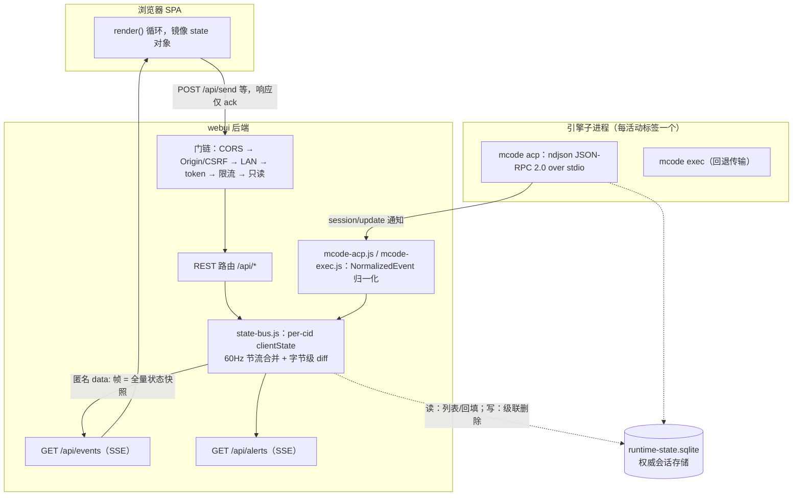
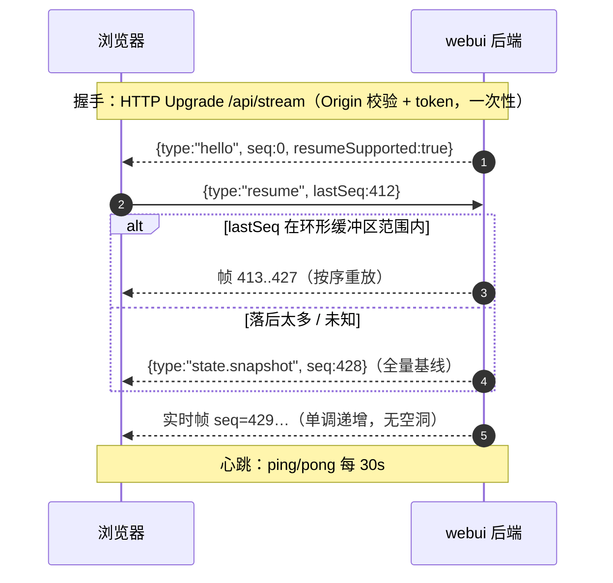
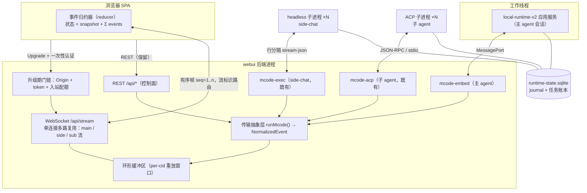
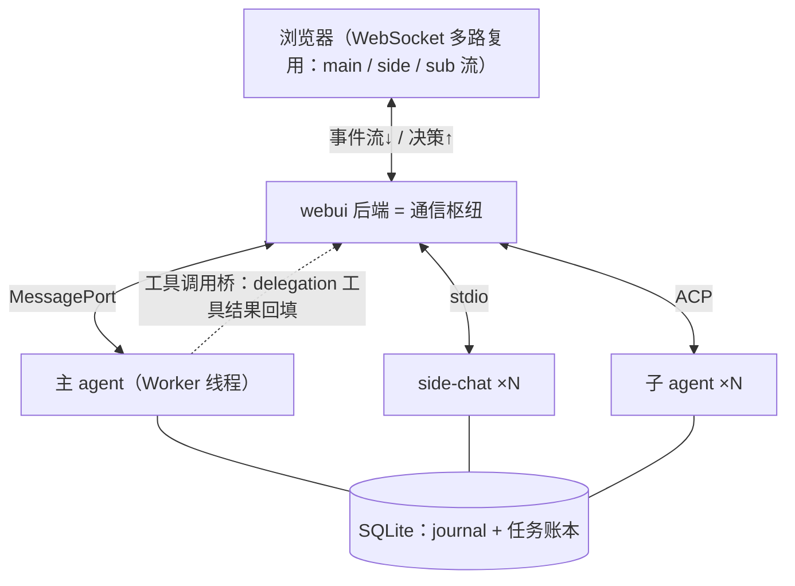
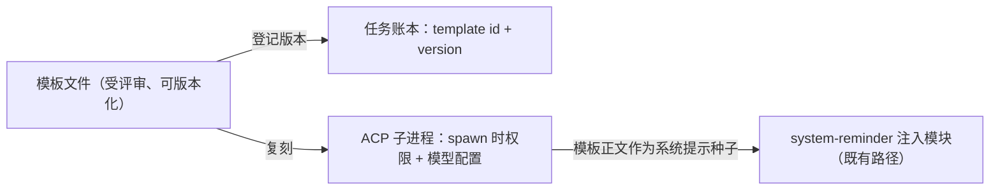

# Web UI 网络层设计草案（2026-09-22）

> **状态**：草案，未实现；所有内容均为提案，不改变当前发布行为。
> **定位**：[ARCHITECTURE.md](../ARCHITECTURE.md) 的前瞻配套文档；方案接受后相关章节迁入正式文档，本文归档。
> **范围**：浏览器 ↔ webui 后端（浏览器通信）、webui 后端 ↔ 引擎（引擎集成），及安全、迁移等横切关注点。
> **修订**：四稿 —— 精简重组：去除自定义编号（目标/缺陷/边界改为具名引用），合并次要图表，保留关键设计与核心图表。

## 1. 目标与非目标

**目标**

1. 下行投递从「至多一次的快照流」升级为「至少一次的有序增量事件流」，支持断线续传。
2. 下行负载从 O(状态总量) 降为 O(事件增量)。
3. 上行交互（审批、问答、计划确认、取消）使用结构化消息，不再伪装成聊天内容。
4. 引擎能力面完整可用：取消、模式切换、队列、会话中权限切换。
5. 安全门链语义逐条映射到新传输，不新增攻击面；保留对接外部/旧版引擎的 ACP 通道。
6. 引擎集成按角色分层，子 agent 由受评审的模板实例化，层间通信不引入消息代理。

**非目标**：多用户鉴权与多实例扩展；重设计 ACP 协议本身；PTY 驱动 TUI；更换前端渲染技术栈。

## 2. 术语

| 术语 | 英文 | 定义 |
|---|---|---|
| 控制面 / 数据面 | control plane / data plane | 指令上行通道 / 状态与事件下行通道 |
| 快照 / 增量 | snapshot / delta | 某时刻完整状态 / 相对前一状态的最小变更 |
| 事件溯源 | event sourcing | 以有序事件日志为事实来源，重放重建状态 |
| 单调序列号 | monotonic sequence number | 连接内连续递增、不回退的帧编号 |
| 环形缓冲区 | ring buffer | 固定容量、新帧覆盖最旧帧的内存重放窗口 |
| 断线续传 | resume | 携带最后序列号重连，服务端从该点续发 |
| 至少一次 | at-least-once | 不丢帧的投递保证（配合幂等消费） |
| 多路复用 | multiplexing | 单条连接承载多条逻辑流 |
| 能力协商 | capability negotiation | 握手期声明并探测双方支持的能力集 |
| 崩溃域 | crash domain | 一个故障波及的进程/线程边界 |
| 可重入性 | reentrancy | 同一模块被多个并发会话安全复用 |
| 传输抽象层 | transport abstraction | 同一接口契约下可互换的传输实现集合（`runMcode` → `NormalizedEvent`） |
| 模板 agent | agent template / blueprint | 以受评审文件定义方法论与验收标准，按需实例化为子 agent 进程 |
| 黑板 | blackboard | 多 agent 共享的异步协作介质（本方案为工作区文件） |

## 3. 现状（as-is）

### 3.1 拓扑



三条事实链：**浏览器通信 = REST 控制面 + SSE 数据面**（`POST /api/send` 立即返回 `{ok:true}`，结果全部走 SSE）；**引擎集成 = ACP 子进程**（`initialize` 握手后 `session/new|load|list|prompt|close`，事件以 `session/update` 回传归一化）；**旁路 = 直连 SQLite**（列表、回填、级联删除不经 ACP）。

### 3.2 浏览器通信细节

- SSE 常规推送全部是**匿名 `data:` 帧，内容为全量 state 快照**；仅 4 个命名控制事件（`auth.token_rotated`、`token.first_run`、`needs_authorization`、`authorization_decided`）。
- 推送优化：16ms 窗口节流合并（last-call-wins）+ 与上一帧逐字节相同则跳过——两者都是快照模型的补偿，单帧大小仍为 O(状态总量)。

### 3.3 引擎集成细节

- 传输：Agent Client Protocol（ACP），ndjson JSON-RPC 2.0 over stdio；每活动标签一个子进程 + 一个列表用单例（会话列表 30s 缓存、命令目录 24h 缓存）。
- 能力探测是**静态黑名单**：`mcode-rpc.js` 的 `UNSUPPORTED` 集合硬编码自 mcode 0.1.5 实测；而本仓库引擎（`packages/tui/src/acp/agent.ts`）已实现 `setMode`、`setConfigOption`、`cancel`、`fork`、`resume`，并在 `initialize` 响应中发布能力与扩展方法清单——黑名单已与实际漂移。
- 取消 = 杀子进程（SIGTERM → 2s 后 SIGKILL）；权限模式仅能在 spawn 时以 `--permission` 传入。引擎侧自有并发上限（如并发 `session/new` ≤ 8、生命周期 64/会话、256 全局）。

### 3.4 限制清单（现状数值）

| 限制 | 默认值 | 环境变量 | 出处 |
|---|---|---|---|
| 端口 | 18090，占用向后探测（≤20 次）；显式指定则固定 | `PORT` / `--port` | `config.js`、`port.js` |
| 绑定 | `127.0.0.1`（loopback 默认） | `HOST` / `lanBind` | `config.js` |
| 限流 | 60 次/分钟、burst 100；持 token ×2；loopback 豁免 | `MCODE_WEBUI_RATE_LIMIT(_BURST)` | `rate-limit.js` |
| 上传 | 请求体 50 MiB / 单文件 25 MiB / 配额 200 MiB，中途超限即 413 | `MCODE_WEBUI_UPLOAD_*` | `upload.js` |
| 回合空闲看门狗 | 流静默 120s 判超时（事件续命，非墙钟） | `MCODE_WEBUI_PROMPT_IDLE_TIMEOUT` | `idle-watchdog.js` |
| 转录回填 | ≤400 行 / ≤200 KB | 无 | ARCHITECTURE.md §2.2 |
| token / trustedOrigins | token ≤256 字符；白名单 ≤16 条 × 1–200 字符 | `/api/settings` | `auth.js`、`settings.js` |
| 依赖 | 0 个 npm 运行时依赖；Node ≥22.19 | — | `docs/webui.md` |

### 3.5 现状问题清单（按用户可感知的影响归纳）

| 用户可感知的影响 | 技术根因 | 对策 |
|---|---|---|
| 会话越长，流式输出时界面越卡、流量消耗越大（弱网与手机上明显）——每帧推送都是全量状态快照，大小与聊天历史长度成正比 | 快照模型 | §5 方案 B |
| 网络闪断后页面整体重新加载（「转圈」）；侧栏会话列表先闪空再弹回；断线期间的模型输出丢一段且无任何提示 | SSE 单向、无序列号，重连只能全量重同步 | §5 方案 B |
| 切回长会话只能看到最近约 400 行 / 200 KB 的历史，更早的记录在 webui 里看不到 | 快照模型装不下完整历史 | §5 方案 B |
| 点「停止」会杀掉整个引擎进程：进行中的输出直接丢弃、下一回合有秒级重启延迟，不是优雅取消；会话中途无法把权限从「询问」切成「自动」；部分功能按钮点击后提示「不支持」，即使新版引擎实际已支持 | 缺运行时能力协商（静态黑名单），取消与权限切换没有协议通道 | §8 阶段 0、§6 |
| 回合启动失败时界面残留「思考中」，要刷新页面才能恢复（该竞态目前靠补丁压制而非根治）；弹窗应答与普通消息共用一条通道、靠特判区分，是同类竞态的温床 | 上行无结构化通道，请求与事件分属两条无序通道 | §5 方案 B |
| 偶发侧栏多出空会话条目（探测会话堆积，靠清理补丁压制）；偶发引擎子进程卡死，表现为发送后长时间无响应 | 子进程生命周期管理固有成本 | §6 分层 |
| 短时间频繁刷新或切换会触发限流报错（429）；管理员重置 token 后，其他已打开的设备全部掉线且需手动获取新地址；同一浏览器开约三个及以上标签页时请求可能排队变慢（浏览器同源连接数上限，每标签占用两条长连接） | 按请求认证、轮询消耗限流配额、SSE 每用途一条连接 | §5 方案 B |
| 列表/删除与会话协议走不同通道（直连数据库）——用户基本无感，属升级引擎版本时行为可能不一致的维护性风险 | ACP 能力与性能缺口 | §6 分层 |

## 4. 同类方案

**DeepSeek Harness web**：web 服务与 agent 运行时同进程；单条多路复用 WebSocket（`/api/remote.mux`）承载全部逻辑流，类型化 RPC + 事件流，心跳保活，升级期认证与 Origin 校验；服务端可向浏览器发起带关联 ID 的请求（审批、提问天然双向）。

**Kimi Code Web**（`kimi web`）：FastAPI + 每 session 一个 CLI 子进程；REST 承载 CRUD，每 session 一条 WebSocket；连接后先从 `wire.jsonl` 重放历史再转实时（断线零丢失）；token 走 URL fragment，握手期校验 token/Origin/LAN。

| 维度 | mcode webui（现状） | dsh web | kimi web |
|---|---|---|---|
| 下行通道 | SSE ×2，快照流 | 单条多路复用 WebSocket，类型化事件流 | 每 session 一条 WebSocket，事件流 |
| 投递保证 | 至多一次 + 全量重同步 | 连接内有序 | 至少一次（日志重放） |
| 上行通道 | REST（交互伪装成消息） | WebSocket 双向 + 服务端主动请求 | WebSocket 双向 |
| 断线恢复 | `GET /api/state` 全量 | 重连 + 事件流恢复 | `wire.jsonl` 重放，零丢失 |
| 引擎关系 | ACP 子进程（公开标准协议） | 同进程直调 | 私有协议子进程 |
| 负载模型 | O(状态总量)/帧 | O(增量)/帧 | O(增量)/帧 |
| 认证 | 按请求 | 按连接（升级期） | 按连接 + fragment token |

两者共同验证：「有序增量事件流」优于「无序快照流」，「按连接认证」优于「按请求认证」。

## 5. 浏览器通信选型

### 5.1 候选方案

- **方案 A（维持现状）**：REST + SSE 快照。已实现、可 curl 调试、客户端镜像即可；但 §3.5 前四类问题全部成立且互相耦合。适用：迁移期过渡。
- **方案 B（选定）**：**WebSocket 事件流 + REST**。REST 保留为控制面（发送、会话、上传、设置），WebSocket 单连接承载全部下行事件流与结构化上行。
- **方案 C（回退通道）**：SSE + `Last-Event-ID` 重放。改动最小、免费获得至少一次投递；但上行仍是 REST、仍两条长连接，事件化改造工作量与方案 B 相同却拿不到上行收益。定位：方案 B 的降级开关。

| 维度（权重） | A 现状 | B WebSocket 事件流 | C SSE + Last-Event-ID |
|---|---|---|---|
| 投递保证（高） | ✗ 至多一次 | ✓ 至少一次 + 精确续传 | ◐ 至少一次 |
| 上行结构化（高） | ✗ | ✓ | ✗ |
| 负载效率（高） | ✗ O(总量) | ✓ O(增量) | ◐ O(增量) |
| 连接数（中） | ✗ ×2/标签 | ✓ ×1 | ✗ ×2 |
| 代理兼容（中） | ◐ 需关缓冲 | ◐ 少数代理不支持 Upgrade | ◐ 需关缓冲 |
| 实现成本（中） | ✓ 零 | ✗ 高（协议 + reducer + RFC 6455 决策） | ◐ 中 |
| 客户端复杂度（中） | ✓ 镜像即可 | ◐ 需 reducer | ◐ 需 reducer |
| 可调试性（低） | ✓ curl | ◐ 需工具/日志 | ✓ curl |

### 5.2 方案 B 设计

**核心原理：先快照、后增量（snapshot-then-delta）**。连接建立先发一次 `state.snapshot` 建立基线，此后只发增量事件；客户端用确定性归约函数（reducer）维护状态。



**帧格式**：

```ts
// 服务端 → 客户端（连接内 seq 单调递增、连续、不重置）
interface ServerFrame {
  v: 1;
  seq: number;            // 从 1 开始
  ts: number;             // epoch ms
  type: ServerEventType;
  payload: unknown;       // 按 type 的 schema
  ref?: string;           // 对客户端请求的响应携带
}

// 客户端 → 服务端
interface ClientFrame {
  v: 1;
  type: ClientEventType;
  ref?: string;           // 请求/响应关联 ID
  payload: unknown;
}
```

**事件目录**（与 `NormalizedEvent` 一一对应）：

| 方向 | type | 说明 |
|---|---|---|
| ↓ | `state.snapshot` | 全量基线（与 ARCHITECTURE.md §4 同构） |
| ↓ | `chat.line_appended` / `chat.delta` | 行追加与流式增量 |
| ↓ | `tool.call_started` / `tool.call_updated` | 工具调用生命周期 |
| ↓ | `run.started` / `run.finished` / `run.failed` | 回合生命周期（stopReason、usage） |
| ↓ | `context.updated` / `usage.updated` / `commands.updated` / `session_list.updated` | 派生状态更新 |
| ↓ | `interaction.ask_raised` / `permission_raised` / `plan_raised` | 交互请求（弹窗） |
| ↓ | `auth.token_rotated` / `alert.raised` | 令牌轮转与告警（合并入单连接） |
| ↑ | `resume` | 携带 lastSeq 断线续传 |
| ↑ | `interaction.answer` / `permission.decision` / `plan.decision` | 结构化交互应答（替代 `isAskAnswer` 伪装） |
| ↑ | `run.cancel` | 取消（与 REST `/api/stop` 并存） |
| ↑ | `pong` | 心跳应答 |

**负载对比**：

```
快照模型（现状）                      增量模型（方案 B）
帧 1  ████████████████ ≈8 KiB        ▎ ≈100 B   chat.line_appended
帧 2  ████████████████ ≈8 KiB        ▎ ≈110 B   chat.delta
帧 N  ████████████████ ≈8 KiB        ▎ ≈120 B   run.finished
每帧 = O(state 总量)，含命令目录       每帧 = O(事件大小)，与历史长度无关
流式期间 ≈ 数百 KiB/s                  ≈ 数 KiB/s
```

**收益**：§3.5 前四类问题成批消失；回填上限可移除（历史 = 重放 + 快照基线）；reducer 为纯函数可测；弱网体验从全量重同步变为精确续传。
**成本**：前端需实现 reducer 与续传；WebSocket 不能 curl（缓解：事件落日志 + 开发期只读端点）；依赖策略需决策（§7.5）；少数代理不支持 Upgrade（缓解：保留 SSE 回退开关）。

## 6. 引擎集成选型

### 6.1 候选方案

- **方案 A（ACP 子进程，现状）**：进程隔离、版本解耦（`MCODE_CMD` 可指向任意安装）、公开标准协议；代价是能力黑名单、每事件序列化、子进程生命周期管理成本、单连接单活动会话。
- **方案 B（进程内嵌入）**：直接 import `@mavis/local-runtime-v2` 应用服务（`./cli-service`、`./session-system` 等导出即为此设计），取消/模式切换/队列/会话中权限全部成为直接方法调用，类型编译期对齐、零序列化；代价是同崩溃域、可重入性未验证、进程级信号冲突风险。
- **方案 C（Worker 线程嵌入）**：引擎跑在 `worker_threads`，经 `MessagePort`（结构化克隆）传请求与事件。兼顾 B 的类型化收益与接近进程级的隔离；`worker.terminate()` 是干净的强取消边界，未捕获异常不跨线程传播。

### 6.2 TUI（互补能力，非传输）

| 子形态 | 结论 |
|---|---|
| 共享会话存储（SQLite + `session/load`） | 保留延续：webui 已能接管任意 TUI 会话 |
| `/web` 交接（TUI 内一键交给浏览器） | 建议采纳：上一行的产品化包装 |
| PTY 驱动 TUI 本体 | 否决：终端仿真层脆弱、不可测 |

### 6.3 角色分层分配（选定方案）

三个方案不互斥为「默认/回退」，而是按角色各就其位，隔离强度随信任梯度递增：

| 角色 | 会话 origin | 传输 | 能力面 | 隔离强度 | 生命周期 |
|---|---|---|---|---|---|
| 主 agent（交互会话） | `main` | Worker 线程内嵌 | 完整：cancel/steer/queue/goal/会话中权限 | 线程级（`terminate()`） | 跟随标签页 |
| side-chat（侧边轻会话） | `side` | headless 子进程（`mcode exec`） | 刻意收窄：单回合、maxSteps 默认 6、spawn 时定权限 | 进程级 | 跟随会话，关闭即退出 |
| 子 agent（后台/并行任务，按模板实例化 §7.8） | `task` | ACP 子进程 | 会话化：多回合、流式、cancel、fork | 进程级 | 跟随任务，可独立终止 |

机制性优点：**隔离梯度匹配信任梯度**（可重入性验证范围收窄到主会话——任意 side-chat 与子 agent 都在进程里，不触碰主 agent 的 Worker）；**三条路径全部复用既有代码**（headless 与 ACP 传输已存在，新增仅 `mcode-embed`）；**与方案 B 协同**（三个角色 = 三条逻辑事件流，复用在同一条 WebSocket 上）。

**四条硬边界（阶段 1 验收条件）**：

| 边界 | 内容 |
|---|---|
| 编排边界 | 「子 agent → ACP」仅指 webui 发起的后台/并行代理；引擎内部 delegation 留在 Worker 内进程内完成，绝不外绕 webui ACP（否则形成循环编排） |
| 晋升路径 | side-chat 必须可晋升为主会话（等价于一次 `session/load` + origin 变更）；无晋升则 headless 能力上限成为体验陷阱 |
| 可重入性范围 | 风险收窄为「主会话 × 主会话」；保守起点「每活动标签一个 Worker」，验证后再合并 |
| 静态分配 | 角色 → 传输是架构常量，不提供改派配置；主 agent 的 ACP 逃生门属部署级开关 |

**场景覆盖**：产品 webui 按上表分层；`MCODE_CMD` 指向外部引擎时子进程层随之运行该版本（side-chat 天然充当金丝雀层）；Docker 同产品默认；显式进程隔离需求时主 agent 降级 ACP；TUI 互通走存储共享 + `/web`。

## 7. 目标架构

### 7.1 拓扑



关键点：传输抽象层（`runMcode → NormalizedEvent`）不变，`mcode-embed` 是实现该契约的第三个传输；两条通信链路（浏览器通信 / 引擎集成）独立演进、独立回退。

### 7.2 WebSocket 协议规格

| 项 | 规格 |
|---|---|
| 端点 | `GET /api/stream`（HTTP Upgrade），单连接承载全部逻辑流 |
| 流标识 | 下行帧携带 `stream` 字段（`main` / `side:<id>` / `sub:<id>`）做多路路由；`seq` 按连接全局递增（全序），流标识只做路由不做排序 |
| 认证 | 升级期 `?token=`（或首帧 `auth`），连接作用域；本机豁免规则同现状 |
| Origin | 升级期白名单校验（等价现状 CSRF 门，loopback 不豁免页面身份） |
| 序列号 | 连接内从 1 起单调递增、连续，全部帧共用同一序列空间 |
| 重放窗口 | per-cid 环形缓冲区（初值 4096 帧）；`resume {lastSeq}` 续传；落后超窗降级为 `state.snapshot` 基线 |
| 心跳 | 服务端 ping 每 30s；连续 2 次未 pong 判死连接并释放资源 |
| 入站配额 | 每连接 20 帧/秒、burst 40；超限警告帧后关闭（等价限流门语义） |
| 帧约束 | 仅文本帧（JSON，UTF-8）；单帧上限 1 MiB；非法 UTF-8 按规范关闭；相邻同目标 `chat.delta` 可保序合并 |
| 只读与错误 | 非本机连接的写类帧拒绝；错误帧复用现有消毒规则（截断 200 字符、去控制字符） |

### 7.3 保留的 REST 面

| 端点组 | 处置 |
|---|---|
| `POST /api/send`、`/api/sessions*`、`/api/upload`（multipart）、`/api/settings`、`/api/models*`、`/api/protocol/*`、`/api/trajectory/*` | 保留（控制面；multipart 不适合 WebSocket） |
| `GET /api/state` | 保留（调试与降级基线） |
| `GET /api/events`、`GET /api/alerts`（SSE） | 迁移期保留为回退通道，阶段 3 起仅特性开关可启用 |
| `POST /api/stop` | 保留，同时提供 `run.cancel` 等价路径 |

### 7.4 安全门映射（语义逐条对齐，不新增面）

| 现状 HTTP 门 | WebSocket 等价物 |
|---|---|
| CORS 可信 Origin 反射 | 升级期 Origin 白名单校验，拒绝 403 |
| Origin/CSRF 门（含 loopback） | 同上，升级期一次性判定（连接即页面身份） |
| token（按请求） | 升级期一次，连接作用域 |
| 限流 60/min per {IP,token} | REST 面不变；WebSocket 改为每连接入站配额 |
| 只读门（非本机非 GET） | 非本机连接的写类帧直接拒绝 |
| loopback 默认绑定 | 不变 |

### 7.5 依赖策略

手写 RFC 6455 服务端子集（握手、帧编解码、掩码校验、分片、close/ping/pong；不实现压缩扩展，约 300–400 行 + 一致性测试）可保持「零 npm 运行时依赖」的成文原则；引入 `ws` 库则边界用例久经考验但破例需书面理由。**推荐**：先手写并以一致性测试门护航，成本过高则降级引入 `ws`，决策门在阶段 2 原型完成时。

### 7.6 故障模式

| 故障 | 检测 | 恢复 |
|---|---|---|
| WebSocket 断开 | 心跳超时 / TCP 错误 | 退避重连 + `resume`；超窗则快照基线 |
| 环形缓冲区欠载 | 服务端比对窗口头 | 直接发 `state.snapshot` |
| 主 agent Worker 崩溃 | `worker.on(error/exit)` | 发 `run.failed` + 按策略重建（会话由 SQLite 恢复） |
| side-chat / 子 agent 进程崩溃 | 退出码 / ACP 子进程退出 | 上报失败并更新任务账本；side-chat 下回合自然重建；不影响主 agent Worker |
| 服务重启 | 客户端连接失败 | 重连 + 快照重建；按任务账本重挂接存活子 agent |
| 异常客户端 | 入站配额 + 帧校验 | 警告帧 → 关闭；REST 面仍受既有门链保护 |

### 7.7 层间通信（三类 agent 之间）

**原则：控制走活通道，状态进 SQLite。** 拓扑为星型（hub-and-spoke）：webui 后端是唯一同时持有三类活句柄（MessagePort、headless stdio、ACP stdio）的组件，agent 之间无对等通信需求，不引入消息代理。



| | 主 agent（Worker） | side-chat（headless） | 子 agent（ACP） |
|---|---|---|---|
| **下达** | MessagePort 直接方法调用：`prompt` / `enqueueMessage` | spawn argv + stdin，prompt 即任务 | `session/new` → `session/prompt`；后续 `mcode/session/queue/enqueue` |
| **反馈**（中途介入） | `runtime.steer()` | 无 steer 对象（单回合）：等待或终止 | `mcode/session/steer`、`queue/steer`、`session/cancel` |
| **上传** | MessagePort 事件流（`NormalizedEvent`） | stdout 行分隔 stream-json + 退出码 | `session/update` 通知 + prompt 响应（stopReason、usage） |
| **取消** | 语义 cancel 或 `worker.terminate()` | SIGTERM → SIGKILL | `session/cancel`（能力协商后），否则 kill |

「队列」原语已在正确位置：引擎的 `mcode/session/queue/*` 扩展即「agent 忙时给它的下一条消息」，webui 只需接到 WebSocket 上行，无需自建队列。

跨层路由三条：① 三层上传事件按流标识汇入同一 WebSocket；② **主 agent ↔ 子 agent = 工具调用桥**——嵌入方向由 `host-contract.ts` 确立（宿主向引擎暴露能力），后台代理工具沿同一模式：主 agent 调用 delegation 工具 → 执行落在 webui → spawn ACP 子 agent → 结果作为工具结果回填 Worker；③ 审批/问答沿各层 interaction 事件 → 浏览器 → 原通道返回。

SQLite 角色 = **journal + 任务账本**，非消息队列：会话/事件日志（既有，三层同库，支撑侧栏/搜索/trajectory/晋升）；任务账本（新增小表：task id、session id、status、owner）用于重启重挂接与审计。否决 SQLite 消息队列：星型枢纽已持有活管道，broker 是轮询中间人；流式/取消/steer 需要 push 与背压；跨进程写队列表需锁调优且重新耦合崩溃域。消息队列成立的条件（对等无共同父级、跨机分布、独立守护进程存活）当前均不成立。

### 7.8 会话可见性与多 agent 形态

#### origin 分类

side-chat 与子 agent 会话**必须持久化**（晋升与审计依赖同库），但默认不混排主列表。分类标记住 webui overlay（`sessions.json` 的 `kind` 字段扩展），不改引擎 schema：

| origin | 主列表默认 | 可见位置 | 回收 |
|---|---|---|---|
| `main` | ✓ 显示 | 主列表 | 现有规则 |
| `side` | ✗ 隐藏 | 独立「侧边会话」分区/开关 | 未晋升超时 → 扩展启动清理 |
| `task` | ✗ 隐藏 | 任务面板（按 team 分组）+ trajectory | 任务终态后按账本清理 |
| `tui` / `exec` | ✓ 显示 | 主列表 | 现有规则 |

晋升 = origin 从 `side` 改 `main`（一次 `session/load` + 一行 overlay 变更）。

#### team 编排

| 模式 | 编排者 | 适用 |
|---|---|---|
| fan-out / fan-in | webui 枢纽（或主 agent 经工具桥） | 并行侦察、多方案对比 |
| lead + workers | lead 子 agent 自己的引擎（进程内 delegation，编排边界递归适用）；webui 经 `delegation/get` 只读观察 | 分层委托 |
| peer mesh | 否决——对等通信需要共享收件箱，与否决消息代理同理 | —— |

跨成员共享状态用**黑板 = 工作区文件**（成员用既有文件工具读写，可 diff、可审计、零新增设施）。team 是任务账本一等对象；并发上限：每队 ≤8、全局 ≤16。

#### 模板 agent：定义常驻，进程按需

「常驻」的正确定义是**规格持久、进程按需**：方法论与验收标准写进受评审的模板文件，需要时复刻启动——运行时即兴编写提示词正是方法论疏漏的根源（编写时机在运行时、编写者是无评审的模型）。

| | 即兴提示词 | 模板实例化 |
|---|---|---|
| 规格编写 | 运行时每次重写 | 开发时一次编写 |
| 方法论/验收 | 靠模型发挥，常漂移 | 每次复刻一致，内置 checklist |
| 评审与版本 | 无 | 进仓库，可 diff、随产品发版 |
| 审计 | 无法回答 | 账本记录模板 id + 版本 |

```markdown
---
name: code-reviewer
version: 2
model: minimax_api/MiniMax-M3
permission: read              # spawn 时权限（复用既有机制）
tools: [read, grep, glob]     # 工具授权收窄
acceptance: 必须产出 checklist 全绿的审查报告
---
# 方法论 / # 验收标准（正文）
```



实例化复用三处既有设施（system-reminder 注入路径、spawn 时权限、per-session 模型配置），新增仅模板文件 + 解析器 + 账本两个字段。模板与 skill 的区别：skill 是注入会话的说明书，模板是完整定义 agent 的规格（人格、工具授权、权限、模型、方法论、验收），模板可引用 skill。延伸收益：模板与产品同仓同版本，「同一模板在新旧引擎各跑一遍比对输出」即现成回归用例；side-chat 亦可由轻量 persona 模板实例化。

## 8. 迁移计划

| 阶段 | 内容 | 风险 |
|---|---|---|
| **阶段 0（偿还技术债，不动传输）** | 用 `initialize` 返回的 `agentCapabilities` + 扩展方法清单做运行时能力协商，替换静态黑名单；接通引擎已实现的 `session/cancel` | 低 |
| **阶段 1（引擎集成层，分层落地）** | 新增 `mcode-embed`（Worker 形态）承载主 agent；side-chat / 子 agent 沿用既有路径；实现晋升路径与任务账本；验收含四条边界与主会话可重入性；主 agent 保留 `MCODE_ENGINE=acp` 逃生门 | 中 |
| **阶段 2（浏览器通信层，双轨）** | WebSocket 服务端（含 RFC 6455 决策）、环形缓冲区、流标识与多路复用、事件目录与前端 reducer；模板实例化、origin 分类与侧栏分区随之落地；`MCODE_WEBUI_TRANSPORT=sse\|ws` 开关，默认 sse | 高 |
| **阶段 3（收敛）** | 默认翻转为 ws；`isAskAnswer` 伪装、stale-sync 补丁、状态残留补丁按事件目录重构删除；SSE 转为特性开关回退；（可选）持久化事件日志支持跨重启重放与回填上限移除 | 中 |

测试策略：RFC 6455 一致性单测（握手、帧长边界、未掩码关闭、分片、跨帧 UTF-8、close/ping/pong）；序列号性质测试（重放无空洞无重复、欠载降级、ref 唯一）；三条固定泳道（主 agent 嵌入 / side-chat headless / 子 agent ACP）× 前端双轨（sse/ws）同一套行为断言。回退：阶段 1 = 主 agent 降级 ACP；阶段 2/3 = `MCODE_WEBUI_TRANSPORT=sse`；开关均在启动期读取。

## 9. 风险与待决问题

| 风险 | 等级 | 缓解 |
|---|---|---|
| RFC 6455 边界用例实现缺陷 | 中 | 一致性测试门先行；不达标降级引入 `ws` |
| 引擎应用服务不可重入 | 高（阶段 1） | 分层已收窄为主会话 × 主会话；验证失败则每标签一个 Worker 或主 agent 维持 ACP |
| Worker 环境不兼容引擎依赖 | 中 | 兼容性清单先行；不兼容模块走 ACP 兜底 |
| 前端 reducer 状态漂移 | 中 | reducer 纯函数 + 定期快照对账，漂移即重建 |
| 三传输并存维护成本 / side-chat 每回合 spawn 延迟 | 低–中 | 角色静态分配锁三条泳道；spawn 延迟第一版接受，必要时进程保活 |

待决：环形缓冲区容量定值；持久化事件日志位置与保留；`/api/send` 是否迁移上行；多标签共享会话（状态键从 cid 迁到会话）；`/api/alerts` 并轨时机；side-chat 回收时限与进程保活策略；任务账本表结构；Worker 拓扑合并时机；team 上限定值；模板存放位置（仓库 / workspace / 叠加）与是否引用 skill；验收失败的任务终态语义。

## 附录 A：证据索引

| 主题 | 出处 |
|---|---|
| SSE 快照推送、节流合并、diff 门、命名控制事件 | `server/lib/state-bus.js` |
| 发送即确认、`isAskAnswer` 伪装、状态残留补丁 | `server/routes/chat.js` |
| SQLite 旁路（列表/回填/级联删除）、≤400 行回填 | `server/lib/db.js`、`docs/ARCHITECTURE.md` §2.2 |
| 限流、上传三段限制、空闲看门狗、端口规则 | `server/lib/rate-limit.js`、`upload.js`、`idle-watchdog.js`、`config.js` |
| ACP 静态黑名单 vs 引擎实际能力、并发上限、queue/steer/delegation 扩展 | `server/lib/mcode-rpc.js`、`packages/tui/src/acp/agent.ts`、`extensions.ts` |
| 子进程生命周期补丁、空闲挂起、探测会话清理 | `acp.mjs`、`server/lib/acp-client.js` |
| 进程内入口、宿主能力契约（工具调用桥依据）、后台运行时 | `packages/local-runtime-v2`（`package.json`、`src/local/host-contract.ts`、`src/background-runtime.ts`） |
| 系统提示注入路径（模板实例化依据） | `packages/agent-modules`、`docs/ARCHITECTURE.md` §2.1 |
| dsh / kimi 同类方案 | `@deepseek-ai/dsh-api-gateway`（本机）；`MoonshotAI/kimi-cli` `src/kimi_cli/web/` |

## 附录 B：参考资料

- RFC 6455（WebSocket Protocol）：<https://www.rfc-editor.org/rfc/rfc6455>；WHATWG HTML（EventSource）：<https://html.spec.whatwg.org/multipage/server-sent-events.html>
- Kimi Code Web 文档：<https://moonshotai.github.io/kimi-code/en/guides/web.html>
- 本仓库：`docs/architecture.md`、`packages/webui/docs/ARCHITECTURE.md`、`docs/API.md`、`references/SECURITY-NOTES.md`