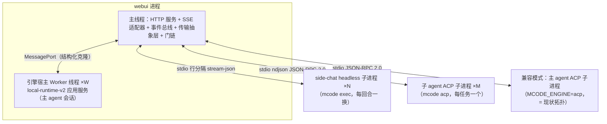
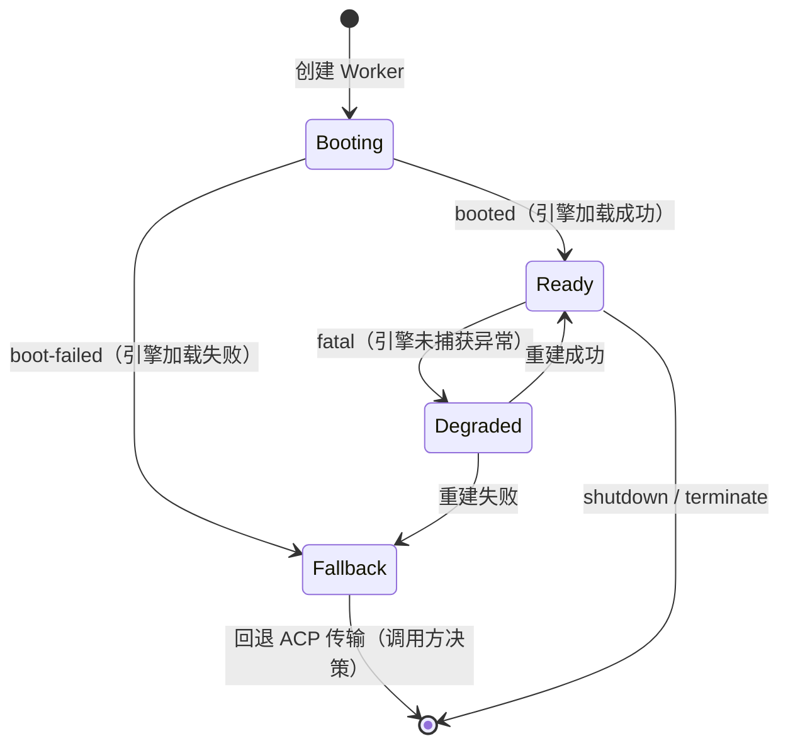
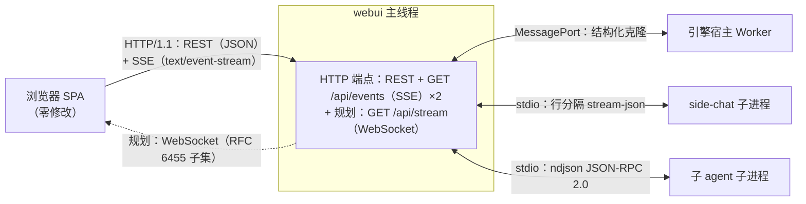
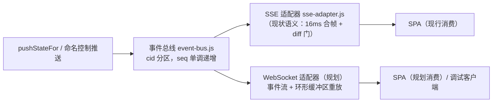

# Web UI 网络层与进程/线程拓扑技术方案（2026-09-23）

> **状态**：技术方案（可实施级）。依据 [arch_net_draft_0922.md](arch_net_draft_0922.md)（提案）展开；方案改动先落盘再改代码，实现偏差归档至 §10 决策记录。
> **硬约束**：① 前端 SPA 零修改（`packages/webui/public/` 不动，REST 响应形状与 SSE 帧语义逐字节兼容）；② 暂时兼容原有方案（默认旧行为，新路径可开关）；③ 全量 webui 测试套件与 `check-docs-alignment` 为验收门。

## 1. 前端零修改不变量（golden 等价点）

SPA 依赖的每一种线上行为必须逐字节保持（以 `server/lib/state-bus.js` 实际代码为准）：

| 等价点 | 精确规格 |
|---|---|
| 状态快照帧 | 匿名默认事件：`data: ` + `JSON.stringify(snapshot)` + 两个换行；不带 `event:` 行 |
| 节流合并 | `STATE_PUSH_THROTTLE_MS`（默认 16ms，0 禁用）；窗口内 last-call-wins，只写最后一份 payload |
| 字节级 diff 门 | 与上次成功写出的 payload 逐字节相同则跳过不写 |
| 命名控制事件 | `event: <name>` + `data: <body>` + 两个换行；`auth.token_rotated` 的 data 为原文（不包 JSON），`token.first_run` / `needs_authorization` / `authorization_decided` 的 data 为 JSON 字符串 |
| SSE 头 | `SSE_HEADERS` 四字段逐字保持（`text/event-stream`、`no-cache`、`keep-alive`、`X-Accel-Buffering: no`） |
| REST 形状 | 所有 `/api/*` 响应的 JSON 键序与错误消毒（截断 200 字符、去换行/控制字符）不变 |

## 2. 进程/线程拓扑

### 2.1 现状

```
webui 进程（1 主线程）
├─ HTTP 服务（router + 门链）/ SSE ×2 / state-bus
├─ mcode acp 子进程 ×N   ← 每活动浏览器标签一个（stdio JSON-RPC 2.0）
├─ mcode acp 子进程 ×1   ← 列表/命令单例（30s / 24h 缓存）
└─ mcode acp 子进程 ×0..1 ← 命令探测临时进程（用完即删）
```

问题：标签数线性放大进程数；子进程生命周期补丁集合（挂起批量拒绝、探测会话清理、缓存绕行）；取消 = 杀进程；能力面靠静态黑名单。

### 2.2 目标拓扑



### 2.3 拓扑关系表

| 成员 | 职责 | 生命周期 | 崩溃域 | 数量模型 |
|---|---|---|---|---|
| 主线程 | 门链、REST、SSE 适配器、事件总线、传输选择 | 进程级 | 进程 | 1 |
| 引擎宿主 Worker | 承载主 agent 会话（嵌入模式） | 跟随标签/会话（可重入验证后合并） | 线程（`terminate()`） | W = 活动标签数（保守）→ 1（验证后） |
| side-chat 子进程 | 轻会话单回合 | 每回合一换 | 进程 | 0..N（并发 ≤4，规划值） |
| 子 agent 子进程 | 后台/并行任务 | 每任务一个 | 进程 | 0..M（并发 ≤8，规划值） |
| ACP 兼容子进程 | 兼容模式下的主 agent | 现状（每标签） | 进程 | 按开关 |

### 2.4 引擎宿主 Worker 生命周期



回退触发：boot 动态 import 失败、Worker 未捕获异常（`fatal` 消息）、MessagePort 断开。回退语义：`runMcode` 传输选择层改走 `mcode-acp`（兼容路径），用户无感；当前仓库未构建引擎 dist 时全部走 Fallback 属预期。

## 3. 网络拓扑

### 3.1 链路图



### 3.2 链路 × 进程边界映射

| 链路 | 协议 | A 端（进程/线程） | B 端（进程/线程） |
|---|---|---|---|
| REST 控制面 | HTTP/1.1 JSON | 浏览器主线程 | webui 主线程 |
| SSE 数据面 ×2 | HTTP/1.1 text/event-stream | 浏览器主线程 | webui 主线程 |
| WebSocket（规划） | RFC 6455 子集 | 浏览器主线程 | webui 主线程 |
| 嵌入引擎 RPC | MessagePort 结构化克隆 | webui 主线程 | 引擎宿主 Worker |
| headless 传输 | stdio 行分隔 stream-json | webui 主线程 | side-chat 子进程 |
| ACP 传输 | stdio ndjson JSON-RPC 2.0 | webui 主线程 | 子 agent / ACP 兼容子进程 |

## 4. 内部数据流：事件总线与适配器



接口签名（第一阶段载荷 = state 快照 + 控制事件；事件级增量随嵌入传输落地接入）：

```js
// event-bus.js
emitEvent(cid, event)            // {type:"state.snapshot", snapshot} | {type:"control", name, data}
subscribeEvents(cid, sink)       // sink({seq, ts, event}) → unsubscribe()
// state-bus.js（兼容 facade，调用点不变）
pushStateFor(cid, opts)          // 构建快照 → emitEvent（opts.silent 不下发）
```

演进路径：阶段一总线承载快照 + 控制事件（SSE 兼容面零变化）；`mcode-embed` 落地后 NormalizedEvent 级增量直接进总线，WebSocket 适配器按 `stream` 字段多路复用（`main`/`side:<id>`/`sub:<id>`），SSE 适配器继续折叠为快照。

## 5. 引擎集成层

### 5.1 传输抽象层

接缝（按代码形态更正，2026-09-23）：`runMcodeAcp(content, opts) → Promise<结果 r>`（内部经 streamAcpPrompt 写聊天行并 finalize）；exec 传输为 spawn 描述符 + `collectExecResult` 收集（同样写聊天行）；`runMcodeEmbed(content, opts) → AsyncGenerator<NormalizedEvent>`（生成器返回值 = 同形结果 r，聊天行由消费侧承接）。结果 r 形状：answer / thinking / status / error / usage / sessionId / durationMs / stopReason / tps。三实现：`mcode-acp`（既有）、`mcode-exec`（既有）、`mcode-embed`（新增，Worker RPC 桥，聊天行消费器随接线落地）。传输选择层按 `MCODE_ENGINE` 开关分发，回退链：embed 失败 → acp（默认即 acp）。

### 5.2 能力协商（三层策略）

1. **声明清单**：`initialize` 响应的 `agentCapabilities.sessionCapabilities`（list/fork/resume/close）+ `_meta["minimax-code/extensions"].methods`（`session/activate`、`mcode/session/*`）→ 直接采信。
2. **惰性探测**：未声明方法（如 `session/set_mode`、`session/set_config_option`）首次调用即探测——用故意非法但无副作用的参数（缺必填字段），按错误码分类：`-32601`（Method not found）= 不支持并缓存；`-32602`（invalidParams）/ `-32000`（resourceNotFound）/ 成功 = 支持。`session/cancel` 为 notification，恒视为支持（尝试无害）。
3. **旧引擎回退**：`initialize` 无任何声明 → 沿用既有 `UNSUPPORTED` 静态表语义（前端 501 语义逐字节不变）。

### 5.3 Worker RPC 协议（MessagePort，v:1）

| 方向 | 消息 | 字段 |
|---|---|---|
| 主→Worker | `boot` | `{workspace}` |
| 主→Worker | `prompt` | `{sessionId?, content, model, permission}` |
| 主→Worker | `steer` / `cancel` | `{sessionId, text}` / `{sessionId}` |
| 主→Worker | `shutdown` | — |
| Worker→主 | `booted` / `boot-failed` | `{engineVersion}` / `{error}` |
| Worker→主 | `event` | `payload: NormalizedEvent`（流式） |
| Worker→主 | `reply` | `{id, ok, payload|error}` |
| Worker→主 | `prompt-done` | `{stopReason, usage}` |
| Worker→主 | `fatal` | `{error}`（未捕获异常/引擎崩溃） |

boot 动态 import 引擎应用服务（`@mavis/local-runtime-v2/cli-service` 或相对路径）置于 try/catch，失败发 `boot-failed` 由调用方回退。

## 6. 兼容性矩阵

| 子系统 | 现状 | 方案后 | 开关（默认） |
|---|---|---|---|
| SPA 静态资源 | 原样 | 原样（零修改） | — |
| REST 形状 | 见 §1 | 逐字节不变 | — |
| SSE 帧 | 见 §1 | 逐字节不变（SSE 适配器） | — |
| 命名控制事件 | 4 个 | 不变 | — |
| ACP 线协议 | ndjson JSON-RPC 2.0 | 不变（保留为兼容/子 agent 传输） | — |
| 会话存储 | runtime-state.sqlite | 不变 | — |
| 门链 | CORS→Origin→LAN→token→限流→只读 | 不变 | — |
| 主 agent 引擎传输 | 每标签 ACP 子进程 | 嵌入 Worker（可回退） | `MCODE_ENGINE`（`acp`） |
| 浏览器下行通道 | SSE | SSE + 规划 WebSocket | `MCODE_WEBUI_TRANSPORT`（`sse`） |

新开关落地时在 `config.js` 声明 `export const` 并同步 §7 六处对齐面。

## 7. 对齐义务矩阵

`scripts/check-docs-alignment.mjs` 的 6 项交叉校验（已核实源码）：

| 检查 | 单一事实源关系 | 机制要点 |
|---|---|---|
| 1 | `package.json` capabilities → `README.md` + `docs/CAPABILITIES.md` | 每个 capability 名两处各出现一次 |
| 2 | `README.md` 行内反引号端点引用 → `router.js` | 解析 `METHOD /api/path` 反引号对 |
| 3 | `docs/API.md` 端点标题 → `router.js` | 标题须为 `` ### `METHOD /api/path` `` 反引号形式 |
| 4 | `SECURITY-NOTES.md` env 变量 → `config.js` | 仅校验命中 `KNOWN_ENV_VARS` 显式集合的词；新开关须加集合 + 同名 `export const` |
| 5 | `package.json` 回环解析 + capability 形状 | `description` ≥ 30 字符 |
| 6 | cleanup-orphans 端点一致性 | `docs/API.md` ↔ `router.js` |

**每切片同步义务**（更新对齐代码要及时——同一变更内完成全部触点）：

| 切片 | 必须同改的对齐面 |
|---|---|
| WebSocket `/api/stream` 端点 | `router.js` + `package.json`（endpoints，若有 capability 还需 ≥30 字符描述）+ `docs/API.md` 标题 + `README.md`（若提及）+ `config.js` + `SECURITY-NOTES.md` + `KNOWN_ENV_VARS` 集合 |
| `MCODE_ENGINE` / `MCODE_WEBUI_TRANSPORT` 开关 | `config.js` export const + `SECURITY-NOTES.md` + `KNOWN_ENV_VARS` 集合 |
| 纯内部模块（事件总线/帧库/能力协商/embed 骨架） | 无对齐面（不新增端点/env） |

## 8. 实施切片与验收门

| 切片 | 文件 | 测试验收 | 回退 |
|---|---|---|---|
| 事件总线 + SSE 适配器 | `event-bus.js`、`sse-adapter.js`、`state-bus.js` | golden 帧等价 + SSE 契约守护 6 测试 | `git revert`（行为不变设计） |
| 能力协商 | `capability.js`、`mcode-rpc.js` | 声明/探测/回退三层单测 | 静态表回退 |
| WebSocket 帧库 + 环形缓冲 | `ws-frame.js`、`ring-buffer.js` | RFC 6455 一致性矩阵 | 纯新增，无回退需要 |
| 引擎宿主 Worker 骨架 | `mcode-embed.js`、`engine-host.worker.js` | RPC 往返 + NormalizedEvent 对齐 | boot-failed → ACP |
| WebSocket 端点集成 | `ws-server.js`、`router.js` 等 | 协议一致性 + 门链映射 | `MCODE_WEBUI_TRANSPORT=sse` |

全局验收门：① 全量 `pnpm --filter @mavis/webui test` 绿（对照绿基线：契约面 36/36）；② `node scripts/check-docs-alignment.mjs` PASS（6/6）；③ `release/public-source.json` 清单登记（`node scripts/source-inventory.mjs --write` + check:source）；④ `git diff packages/webui/public` 为空（前端零修改证明）。

## 9. 风险与回退

| 风险 | 缓解 |
|---|---|
| RFC 6455 边界缺陷 | 一致性测试门先行；不达标暂缓端点集成（帧库为纯新增无害） |
| 引擎服务不可重入 | 分层收窄为主会话 × 主会话；验证失败维持 ACP |
| Worker 环境不兼容引擎 | boot-failed 兜底全量回退 ACP（已可测） |
| SSE 行为漂移 | golden 等价为合并门；基线 36/36 对照 |
| 对齐门破坏 | §7 矩阵同改纪律 + 每轮 check-docs-alignment 守卫 |

## 10. 决策记录

（预留：实现与规格的偏差由主协调者在此归档——原因、替代方案、影响面。）

### 2026-09-23 能力协商切片

1. **错误文案统一**：不支持方法的错误信息由「mcode 0.1.5 acp does not implement …」统一为「mcode acp does not implement … (server returns "Method not found")」。影响面：仅 toast 文案；前端契约 code:'unsupported' 与 501 语义不变。
2. **cancel 能力位恒 true + cancelSession 改 notification**：`session/cancel` 在引擎侧是 notification（onNotification 承接），旧 request 路径会永挂；改为 `client.notify` 后尝试无害，能力位恒 true 属既定改进（旧实现不再依赖引擎支持该方法）。chat.js 的杀进程兜底保持不变。
3. **注册表播种时序**：活动注册表在 acp-client 启动成功时按 initialize 结果播种；进程内首个 RPC 若发生在任何 client 启动之前，沿用旧回退语义（一次 501），client 就绪后自然生效。实际拓扑（列表单例先行）使该窗口趋近于零。
4. **实现形态**：能力注册表归 capability.js 所有（零本地依赖），acp-client 播种、mcode-rpc 消费，避免循环依赖；UI 能力映射为可变对象，routes/protocol.js 零修改。

### 2026-09-23 WebSocket 帧库切片（成员三报告，防御性收紧 2 条）

5. **分片重组消息总量受 maxFrameBytes 约束**（超出 → 1009）：仅限单帧则 N×1MiB 分片可放大占满内存（不可信客户端 DoS 面）。替代方案（只限单帧）被否决；影响面：总量超 1 MiB 的分片消息被拒，与提案 §7.2「单帧上限 1 MiB」语义一致。
6. **close 线上 code 校验与长度字段最小化编码校验**（非法 code / 1 字节 close 体 / 非最小编码长度 → 1002）：RFC §7.4.1/§5.2 MUST 要求拒绝；影响面仅畸形输入路径，正常 close 行为不变。

### 2026-09-23 事件总线 + SSE 适配器切片

7. **STATE_PUSH_THROTTLE_MS 默认值更正**：实测代码默认为 0（节流禁用、每次推送同步写出），此前文档表述的「默认 16ms」来自过时注释。golden 以代码为准：默认行为不变，窗口仅在显式设置 env 时启用。§1 的 16ms 表述按此更正。
8. **节流判定改为调用期读 env**（`currentThrottleMs()`），导出常量保留为导入期快照仅供内省：既有测试契约「cache-bust 重导入状态模块即可读到新 env」要求行为跟随 env 变化；生产环境 env 进程内恒定，线上行为不变。
9. **总线并行落点 + SSE 兼容面直写**：`pushStateFor` 与命名控制推送同时 emit 到事件总线（WebSocket 适配器订阅面）并按旧路径直写 SSE。原因：既有测试直接操纵 `sseByCid`（绕过 `setSseClient`），订阅驱动会破坏该契约；影响面：零线上差异，WebSocket 适配器接线时可切换为订阅驱动（届时同步调整测试装配方式）。

### 2026-09-23 引擎宿主 Worker 切片（成员五报告，偏差 7 条 + 发现 2 条）

10. **NormalizedEvent 标签用 `kind`**（非文档的 `type`）：以代码形态为准逐字段对齐 `mcode-acp.js` 流回调载荷。连带发现：`docs/ARCHITECTURE.md` §3 的传输契约描述与两实现不符（`runMcodeAcp` 实为 Promise、`runMcodeExec` 为 spawn 描述符 + `collectExecResult`）——§5.1 已按代码形态更正，ARCHITECTURE.md 的修订列为文档跟进项。
11. **导出面扩展**：`steerEmbed`/`cancelEmbed`（RPC 往返验收入口）、`stopEmbed` 返回 `Promise<void>`（确定性验证无悬挂句柄）、`bootEngineHost` 扩展 `workspace`/`workerData` 参数（单参调用兼容）。
12. **引擎适配器缝（createEngineAdapter）**：prompt/steer/cancel 的引擎调用点为适配器契约；真实引擎会话编排（组合应用服务）超出传输骨架切片且 dist 未构建不可测，未接线时明确回复 `engine-adapter-missing`。嵌入传输全量点亮依赖该适配器落地（后续波次）。
13. **语义收束优于强杀**：空闲超时以语义 cancel 收束（非 terminate）；error 事件落定后不再回写（finalize 恰好一次，修正了 mcode-acp 的晚回写瑕疵）；失败路径返回全九字段结果形状。

### 2026-09-23 embed 接线（chat.js 三路选择 + 聊天行归约器）

14. **归约器范围取舍**（embed-consumer.js）：收尾记账镜像 streamAcpPrompt 的真实值/估算两条分支；mavis 真值覆盖层与工具输出全文渲染留待共享归约器提取轮次（当前 embed 依赖的引擎适配器缝未接线，无真实回合可跑，先保契约正确）。工具行最小化为标记行（→ title）。
15. **回退语义定案**：boot 失败自动回退旧传输（ACP/exec）；**回合级失败不回退**（如 engine-adapter-missing 显示为失败告警）——避免部分事件已落聊天行后的重复回合。`MCODE_ENGINE=embed` 在引擎适配器落地前的预期行为即失败告警 + 显式可选，不影响默认路径。
16. **/api/stop 的 embed 路径**（cancelEmbed 语义取消）留待下一波；当前 embed 回合的停止走 host shutdown 兜底。`MCODE_USE_ACP=0` exec 逃生路径保持原样，优先级：embed → exec → acp。

### 2026-09-23 WebSocket 事件流端点（GET /api/stream）

17. **协议取舍**：(a) 恢复欠载以「最近 state.snapshot 为基线」近似严格基线（严格版需按需重建快照，留待共享快照构建器提取时精确化）；(b) 馈送按连接引用计数订阅，最后连接断开即退订，无连接期事件不入环形缓冲（恢复时走快照回退）；(c) 心跳/配额/环形容量经参数注入便于测试，生产默认 30 秒 / 稳态 20 帧每秒 + 突发 40 / 4096 条；(d) 普通 GET → 426，升级门链复用 origin / LAN / token 三关（与 /api/events 同款），默认 MCODE_WEBUI_TRANSPORT=sse 时直接拒绝升级；(e) CLOSE_CODE 附加 1008 / 1013（RFC 6455 §7.4.1 保留值，附加常量不影响既有测试）；(f) 解码器按 RFC 6455 §5.3 严格要求客户端帧掩码（未掩码帧以 1002 拒绝，实测确认），服务端帧不掩码；非浏览器客户端须自备掩码编码（RFC 义务，非本实现的宽容/严格选择）。

### 2026-09-23 WebSocket 端点集成测试（补充决策）

19. **契约修正（推翻 9 号决策两处，守护测试优先）**：(a) 错误消息恢复 "mcode 0.1.5" 溯源（合并措辞：`mcode acp does not implement X (mcode 0.1.5 server returns "Method not found")`，同时满足 checks 的 /mcode 0\.1\.5/ 与能力测试的 /does not implement|Method not found/）；(b) session/cancel 由「恒 supported + notify」改为**声明条件式**——能力注册表未声明支持时短路为 unsupported 且不触碰 client（守护 checks/lib-mcode-rpc.check.mjs 的 no mcode spawn；该派生曾引发种子级联：真实 client 启动后 initialize 重播种注册表，令 set_mode/activate 逃逸黑名单），仅当引擎 initialize 声明该方法才走 notification 语义。前端能力映射 cancel 位随之在旧引擎下为 false。

18. **集成测试的三个实证**：(a) 环形缓冲 `replay()` 返回 `{seq, item}` 包装条目，`frameForItem` 归一化兼容包装/裸条目两种形状；(b) hello 帧携带 `cid` 回显（协议补充，客户端确认身份 + 测试注入对齐）；(c) 测试基建语义：升级套接字脱离 http 连接跟踪后 `server.close()` 回调在超时/异常路径个别不落定，测试清理以 500ms 竞速尽力而为（仅测试基建，不影响生产关闭语义——生产进程由 SIGINT/SIGTERM 钩子收尾）。入站配额按帧计数（TCP 粘包下按数据块计数无意义）。

## 附：文档集

见 [README.md](README.md) 索引。